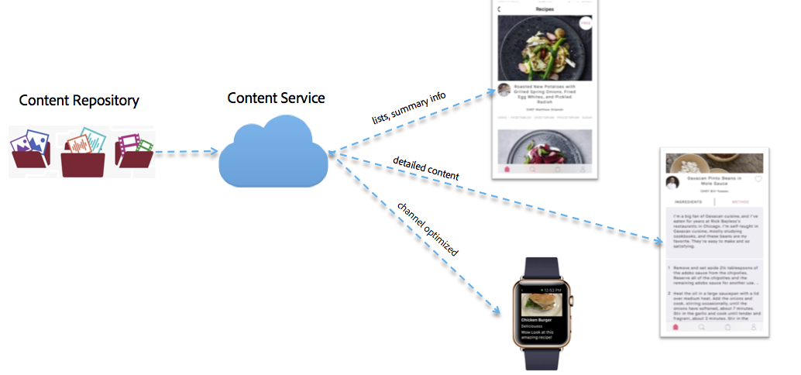

# Content Services{#content-services}

{{ue-over-mobile}}

>[!CAUTION]
>
>The Content Services feature is documented for preview purposes only.
>
>It is subject to change with the release of 6.3 Service Pack 1.

AEM Mobile Content Services is a lightweight feature for requesting content that is managed by AEM. This provides all app developers with a high performing way to retrieve content without having to have deep knowledge of AEM's content repository (JCR) and web framework (Sling). It allows the requesting applications to be decoupled from the content repository.

Content Services introduces several new AEM constructs that let a developer access AEM-managed content without knowledge of the repository structure of that content.

These constructs are necessary to maintain flexibility and to enable future expansion by providing an abstraction layer between the AEM-managed content and the mobile apps consuming the content. This allows AEM Content Services to work as an abstraction layer between the native application's content requirements and the AEM content repository.

Content Services can deliver the content as assets, packaged HTML (HTML/CSS/JS), or as channel-independent content.

>[!CAUTION]
>
>**Prerequisites:**
>
>Before you get started with Content Services, ensure that you enable the Content Services flag. To enable creation and management of models in your app, enable data models in the Configuration Browser.
>
>See **[Administering Content Services](/help/mobile/developing-content-services.md)** and the [Configuration Browser](/help/sites-administering/configurations.md) documentation for more information.

After you have set the Content Services flag, and enabled data models in the Configuration Browser, see the resources below to get started with AEM Mobile Content Services. Become familiar with Content Services Concepts such as model management, entity management followed by content delivery/rendering for AEM Mobile Content Services.

* Models in Repository
* Rendering and Delivery
