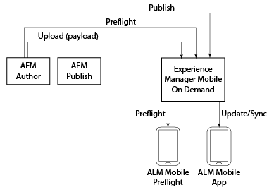

# AEM Mobile On-Demand{#aem-mobile-on-demand}

>[!NOTE]
>
>Adobe recommends using the SPA Editor for projects that require single page application framework-based client-side rendering (e.g. React). [Learn more](/help/sites-developing/spa-overview.md).

>[!NOTE]
>
>If you are not using AEM as your content managment source, see [AEM Mobile On-Demand Services Help](https://helpx.adobe.com/digital-publishing-solution/topics.html).

AEM provides several tools that enable you to integrate your content into mobile applications.

The following diagram illustrates how the various components of AEM Mobile and On-Demand Services fit together to deliver content to mobile apps.

AEM Preflight app can be considered a testing environment to preview the app and content prior to publishing; whereas the AEM Mobile App is the final app that is built for distribution.

>[!NOTE]
>
>To learn in-depth about Preflight app, see [Using the AEM Preflight app](https://helpx.adobe.com/digital-publishing-solution/help/preflight-app.html) in AEM Mobile On-Demand Services Help.

>[!NOTE]
>
>In the diagram above, the AEM Publish instance is not required for a typical deployment scenario to AEM Mobile On-Demand Services.

## Starting a New Mobile App {#starting-a-new-mobile-app}

AEM Mobile is just one pillar that makes up the complete AEM platform.

Starting a new AEM Mobile app experience requires a cohesion of roles before it is ready for content editing. The following roles provide a a starting point for creating a new AEM Mobile application:

* **Administrator**
* **Developer**
* **Author**

>[!NOTE]
>
>Before working with AEM Mobile and following the steps within this getting started guide, users should be familiar with AEM. Learn the basics of AEM [here](/help/sites-deploying/deploy.md).

### Understanding the AEM Mobile Application Dashboard {#understanding-the-aem-mobile-application-dashboard}

Before understanding the roles and responsibilities, the user should have throrough knowledge of **AEM Mobile Control Center** or the **Application Dashboard**. Click [here](/help/mobile/mobile-apps-ondemand-application-dashboard.md) for an in-depth understanding.

### AEM Administrator {#aem-administrator}

An ***AEM administrator*** is responsible for adding a new application to the AEM Mobile catalog, either by creating a new app using the creation wizard, or by importing an existing application. AEM administrators who create a new app using AEM Mobile's *creation wizard* typically select one of the desired app templates either from our out-of-the-box reference samples or (in most cases) a custom app template created by *AEM developers.*

An AEM administrator is responsible for the following tasks while creating an app using AEM Mobile On-Demand Services:

* [Setting up AEM Mobile](/help/mobile/aem-mobile-setup.md)
* [Configuring your User and User Groups](/help/mobile/aem-mobile-configure-users.md)
* [Previewing with Preflight](/help/mobile/aem-mobile-manage-ondemand-services.md)
* [Administering Content Services](/help/mobile/developing-content-services.md)

To get started with an Administrator's roles and responsibilities, See [Administering Content to Use AEM Mobile On-Demand Services](/help/mobile/aem-mobile.md).

## AEM Developer {#aem-developer}

An **AEM developer** extends and creates custom web templates and components to enable the *AEM Author *to create beautiful and engaging mobile experiences. These templates and components are not only optimized for the mobile app world; but communicate both to the device and to the AEM server (any remote server) to omni-channel service end-points. AEM's built-in content editor is used by *AEM Authors* to create rich and relevent experiences within the app, including integration with the rest of the Adobe Marketing Cloud.

An AEM developer is responsible for the following tasks while creating an app using AEM Mobile On-Demand Services:

* [App Templates and Components](/help/mobile/app-templates-and-components1.md)
* [Mobile with Content Sync](/help/mobile/mobile-ondemand-contentsync.md)
* [Content Properties and Exporting Content](/help/mobile/on-demand-content-properties-exporting.md)
* [Developing AEM Mobile Content Services](/help/mobile/developing-content-services.md)

To get started with Developer's roles and responsibilities, See [Developing AEM Content for AEM Mobile On-Demand Services](/help/mobile/aem-mobile-on-demand.md).

>[!NOTE]
>
>An *AEM developer's* role does not start and end with the development of templates and components. An *AEM developer* can create an entirely new app rather than simply extend the out-of-the-box reference implementation sample.

## AEM Author {#aem-author}

An ***AEM Author* (or *Marketer*)** uses the custom developed or out-of-the-box templates and components to add and edit pages, drag and drop components and add media of all types from the DAM including images, videos and text fragments (content fragments). AEM's built-in content editor is then used by *AEM Authors* to create rich and relevent experiences within the app, including integration with the rest of the Adobe Marketing Cloud.

An AEM author must understand the following topics, while creating an app using AEM Mobile On-Demand Services:

* [AEM Mobile Application Dashboard](/help/mobile/mobile-apps-ondemand-application-dashboard.md)
* [Application Create and Configuration Actions](/help/mobile/mobile-apps-ondemand-application-create-configure-action.md)
* [Cloud Configuration](/help/mobile/mobile-on-demand-associating-an-on-demand-app-to-cloud-configuration.md)
* [Managing Content](/help/mobile/mobile-apps-ondemand-manage-content-ondemand.md)
* [Content Services Overview](/help/mobile/develop-content-as-a-service.md)

To get started with an Author's roles and responsibilities, See [Authoring AEM Content for AEM Mobile On-Demand Services App](/help/mobile/mobile-apps-ondemand.md).

>[!NOTE]
>
>An AEM Author is also responsible for setting up entitlement, creating cards and layouts, and sending push notifications. Also, for more information on methods for authoring content; managing articles and collections; creating banners, cards, and layouts in AEM Mobile, see [AEM Mobile On-Demand Portal](https://helpx.adobe.com/digital-publishing-solution/topics.html#dynamicpod_reference_2).
