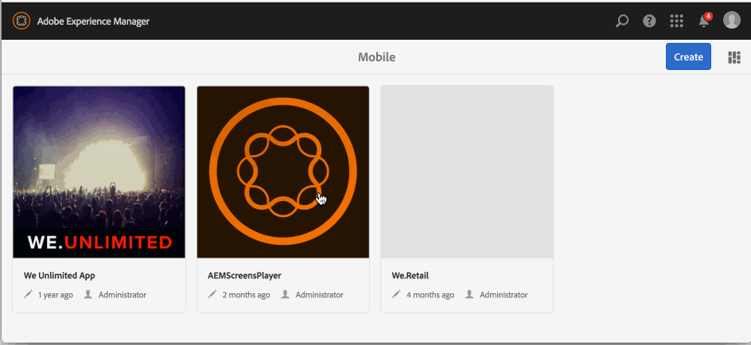

# Application Create and Configuration Actions{#application-create-and-configuration-actions}

{{ue-over-mobile}}

## Creating an On-Demand Application {#creating-an-on-demand-application}

Creating an app is often the first step towards creating and managing AEM Mobile On-Demand content, and is often performed at the AEM Administrator level. It represents a content shell, viewable on mobile devices, ready to display author-created content such as articles, images, and collections.

The details of your app can be viewed in the Dashboard or AEM Mobile Control Center.

>[!NOTE]
>
>The Dashboard is a series of useful tiles which give an overview of the app's content, metadata, and AEM Mobile On-Demand connection status.
>
>See [AEM Mobile Application Dashboard](/help/mobile/mobile-apps-ondemand-application-dashboard.md) for details.

**To create an on-demand app:**

1. Select **Mobile** from the side rail.
1. Select **Apps** from the Navigation.
1. Click **Create** and select **App** from the drop-down.
1. Choose the Mobile app template and click **Next**.
1. Enter app properties such as **Title**, **Name**, **Description**.
1. Click **Next**.
1. If known, enter cloud config details, otherwise click **Create**.
1. Click **Done** to view your new AEM Mobile app in the catalog.

>[!NOTE]
>
>This process lets you create an app instance in AEM.

## Using App Templates {#using-app-templates}

App templates provide an easy way to use existing designs created by developers, used for the creation of new apps within AEM.

What is an app template? Think of it as a collection of page templates and components that represent a baseline or foundation of an app.
When creating an app based on the template of another app, you get an app that has a starting point representative of the app in which it was created from.

You must have an existing mobile app template (or an app installed that has an app template) to use this feature.

### The Next Step {#the-next-step}

Once you create an On-Demand app from the application dashboard, the next step is to associate your app to the cloud configuration.

See [Associating your app to the Cloud Configuration](/help/mobile/mobile-on-demand-associating-an-on-demand-app-to-cloud-configuration.md) for more details.

### Getting Ahead {#getting-ahead}

Once you are familiar with creating an on-demand application and thus associating that app to a cloud configuration, see [Content Management Actions](/help/mobile/mobile-apps-ondemand-manage-content-ondemand.md).

**Content Management Actions** involves creation and management of following content:

* [Managing Articles](/help/mobile/mobile-on-demand-managing-articles.md)
* [Managing Banners](/help/mobile/mobile-on-demand-managing-banners.md)
* [Managing Collections](/help/mobile/mobile-on-demand-managing-collections.md)
* [Uploading Shared Resources](/help/mobile/mobile-on-demand-shared-resources.md)
* [Publish UnPublish Content](/help/mobile/mobile-on-demand-publishing-unpublishing.md)

To learn about the roles and responsibilities of an Administrator and Developer, see the resources below:

* [Developing AEM Content for AEM Mobile On-Demand Services](/help/mobile/aem-mobile-on-demand.md)
* [Administering Content to Use AEM Mobile On-Demand Services](/help/mobile/aem-mobile.md)
