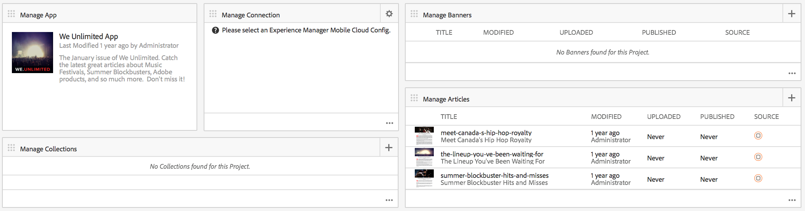
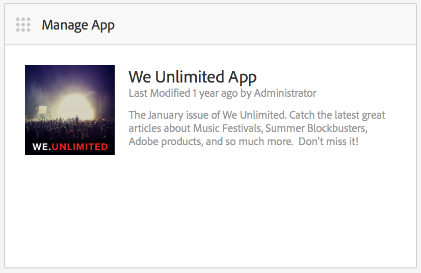
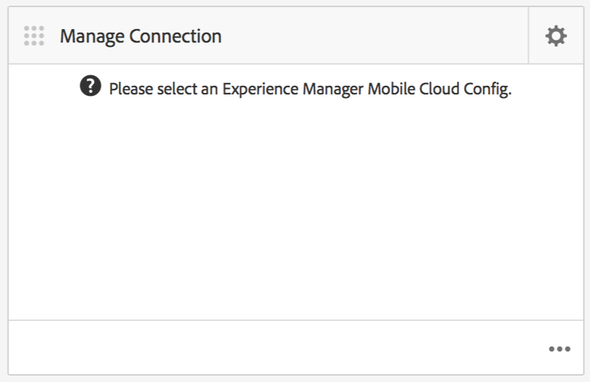
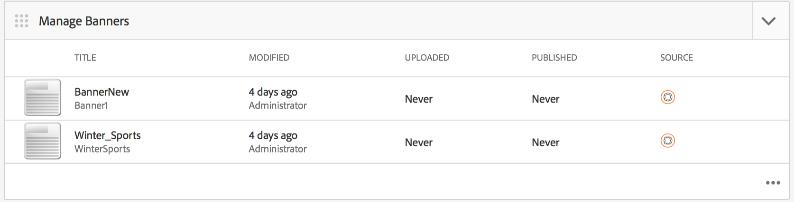
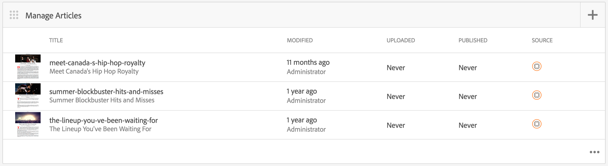
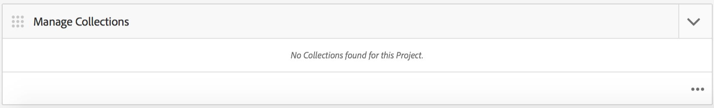

# AEM Mobile Application Dashboard {#aem-mobile-application-dashboard}

{{ue-over-mobile}}

You can manage your application and mobile app content from AEM Mobile Application Dashboard or the Control Center.

You can drill into each tile in the Control Center to view or edit details by clicking the '...' in the bottom right corner.

>[!NOTE]
>
>You can rearrange the order of the tiles by clicking the tile's grabber icon (top left 9 dots). The order change is user specific - different for individual users.

Managing app content requires a collective effort from developers, content authors and administrators. Authors manipulate pages, which are in turn based off of templates and components generated by app developers.

Finally, administrators strategically publish the updated app content.

## The Manage App Tile {#the-manage-app-tile}

The **Manage App** Tile displays available application information:

* Title
* Description
* Icon
* Last Modified
* Last Modified By

## The Manage Connection Tile {#the-manage-connection-tile}

The **Manage Connection** tile displays the AEM Mobile On-Demand Services connection information:

* Coud Configuration name
* Project name and ID
* Connection status

>[!NOTE]
>
>Click the gear in the top right to setup a Mobile On-Demand Cloud configuration.
>
>See [Configuring Mobile On-Demand Services](/help/mobile/mobile-on-demand-associating-an-on-demand-app-to-cloud-configuration.md) for details.

## Managing Entities {#managing-entities}

These 3 tiles provide an overview of the state of an app's content:

* **banners**
* **articles**
* **collections**

Each tile can be expanded to provide a more detailed list view by clicking on the ellipsis (...) in the bottom right corner. These list views provide an alternate way to access common Mobile On Demand actions like delete, upload, and edit properties.

### The Manage Banners Tile {#the-manage-banners-tile}

The **Manage Banners** tile lets you manage the content for a banner. The following information is displayed for a banner:

* image
* **TITLE**: name of the banner
* **MODIFIED**: last modified in AEM
* **UPLOADED**: last uploaded from AEM
* **PUBLISHED**: last published request form AEM
* **SOURCE**: source (AEM local or remote from Mobile On Demand)

The following image shows the **Manage Banners** tile in AEM Mobile Application Dashboard:

>[!NOTE]
>
>See **[Managing Banners](/help/mobile/mobile-on-demand-managing-banners.md)** for creating, deleting, or updating the banners.

### The Manage Articles Tile {#the-manage-articles-tile}

The **Manage Articles** tile lets you manage the content for an article. The following information is displayed for an article:

* image
* **TITLE**: name of the article
* **MODIFIED**: last modified in AEM
* **UPLOADED**: last uploaded from AEM
* **PUBLISHED**: last published request form AEM
* **SOURCE**: source (AEM local or remote from Mobile On-Demand)

The following image shows the **Manage Articles** tile in AEM Mobile Application Dashboard:

>[!NOTE]
>
>See [**Managing Articles**](/help/mobile/mobile-on-demand-managing-articles.md) for creating, deleting, or updating the articles.

### The Manage Collections Tile {#the-manage-collections-tile}

The **Manage Collections** tile lets you manage the content for a collection. The following information is displayed for a collection:

* image
* **TITLE**: name of the collection
* **MODIFIED**: last modified in AEM
* **UPLOADED**: last uploaded from AEM
* **PUBLISHED**: last published request form AEM
* **SOURCE**: source (AEM local or remote from Mobile On-Demand)

The following image shows the **Manage Collections** tile in AEM Mobile Application Dashboard:

>[!NOTE]
>
>See **[Managing Collections](/help/mobile/mobile-on-demand-managing-collections.md)** for creating, deleting, or updating the collections.

### The Next Steps {#the-next-steps}

Once you are familiar with the application dashboard, see the following resources to create a mobile app:

* [Application Create and Configuration Actions](/help/mobile/mobile-apps-ondemand-application-create-configure-action.md)
* [Associating an On-Demand App to a Cloud Configuration](/help/mobile/mobile-on-demand-associating-an-on-demand-app-to-cloud-configuration.md)
* [Content Management Actions](/help/mobile/mobile-apps-ondemand-manage-content-ondemand.md)

### Additional Resources {#additional-resources}

To learn about the roles and responsibilities of an Administrator and Developer, see the resources below:

* [Developing AEM Content for AEM Mobile On-Demand Services](/help/mobile/aem-mobile-on-demand.md)
* [Administering Content to Use AEM Mobile On-Demand Services](/help/mobile/aem-mobile.md)
