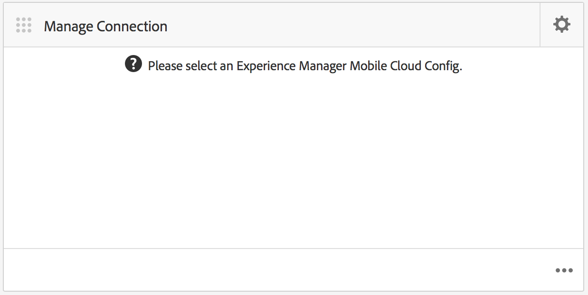
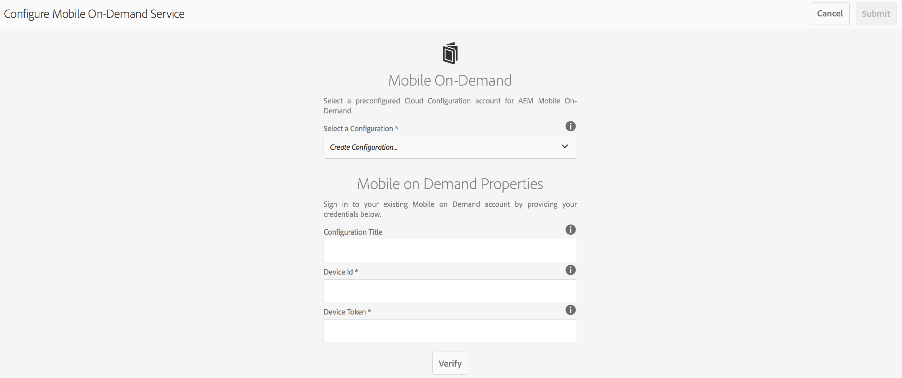
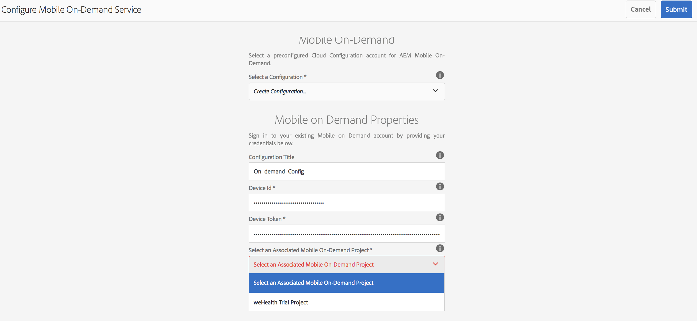
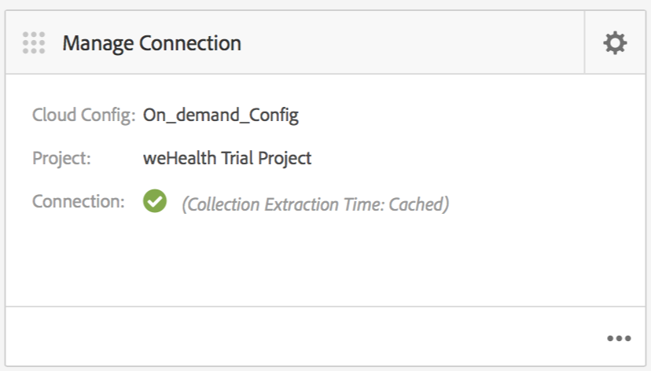
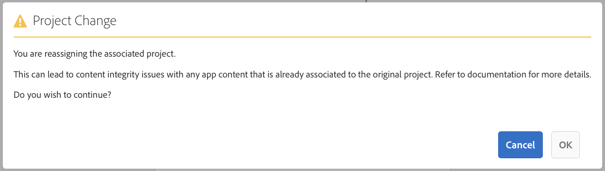

# Cloud Configuration{#cloud-configuration}

{{ue-over-mobile}}

Associating an On-Demand App to a Cloud Configuration allows Adobe Experience Manager (AEM) to communicate directly with a Mobile On-Demand hosted project by establishing a two way link. By linking your app to a Mobile On-Demand project, you will be able to perform content creation, such as articles, banners, and collections within AEM, but also serve that content to Mobile On-Demand.

From there, publishing, previewing, and managing content becomes possible. You can also import existing Mobile On-Demand content into AEM and perform content editing.

## Setting Up Cloud Configuration {#setting-up-cloud-configuration}

>[!CAUTION]
>
>Before you start configuring cloud configuration for your On-Demand app, you must be familiar with AEM Mobile Provisioning and Configuring AEM Mobile On-Demand Services Client.
>
>For details, See [Setting up AEM Mobile On-Demand Services](/help/mobile/aem-mobile-setup.md) in the Administering section.

To configure Mobile On-Demand Cloud Services, click the top gear on the top right corner of the **Manage Connection** tile from your app dashboard.

You should be familiar with the app dashboard and the tiles available. See [AEM Mobile Application Dashboard](/help/mobile/mobile-apps-ondemand-application-dashboard.md) for more details.

### Setting Up Link to Cloud Configuration {#setting-up-link-to-cloud-configuration}

>[!CAUTION]
>
>Ensure you have an existing On-Demand client and cloud configuration.
>
>For details, See [Setting up AEM Mobile On-Demand Services](/help/mobile/aem-mobile-setup.md) in the Administering section.

The following steps describes setting up link to cloud configuration:

1. From **Mobile**, choose **Apps** and then your Mobile On-Demand app from the catalog.
1. Click the gear icon on the **Manage Connection** tile.

   

1. Enter the already existing configuration or create one by entering the **Configuration Title**, **Device Id**, and **Device Token**.

   

1. Once your **Device Id** and **Device Token** are verified, choose your On-Demand project from the list.

   Click **Submit**.

   

   The **Manage Connection** tile shows your Cloud Configuration.

   

   >[!CAUTION]
   >
   >If you try to change which project this App is associated with, while switching project in the dashboard, you will receive a warning for content integrity issues as shown in the figure below:

   

### The Next Steps {#the-next-steps}

Once you have configured cloud configuration for your app, See the following resources for managing content:

* [Managing Articles](/help/mobile/mobile-on-demand-managing-articles.md)
* [Managing Banners](/help/mobile/mobile-on-demand-managing-banners.md)
* [Managing Collections](/help/mobile/mobile-on-demand-managing-collections.md)
* [Uploading Shared Resources](/help/mobile/mobile-on-demand-shared-resources.md)
* [Publishing/Unpublishing the Content](/help/mobile/mobile-on-demand-publishing-unpublishing.md)
* [Previewing with Preflight](/help/mobile/aem-mobile-manage-ondemand-services.md)
