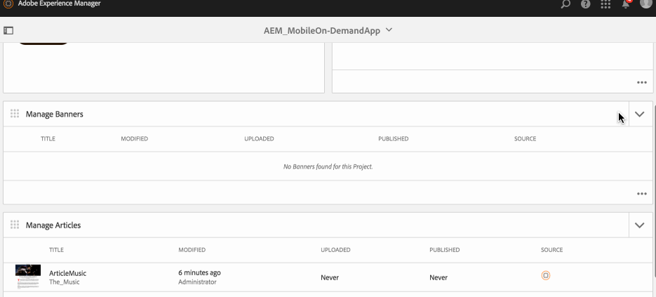
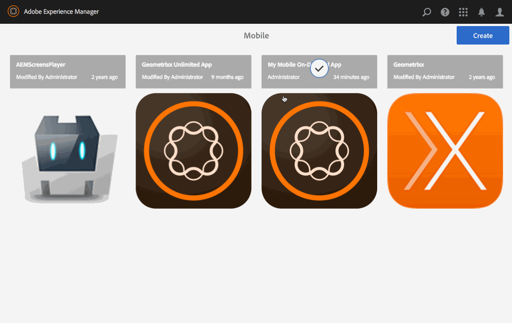

# Managing Banners{#managing-banners}

{{ue-over-mobile}}

Content Management actions are the building blocks that help to create and manage content within an application. The following actions are performed on content within the application.

## Banners Overview {#banners-overview}

Banners represent typically graphical promotional links.

>[!NOTE]
>
>See the following resources in Online Help to learn about the following topics in AEM Mobile apps:
>
>* [Design considerations](https://helpx.adobe.com/digital-publishing-solution/help/design-app.html)
>
>* [Creating Banners](https://helpx.adobe.com/digital-publishing-solution/help/creating-banners.html)
>

## Creating a Banner {#creating-a-banner}

The general workflow to create an article is as follows:

1. Select **Mobile** from the side rail.
1. From Mobile, choose your Mobile On-Demand app from the catalog.
1. Click the down arrow on the top right corner of the **Manage Banners** tile.
1. Work through each step of the wizard to continue creating your new banner.
1. When ready, click **Create**.
1. Your new banner appears in the **Manage Banners** tile.

## Importing a New Banner {#importing-a-new-banner}

Existing Mobile On-Demand content may be downloaded (Imported) from Mobile On-Demand to AEM. This allows local content editing and viewing.

>[!NOTE]
>
>Importing does not include images.

The workflow to import a new article

1. From Mobile, choose your Mobile On-Demand App from the catalog.
1. Click the down arrow on the top right corner of the **Manage Banners** tile and select Import Banners.
1. Click **Import Banner** on the dialog, then Close.
1. Your Mobile On-Demand articles now appear in the **Manage Banners** tile.

>[!CAUTION]
>
>Associate a Mobile On-Demand connection first.

## Editing a Banner {#editing-a-banner}

Use the built in AEM drag and drop editor to add or change an article. Components such as text and images can be added/removed. Images from DAM Assets can be inserted.

>[!CAUTION]
>
>Only banners created in AEM can be opened in the editor.

The workflow to edit an article:

1. From Mobile, choose your Mobile On-Demand app from the catalog.
1. Select an AEM sourced banner from the** Manage Banners** tile.
1. Click the highlighted banner from the list view to open it in the content editor.
1. Use the content editor to drag banner content (manuscripts, images, text, and so on).

### Viewing and Editing the Metadata within a Banner {#viewing-and-editing-the-metadata-within-a-banner}

Banners have numerous properties such as titles, descriptions, images. This action is used to view and modify such properties. Optionally, these changes can be uploaded to Mobile On-Demand upon save.

The general workflow to view/edit an article:

1. From Mobile, choose your Mobile On-Demand app from the catalog.
1. Choose a banner from the **Manage Banners** tile.

1. Select **Properties** from the action bar.
1. View all available meta data for that article.
1. Edit the meta data if desired and click **Save** when done.
1. Optionally, upload the changes immediately to Mobile On-Demand.

## Uploading a Banner {#uploading-a-banner}

The uploading action copies the selected content and adds it to a Mobile On-Demand project. Already existing Mobile On-Demand content is replaced by the new version.

The general workflow to upload a banner:

1. From **Mobile**, choose your Mobile On-Demand app from the catalog.
1. In the **Manage Banners** tile, select a banner for upload to Mobile On-Demand.
1. Add more banners if needed from the list view.
1. Select **Upload** from the action bar, then click Upload in the dialog.
1. Your banner(s) are now uploaded to Mobile On-Demand.

## Deleting a Banner {#deleting-a-banner}

This operation deletes the selected banner from Mobile On-Demand, and optionally from the local AEM instance.

The general workflow to delete a banner:

1. From Mobile, choose your Mobile On-Demand app from the catalog.
1. Select the banner to delete in the **Manage Banners** tile.
1. Ensure it is selected in the list (select others to delete as needed).
1. Click **Delete** from the action bar.
1. Check if you would like to delete from AEM and Mobile On-Demand.
1. Click **Delete**.
1. Your banner is now removed from the list.

### The Next Steps {#the-next-steps}

One you learn about managing banners, see

* [Managing Articles](/help/mobile/mobile-on-demand-managing-articles.md)
* [Managing Collections](/help/mobile/mobile-on-demand-managing-collections.md)
* [Uploading Shared Resources](/help/mobile/mobile-on-demand-shared-resources.md)
* [Publishing/Unpublishing the Content](/help/mobile/mobile-on-demand-publishing-unpublishing.md)
* [Previewing with Preflight](/help/mobile/aem-mobile-manage-ondemand-services.md)
