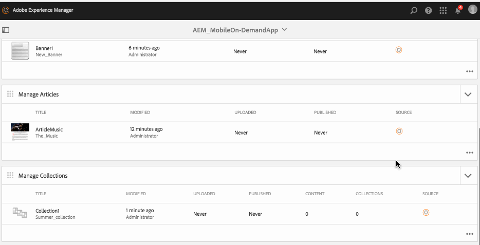
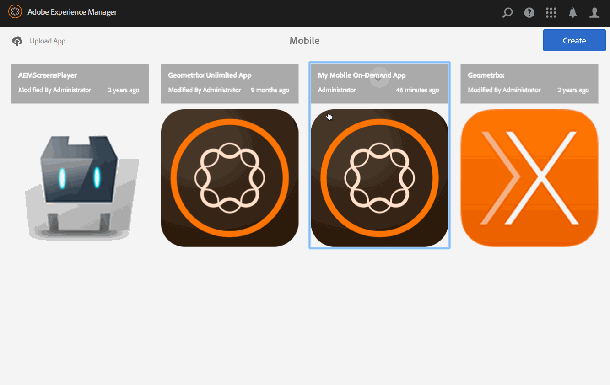

# Managing Collections{#managing-collections}

{{ue-over-mobile}}

Content Management actions are the building blocks that help to create and manage content within an application. The following actions are performed on content within the application.

## Collections Overview {#collections-overview}

Collections represent a well defined *bucket* filled with content such as articles or banners that suits the cover's theme.

>[!NOTE]
>
>See the following resources in Online Help to learn about the following topics in AEM Mobile apps:
>
>* [Design considerations](https://helpx.adobe.com/digital-publishing-solution/help/design-app.html)
>
>* [Managing Collections](https://helpx.adobe.com/digital-publishing-solution/help/creating-collections.html)
>

## Creating a Collection {#creating-a-collection}

The general workflow to create a collection is as follows:

1. Select **Mobile** from the side rail.
1. From Mobile, choose your Mobile On-Demand app from the catalog.
1. Click the down arrow on the top right corner of the **Manage Collections** tile.
1. Work through each step of the wizard to continue creating your new article.
1. When ready, click **Create**.
1. Your new article appears in the **Manage Collections** tile.

## Importing a New Collection {#importing-a-new-collection}

Existing Mobile On-Demand content may be downloaded (Imported) from Mobile On-Demand to AEM. This allows local content editing and viewing.

>[!NOTE]
>
>Importing does not include images.

The workflow to import a new Collection

1. From Mobile, choose your Mobile On-Demand App from the catalog.
1. Click the down arrow on the top right corner of the **Manage Collections** tile and select Import Collections.
1. Click **Import Collections** on the dialog, then Close.
1. Your Mobile On-Demand collections now appear in the **Manage Collections** tile.

>[!CAUTION]
>
>Associate a Mobile On-Demand connection first.

## Editing a Collection {#editing-a-collection}

Use the built in AEM drag and drop editor to add or change an article. Components such as text and images can be added/removed. Images from DAM Assets can be inserted.

The workflow to edit a collection:

1. From Mobile, choose your Mobile On-Demand app from the catalog.
1. Select an AEM sourced article from the **Manage Collections** tile.
1. Click the highlighted collection from the list view to open it in the content editor.
1. Use the content editor to drag collection content (manuscripts, images, text, and so on).

### Viewing and Editing the Metadata within a Collection {#viewing-and-editing-the-metadata-within-a-collection}

Collections have numerous properties such as titles, descriptions, images. This action is used to view and modify such properties. Optionally, these changes can be uploaded to Mobile On-Demand upon save.

The general workflow to view/edit a collection:

1. From Mobile, choose your Mobile On-Demand app from the catalog.
1. Choose a collection from the **Manage Collections** tile.

1. Select **Properties** from the action bar.
1. View all available meta data for that article.
1. Edit the meta data if desired and click **Save** when done.
1. Optionally, upload the changes immediately to Mobile On-Demand.

## Uploading a Collection {#uploading-a-collection}

The uploading action copies the selected content and adds it to a Mobile On-Demand project. Already existing Mobile On-Demand content is replaced by the new version.

The general workflow to upload a collection:

1. From **Mobile**, choose your Mobile On-Demand app from the catalog.
1. In the **Manage Collections** tile, select an article for upload to Mobile On-Demand.
1. Add more collections if needed from the list view.
1. Select **Upload** from the action bar, then click Upload in the dialog.
1. Your collection(s) are now uploaded to Mobile On-Demand.

## Deleting a Collection {#deleting-a-collection}

This operation deletes the selected collection from Mobile On-Demand, and optionally from the local AEM instance.

The general workflow to delete a collection:

1. From Mobile, choose your Mobile On-Demand app from the catalog.
1. Select the article to delete in the **Manage Collections** tile.
1. Ensure it is selected in the list; select others to delete as needed.
1. Click **Delete** from the action bar.
1. Check if you would like to delete from AEM and Mobile On-Demand.
1. Click **Delete**.
1. Your collection is now removed from the list.

## Adding Content to Collections {#adding-content-to-collections}

Collections are essentially a category of related content. They gather content such as articles, banners together into packages that define the navigation structure of your application. Collections can be nested.

>[!NOTE]
>
>Content must be uploaded to Mobile On-Demand before it can be added to a collection.

Collections are essentially a category of related content: They gather content such as articles, banners together into packages that define the navigation structure of your application. Collections can be nested.

1. From Mobile, choose your Mobile On-Demand app from the catalog.
1. Select a previously uploaded article (or banner/collection)
1. Choose Add to from the action bar.
1. Select a previously uploaded collection from the dialog.
1. Click **Update** to add content to the collection.

### The Next Steps {#the-next-steps}

One you learn about managing collections, see

* [Managing Banners](/help/mobile/mobile-on-demand-managing-banners.md)
* [Managing Articles](/help/mobile/mobile-on-demand-managing-articles.md)
* [Uploading Shared Resources](/help/mobile/mobile-on-demand-shared-resources.md)
* [Publishing/Unpublishing the Content](/help/mobile/mobile-on-demand-publishing-unpublishing.md)
* [Previewing with Preflight](/help/mobile/aem-mobile-manage-ondemand-services.md)
