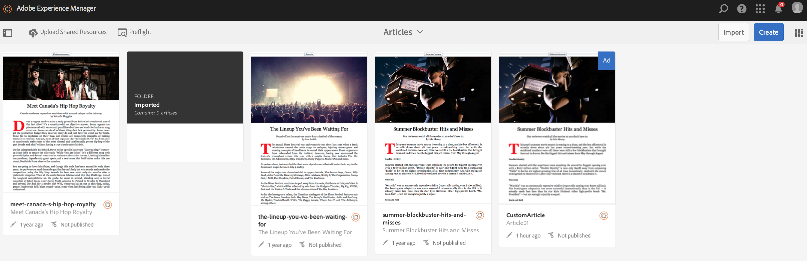

# Uploading Shared Resources {#uploading-shared-resources}

{{ue-over-mobile}}

Content Management actions are the building blocks that help to create and manage content within an application. The following actions are performed on content within the application.

>[!NOTE]
>
>To learn more on design considerations for AEM Mobile apps, see [Design considerations for AEM Mobile apps](https://helpx.adobe.com/digital-publishing-solution/help/design-app.html) in Online Help.

>[!CAUTION]
>
>Associate a Mobile On-Demand connection first.

## Uploading Shared Resources {#uploading-shared-resources-1}

Typically, content such as articles are required to have the same look and feel across all authors and even apps. Making scripts, css and fonts available to all is therefore essential. This operation sends such shared resources to Mobile On-Demand which can then be consumed as needed.

Once you configure and associate your app to a Cloud Configuration, you can upload your shared resources. For detailed steps on associating your app to a cloud configuration, click [here](/help/mobile/mobile-apps-ondemand-application-create-configure-action.md).

>[!NOTE]
>
>Shared Resources uses ContentSync to collect all the different resources. See [Mobile with ContentSync](/help/mobile/mobile-ondemand-contentsync.md) for more details.

Follow these steps to upload your shared resources for an article:

1. Select the article from **Manage Articles** tile.
1. Click **Upload Shared Resources** to upload your shared HTML resources.

   

### The Next Step {#the-next-step}

Once you have learnt about creating and publishing content, See

* [Developing AEM Content for AEM Mobile On-Demand Services](/help/mobile/aem-mobile-on-demand.md)
* [Administering Content to Use AEM Mobile On-Demand Services](/help/mobile/aem-mobile.md)

Or still need to learn about the authoring topics, See

[Authoring AEM Content for AEM Mobile On-Demand Services Apps](/help/mobile/mobile-apps-ondemand.md)
