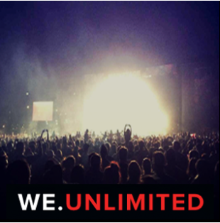
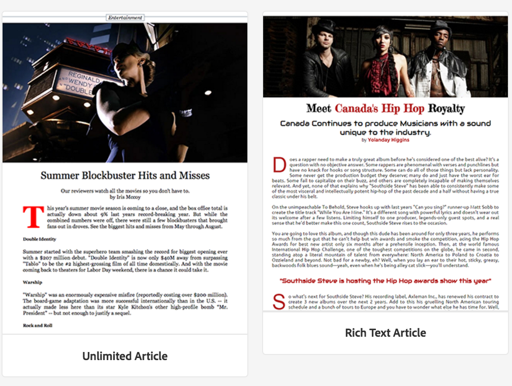
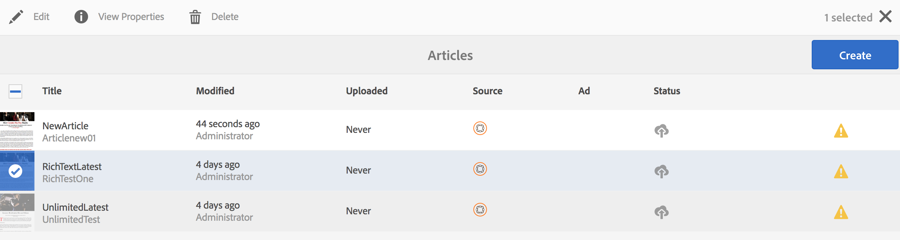
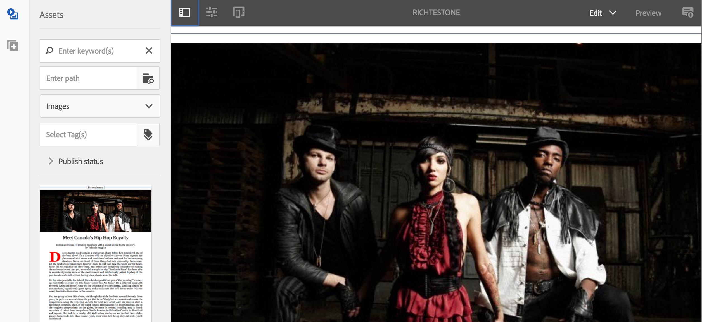
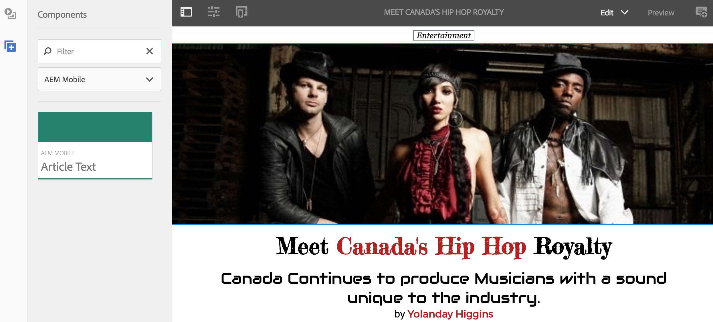
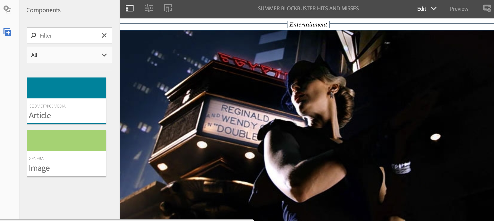

# Creating and Adding Templates and Components {#creating-and-adding-templates-and-components}

{{ue-over-mobile}}

AEM Mobile On-Demand provides a fully configured app template, an article template, and article components.

The We.Unlimited App is a sample template representing the shell of a fully configurable and manageable AEM Mobile On-Demand application.

Selecting this sample template when creating an app delivers an AEM Mobile feature rich dashboard.

>[!NOTE]
>
>To manage your application and mobile app content from AEM Mobile Apps Control Center, see the [AEM Mobile Application Dashboard](/help/mobile/mobile-apps-ondemand-application-dashboard.md).

## Creating App Templates {#creating-app-templates}

An App template is used to create an app and acts as a collection of page templates and components that represent a baseline or foundation of an app. The template stamps out some fundamental properties to lead the app in the appropriate way. In general, a customer would not create too many apps in total.

App templates provide an easy way to use existing designs created by devlopers, used for the creation of new apps within AEM.

When creating an app based on the template of another app, you will get an app that has a starting point representative of the app in which it was created from.

Steps to creating an app based on an app template:

1. Navigate to the AEM Mobile app catalog: *&lt;server-url&gt;/aem/apps.html/content/mobileapps*
1. Select **Create** > **App** as shown below

Once you create an app using this template, you can add articles, banners, and collections to your app. To re-visit, creation of articles, banners, and collections, See [Content Management Actions](/help/mobile/mobile-apps-ondemand-manage-content-ondemand.md).

>[!NOTE]
>
>Alternatively, you can also select a sample app template, for example, **We.Unlimited** app, made available to you by an AEM developer. If you use this sample template for your app, you get some sample articles and collections to work on. You will have the option of using the sample templates and components, customizing the existing ones, or creating new ones for your app.

>[!CAUTION]
>
>Setting ***redirectTarget*** property
>
>While using one of the app templates, the developer defines the content of the application. However, the developer must be aware where application gets created in the jcr and the value of ***redirectTarget*** property.
>
>The ***redirectTarget*** is calculated as part of the create app operation and attempts to resolve a path, if there is a redirectTarget property available as part of the app template, and the value of the redirectTarget is defined as relative. When the create app process finds a relative value for the redirectTarget in the app template, the value is appended to the resolved location of where the app was created.
>
>For example, if an app template defines a ***redirectTarget*** with a value of "*lanugage-masters/en*", and the app was created in "*/content/mobileapps/fooApp*", the final value for redirectTarget after the app as been created will be "*/content/mobileapps/fooApp/language-masters/en*".
>

## Creating Content Templates {#creating-content-templates}

Each entity type has two out-of-the-box templates. These are:

* **Default templates:** used for content creation with applicable default properties/structure
* **Imported templates:** used for importing content from AEM Mobile with applicable default properties/structure

### Article Templates {#article-templates}

The Unlimited Article is a sample template representing a typical AEM Mobile On-Demand article layout.

1. In **Manage Articles**, select **+**  to create an article. You can choose either an **Unlimited Article** or a **Rich Text Article**. The image below shows the option that lets you choose from any of these two article templates.

1. Click **Next** to define artcle meta data such as Article Name/Title, Description, Author, Abstract, Department, Thumbnail Image, Article Acces, and so on.
1. Click **Next** to fill in the Advertisement Properties.
1. Click **Next** to enter Article Image or Social Media Image
1. Click **Next** to choose a collection link this new Article to.
1. Click **Next** to enter the details for social sharing.
1. Click **Create** to finish the process of creating an article using the sample. You either click **Done** or **Edit Article** to edit the properties of this article.

### Adding Components to Article {#adding-components-to-article}

Once created, an author can edit an article's content by adding components like text and images. Articles are an extension of AEM page templates.

Select an article you want to edit, then click **Edit** to add components to the article.

 

Choose the '**+**' on the left panel to add components to your article.

### Creating Out-of-the-box templates {#creating-out-of-the-box-templates}

There are no out-of-the-box Article Templates, however there is a default template that custom templates should extend, see Geometrixx Unlimited App's [Article template sample](http://localhost:4502/crx/de/index.jsp#/apps/geometrixx-unlimited-app/templates/article).

The key properties beyond normal AEM template required properties include;

***dps-resourceType="dps:Article"***

This property ensures that the AEM page is recognized as an AEM Mobile targeted article page.

As per AEM templates, you can add any default properties or child nodes to the template's ***jcr:content***.

### Banner and Collection Templates {#banner-and-collection-templates}

>[!CAUTION]
>
>Banners and Collections do not have content so their creation does not support custom templates.

## Creating and Adding Components {#creating-and-adding-components}

Components use and allow access to Widgets and these are used to render the Content.

A simple component is included in the code repository, the source of which can be found in AEM. Subsequently, it can also be opened locally in CRXDE Lite.

>[!NOTE]
>
>There are currently no out-of-the-box components provided for AEM Mobile.
>

You can add components to your page. Any component can be used in an AEM Mobile app but when applied, may not render properly.

However, custom components may not export and upload to AEM Mobile On-Demand Services correctly without a custom export content sync handler that renders in AEM.

Once the component has already been included in an AEM page, along with a few other building block components, you can add another component to the page or edit an existing one.

**To add another component to the page:**

1. Choose that page and ensure you are in Edit mode, via the dropdown at the top right of the Editor's header
1. Toggle the side panel using the leftmost icon in the Editor's header
1. Select the **Components** tab
1. Drag and drop one of the available components onto the page

**To edit an existing component:**

1. Choose that page and ensure you are in **Edit** mode and select the component
1. Select the wrench icon to configure the component

>[!NOTE]
>
>You can create a create a component in AEM and customize the same using [Developing with CRXDE Lite](/help/sites-developing/developing-with-crxde-lite.md). Once you have customized the existing component as your requirements, you can add it in your page using the **Edit** option under **Manage Articles** as shown in the figure above.

>[!NOTE]
>
>Refer to [Best Practices for Templates and Components Development](/help/mobile/best-practices-aem-mobile.md) in AEM Mobile.

### The Next Steps {#the-next-steps}

* [Using Content Properties to Export Content](/help/mobile/on-demand-content-properties-exporting.md)
* [Mobile with Content Sync](/help/mobile/mobile-ondemand-contentsync.md)
