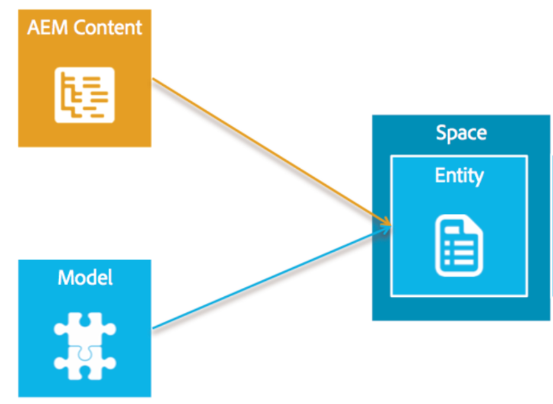
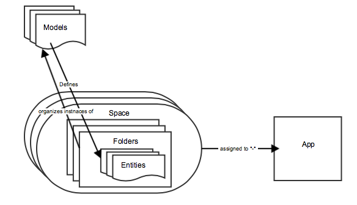

# Models Overview{#models-overview}

{{ue-over-mobile}}

Model management involves the creation and management of models for associating with eventual data objects. Each model includes all the properties and field definitions required to facilitate the creation and rendering of objects.

Model Management involves the creation of **models**, **entities**, and **spaces**. The following diagram illustrates the relationship between the AEM Content and the models.

## The Content Model {#the-content-model}

A model describes the type of content and denotes what information is available to the native application. It is a description of what makes up a piece of content. A content model is the rules for how to build a piece of content. The content model includes what data is available, what assets can be used, the relationship between assets and data, the relationship with other content models, and the available metadata.

Models also serve as a way to transform existing AEM content into objects that can be easily used by native mobile apps.

Content Services provides a few out-of-the-box models for common objects such as assets, asset collections, HTML pages, app configurations, and channel independent pages. These are configurable so they can meet specific customer needs without requiring an AEM development effort.

Users can create their own models. This enables the creation of new content types that are not already managed by AEM. Model creation is done through a UI using existing primitive types.

The following diagram illustrates the content model for AEM Mobile Apps and how entities, folders, and spaces are assigned to an app.

### The Models {#the-models}

Models are used to determine how entities are created. They define what is available in an entity and how that data is generated from AEM content. Before you start working with Spaces, Folders, and Entities, you should be familiar with creating and managing models.

>[!NOTE]
>
>A model exists outside of an app as more than one app can use it.
>

To create and manage models in the dashboard and repository, see **[Models](/help/mobile/administer-mobile-apps.md)**.

### Entities in Content Model {#entities-in-content-model}

An entity is an instance of a content model. An entity is exposed through the Content Services API to the client-side library and provides a way for a native app to access content in a channel-independent way.

If there is existing AEM content, an entity is generated using a model and the AEM content source. For example, a page entity is a channel and layout independent object that is generated from an AEM page and the page model.

Changes to the referenced content of an entity results in a change to the entity. For example, if a *cq:page* is updated, then any entities that are based on that page are updated, too.

To create custom entities from models, see **[Working with Entities](/help/mobile/spaces-and-entities.md)**.

>[!NOTE]
>
>If the model does not correspond to an existing AEM content, such as the customer created a model, then there is a UI so a customer can create an entity.
>

### Spaces in Content Model {#spaces-in-content-model}

A space is used to organize entities for easy access. A space can contain one or more entity types and may contain subfolders.

On the AEM side, a space is a convenient way to manage entities that are related. It can also be used to assign authorization permissions. Authorization can be made to a space, which protects the entities that are in that space.

*For example*,

A user has three general classifications of entities. One is for internal use only, another is approved for public use and still a third is for common entities that are used by many apps. To make it easy to manage, the user creates three spaces namely *internal*, *public* (with both English and French content), and *common* for managing the appropriate entities as mentioned below:

* /content/entities/internal
* /content/entities/public/en
* /content/entities/public/fr
* /content/entities/common

A service end point is provided to the space so the native client library can request a list of the contents of a space. This "listing" is returned as a JSON object.

See **[Spaces and Entities](/help/mobile/spaces-and-entities.md)** for creating and publishing spaces.

>[!NOTE]
>
>A space can be used by many apps and an app can use many spaces.

### Folders in Content Model {#folders-in-content-model}

Folders allow users to organize entities as required and facilitates finer ACL control. Spaces can include folders to help further organize the space's content and assets. A user can create their own hierarchy under a space.

To create and manage folders within a space, see **[Working with Folders in a Space](/help/mobile/spaces-and-entities.md)**.
