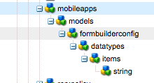

# Models in Repository{#models-in-repository}

>[!NOTE]
>
>Adobe recommends using the SPA Editor for projects that require single page application framework-based client-side rendering (e.g. React). [Learn more](/help/sites-developing/spa-overview.md).

A model contains a set of data types that define the properties that will ultimately be rendered by content services. A model also defines the relationships between other models in order to enforce data integrity.

As a Developer, you should be familiar with the Model structure in repository. You can create you own models and entities as per your app requirement.

## Creating Model Types {#creating-model-types}

There are two system provided model types under */libs/settings/mobileapps/model-types*. If you want to override the system model types a *mobileapps/model-types* node will need to be created under the configuration node you wish the override to occur on.

For example, if you have created configurations at */conf/myconf1* and */conf/myconf2* and want to override the system model types on *conf1* only, you would create a *mobileapps/model-types* node under the settings of *conf1*.

If you want to allow data types to be added to a model the model type must have a child node named 'scaffolding' of type 'cq:Page' and a resource type of *wcm/scaffolding/components/scaffolding*.

The scaffolding page must also include a *dataTypesConfig* property on the PageContent node which indicates the data types models created from this type will be allowed to use.

>[!NOTE]
>
>A **Scaffolding** is a page that defines the data types that can be edited by an entity based on the model. Each data type can also be configured to define how the field will be presented in the UI as well as how the data value will be persisted.

### Data Types Config {#data-types-config}

The data types config node contains a list of data type items. Each data type item specifies how a data type will appear in the model editor as well as how it needs to be persisted for eventual rendering by an entity.

| **Property Name** |**Description** |
|---|---|
| fieldIcon |class of CoralUI icon to represent data type |
| fieldPropResourceType |component that will render out all the properties for configuring the data type |
| fieldProperties |multi-value list of property components that are used when the fieldPropResourceType is *mobileapps/caas/gui/components/models/editor/datatypes/field* |
| fieldResourceType |resourceType of the persisted node for the data type (that is, the component that will render the property in the entity editor) |
| fieldViewResourceType |component to use for rendering data type in model editor view (fieldResourceType will be used if this property is omitted) |
| fieldTitle |name of the data type that will be displayed in the model editor |
| multiFieldResourceType |resource type to use on persisted node when multi-value is selected |
| renderType |rendering clue for client-side rendering |

### Data Types Config Overlay {#data-types-config-overlay}

The 'dataTypesConfig' property supports Sling resource merging. This means the data types used by the system model types (or even custom model types) can be customized by using overlay nodes.

An overlay of */libs/settings/mobileapps/models/formbuilderconfig/datatypes* will need to be created and then customized as desired.

For example, an overlay for the String data type could be added in order to change the fieldResourceType to a custom component.

For more information on Sling Resource Merging see, [Using Sling Resource Merger in AEM](/help/sites-developing/sling-resource-merger.md).

### Data Types {#data-types}

A model data type is a form component that is capable of including data to be included when posting a form. The data type component can be as complicated as desired. An example of a custom data type could be an address block for a particular country to avoid having to recreate it all the time using the primitive data types.

See '/libs/mobileapps/caas/components/form/contentreference' as an example of a custom data type.

All the primitive data type make use of existing Granite form components. See: [https://docs.adobe.com/docs/en/aem/6-3/develop/ref/granite-ui/api/jcr_root/libs/granite/ui/components/coral/foundation/form/index.html](https://docs.adobe.com/docs/en/aem/6-3/develop/ref/granite-ui/api/jcr_root/libs/granite/ui/components/coral/foundation/form/index.html)

Any custom data type can then be added to a data type config for use by the model editor.

## Creating Models {#creating-models}

You can start creating models once all the desired model types and data types have been developed. The authors will ultimately use models to create entities from which content services uses to render its data from.

Creating a model consists of picking an allowed model type based on the current configuration and then providing a title and description.

To learn about creating and managing a model from the dashboard, see [Creating a Model](/help/mobile/administer-mobile-apps.md) under authoring section for Mobile Apps.

### Properties of a Model {#properties-of-a-model}

The following table shows the properties defined for a model:

| **Property Name** |**Description** |
|---|---|
| Model title |name of the model |
| Description |description of the model |
| Thumbnail |thumbnail image of the model |
| Model Type |type of the model (this can be a simple string or a path to an actual component) |
| Allowed Children |path of a template that is allowed to be a child of this template |
| Allowed Parents |path of a template that is allowed to be a parent of this template |

>[!NOTE]
>
>The *allowed children* and *allowed parents* properties follow the same rules as Page templates. For more information, see [Page Templates](/help/sites-developing/page-templates-static.md).
>
>In reference to *Model Type* property, all models must have a super type of *mobileapps/caas/components/data/entity* but can have a sub-type which allows the content delivery to be customized. Ensuring all model types are unique may also help clients of content services to distinguish between objects in the data.

### Editing a Model {#editing-a-model}

Editing a model involves opening the scaffolding dialog form associated with a model for editing. Generally the scaffolding is a child node of the model but it can be located outside of the model if desired by specifying its path using the 'cq:scaffolding' property. This is uselful, if you want to share the same scaffolding between multiple models that need to have different properties.

When the scaffolding for the model is located the model editor will render whatever is found under 'jcr:content/cq:dialog/content'. Currently only an up to 3-column fixed layout is supported by the client-side formbuilder engine. To the right of the rendered form dialog will be a list of all the data types specified in the data types config. Data types can be edited by clicking on them. The right rail will then switch to the properties tab for the selected data type. New data types can be added by dragging them onto the preview canvas. Clicking Save propagates the changes to the server. Clicking Cancel closes the model editor.

>[!NOTE]
>
>All models are Templates, so they follow all AEM Templating rules. This allows using properties such as *allowedParents*and *allowedChildren* properties. These are effective while creating new Entities based on a model. The template rules will ensure entities can only be based on certain models depending on their hierarchy.
>
>To learn about editing a model from the dashboard, see [Creating a Model](/help/mobile/administer-mobile-apps.md) under authoring section for Mobile Apps.

### System Models {#system-models}

Two types of pre-defined system models are provided for simple content re-use. These models cannot be edited.

**Pages Model** The Pages model provides a quick method to re-use existing content from Sites for delivery by content services.

The resourceType of entities based on the Pages model is: mobileapps/caas/components/data/pages

Path: Path to a Sites page. Contents from this path (and its children) will be rendered by content service handlers.

**Assets Model** The Assets model provides a quick method to re-use existing content from Assets for delivery by content services.

The resourceType of entities based on the Pages model is: *mobileapps/caas/components/data/assets.*

Asset List: List of paths from Assets. Each asset will added as a child entity node with a resourceType of *wcm/foundation/components/image*.

>[!NOTE]
>
>To learn more about using these templates for creating models from the dashboard, see [Creating a Model](/help/mobile/administer-mobile-apps.md) under authoring section for Mobile Apps.
