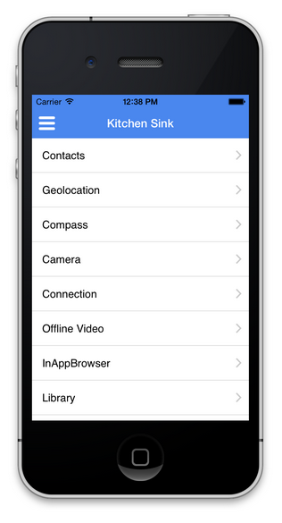

# Access Device Features{#access-device-features}

{{ue-over-mobile}}

## Building Adobe Experience Manager (AEM) components that access device features {#building-aem-components-that-access-device-features}

The [AEM PhoneGap Kitchen Sink](https://github.com/blefebvre/aem-phonegap-kitchen-sink) GitHub repository provides developers with a functional AEM app that illustrates the use of several core Cordova APIs. When run on iOS or Android&trade; via the PhoneGap CLI, the app opens up into the following page which includes a link to each device API that it demonstrates:

The source code for each of these device API components is [available on GitHub](https://github.com/blefebvre/aem-phonegap-kitchen-sink/tree/master/content/src/main/content/jcr_root/apps/brucelefebvre/kitchen-sink/components).

For more detail on the usage of each API, see the Cordova plugin documentation (`https://docs.phonegap.com/en/4.0.0/cordova_plugins_pluginapis.md.html`).

## The Next Steps {#the-next-steps}

See [Track App Performance with Adobe Mobile Analytics](/help/mobile/phonegap-intro-to-app-analytics.md).
