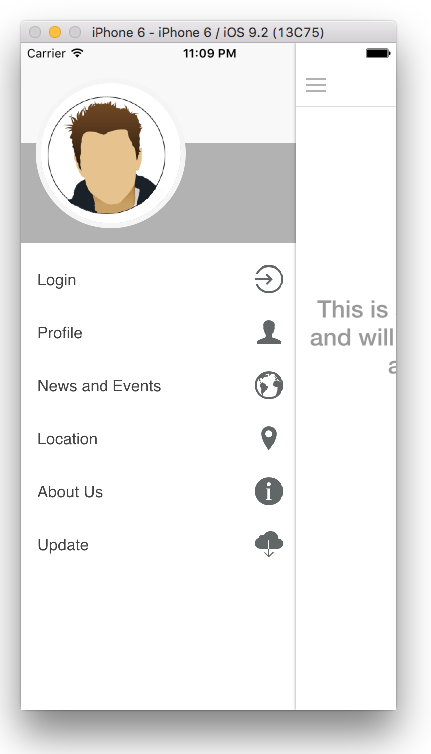
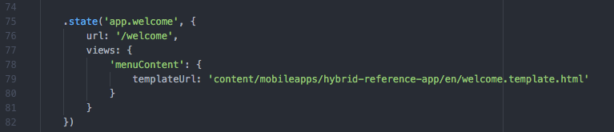
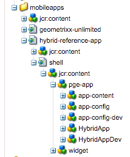
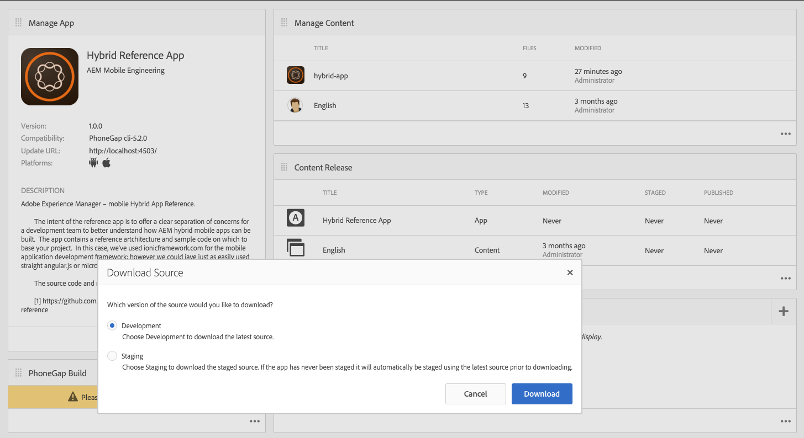
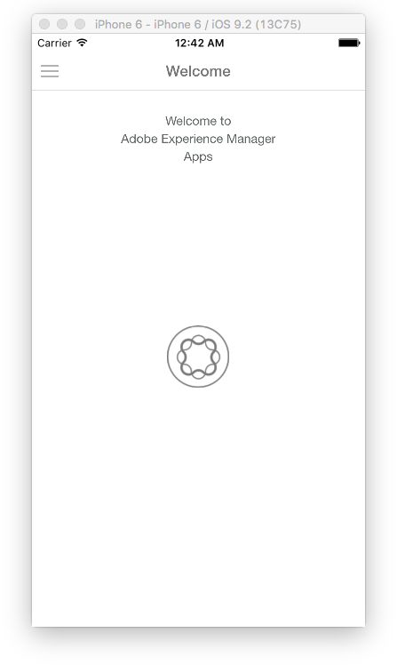

# Is your hybrid app ready for Adobe Experience Manager Mobile?{#is-your-hybrid-app-ready-for-aem-mobile}

>[!NOTE]
>
>Adobe recommends using the SPA Editor for projects that require single page application framework-based client-side rendering (for example, React). [Learn more](/help/sites-developing/spa-overview.md).

So you've imported your Hybrid PhoneGap or Cordova app into AEM, now what? Likely you want to add authorable content to your app. To accomplish this task, you need a general understanding of the structure of an AEM app. An app in AEM is commonly divided into two parts. The 'shell' and 'content'. The 'shell' comprises the static parts of your app; such as the PhoneGap configuration files, the app framework, and the navigation controls. The contents of the archive that you imported are stored as part of the shell. In the context of this document, the shell is all the non-AEM authored content of your Hybrid PhoneGap app built by the app developer.

Content refers to the components, templates, and authored pages that are authored in AEM built by the AEM Developer. Content is categorized as either developer content or as authored content. Components, designs, and page templates are considered to be dev-content since they are built by a developer. Author-contents are pages that have been built using the components and templates. These pages are typically done by a Designer or a Marketer.

Adding authored AEM pages to your Hybrid app requires coordination between the app developer and the AEM developer. Anywhere in the app where you want to add authored content, the app developer must organize these pages in a structure that can be overlaid in Experience Manager. The app developer must be able to provide the Experience Manager developer with the paths to where the Experience Manager authored content is added. Then, provide a placeholder page in the Hybrid app that is replaced after the Experience Manager developer has authored the page content.

To make the explanation easier to follow, the AEM Experience Cloud is being used: AEM Mobile Hybrid Reference to explain the concepts. The Hybrid Reference app consists of a welcome page with a side menu.

In this example, the welcome page of the application is going to be authored. Looking at the source [https://github.com/Adobe-Marketing-Cloud-Apps/aem-mobile-hybrid-reference/blob/master/hybrid-app/www/js/app.js#L75](https://github.com/Adobe-Marketing-Cloud-Apps/aem-mobile-hybrid-reference/blob/master/hybrid-app/www/js/app.js#L75). Notice that the app developer has defined a welcome page and provided a template for the page which is rendered by the app. This page is where the app developer and AEM developer must coordinate. The path to the welcome page template in the Hybrid Reference App is defined as ''content/mobileapps/hybrid-reference-app/en/welcome.template.html''. This path is important because the AEM developer will author their welcome page in the AEM repository using the same path.

It is important the hybrid app and the AEM authored content use the same path because it relies on the ability to overlay content using Content Sync to add new pages to the Hybrid app. When the Hybrid App is imported into AEM, as part of the import process, Content Sync configurations are set up.

When you 'Download Source' from the app dashboard these ContentSync scripts are run to assemble an archive of your Hybrid App.

ContentSync first pulls in 'shell' of the app which is where all the app developed content of the Hybrid app is stored. Then, it pulls in the 'content' of the app. Now, if there are pages in the 'shell' that have the same path as in 'content', the pages under 'shell' are (replaced) by the pages under 'content'. So, in the Hybrid Reference App sample, if a page is created in AEM that has the same path as ''content/mobileapps/hybrid-reference-app/en/welcome.template.html'', when ContentSync runs, it overlays the page that was part of the Hybrid Reference app. It overlays it with whatever is in AEM at that location. The overlay is taken care of by ContentSync, so for someone who's using the app, the updates to the app with AEM authored content looks seamless and does not require a rebuild of the app. As a result, when you run the app, the welcome page appears as follows:

