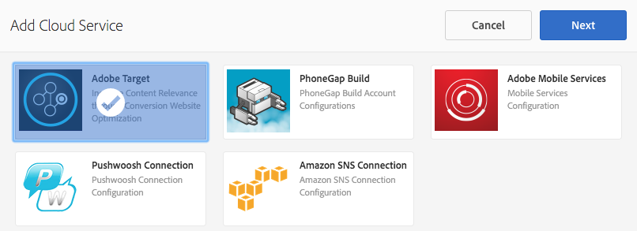
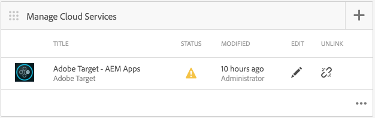
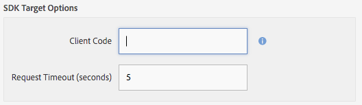

# AEM Mobile content personalization{#aem-mobile-content-personalization}

{{ue-over-mobile}}

>[!NOTE]
>
>This document is part of the [Getting Started with AEM Mobile](/help/mobile/getting-started-aem-mobile.md) Guide, a recommended starting point for AEM Mobile reference.

The AEM Mobile content personalization feature allows [AEM Authors](#author) to personalize mobile app content by using [Adobe Target](https://business.adobe.com/products/target/adobe-target.html). This allows the delivery of targeted offers to mobile application users. Adobe Experience Manager Mobile provides the ability to create, target, and deliver content that will provide the user with content that is specific for their own individual tastes.

In AEM, for authors to begin creating this content, administrators and developers must first prepare the environment.

[AEM administrators](#administrator) are required to establish a connection between AEM Mobile and the Adobe Target Cloud Service.

Meanwhile, AEM Mobile [developers](#developer) must edit their existing scripts to facilitate targeted content authoring.

## For Administrators {#for-administrators}

There are several steps that must come together before content authors can start to generate targeted content for mobile apps: There's getting the right set of permissions for users and groups, creating cloud services, configuring the application for the activity, and finally generating the content.

This article guides you through the process used to configure the [AEM Mobile Hybrid Reference Application](https://github.com/Adobe-Marketing-Cloud-Apps/aem-mobile-hybrid-reference) for targeting.

The assumption going forward is that the AEM Mobile Hybrid Reference Application has been successfully deployed and accessible via the AEM Mobile Dashboard.

Before authors can generate targeted content within an application, your AEM instance must be [configured with the Adobe Target Cloud Service.](/help/mobile/aem-mobile-configuring-cloud-service.md)

### Permissions {#permissions}

Users that need access to the personalization console must be part of the `target-activity-authors` group.

It is suggested that as part of the users and group setup that the target-activity-group should be added to the apps-admins group. By adding the target-activity-authors group, this allows users the ability to see the Personalization navigation menu entry.

>[!NOTE]
>
>Forgetting to add the users or groups that you want to have access to the personalization Admin Console to the target-activity-authors group prevents users from seeing the personalization console.

### Cloud Services {#cloud-services}

To get targeted content working for mobile applications, there are two services that must be configured: The Adobe Target Service and the Adobe Mobile Services service. The Adobe Target Service provides the engine for processing client requests and returning the personalized content. The Adobe Mobile Services service provides the connection between the Adobe services and the mobile application via the ADBMobileConfig.json file which is consumed by the AMS Cordova plugin. From the AEM Mobile Dashboard, you can configure your application by adding the two services.

From the AEM Mobile Dashboard, locate the Manage Cloud Services and click the + button.


From the Add Cloud Service wizard, select the "Adobe Target" cloud service card and click Next.



From the Select a Configuration drop-down, you can either create a configuration or select from an existing one. To create a configuration, select "Create Configuration" from the dropdown. Enter a title for the Target configuration. Enter your client code, email, and password that are associated with your Target account. If you do not know the values for these fields, contact the Adobe Target support. Click the "Verify" button to validate the credentials. Once verified, click the Submit button to create the cloud service.

>[!NOTE]
>
>The cloud service that gets created is automatically associated with the mobile application via the wizard. The cq:cloudserviceconfigs property value gets set on the jcr:content node of the apps group node. For the hybrid app sample, it gets set on /content/mobileapps/hybrid-reference-app/jcr:content with the value pointing to the automatically generated framework node at /etc/cloudservices/testandtarget/adobe-target---aem-apps/framework. The framework node has two properties set by default, gender and age. The framework is only used by AEM previewing and does not have any impact on the device.

After completion of the wizard, the Manage Cloud Service tile contains the Target cloud service. However, it contains a warning about a missing Adobe Mobile Service account.



### Adobe Mobile Services {#adobe-mobile-services}

It is necessary to link an Adobe Mobile Services (AMS) account to the application as well, the AMS service provides the required ADBMobileConfig.json file which contains the Target client code information. Before creating an association with the AMS account, the AMS account must be modified by a user that has permissions to AMS.

### Client Code {#client-code}

To log in to the AMS services visit [https://mobilemarketing.adobe.com](https://mobilemarketing.adobe.com/), select the mobile application and click the settings. Locate the SDK Target Options field and place the client code into the field and click Save.



Now that the client code has been associated with the mobile application, when the AMS cloud service is configured via the Adobe Mobile Dashboard the settings for the service settings will be delivered via the ADBMobileConfig.json file.

### Adobe Mobile Service Cloud Service {#adobe-mobile-service-cloud-service}

Now that AMS is configured, it is time to associate the mobile application in the Adobe Mobile Dashboard. From the AEM Mobile Dashboard, locate the Manage Cloud Services and click the + button.


Select the Adobe Mobile Services card and click Next.


From the Create or Select wizard step, select the Mobile Service drop-down, and select the Create Configuration entry. Provide a title, company, username, password, and select the appropriate data center. If you do not know these values, contact your Adobe Mobile Service administrator to obtain them. After all fields are filled out, click **Verify**. The verification process goes to AMS and verifies the credentials for the account, and on successful validation, a list of Mobile Applications is populated where you select the associated mobile application from the dropdown. Click **Submit** to complete the wizard. The process may take a bit of time to obtain the configuration data and any associated analytics with the application. After the process is complete, click **Done** to return back to the Adobe Mobile Dashboard.

Returning back to the Mobile Dashboard, the Manage Cloud Services tile contains the AMS cloud service. Also, the Analyze Metrics tile is populated with lifecycle reports.


## For Authors {#for-authors}

**Prerequisite:** As mentioned above, administrators must configure the connection to the Adobe Target Service before authors can generate new targeted content.

Once the Administrator has configured the two cloud services and the developer has configured the mobileappoffers handler, content authors can now start generating targeted experiences.

Authoring targeted content within an AEM Mobile app follows a similar procedure to authoring AEM Sites:

See here for a complete overview on [Authoring targeted content in AEM](/help/sites-authoring/personalization.md)

## For Developers {#for-developers}

AEM developers building mobile applications should continue to follow the patterns commonly used throughout AEM when developing components. Here, Adobe walks you through the necessary steps to enable content authors to create targeted content:

### Adobe Target ContentSync Handlers {#adobe-target-contentsync-handlers}

To deliver content to the user's device, content is generated by rendering the offers which are created by AEM content authors. To handle the rendering of target offers, there is a new content sync handler that processes the offers. Using the Hybrid Reference Application as the sample, the en (english) content package contains the ContentSyncConfig with a [mobileappoffers](https://github.com/Adobe-Marketing-Cloud-Apps/aem-mobile-hybrid-reference/blob/master/aem-package/content-author/src/main/content/jcr_root/content/mobileapps/hybrid-reference-app/en/_jcr_content/pge-app/app-config-dev/targetOffers/.content.xml) handler. The next step is crucial for rendering offers to the device. The mobileappoffers handler has a path property that identifies the path to the personalization activity that is to be used for the application.

For example, if there is an activity at */content/campaigns/hybridref*, copy this path and paste it as the value to the *path* property of the mobileappoffers handler.

>[!NOTE]
>
>For the Hybrid Reference Application, there are two mobileappoffers handlers one for the dev and one for productions.

After the activities path is set in the mobileappoffers handler's path property, save the handler. The handler is now ready to start rendering offers for mobile devices.

### Render Mode {#render-mode}

The mobileappoffers handler is configured differently for publish and dev setups. For publish setups there is a property called *renderMode* with a value of *publish* set on the cq:ContentSyncConfig node. The mobileappoffers handler references the renderMode and, if set to publish, edits the mbox id that gets created. By default, mboxes that are created by AEM have an --author value appended to the mbox id. This identifies that the activity has not been published and should use the unpublished campaign for offer resolutions.

When content is staged via the Adobe Mobile Dashboard, staged content is considered production ready content and is rendered via the non-dev Content Sync Config. Rendering this way will cause the --author to be removed from all mbox ids and expect a published activity to be available on the Target server. Before testing staged content, make sure that the activity is already published.

### Personalization App Development {#personalization-app-development}

#### Components {#components}

The foundation for any content is typically a page component that extends either one of the base AEM page components wcm/foundation/components/page or foundation/components/page depending if you're using HTL or JSPs. The duration of these steps focus on using the wcm/foundation/components/page component. The basic structure of the page component is broken down into multiple scripts, with each script providing the specific purpose of allowing the developer to organize and override their code if needed. The two scripts that are of interest for Personalization is the head.html and body.html. These two scripts provide an area where code can be injected to support the Context Hub, Cloud Services, and Mobile authoring.

Here is an overview of the two primary scripts used to enable content targeting.

#### head.html {#head-html}

To provide the author the ability to target their content, the target menu must be added to the page so that the author can change context from edit mode to targeting mode. To enable this feature, the developer should modify the head.html script to include the following snippet of code near the top of the head.html or as close to the &lt;title&gt;&lt;/title&gt; element as possible.

```xml
<meta data-sly-test="${!wcmmode.disabled}">
    <div data-sly-call="${clientLib.all @ categories='personalization.kernel'}" data-sly-unwrap></div>
    <div data-sly-resource="${'config' @ resourceType='cq/personalization/components/clientcontext_optimized/config'}" data-sly-unwrap></div>
    <div data-sly-resource="${'contexthub' @ resourceType='granite/contexthub/components/contexthub'}" data-sly-unwrap></div>
</meta>
```

>[!NOTE]
>
>Only include the script when the WCM Mode is disabled such that when the WCM Mode is disabled (see ContentSync handler's section for details) the script is not included in the final application code.

To provide authors the ability to preview the targeted content, the editor must be able to locate the configuration of the Adobe Target cloud service. The code block below adds two important scripts. The first adding the ability for the page to locate the associated Target cloud service and make the calls out to Adobe Target. The second is the addition of the cq.apps.targeting category.

The **cq.apps.targeting** category overrides the default cq/personalization/component/target component and uses the mobileapps/components/target component that renders offers specifically for mobile application consumption. More details of this will be discussed in the Target Component section.

The code should be added in the head.html and placed just before the end of the &lt;/head&gt; element.

```xml
<div data-sly-test="${!wcmmode.disabled}">
    <div data-sly-include="/libs/cq/cloudserviceconfigs/components/servicelibs/servicelibs.jsp" data-sly-unwrap></div>
    <meta data-sly-call="${clientLib.all @ categories='cq.apps.targeting'}" data-sly-unwrap></meta>
</div>
```

>[!NOTE]
>
>The block of code is wrapped within a WCM Mode not being disabled therefore only coming into play while the content author is working on creating content. The cloud service scripts are not added to the generated mobile runtime code.

#### body.html {#body-html}

To give the content author the ability to test different personas, the body.html script must include the following code block as the first child of the body element.

```xml
<div data-sly-test="${!wcmmode.disabled}">
    <div data-sly-resource="${'clientcontext' @ resourceType='cq/personalization/components/clientcontext_optimized'}" data-sly-unwrap></div>
</div>
```

The last bit of code required is at the bottom of body.html. This bit of code looks for the associated cloud service and injects the appropriate targeting engine code.

```xml
<div data-sly-test="${!wcmmode.disabled}">
    <div data-sly-resource="${'cloudservices' @ resourceType='cq/cloudserviceconfigs/components/servicecomponents'}" data-sly-unwrap></div>
</div>
```

### Reference Application {#reference-application}

Examples of head.html and body.html can be found in the [AEM Mobile Hybrid Reference Application](https://github.com/Adobe-Marketing-Cloud-Apps/aem-mobile-hybrid-reference) showing the developer where to place the script blocks within the two scripts.

### Content Sync Handlers {#content-sync-handlers}

When the content author has finished creating content for the mobile application, the next step is to download the source and build the application, or stage the content to be published. There are several steps that the developer is involved with to make this happen. To aid in rendering the content, AEM Mobile uses content sync handlers to render and package the content. A new content sync handler has been introduced for the Personalization use case to render targeted content. The 'mobileappoffers' handler knows how to render the associated target offers that have been created by the content author. The mobileappoffers handler extends the abstract pages update handler therefore, many of the properties are similar. The details of the mobileappoffers handler have the following properties.

<table>
 <tbody>
  <tr>
   <td><strong>Property</strong></td>
   <td><strong>Value</strong></td>
   <td><strong>Description</strong></td>
  </tr>
  <tr>
   <td>rewrite</td>
   <td>+ relativeParentPath<p> - "/"</p> </td>
   <td>The rewrite property identifies how paths within the content should be rewritten.</td>
  </tr>
  <tr>
   <td>includedPageTypes</td>
   <td><p>"cq/personalization/components/teaserpage",</p> <p>"cq/personalization/components/offerproxy"</p> </td>
   <td>The includePageTypes property is optional, defaulting to pages that have resource types of cq/personalization/components/teaserpage and cq/personalization/components/offerproxy. These two resource types are the default resource types used when content is targeted. If additional resource types must be supported, add them to the list of includePageTypes.</td>
  </tr>
  <tr>
   <td>locationRoot</td>
   <td>/content/mobileapps/&lt;app&gt;</td>
   <td>The location of the App.</td>
  </tr>
  <tr>
   <td>type</td>
   <td>mobileappoffers</td>
   <td>The name of the handler being mobileappoffers.</td>
  </tr>
  <tr>
   <td>selector</td>
   <td>tandt</td>
   <td>The tandt selector is used to render the targeted content. </td>
  </tr>
  <tr>
   <td>targetRootDirectory</td>
   <td>www</td>
   <td>The root directory where to persist the rendered content.</td>
  </tr>
  <tr>
   <td>includeImages</td>
   <td>true | false</td>
   <td>If true any images included in the offer will be rendered. If false, images are skipped.</td>
  </tr>
  <tr>
   <td>includeVideos</td>
   <td>true | false</td>
   <td>If true any videos included in the offer will be rendered. If false, videos are skipped.</td>
  </tr>
  <tr>
   <td>path</td>
   <td>/content/campaigns/&lt;brand&gt;</td>
   <td>Points to the campaign's brand which the offers participate in. Currently all offers must come from the same campaign.</td>
  </tr>
  <tr>
   <td>deep</td>
   <td>true | false</td>
   <td>If true recursively render all child pages, if false do not recurse. </td>
  </tr>
  <tr>
   <td>extension</td>
   <td>html</td>
   <td>Sets the extension for the resource being rendered. Set to html such that the pages have an .html extension.</td>
  </tr>
 </tbody>
</table>

>[!NOTE]
>
>The [AEM Mobile Hybrid Reference App](https://github.com/Adobe-Marketing-Cloud-Apps/aem-mobile-hybrid-reference) has the default mobileappoffer handler's configuration. The path property in the sample is empty as it depends on the campaign location. After a Campaign author has created a Campaign, the apps administrator should associate the Campaign with the handler by specifying the path property to point to the Campaign.

### Target Component {#target-component}

To help render content specifically for mobile applications, AEM Mobile uses the mobileapps/components/target component. The mobile target component extends the cq/personalization/components/target component and overrides the engine_tnt.jsp script. By overriding the engine_tnt.jsp, this allows AEM Mobile to control the generated HTML for the mobile apps use case. For every component that is targeted by a content author, an associated mbox is created by the engine_tnt.jsp.

For each mbox, an attribute of **cq-targeting** is added allowing application developers to write custom code to consume and use however they want. The [AEM Mobile Hybrid Reference App](https://github.com/Adobe-Marketing-Cloud-Apps/aem-mobile-hybrid-reference) has an example of an Angular directive that uses the cq-targeting attribute. The concept of content replacement, when and how it is done, is up to the mobile application developer. There is a Mobile SDK that is delivered via AEM /etc/clientlibs/mobileapps/js/mobileapps.js that provides an API to call the Adobe Targeting service. It is up to the application developer to specify when that call should be made according to the design of their application.

## What's Next? {#what-s-next}

1. [Start my AEM Mobile app experience](/help/mobile/starting-aem-phonegap-app.md)
1. [Manage my app's content](/help/mobile/phonegap-manage-app-content.md)
1. [Build my application](/help/mobile/building-app-mobile-phonegap.md)
1. [Track my app's performance with Adobe Mobile Analytics](/help/mobile/phonegap-intro-to-app-analytics.md)
1. [Deliver a personalized app experience with Adobe Target](/help/mobile/phonegap-aem-mobile-content-personalization.md)
1. [Send important messages to my users](/help/mobile/phonegap-push-notifications.md)
