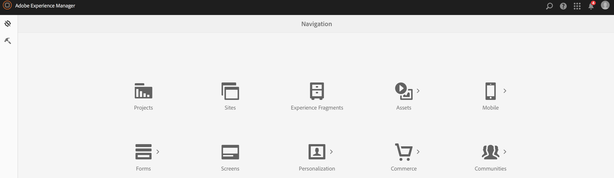
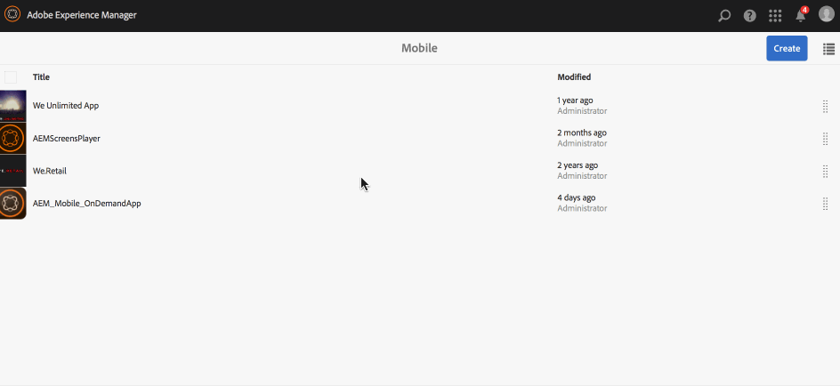

# App definitions{#app-definitions}

>[!NOTE]
>
>Adobe recommends using the SPA Editor for projects that require single page application framework-based client-side rendering (for example, React). [Learn more](/help/sites-developing/spa-overview.md).

App definitions are a way to identify what spaces and other configurations are appropriate for the app. App definitions allows the user to add space, without having to recompile the app. The app definition is updated and that will include the information for any new spaces.

>[!NOTE]
>
>App definitions are tied to an app, therefore they require the creation of an App in the AEM Mobile App console.

## Creating a New App definition {#creating-a-new-app-definition}

1. Choose **Mobile** from the AEM Navigation Console.

   

1. Choose **Apps** from **Mobile** and click **Create.**

   Choose **App** to and enter details to create your your new app.

   

### The Next Steps {#the-next-steps}

Once you are familiar with App Definitions, learn more about the following authoring resources:

* [Import an existing hybrid app](/help/mobile/phonegap-adding-content-to-imported-app.md)
* [Create a New App using Create App Wizard](/help/mobile/phonegap-create-new-app.md)
* [Content Services](/help/mobile/develop-content-as-a-service.md)

## Additional Resources {#additional-resources}

To learn about the roles and responsibilities of an Adminstrator and Developer, see the resources below:

* [Developing for Adobe PhoneGap Enterprise with AEM](/help/mobile/developing-in-phonegap.md)
* [Administering Content for Adobe PhoneGap Enterprise with AEM](/help/mobile/administer-phonegap.md)
