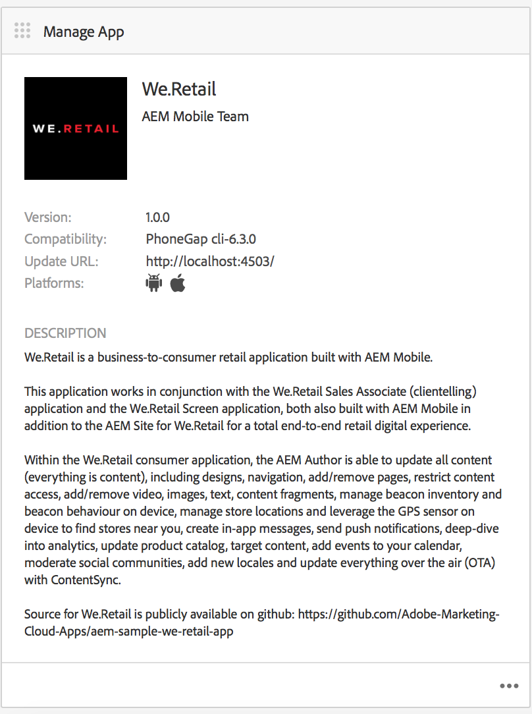
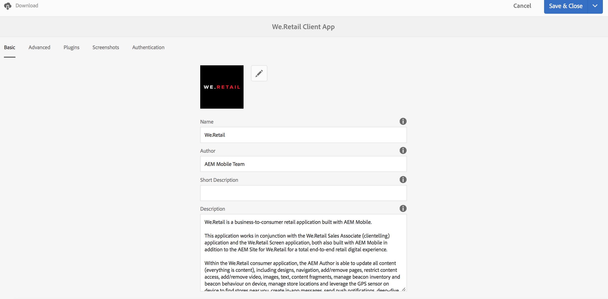
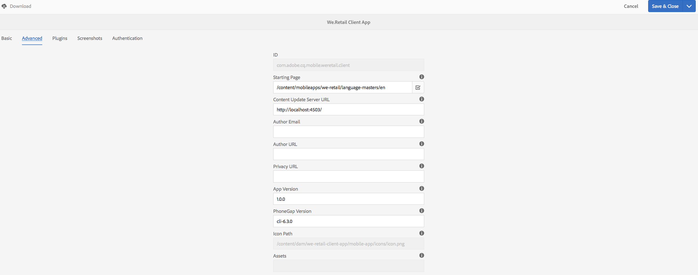
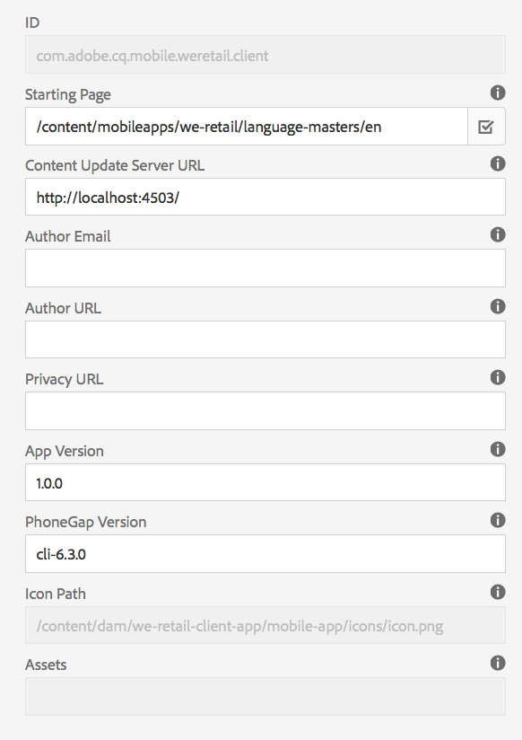
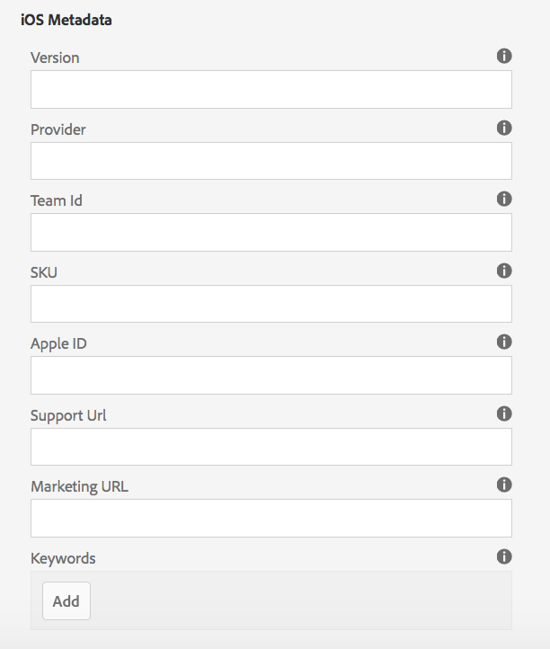
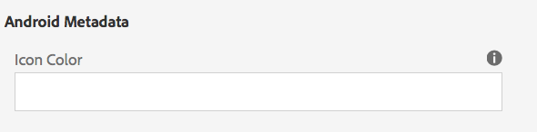
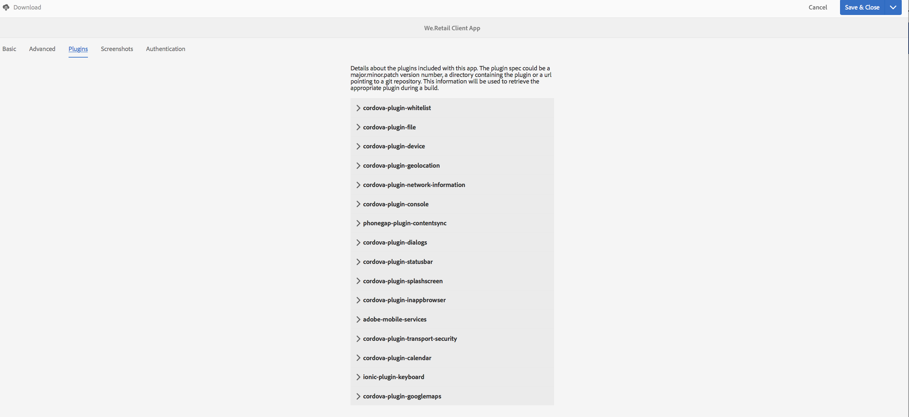
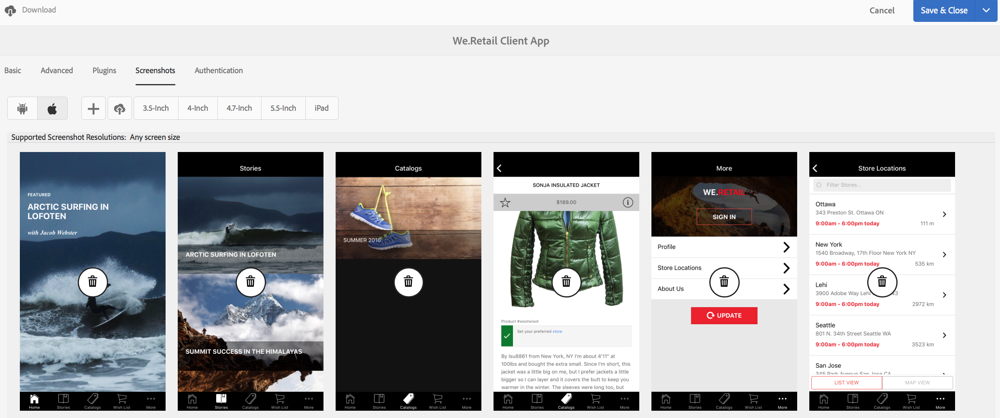
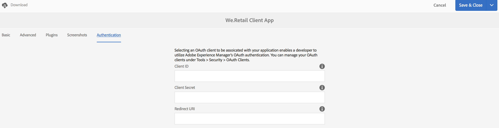

# Manage App Tile{#manage-app-tile}

{{ue-over-mobile}}

The **`Manage App`** tile on the App Dashboard lets you edit details about the Application. To open the Details page, click the **`Manage App`** tile's details link. From within the **`Manage App`** page, you can edit the PhoneGap Application Configuration (config.xml) settings and prepare your application for submission to the various application stores.



## Understanding the `Manage App` tile {#understanding-the-manage-app-tile}

You can drill into each tile in the **`Manage App`** tile to view or edit details by clicking the '...' in the bottom-right corner.

### The Basic tab {#the-basic-tab}

You can edit the **Name**, **Author**, **Short Description**, and the **Description** for your app from this tab.



### The Advanced tab {#the-advanced-tab}

Each mobile application platform describes what data is collected, targeting each application store specifically.

Platforms displayed are driven by the PhoneGap config.xml content:

```xml
<widget>
<gap:platform name="ios"/>
<gap:platform name="android"/>
</widget>
```

Each vendor application store&mdash;for example, Apple App Store or Google Play Store&mdash;requires one or more screenshots of your mobile application to display your application details to customers. These screenshots can have strict requirements around dimensions and content (basically they must truly represent the application). AEM Apps supports selecting and managing these screenshots for the supported platforms and viewing port dimensions as required by each vendor's application store.

>[!NOTE]
>
>The AEM Verify app lets you send screenshots directly to your app details in AEM.
>
>See [Mobile Quickstart for AEM Verify](/help/mobile/phonegap-mobile-quickstart.md) for more details.



### Metadata {#metadata}

>[!NOTE]
>
>Once you are familiar with the **`Manage App`** tile, see [Editing App Metadata](/help/mobile/phonegap-editmetadata.md) to view and edit the metadata.

#### Common Metadata {#common-metadata}

Every Application should have associated metadata that aids in configuring different aspects of the application. The Manage App page is separated into two different areas related to metadata collection. Platform-specific metadata and common metadata.

There is common configuration and metadata to all platforms.

Within this section, you define the Content Update Server URL, landing page for your mobile application, PhoneGap version for compilation, your application version, name, description, and more.

**App Version** is the working version of your application. Common best practice is to use a 3-decimal notation and start below 1.0.0 before your first release.

**PhoneGap Version** is the version in which you wish to compile your application with PhoneGap. Best practice is to keep up with the current version to ensure you get the latest and greatest features and bug fixes.

**Content Update Server URL** is the URL which your application uses to call for ContentSync updates. It must be set to your Dispatcher URL or, if not using a Dispatcher, to one of your publish instances that is used to serve ContentSync updates to your application.



>[!NOTE]
>
>This section may appear empty unless there is data populating the fields.
>
>At the top of the details view, you see Application Version, PhoneGap Version, and Update URL, each of these values can be set within Common Metadata section. However, the Application ID cannot be edited.

#### Platform Metadata {#platform-metadata}

Every platform that's defined in the PhoneGap config.xml can contain custom platform properties. An AEM developer must contribute the content structure to capture these properties. A provided example of platform-specific properties can be found for iOS.

Metadata for all configured platforms is now displayed at the same time on the Advanced tab of the `Manage App` tile.

>[!NOTE]
>
>The platform metadata sections are not used by PhoneGap during a CLI or build of Remote PhoneGap. Instead, AEM attempts to capture metadata for platforms such that they can be used later on when submitting to the targeted vendor's application store.

For platforms not understood by AEM, it is still possible for a AEM developer to extend the UI to capture this metadata which later on can be exported and used during the application submission process.

#### iOS Metadata {#ios-metadata}

The Apple AppStore requires extra metadata to submit your application for distribution. The iOS metadata section attempts to collect the required information that can be used by Apple's iTMSTransporter tool to publish the metadata to the associated Apple developer's account.

To obtain the Apple specific metadata, create your application on [https://itunesconnect.apple.com](https://itunesconnect.apple.com/). Upon creating your application, Apple generates metadata which is required by the iOS metadata section if you wish to use the Apple iTMSTransporter tool to validate and upload the metadata to itunesconnect.apple.com. If you want to obtain the metadata to collect, you do not have to fill out the iOS specific metadata. You can still export the metadata that merges the iOS and common metadata and collect all the screenshots into a zip file that can be downloaded at any time.

The downloaded zip file contains an itmsp file which can be inspected for the metadata.xml. The itmsp file contains the exported metadata (within the metadata.xml file), along with all the associated screenshots.

The export functionality is used to provide a convenient way of collecting the screenshots and metadata that can be passed along to the application publisher for input into the vendor-specific application store.



#### Android&trade; Metadata {#android-metadata}

When selecting the Android&trade; platform, there is no custom metadata at this point that can be set. When clicking the download button, a zip file is generated with a properties file that contains all the metadata and associated screenshots.

The export functionality is used to provide a convenient way of collecting the screenshots and metadata that can be passed along to the application publisher for input into the vendor-specific application store.



### Content Update Server URL {#content-update-server-url}

One of the key features of AEM Apps is the ability to have a mobile application request new content through ContentSync, where content can be html resources, pages, video, images, text, and more. After a content author has updated content and then publishes that content, the server makes the content update available for the mobile application to download.

The Content Update Server URL property is the URL that must point to a publish instance; either directly or through the Dispatcher or CDN. The format of the URL is simply:

`https://[hostname]:[port]`

>[!NOTE]
>
>If your Author server instance is replicating to many publish server instances (common architecture for AEM), each publish server has the same update content. The reason is because the update is built on the author and replicated to all publish instances. Basically, load balancing and failover are fully supported.

### The Plugins tab {#the-plugins-tab}

The **Plugins** tab describes the plugins associated with your app. This information is used to retrieve the appropriate plugin during a build.



### The Screenshots tab {#the-screenshots-tab}

The **Screenshots** tab displays the supported screenshot resolutions on different platforms.



>[!NOTE]
>
>To add and remove screenshots, see [Editing App Metadata](/help/mobile/phonegap-editmetadata.md).

### The Authentication tab {#the-authentication-tab}

The **Authentication** tab lets you select an OAuth client to associate with your application and enables a developer to use Adobe Experience Manager's OAuth authentication.



### The Next Steps {#the-next-steps}

Once you have learned about Managing App Tile in the application dashboard, see the following resources for other authoring roles:

* [Editing App Metadata](/help/mobile/phonegap-editmetadata.md)
* [App Definitions](/help/mobile/phonegap-app-definitions.md)
* [Creating a New App using Create App Wizard](/help/mobile/phonegap-create-new-app.md)
* [Import an Existing Hybrid App](/help/mobile/phonegap-adding-content-to-imported-app.md)
* [Content Services](/help/mobile/develop-content-as-a-service.md)

### Other Resources {#additional-resources}

To learn about the roles and responsibilities of an Administrator and Developer, see the resources below:

* [Developing for Adobe PhoneGap Enterprise with AEM](/help/mobile/developing-in-phonegap.md)
* [Administering Content for Adobe PhoneGap Enterprise with AEM](/help/mobile/administer-phonegap.md)
