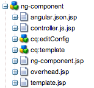

# The Anatomy of an App{#the-anatomy-of-an-app}

>[!NOTE]
>
>Adobe recommends using the SPA Editor for projects that require single page application framework-based client-side rendering (e.g. React). [Learn more](/help/sites-developing/spa-overview.md).

## Page Templates for Mobile Apps {#page-templates-for-mobile-apps}

Page components that you create for your app are based on the /libs/mobileapps/components/angular/ng-page component ([open in CRXDE Lite on a local server](http://localhost:4502/crx/de/index.jsp#/libs/mobileapps/components/angular/ng-page)). This component contains the following JSP scripts that your component either inherits or overrides:

* ng-page.jsp
* head.jsp
* body.jsp
* angular-app-module.js.jsp
* angular-route-fragment.js.jsp
* angular-app-controllers.js.jsp
* controller.js.jsp
* template.jsp
* angular-module-list.js.jsp
* header.jsp
* footer.jsp
* js_clientlibs.jsp
* css_clientlibs.jsp

### ng-page.jsp {#ng-page-jsp}

Determines the name of the application using the `applicationName` property, and exposes it via the pageContext.

Includes head.jsp and body.jsp.

### head.jsp {#head-jsp}

Writes out the `<head>` element of the app page.

If you want to override the viewport meta property of the app, this is the file that you override.

Following best practices, the app includes the css portion of the client libraries in the head, while the JS is included at the closing < `body>` element.

### body.jsp {#body-jsp}

The body of an Angular page is rendered differently depending on whether wcmMode is detected (!= WCMMode.DISABLED) to determine whether the page is opened for authoring or as a published page.

**Author Mode**

In author mode, each individual page is rendered separately. Angular does not handle routing between pages, nor is an ng-view used to load a partial template that contains the page's components. Instead, the content of the page template (template.jsp) is included on the server side via the `cq:include` tag.

This strategy enables the author features (such as adding and editing components in the paragraph system, Sidekick, design mode, etc.) to function without modification. Pages that rely on client side rendering, such as those for apps, do not perform well in AEM author mode.

Note that the template.jsp include is wrapped in a `div` element that contains the `ng-controller` directive. This structure enables the linking of the DOM contents with the controller. Therefore, although pages that render themselves on the client side fail, individual components which do so work fine (see section on Components below).

```xml
<div ng-controller="<c:out value="${controllerNameStripped}"/>">
      <cq:include script="template.jsp"/>
</div>
```

**Publish Mode**

In publish mode (such as when the app is exported using Content Sync), all pages become a single page app (SPA). (To learn about SPAs, use the Angular tutorial, specifically [https://docs.angularjs.org/tutorial/step_07](https://docs.angularjs.org/tutorial/step_07).)

There is only one HTML page in a SPA (a page that contains the `<html>` element). This page is known as the "layout template". In Angular terminology, it is "...a template that is common for all views in our application." Consider this page as the 'top-level app page'. By convention the top-level app page is the `cq:Page` node of your application that is closest to the root (and is not a redirect).

Since the actual URI of your app does not change in publish mode, references to external assets from this page must use relative paths. Therefore, a special image component is provided that takes this top level page into account when rendering images for exporting.

As an SPA, this layout template page simply generates a div element with an ng-view directive.

```xml
 <div ng-view ng-class="transition"></div>
```

The Angular route service uses this element to display the contents of every page in the app, including the authorable contents of the current page (contained in template.jsp).

The body.jsp file includes header.jsp and footer.jsp which are empty. If you want to provide static content on every page, you can override these scrips in your app.

Finally, javascript clientlibs are included at the bottom of the &lt;body&gt; element including two special JS files that are generated on the server: *&lt;page name&gt;*.angular-app-module.js and *&lt;page name&gt;*.angular-app-controllers.js.

### angular-app-module.js.jsp {#angular-app-module-js-jsp}

This script defines the Angular module of the application. The output of this script is linked to the markup that the rest of the template's component generates via the `html` element in ng-page.jsp, which contains the following attribute:

```xml
ng-app="<c:out value='${applicationName}'/>"
```

This attribute indicates to Angular that the contents of this DOM element should be linked to the following module. This module links the views (in AEM these would be cq:Page resources) with corresponding controllers.

This module also defines a top-level controller named `AppController` which exposes the `wcmMode` variable to the scope, and configures the URI from which to fetch Content Sync update payloads.

Lastly, this module iterates through each descendant page (including itself) and renders the content of the route fragement of each page (via the angular-route-fragment.js selector & extension), including it as a config entry to Angular's $routeProvider. In other words, the $routeProvider tells the app which content to render when a given path is requested.

### angular-route-fragment.js.jsp {#angular-route-fragment-js-jsp}

This script generates a JavaScript fragment that must take the following form:

```
.when('/<path>', {
    templateUrl: '<path to template>',
    controller: '<controller name>'
})
```

This code indicates to $routeProvider (defined in angular-app-module.js.jsp) that '/&lt;path&gt;' is to be handled by the resource at `templateUrl`, and wired up by `controller` (which we'll get to next).

If necessary, you can override this script to handle more complex paths, including those with variables. An example of this can be seen in the /apps/geometrixx-outdoors-app/components/angular/ng-template-page/angular-route-fragment.js.jsp script that is installed with AEM:

```xml
// note the :id suffix on the path
.when('<c:out value="${resource.path}"/>/:id', {
    templateUrl: '<c:out value="${relativeResourcePath}"/>.template.html',
    controller: '<c:out value="${controllerNameStripped}"/>'
})
```

### angular-app-controllers.js.jsp {#angular-app-controllers-js-jsp}

In Angular, Controllers wire up variables in the $scope, exposing them to the view. The angular-app-controllers.js.jsp script follows the pattern illustrated by angular-app-module.js.jsp in that it iterates through each descendant page (including itself) and outputs the controller fragment that each page defines (via controller.js.jsp). The module it defines is called `cqAppControllers` and must be listed as a dependency of the top level app module so that the page controllers are made available.

### controller.js.jsp {#controller-js-jsp}

The controller.js.jsp script generates the controller fragment for each page. This controller fragment takes the following form:

```
.controller('<c:out value="${controllerNameStripped}"/>', ['$scope', '$http',
    function($scope, $http) {
        var data = $http.get('<c:out value="${relativeResourcePath}"/>.angular.json' + cacheKiller);

        // component fragments which consume the contents of `data` go here
    }
])
```

Note that the `data` variable is assigned the promise returned by the Angular `$http.get` method. Each component included in this page can, if desired, make some .json content available (via its angular.json.jsp script) and act on the contents of this request when it resolves. The request is very fast on mobile devices because it simply accesses the file system.

In order for a component to be part of the controller in this way, it should extend the /libs/mobileapps/components/angular/ng-component component and include the `frameworkType: angular` property.

### template.jsp {#template-jsp}

First introduced in the body.jsp section, template.jsp simply contains the page's parsys. In publish mode, this content is referenced directly (at &lt;page-path&gt;.template.html) and loaded into the SPA via the templateUrl configured on the $routeProvider.

The parsys in this script can be configured to accept any type of component. However, care must be given when dealing with components that are built for a traditional website (as opposed to an SPA). For example, the foundation image component functions correctly only on the top-level app page since it is not designed to reference assets that are inside an app.

### angular-module-list.js.jsp {#angular-module-list-js-jsp}

This script simply outputs the Angular dependencies of the top-level Angular app module. It is referenced by angular-app-module.js.jsp.

### header.jsp {#header-jsp}

A script to place static content at the top of the app. This content is included by the top level page, outside the scope of ng-view.

### footer.jsp {#footer-jsp}

A script to place static content at the bottom of the app. This content is included by the top level page, outside the scope of ng-view.

### js_clientlibs.jsp {#js-clientlibs-jsp}

Override this script to include your JavaScript clientlibs.

### css_clientlibs.jsp {#css-clientlibs-jsp}

Override this script to include your CSS clientlibs.

## App Components {#app-components}

App components must not only work on an AEM instance (publish or author), but also when the application content is exported to the filesystem via Content Sync. The component must therefore include the following characteristics:

* All assets, templates, and scripts in a PhoneGap application must be referenced relatively.
* The handling of links differs if the AEM instance is operating in author or publish mode.

### Relative Assets {#relative-assets}

The URI of any given asset in a PhoneGap application differs not only on a per-platform basis, but is unique on each installation of the app. For example, note the following URI of an app running in the iOS Simulator:

`file:///Users/userId/Library/Application%20Support/iPhone%20Simulator/7.0.3/Applications/24BA22ED-7D06-4330-B7EB-F6FC73251CA3/Library/files/www/content/phonegap/geometrixx/apps/ng-geometrixx-outdoors/en/home.html`

Note the GUID '24BA22ED-7D06-4330-B7EB-F6FC73251CA3' in the path.

As a PhoneGap developer, the content that you are concerned with is located below the www directory. To access the app assets, use relative paths.

To compound the issue, your PhoneGap application uses the single page app (SPA) pattern so that the base URI (excluding the hash) never changes. Therefore, every asset, template, or script that you reference **must be relative to your top-level page. **The top level page initializes the Angular routing and controllers by virtue of `*<name>*.angular-app-module.js` and `*<name>*.angular-app-controllers.js`. This page should be the closest page to the root of the repository that *does not *extend a sling:redirect.

Several helper methods are available for dealing with relative paths:

* FrameworkContentExporterUtils.getTopLevelAppResource
* FrameworkContentExporterUtils.getRelativePathToRootLevel
* FrameworkContentExporterUtils.getPathToAsset

To see examples of their usage, open the mobileapps source located at /libs/mobileapps/components/angular.

### Links {#links}

Links must use the `ng-click="go('/path')"` function to support all WCM modes. This function depends on the value of a scope variable to correctly determine the link action:

```xml
<c:choose><c:when test="${wcmMode}">
    <%-- WCMMode is enabled - page is being rendered in AEM --%>
    $scope.wcmMode = true;
</c:when><c:otherwise>
    <%-- WCMMode is disabled --%>
    $scope.wcmMode = false;
</c:otherwise></c:choose>
```

When `$scope.wcmMode == true` we handle each navigation event in the usual way, such that the result is a change to the path and/or page portion of the URL.

Alternatively, if `$scope.wcmMode == false`, each navigation event results in a change to the hash portion of the URL which is resolved internally by Angular's ngRoute module.

### Component Script Details {#component-script-details}



#### ng-component.jsp {#ng-component-jsp}

This script displays either the component contents or a suitable placeholder when Edit mode is detected.

#### template.jsp {#template-jsp-1}

The template.jsp script renders the markup of the component. If the component in question is driven by JSON data extracted from AEM (such as 'ng-text': /libs/mobileapps/components/angular/ng-text/template.jsp), then this script will be responsible for wiring up the markup with data exposed by the page's controller scope.

However, performance requirements sometimes dictate that no client side templating (aka data binding) be performed. In this case, simply render the component's markup on the server side and it is included in the page template content.

#### overhead.jsp {#overhead-jsp}

In components driven by JSON data (such as 'ng-text': /libs/mobileapps/components/angular/ng-text), overhead.jsp can be used to remove all Java code from template.jsp. It is then referenced from template.jsp and any variables that it exposes on the request are available for use. This strategy encourages separation of logic from presentation, and limits the amount of code that must be copied and pasted when a new component is derived from an existing one.

#### controller.js.jsp {#controller-js-jsp-1}

As described in AEM Page Templates, each component can output a JavaScript fragment to consume the JSON content exposed by the `data` promise. Following Angular conventions, a controller should only be used for assigning variables to the scope.

#### angular.json.jsp {#angular-json-jsp}

This script is included as a fragment in the page-wide '&lt;page-name&gt;.angular.json' file that gets exported for each page that extends ng-page. In this file, the component developer can expose any JSON structure that the component requires. In the 'ng-text' example, this structure simply includes the text content of the component, and a flag indicating whether or not the component includes rich text.

The Geometrixx outdoors app product component is a more complex example (/apps/geometrixx-outdoors-app/components/angular/ng-product):

```xml
{
    "content-par/ng-product": {
        "items": [{
            "name": "Cajamara",
            "description": "Bike",
            "summaryHTML": "",
            "price": "$610.00",
            "SKU": "eqsmcj",
            "numberOfLikes": "0",
            "numberOfComments": "0"
        }]
    },
    "content-par/ng-product/ng-image": {
        "items": [{
            "hasContent": true,
            "imgSrc": "home/products/eq/eqsm/eqsmcj/jcr_content/content-par/ng-product/ng-image.img.jpg/1377771306985.jpg",
            "description": "",
            "alt": "Cajamara",
            "title": "Cajamara",
            "hasLink": false,
            "linkPath": "",
            "attributes": [{
                "attributeName": "class",
                "attributeValue": "cq-dd-image"
            }]
        }]
    }
}
```

## Contents of the CLI Assets Download {#contents-of-the-cli-assets-download}

Download CLI assets from the Apps console to optimize them for a specific platform and then build the app using the PhoneGap command line integration (CLI) API. The contents of the ZIP file that you save to the local file system has the following structure:

```xml
.cordova/
  |- hooks/
     |- after_prepare/
     |- before_platform_add/
     |- Other Hooks
plugins/
www/
  |- config.xml
  |- index.html
  |- res/
  |- etc/
  |- apps/
  |- content/
  |- package.json
  |- package-update.json
```

### .cordova {#cordova}

This is a hidden directory which you may not see depending on your current OS settings. You should configure your OS so that this directory is visible if you plan on modifying the app hooks that it contains.

#### .cordova/hooks/ {#cordova-hooks}

This directory contains the [CLI hooks](https://cordova.apache.org/docs/en/10.x/guide/appdev/hooks/). The folders in the hooks directory contain node.js scripts that are executed at exact points during the build.

#### .cordova/hooks/after-platform_add/ {#cordova-hooks-after-platform-add}

The after-platform_add directory contains the `copy_AMS_Conifg.js` file. This script copies a configuration file to support the collection of Adobe Mobile Services analytics.

#### .cordova/hooks/after-prepare/ {#cordova-hooks-after-prepare}

The after-prepare directory contains the `copy_resource_files.js` file. This script copies a number of icon and splash screen images into platform-specific locations.

#### .cordova/hooks/before_platform_add/ {#cordova-hooks-before-platform-add}

The before_platform_add directory contains the `install_plugins.js` file. This script iterates through a list of Cordova plugin identifiers, installing those which it detects are not already available.

This strategy does not require that you bundle and install the plugins to AEM each time the Maven `content-package:install` command is executed. The alternative strategy of checking the files into your SCM system requires repetitive bundling and installing activities.

#### .cordova/hooks/Other Hooks {#cordova-hooks-other-hooks}

Include other hooks as required. The following hooks are available (as provided by the Phonegap sample hello world app):

* after_build
* before_build
* after_compile
* before_compile
* after_docs
* before_docs
* after_emulate
* before_emulate
* after_platform_add
* before_platform_add
* after_platform_ls
* before_platform_ls
* after_platform_rm
* before_platform_rm
* after_plugin_add
* before_plugin_add
* after_plugin_ls
* before_plugin_ls
* after_plugin_rm
* before_plugin_rm
* after_prepare
* before_prepare
* after_run
* before_run

#### platforms/ {#platforms}

This directory is empty until you execute the `phonegap run <platform>` command on the project. Currently, `<platform>` can be either `ios` or `android`.

After you build the app for a specific platform, the corresponding directory is created and it contains the platform-specific app code.

#### plugins/ {#plugins}

The plugins directory is populated by each plugin listed in the `.cordova/hooks/before_platform_add/install_plugins.js` file after you execute the `phonegap run <platform>` command. The directory is initially empty.

#### www/ {#www}

The www directory contains all of the web content (HTML, JS, and CSS files) that implements the appearance and behaviour of the app. Except for the exceptions described below, this content originates from AEM and is exported into its static form via Content Sync.

#### www/config.xml {#www-config-xml}

The PhoneGap documentation (`https://docs.phonegap.com`) refers to this file as a 'global configuration file'. The config.xml contains many app properties, such as the name of the app, the app 'preferences' (for example whether or not an iOS webview allows overscroll), and plugin dependencies that are *only* consumed by PhoneGap build.

The config.xml file is a static file in AEM and is exported as-is via Content Sync.

#### www/index.html {#www-index-html}

The index.html file redirects to the starting page of the app.

The config.xml file contains the `content` element:

`<content src="content/phonegap/geometrixx/apps/ng-geometrixx-outdoors/en.html" />`

In the PhoneGap documentation (`https://docs.phonegap.com`), this element is described as "The optional &lt;content&gt; element defines the app's starting page in the top-level web assets directory. The default value is index.html, which customarily appears in a project's top-level www directory."

PhoneGap build fails if an index.html file is not present. Therefore, this file is included.

#### www/res {#www-res}

The res directory contains splash screen images and icons. The `copy_resource_files.js` script copies the files to their platform-specific locations during the `after_prepare` build phase.

#### www/etc {#www-etc}

By convention, in AEM the /etc node contains static clientlib content. The etc directory contains the Topcoat, AngularJS, and Geometrixx ng-clientlibsall libraries.

#### www/apps {#www-apps}

The apps directory contains code that is related to the splash page. The unique characteristic of the splash page of an AEM app is that it initializes the app with no user interaction. The clientlib content (both CSS and JS) of the app is therefore minimal to maximize performance.

#### www/content {#www-content}

The content directory contains the rest of the web content of the app. The content can include, but is not limited to, the following files:

* HTML page content, which is authored directly in AEM
* Image assets associated with AEM components
* JavaScript content that server-side scripts generate
* JSON files that describe page or component content

#### www/package.json {#www-package-json}

The package.json file is a manifest file that lists the files that a **full** Content Sync download includes. This file also contains the timestamp at which the Content Sync payload was generated ( `lastModified`). This property is used when requesting partial updates of the app from AEM.

#### www/package-update.json {#www-package-update-json}

If this payload is a download of the entire app, this manifest contains the exact listing of files as `package.json`.

However, if this payload is a partial update, `package-update.json` contains only the files that are included in this particular payload.

### The Next Steps {#the-next-steps}

Once you have learnt about the Anatomy of an app, see [Single Page Applications](/help/mobile/phonegap-single-page-applications.md).
