# Creating and Editing Apps Using the Apps Console{#creating-and-editing-apps-using-the-apps-console}

>[!NOTE]
>
>Adobe recommends using the SPA Editor for projects that require single page application framework-based client-side rendering (for example, React). [Learn more](/help/sites-developing/spa-overview.md).

The AEM mobile application development process recognizes that users of different expertise contribute to the development of mobile applications. The following process map illustrates the general order in which content authors and application developers perform tasks.

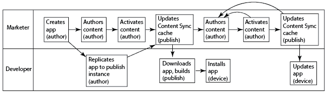

Information about how to perform the Marketer tasks appear on this page. For information about the Developer tasks, see Building PhoneGap Applications.

## The Structure of Mobile Applications {#the-structure-of-mobile-applications}

AEM Mobile provides the Phonegap App blueprint for creating mobile applications. The blueprint defines the structure of the applications that you create. Applications consist of the following items:

* The root page.
* The language variations of the application.
* The home page of the language variation.

### The Root of a Phonegap App {#the-root-of-a-phonegap-app}

The root page of the mobile applications that you create in AEM appears in the Apps console.

The root page is stored below the Destination Path property of the application that was specified upon creating the application (the default path is /content/phonegap/apps). The page name is the Name property of the application. For example, the default URL of the root page of the site named `myphonegapapp` is `http://localhost:4502/content/phonegap/apps/myphonegapapp.html`.

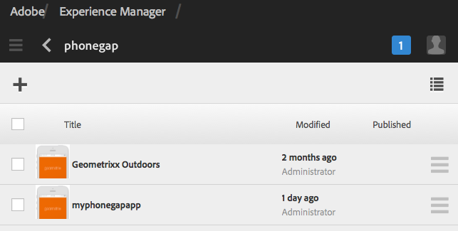

### The Language Variation of a PhoneGap App {#the-language-variation-of-a-phonegap-app}

The first child pages of the root page are the language variations of the application. The name of each page is the language for which the application is created. For example, English is the name of the English variation of the application.

**Note:** The default PhoneGap blueprint creates only an English application. Your developer can modify the blueprint so that it can create more language variations.

The language page serves two purposes:

* The page content is the spash page for the language variation of the application.
* The page properties control several design aspects of the application, such as the URL to use for requesting content updates, and information about connecting to the cloud build and Adobe Analytics Services integration.

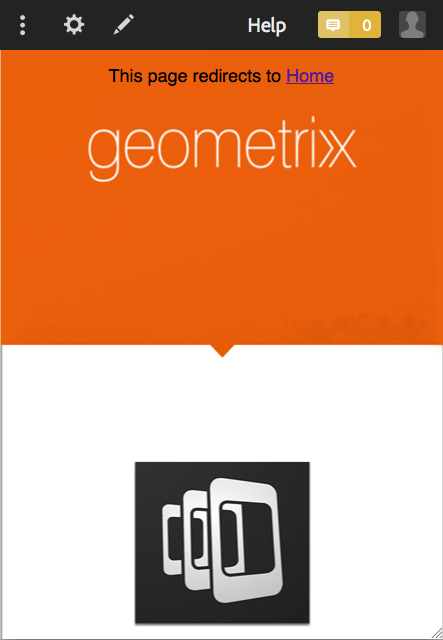

### The Home Page {#the-home-page}

The Home page, or index.html page of a language variation of an application appears when the application is opened. The home page provides users with a menu of links to various pages in the application. The paragraph system enables you to add components to the page for creating content.

## Creating a Mobile Application {#creating-a-mobile-application}

Mobile applications are based on a blueprint that defines a page structure and properties. You can configure the following application properties:

* **Title:** The application title.
* **Destination Path:** The location in the repository where the application is stored. Leave the default to create a path based on the app name.

* **Name:** The default value is the value of the Title property with space characters removed. The name is used within CQ to refer to the application, for example for the repository node that represents the application.
* **Description:** A description of the application.
* **Server URL:** The URL that provides Over-the-Air (OTA) content updates to the application. The default value is the publish server URL of the instance that is used to create an application (taken from the externalizer service). Note, this must be a publish server instance rather than an author, which requires authentication.

You can also provide an image file to use as the application thumbnail, select the PhoneGap Build configuration to use, and select the Mobile App analytics configuration to use. This image is only used as a thumbnail to represent your mobile application within the mobile apps console in Experience Manager.

Additional (and optional) tabs exist for build cloud service and integrating the Adobe Mobile Services SDK plug-in into your app.

* Build: Click manage configurations and set up your build.phonegap.com build service here. Then from the drop-down you will be able to select the newly created PhoneGap build cloud service.
* Analytics: Click manage configurations and set up your [Adobe Mobile Services SDK](https://experienceleague.adobe.com/docs/mobile-services/using/home.html) cloud service. Then from the drop-down you will be able to select the newly created Mobile Service to integrate into your mobile app.

>[!NOTE]
>
>Developers can use the AEM PhoneGap Starter Kit to create apps and add them to the console.

The following procedure uses the Touch UI to create a mobile application.

1. On the rail, click Apps.
1. Click the Create icon.

   

1. (Optional) On the Advanced tab, provide a description for the application, and change the server URL if required.
1. (Optional) If you are using PhoneGap Build to compile the application, on the Build tab, select the Configuration to use.

   To create a PhoneGap build configuration, click Manage Configurations.

1. (Optional) If you are using SiteCatalyst to track application activity, on the Analytics tab, select the configuration to use.

   To create a Mobile App Configuration, click Manage Configurations.

1. (Optional) To provide an application icon, click the Browse button, select the image file from your file system, and click Open.
1. Click Create.

### Changing the Properties of a Mobile Application {#changing-the-properties-of-a-mobile-application}

After you create a mobile application, you can change the properties.

#### Change the title, description, and icon {#change-the-title-description-and-icon}

1. On the rail, click or tap Apps.
1. Select the application to configure and click the View Page Properties icon.

   

1. To change property values, click or tap the Edit icon.

   

1. Configure the Basic and Advanced properties, and then click or tap the Done icon.

   

#### Configure a Language Variation of the Application {#configure-a-language-variation-of-the-application}

1. On the rail, click Apps.
1. Click to drill-into the mobile application you wish to edit within the apps Admin Console. Select the language version of the application to configure and click the View Application Properties icon.

   

1. To change property values, click or tap the Edit icon.

   

1. Configure the properties on the Basic, Advanced, Build, and Analytics tabs, and then click or tap the Done icon.

   

### Authoring the Content of a Mobile Application {#authoring-the-content-of-a-mobile-application}

After you create the mobile application, add content that is used as the application UI.

1. On the rail, click or tap Apps.
1. Click or tap the application, then click or tap English.
1. Edit the Home page, or add child pages as required.

### Moving Content to Mobile Applications {#moving-content-to-mobile-applications}

The Content Sync cache on the AEM publish instance is used as a repository of content for mobile applications:

* Content in the Content Sync cache is included in the application when developers compile the application.
* Content in the cache is available to installed mobile applications for updating the application content.

Mobile applications include an Updates command that downloads and installs updated application content. When an application instance sends an Update request, Content Sync determines which content has changed since the last time the application was updated or installed, and provides the new content.

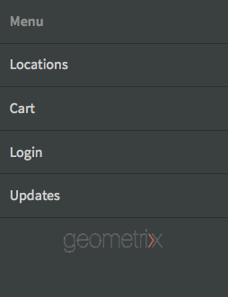

To make updated content available to applications, you update the Content Sync cache. The first time you update the cache, all published content is added. Subsequent updates adds only the published content that has changed since the previous update.

Content Sync also tracks when the updates occur. With this information, Content Sync can determine which cache update to send to a mobile application.

Perform the following procedure on the instance where you want to update the cache. For example, if your application requests updates from the publish instance, perform the procedure on the publish instance.

1. On the rail, click or tap Apps, then click or tap your application.
1. Select the splash page, and then click or tap the Update Cache icon.

   

### Using App Templates {#using-app-templates}

This is a feature that is available with Apps 6.1 Feature Pack 2 and provides an easy way to leverage existing app templates for the creation of new apps within AEM.

What is an app template? Think of it as a collection of page templates and components that represent a baseline or foundation of an app.
When creating a new app based on the template of another app, you will get an app that has a starting point representative of the app in which it was created from.

You must have an existing mobile app template (or an app installed that has an app template) to make use of this feature.

The latest AEM Apps 6.1 samples package includes an updated version of the Geometrixx app with an app template. Alternatively, you can install the StarterKit which also provides a template.

Steps to creating a new app based on an app template:

1. Ensure you have the latest AEM Apps 6.1 feature pack and reference samples packages installed
1. Click Apps from the left rail.

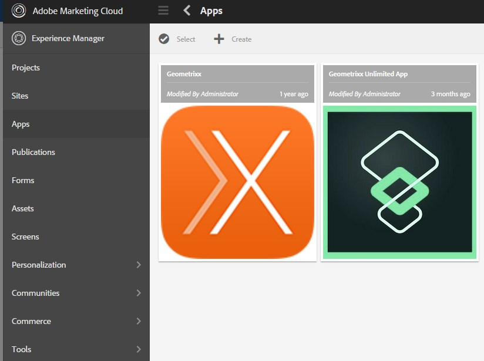

1. Click the + Create button at the top and select Create App.
1. Once you are presented with the list of App Templates, select one:

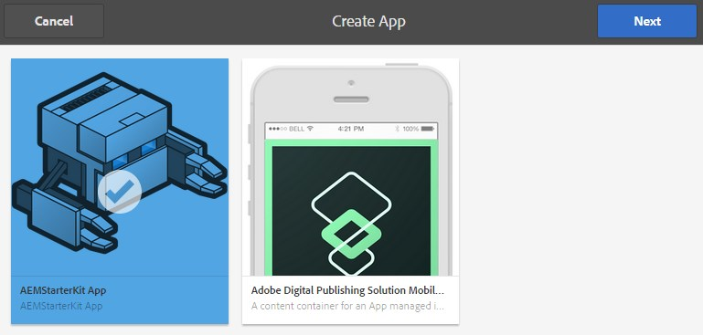

1. Click Next.
1. Provide an App Id and Title, however you might want to also include a Name and a Description.

    1. Also, you can provide a PNG (supported PhoneGap icon format) as an icon by browsing AEM assets.
    1. Recall that you can edit all these fields after the app has been created in the Manage App tile. With the exception of the App Id, once the App Id has been set you are unable to change it.

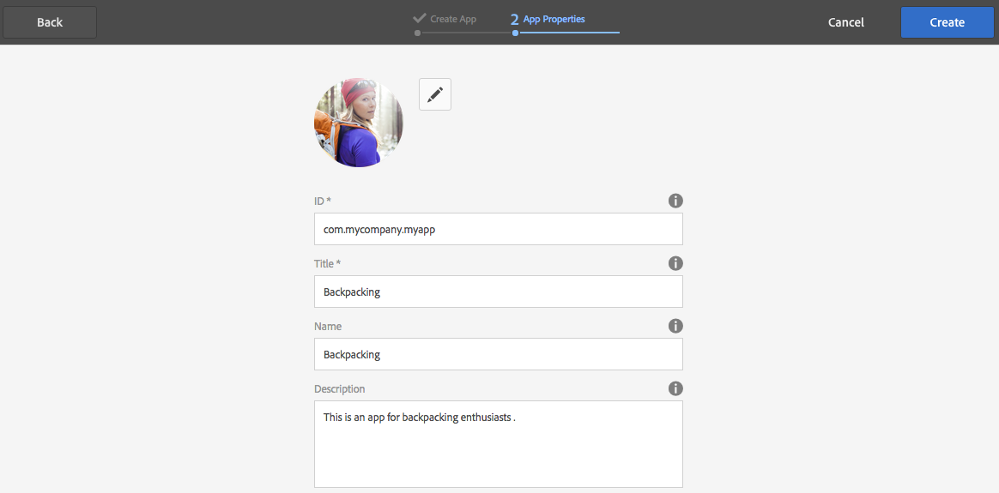

1. Click the create button, you will be presented with 2 options, either Done (go back to Apps catalog view) or Manage App (opens the app dashboard).
1. Once created, you should see the new app listed in the App catalog:

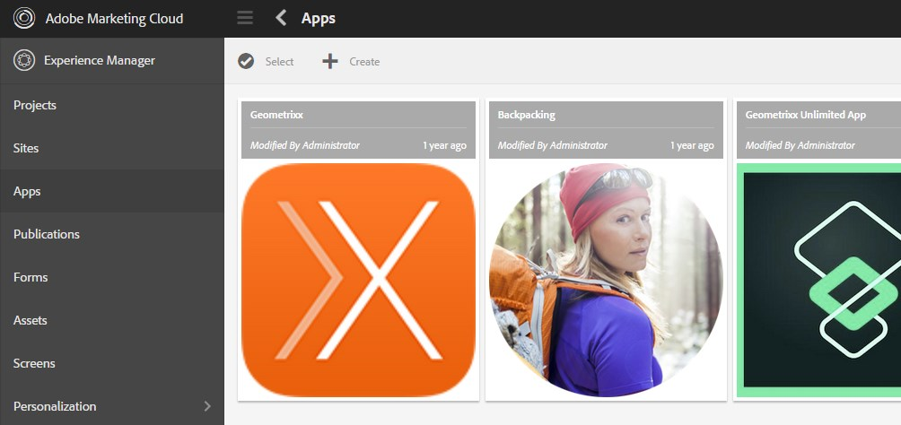

1. Click on the app to open it, you have successfully created a new app based on the template of an existing app.

>[!NOTE]
>
>If you uninstall the Geometrixx Outdoors reference app package from AEM and have an app created based on its template, then that app will not longer be functional. The Geometrixx Outdoors app can be removed, however the app template must remain if it is used by other mobile applications.

## Exploring the Sample Geometrixx Outdoors App {#exploring-the-sample-geometrixx-outdoors-app}

Geometrixx Outdoors App is a sample PhoneGap application that demonstrates the features of the default PhoneGap application blueprint and the sample mobile components.

To open the application, from the rail click Mobile Applications and then select Geometrixx Outdoors App.

### Common Page Features - Geometrixx Mobile App {#common-page-features-geometrixx-mobile-app}

Each page of the mobile app includes the following features:

* A back button for returning to the parent page. Note that the back button does not appear on the Home page.
* An expendable rail that offers a menu of commands and links:

  * Open the Locations page.
  * Open the Cart.
  * Log in.
  * Update the application.

* The paragraph system, for adding components and creating content.

### The Home Page - Geometrixx Mobile App {#the-home-page-geometrixx-mobile-app}

The content of the Home page is comprised of the following navigation tools:

* A Menu List component that provides links to the Gear, Reviews, News, and About Us child pages.
* A Swipe Carousel component that showcases the child pages.

### The Gear Page - Geometrixx Mobile App {#the-gear-page-geometrixx-mobile-app}

The Gear page provides users with access to product pages. A Menu list component provides access to the child pages of the Gear page. The child pages are categories of products that the website features.

* Season
* Apparel
* Gender
* Activity

Each category page uses the same content structure as the Gear page. The carousel provides access to child pages which are subcategories of products. The subcategory pages contain product listings that provide links to product pages.

### The Products Page - Geometrixx Mobile App {#the-products-page-geometrixx-mobile-app}

The Products page and its hierarchy of child pages implement a classification system for product pages. The lowest pages in each branch of the hierarchy is a product page that contains an ng Product component.

The Products page is not available to application users. The Gear page provides access to each product page.

### The Reviews Page - Geometrixx Mobile App {#the-reviews-page-geometrixx-mobile-app}

Contains a back button. The paragraph system allows you to add components.

When using the application, the Reviews page is available from the carousel on the English page.

### The News Page - Geometrixx Mobile App {#the-news-page-geometrixx-mobile-app}

Contains a back button. The paragraph system allows you to add components.

When using the application, the News page is available from the carousel on the English page.

### The About Us Page - Geometrixx Mobile App {#the-about-us-page-geometrixx-mobile-app}

The About us page contains several Two Column Row components. Each column contains either an Image or a Text component. The components are editable, and the paragraph system allows you to add components.

When using the application, the About Us page is available from the carousel on the English page.

### The Locations Page - Geometrixx Mobile App {#the-locations-page-geometrixx-mobile-app}

The Locations page contains a Locations component.

When using the application, the Locations page is available from the menu list on the English page.

## Sample Mobile Components {#sample-mobile-components}

Several components are immediately available in Sidekick when authoring the pages of a mobile application. The components belong to the PhoneGap component group.

### Swipe Carousel {#swipe-carousel}

The Swipe Carousel component is a tool for showcasing and navigating site pages. The component includes a carousel that cycles through images for the pages above a list of page links. Edit the component to specify the pages to expose and the behavior of the carousel.

Note that images appear in the carousel for pages that are associated with an image in a specific way. When pages are not associated with images, only the list of links appears.

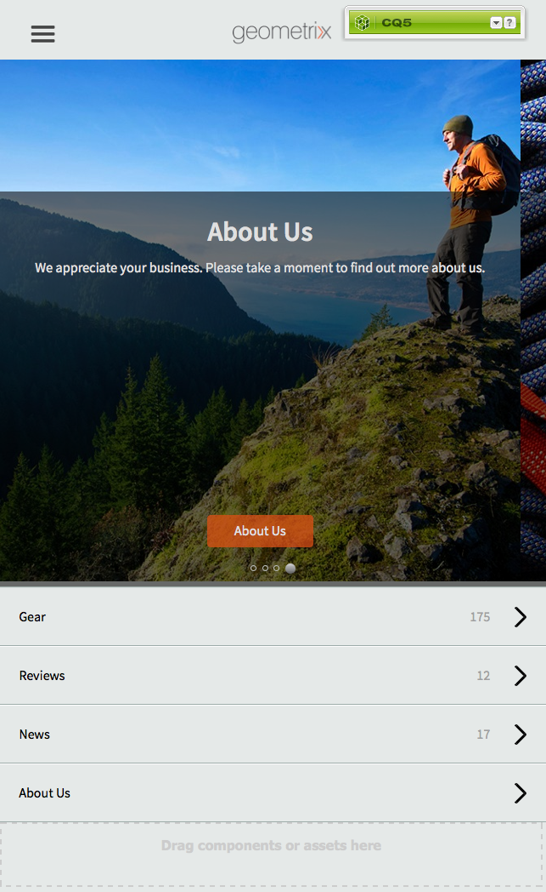

**Carousel properties tab**

Configure the behavior of the carousel:

* Play Speed: The time in milliseconds that each image is displayed before showing the next image.
* Transition Time: The duration in milliseconds of the animation for image transitions.
* Controls Style: The type of controls that are provided for moving between images.

**List properties tab**

Specify how the page list is generated:

* Build List Using: The method to use for specifying the pages to include in the carousel. See Building the Page List.
* Order By: Select a page property to use for sorting the page list. For example, select jcr:title to sort pages alphabetically by title.
* Limit: The maximum number of pages to include. This property is appropriate for search-based methods of building the page list.

#### Building the Page List {#building-the-page-list}

The Swipe Carousel component provides the following values for the Build List Using property. The edit dialog changes according to the value that you select:

**Child Pages**

The component lists all of the child pages of a specific page. After you select this value, select the page on the Child Pages tab, or specify no value to list the children of the current page.

**Fixed List**

Specify a list of pages of include. After you select this value, configure the list on the Fixed List tab that appears when you select Fixed List:

* To add a page, click Add Item, then browse for the page.
* Use the up and down arrow icons to move the page within the list.
* Click the remove button to remove a page from the list.

The Order By property does not affect the order of fixed lists.

**Search**

Populate the list using the results of a keyword search. The search is performed in the children of a page that you specify:

1. To specify the root page of the search, use the Start In property to select the page path. Specify no path to search below the current page.
1. In the Search Query property, enter the search keywords.

**Advanced Search**

Populate the list using a [Querybuilder](/help/sites-developing/querybuilder-api.md) query.

### Image {#image}

Add an image to your application content.

### Text {#text}

Add rich text to your application content.

### Store Locations {#store-locations}

The Store Locations component provides users with tools for finding business outlets:

* Search
* Lists of locations that are near or distant to the GPS coordinates of the device.

The component requires that the repository contains location information for each store. Sample locations are installed at the /etc/commerce/locations/adobe node. 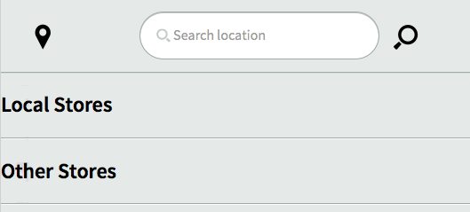

### Two Column Row {#two-column-row}

Enables you to add side-by-side components to a page.

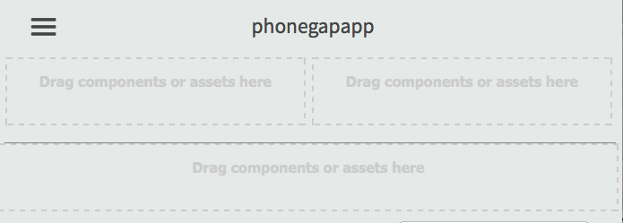
