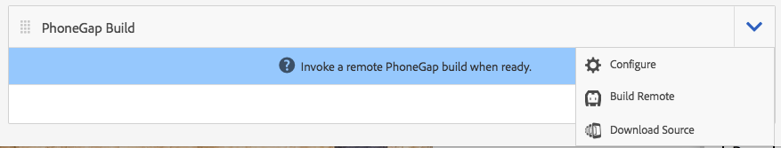
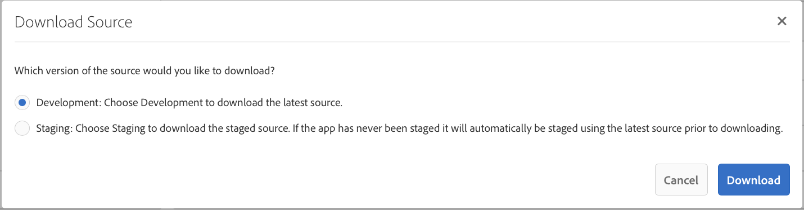
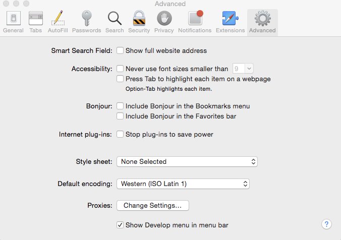
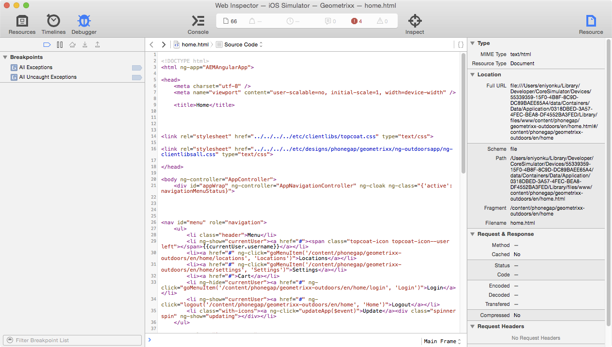
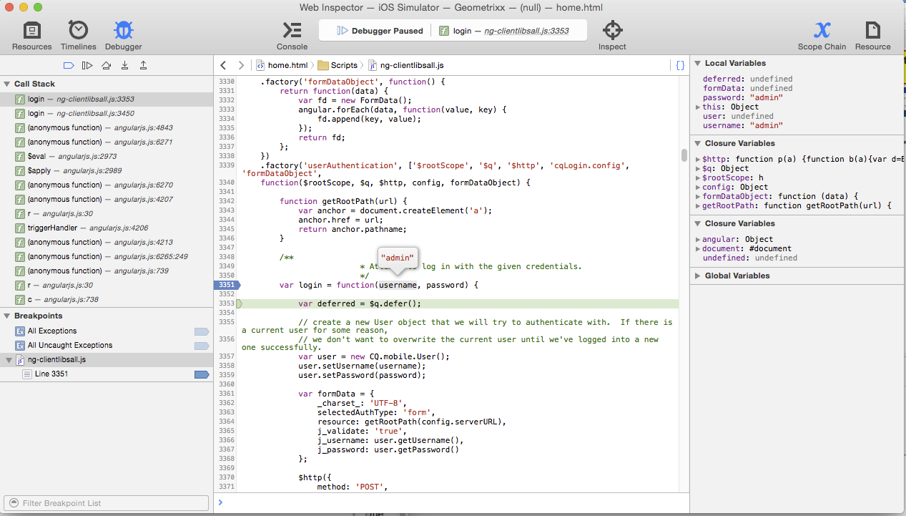
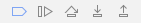

# Developing Apps with PhoneGap CLI{#developing-apps-with-phonegap-cli}

>[!NOTE]
>
>Adobe recommends using the SPA Editor for projects that require single page application framework-based client-side rendering (for example, React). [Learn more](/help/sites-developing/spa-overview.md).

At any given time, as a developer you can run your app on a device or within an emulator, provided you've configured your development environment.

To run the following examples, you need a system that runs OS X (Mac) with Xcode, or a Mac/Win/Linux system with the Android&trade; SDK installed.

## Bootstrap your development environment {#bootstrap-your-development-environment}

Setup PhoneGap CLI (`https://docs.phonegap.com/en/4.0.0/guide_cli_index.md.html#The%20Command-Line%20Interface`)

For iOS: To develop for iPhones and iPads, you need Apple's Xcode IDE.

* Download it for free [here](https://idmsa.apple.com/IDMSWebAuth/signin?appIdKey=891bd3417a7776362562d2197f89480a8547b108fd934911bcbea0110d07f757&path=%2Fdownload%2F&rv=1).
* PhoneGap iOS platform guide (`https://docs.phonegap.com/en/4.0.0/guide_platforms_ios_index.md.html#iOS%20Platform%20Guide`)

For Android&trade;: To develop for iPhones and iPads, you need Google's Android&trade; Stuido IDE.

* Download it for free [here](https://developer.android.com/studio).
* PhoneGap Android&trade; platform guide (`https://docs.phonegap.com/en/4.0.0/guide_platforms_android_index.md.html#Android%20Platform%20Guide`)

## Download the Source {#download-the-source}

Once you've successfully bootstrapped your development environment, download the source from the AEM App Build Tile:

* Click the PhoneGap Build tile dropdown chevron.



* Click Download Source.
* Select the desired source from the Download Source modal.



>[!NOTE]
>
>The development source contains the latest state of your app, while including unstaged changes. Use the Staging source for building release candidates for submitting to app store vendors.
>
>If you never stage your app, selecting Staging triggers the staging workflow (hint: shows up as a staged app in the PhoneGap Enterprise Viewer App available in the AppStore and Google PlayStore).

* Click Download and save the ZIP to your computer.
* Extract the downloaded zip file to your workspace.

## Build and load the App (from source) {#build-and-load-the-app-from-source}

PhoneGap CLI can create a platform project, compile the source, and deploy the app in a single command.

>[!NOTE]
>
>You can do all these steps separately, see PhoneGap CLI docs (`https://phonegap.com/blog/2014/11/13/phonegap-cli-3-6-3/`).

1. Make sure you've Installed PhoneGap CLI, see above.
1. In a console (or terminal) window, navigate to the root directory of your extracted source.
1. Enter the following command:

```xml
phonegap run android

// -- or -- //

phonegap run ios
```

>[!NOTE]
>
>If you have issues at this point, go back to basics to troubleshoot -
>
>1. Create a folder (mkdir test)
>1. Navigate into this new folder (cd test)
>1. Run `phonegap create helloWorld`
>1. Navigate into helloWorld (cd helloWorld)
>1. Run `phonegap run android` (or replace Android&trade; with iOS as above).
>1. Emulator opens running your newly created PhoneGap App, saying 'Device Ready' if the JavaScript Bridge to native is operational.
>
>This troubleshooting verifies that your PhoneGap CLI development environment is running correctly.

## Debug JavaScript with Safari and IOS debug {#debug-javascripts-with-safari-and-ios-debug}

You can debug your app's JavaScript using Safari's developer tools, the same way you would with a web application.

## Enable Safari Developer Tools {#enable-safari-developer-tools}

To enable the developer tools:

* Open Safari's preferences

  * Click Safari in menu bar
  * Click Preferences

* Click Advanced in Preference window



* Check "Show Develop menu in menu bar"
* Close the Preference window

## Connect Safari to iOS {#connect-safari-to-ios}

You can connect Safari to either an iOS device or emulator.

* In a console window, navigate to the root directory of your extracted source.
* Enter the following command so you can launch your app on your device or emulator.

```xml
phonegap run <platform> --device

// -- or -- //

phonegap run <platform> --emulator
```

* Open Safari
* Click Develop in the menu bar
* Select iOS Simulator sub menu
* Click home.html



## Debug JavaScript with Safari's Web Inspector {#debug-javascript-with-safari-s-web-inspector}

You can set breakpoints anywhere in your source. When you interact with your emulator or device, the running of your app stops at those breakpoints. You can step through the running and inspect the values in variables.

* Click Resources in the Web Inspector window
* Navigate the source tree and click the desired source file
* Click the line number next to add a breakpoint
* Interact with device or emulator



* Use the control buttons to continue execution, step over, step into, and step out of methods:



>[!NOTE]
>
>To see the values of variables, in the current method, hover your mouse.

## The Next Steps {#the-next-steps}

After you have learned about Developing Apps with PhoneGap CLI, see [Accessing Device Features](/help/mobile/phonegap-access-device-features.md).
