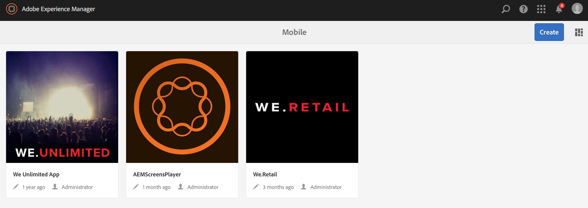
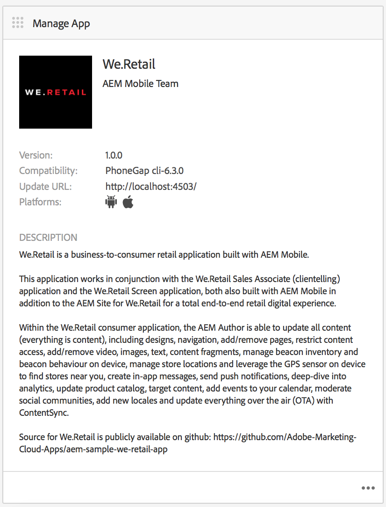
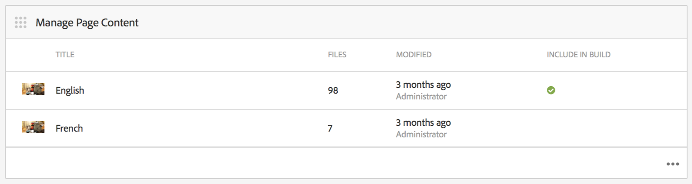
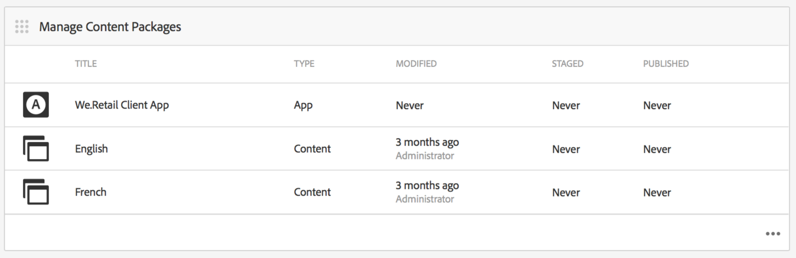
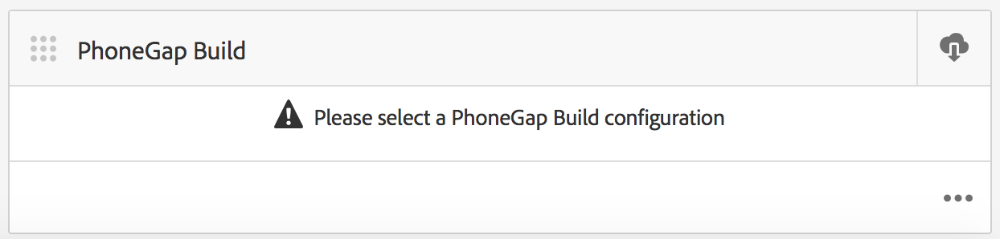
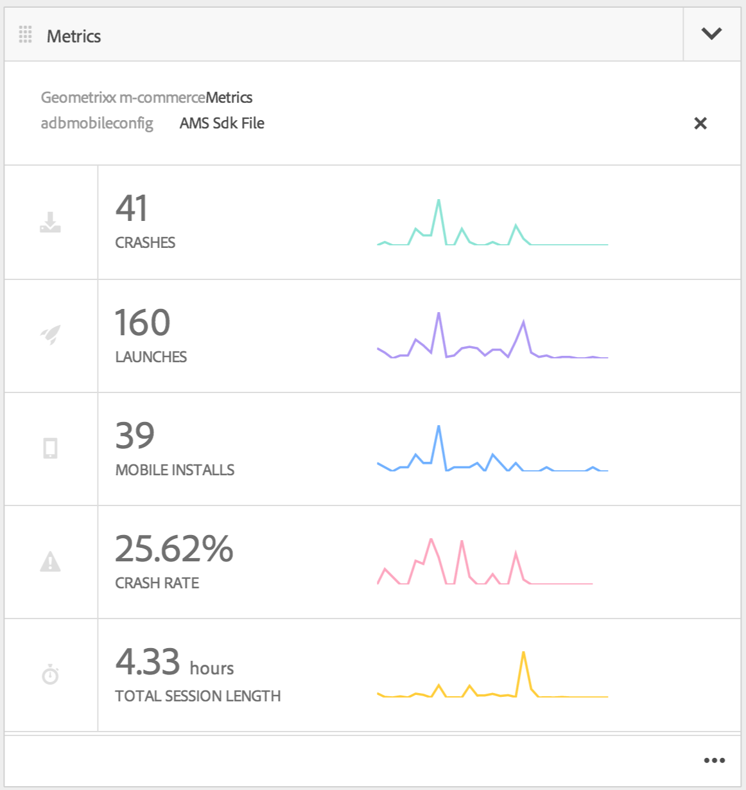
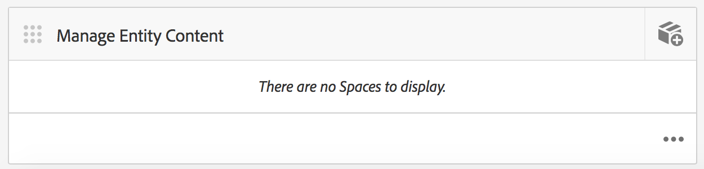

# Authoring Mobile Applications{#authoring-mobile-applications}

>[!NOTE]
>
>Adobe recommends using the SPA Editor for projects that require single page application framework-based client-side rendering (for example, React). [Learn more](/help/sites-developing/spa-overview.md).

The AEM Mobile Dashboard allows you to create, build and deploy your mobile application, create, delete, and edit application metadata. Once your application is live, you can analyze application analytics including life cycle and usage metrics to improve customer conversion and brand loyalty.

To build your AEM Mobile Application, see the [Building Mobile Applications](/help/mobile/building-app-mobile-phonegap.md) page.

To set up your environment and get started, see [Administering AEM to Use AEM PhoneGap Enterprise](/help/mobile/administer-phonegap.md).

## The AEM Mobile Apps Catalog {#the-aem-mobile-apps-catalog}

The [AEM Mobile Apps Catalog](http://localhost:4502/aem/apps.html/content/phonegap) displays all of your mobile app managed in AEM.

Think of this catalog as the "landing page" for AEM Mobile, where administrators are able to start a new AEM Mobile application by either creating based off a template, or uploading an existing app already started by a mobile developer.

Follow these steps to get to the apps catalog landing page:

1. Browse to **Navigation** and then choose **Mobile**.

1. Choose **Apps** to open the apps catalog.

## The AEM Mobile App Dashboard {#the-aem-mobile-app-dashboard}

Selecting an AEM Mobile app from the catalog displays its dashboard. Here you can manage your application, view statistics, build, deploy, and manage your mobile app content.

You can expand into each tile in the AEM Mobile Dashboard to view or edit details by clicking the '...' in the bottom-right corner.

### The Manage App Tile {#the-manage-app-tile}

The Manage App Tile displays your application icon, name, description, supported platforms, call home for updates URL and version information. You can drill into this tile to edit and maintain the PhoneGap Application Configuration (config.xml) and, prepare your application for submission to the various application stores for distribution.

Click [here](/help/mobile/phonegap-app-details-tile.md) for details.

### The Manage Page Content Tile {#the-manage-page-content-tile}

Content can be created, updated, and deleted in AEM Mobile in much the same way you do the same within AEM Sites. The **Manage Page Content Tile** displays the number of pages of managed content and last modified. You can drill-into content to create, copy, move, delete, and update pages by clicking each record in the tile. Once content has been updated, you can push a content update to your customers through the **Manage Content Packages Tile.**

### The Manage Content Packages Tile {#the-manage-content-packages-tile}

Once you have added or modified your content through the Manage Page Content Tile, you are able to push those changes out to your customers with a Content Release update.

Content Package allows the AEM App Author to manage page content in AEM and, have your development team make changes to your PhoneGap Shell Application (that is, app framework or infrastructure) and then push those changes out to your customers quickly and without needing to enlist a developer to resubmit to the various stores for distribution.

Content Package creates a ZIP file, considered a Content Release Package, for each update. These packages contain html resources and html pages that are generated while rendering the app and is intelligent enough to only package those files that have been modified since the last update.

The Manage Content Package Tile's **Type** column displays either 'App' to signify Application Shell content, for example framework or infrastructure of the app managed by a developer or, 'Content' which represents page content managed by the content author.

Content can be represented as a language or as a particular part of the app where multiple Content Release packages are consumed by the app. The choice of how you bundle your content is flexible and entirely up to how you want to manage content for your application.

The **Modified** column indicates when pages were most recently modified.

The **Staged** column shows when the last content update was created. To create a content update and stage your changes open any record in the tile and create an update.

The **Published** column shows when the last content update was published and made available for consumption by your customers. To publish content, you must first stage that content and then publish the update by drilling into this tile and publishing from the Content Release details console.

 

This icon represents a Content Release package for the app shell

These icons represent a Content Release package for app content

### The PhoneGap Build Tile {#the-phonegap-build-tile}

The **PhoneGap Build Tile** connects with `https://build.phonegap.com` to build and host remote builds. Once built, the build is made available either as a download or directly to your device via a QR code.

Alternatively, you can download the device source to build locally through the PhoneGap CLI (`https://docs.phonegap.com/en/3.5.0/guide_cli_index.md.html`).

### The Metrics Tile {#the-metrics-tile}

>[!CAUTION]
>
>The Metrics tile displays only after you configure the cloud service.
>
>See [Configure your Adobe Mobile Services Cloud Service](/help/mobile/configure-adobe-mobile-cloud-service.md) for details.

AEM Mobile integrates with Adobe Analytics through [Adobe Mobile Services SDK](https://experienceleague.adobe.com/docs/mobile.html?lang=en) (AMS).

The Control Center **Metrics Tile** displays summary analytics pulled from AMS for your application. You can drill into the analytics dashboard by clicking the '...' in the bottom right.

### The Manage Entity Content Tile {#the-manage-entity-content-tile}

The Manage Entity Content Tile allows you to add and manage app definitions. App definitions are a way to identify what spaces (and other configurations) are appropriate for the app. This way a new space can be added, without having to recompile the app. The app definition is updated and that includes the information for any new spaces.

Click [here](/help/mobile/phonegap-app-definitions.md) to create and manage your app definitions.

You can drill into the manage entity content dashboard by clicking the '...' in the bottom right.

#### Additional Resources {#additional-resources}

To learn about the roles and responsibilities of an Administrator and Developer, see the resources below:

* [Developing for Adobe PhoneGap Enterprise with AEM](/help/mobile/developing-in-phonegap.md)
* [Administering Content for Adobe PhoneGap Enterprise with AEM](/help/mobile/administer-phonegap.md)
