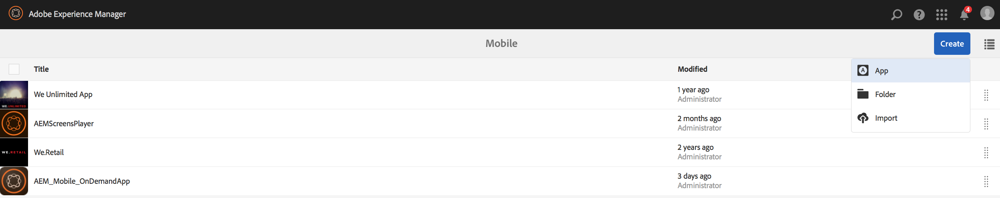
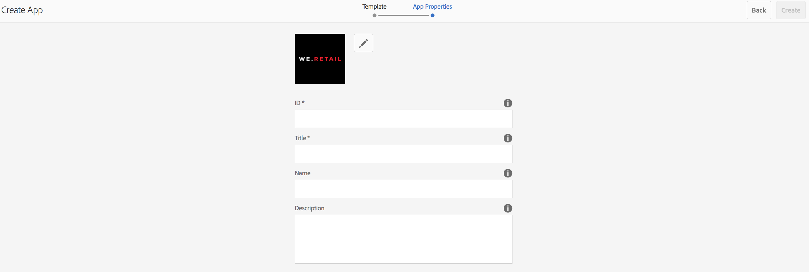

# Creating an AEM Mobile app using create wizard{#creating-a-new-aem-mobile-app-using-create-wizard}

{{ue-over-mobile}}

AEM Mobile apps are based on a blueprint that defines a page structure and properties. You can configure the following application properties:

* **Title:** The application title.
* **Destination Path:** The location in the repository where the application is stored. Leave the default to create a path based on the app name.

* **Name:** The default value is the value of the Title property with space characters removed. The name is used within AEM to refer to the application, for example, for the repository node that represents the application.
* **Description:** A description of the application.
* **Server URL:** The URL that provides Over-the-Air (OTA) content updates to the application. The default value is the publish server URL of the instance that is used to create an application (taken from the externalizer service). Note, this must be a publish server instance rather than an author, which requires authentication.

You can also provide an image file to use as the application thumbnail, select the PhoneGap Build configuration to use, and select the Mobile App analytics configuration to use. This image is only used as a thumbnail to represent your mobile application within the mobile apps console in Experience Manager.

Additional (and optional) tabs exist for build cloud service and integrating the Adobe Mobile Services SDK plug-in into your app.

* Build: Click manage configurations and set up your build.phonegap.com build service here. Then from the drop-down you will be able to select the newly created PhoneGap build cloud service.
* Analytics: Click manage configurations and set up your [Adobe Mobile Services SDK](https://experienceleague.adobe.com/docs/mobile-services/using/home.html) cloud service. Then from the drop-down you will be able to select the newly created Mobile Service to integrate into your mobile app.

## Using App Templates {#using-app-templates}

App templates provide an easy way to use existing designs created by devlopers, used for the creation of new apps within AEM.

What is an app template? Think of it as a collection of page templates and components that represent a baseline or foundation of an app.
When creating an app based on the template of another app, you will get an app that has a starting point representative of the app in which it was created from.

You must have an existing mobile app template (or an app installed that has an app template) to use this feature.

The latest AEM Apps samples package includes an updated version of the Geometrixx app with an app template. Alternatively, you can install the [StarterKit](https://github.com/Adobe-Marketing-Cloud-Apps/aem-phonegap-starter-kit) which also provides a template.

Steps to creating an app based on an app template:

1. Navigate to the AEM Mobile app catalog: &lt;*server-url*&gt;aem/apps.html/content/mobileapps
1. Select **Create** and then choose **App** as shown below

Select an app template made available to you by an AEM developer. See [Structure of an AEM Mobile App](/help/mobile/phonegap-structure-an-app.md) for developer assistance.

Fill out your new app's details as needed including optionally changing its thumbnail image. These values can be edited later from the **Manage App** tile.

## The Next Steps {#the-next-steps}

See the following resources to learn more about other authoring roles:

* [The Manage App Tile](/help/mobile/phonegap-app-details-tile.md)
* [Editing App Metadata](/help/mobile/phonegap-editmetadata.md)
* [App Definitions](/help/mobile/phonegap-app-definitions.md)
* [Import an Existing Hybrid App](/help/mobile/phonegap-adding-content-to-imported-app.md)
* [Content Services](/help/mobile/develop-content-as-a-service.md)

## Additional Resources {#additional-resources}

To learn about the roles and responsibilities of an Administrator and Developer, see the resources below:

* [Developing for Adobe PhoneGap Enterprise with AEM](/help/mobile/developing-in-phonegap.md)
* [Administering Content for Adobe PhoneGap Enterprise with AEM](/help/mobile/administer-phonegap.md)
