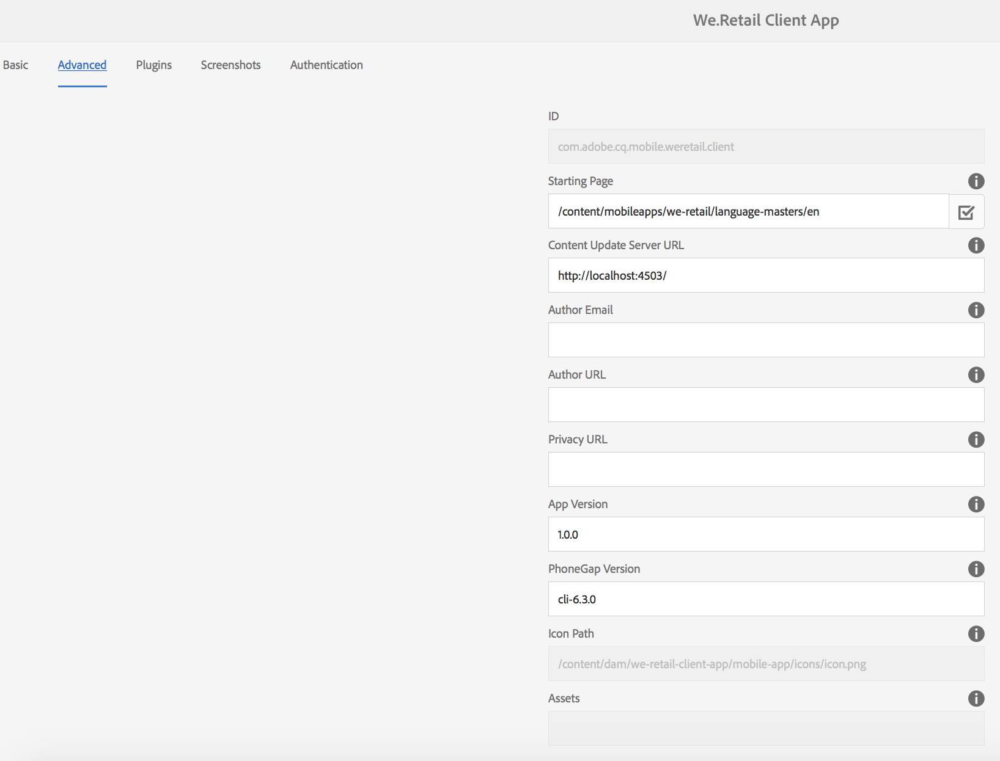
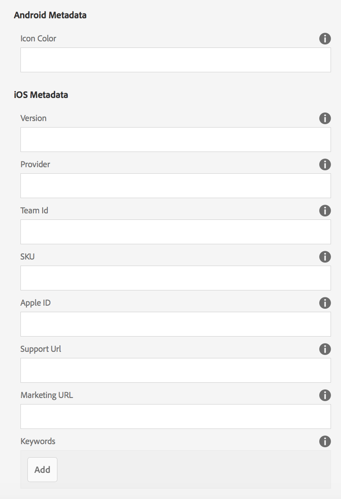
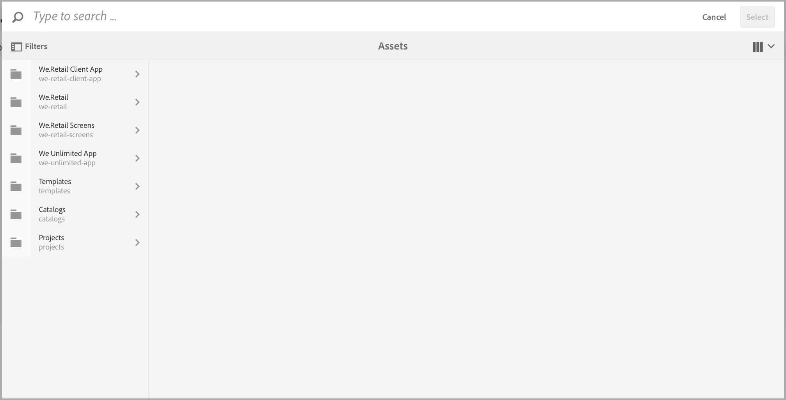
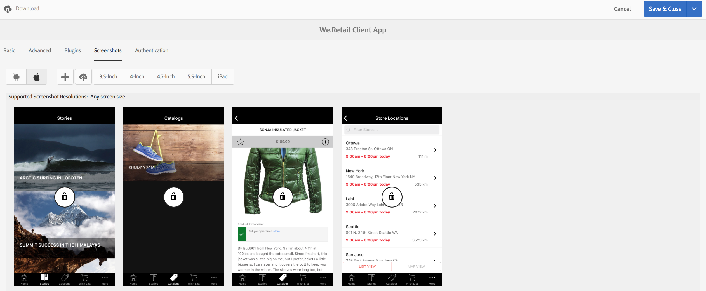

# Editing App Metadata {#editing-app-metadata}

{{ue-over-mobile}}

The **Manage App** tile and "Manage App" page provides a means to view and edit application metadata. App metadata is required details for releasing an application to a vendor's store. This may include common metadata, iOS metadata and screenshots. See the [Manage App Tile](/help/mobile/phonegap-app-details-tile.md) for further details on common and iOS metadata.

## Editing the App Data {#editing-the-app-data}

To edit the app's metadata:

1. Navigate to the dashboard page for the App.

   

1. To view or edit details by clicking the '...' in the bottom right corner of the **Manage App** tile.

1. Enter or view the details in any of the five tabs available as shown in the figure below.

   

## Editing Common and IOS Metadata {#editing-common-and-ios-metadata}

You can edit the common and IOS Metadata:

* Select the **Advanced** tab from the app description page.
* Edit or view the common and IOS metadata. See the figures below for more details.

 

## Add and Remove Screenshots {#add-and-remove-screenshots}

You can include App screenshots to the metadata roll up. Some vendors require accurate screenshots when submitting any app to their app store. These images must already exist in Assets. See [Asset Picker](../assets/search-assets.md#assetpicker) to upload your screenshots.

### Add Screenshots {#add-screenshots}

To add an Asset as a screenshot:

1. While in edit mode of the **Manage App** page, click add (plus icon).
1. Select the asset and click **Select** to add the asset.

   

1. Select the asset and click **Select** to add the asset.

>[!NOTE]
>
>The screenshot must match the target device's screen resolution.

### Delete Screenshots {#delete-screenshots}

To remove a screenshot:

Click the delete on the asset.

## The Next Steps {#the-next-steps}

See the following resources to learn more about other authoring roles:

* [The Manage App Tile](/help/mobile/phonegap-app-details-tile.md)
* [App Definitions](/help/mobile/phonegap-app-definitions.md)
* [Creating a New App using Create App Wizard](/help/mobile/phonegap-create-new-app.md)
* [Import an Existing Hybrid App](/help/mobile/phonegap-adding-content-to-imported-app.md)
* [Content Services](/help/mobile/develop-content-as-a-service.md)

### Additional Resources {#additional-resources}

To learn about the roles and responsibilities of an Administrator and Developer, see the resources below:

* [Developing for Adobe PhoneGap Enterprise with AEM](/help/mobile/developing-in-phonegap.md)
* [Administering Content for Adobe PhoneGap Enterprise with AEM](/help/mobile/administer-phonegap.md)
