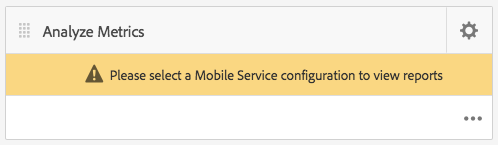
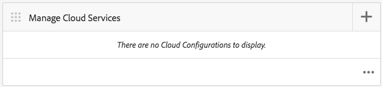
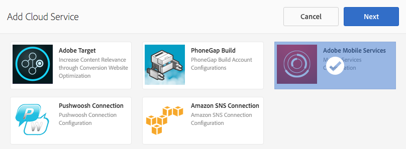
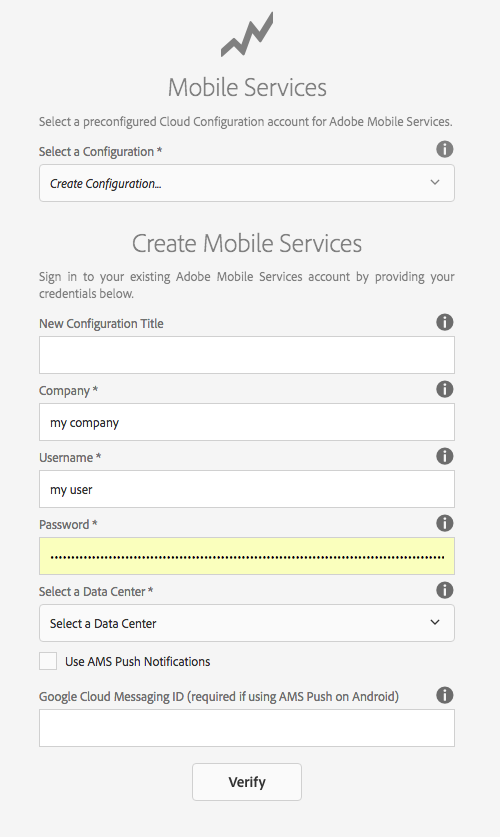
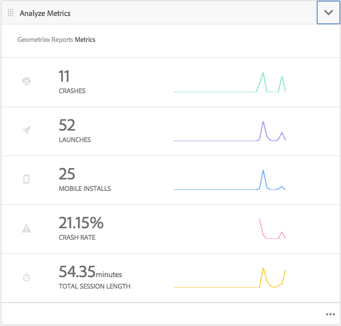
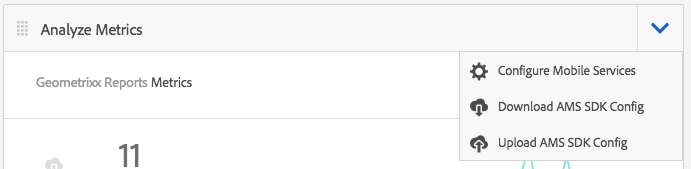
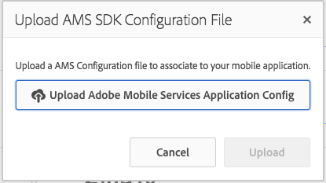

# Track App Performance with Adobe Mobile Analytics{#track-app-performance-with-adobe-mobile-analytics}

{{ue-over-mobile}}

You want to drive higher customer conversions and loyalty.

You want to deliver relevant and engaging experiences to your customers.

What is your AEM Mobile app doing for your marketing campaigns?

How can you fine-tune your mobile applications to provide the best experience for your users?

With Adobe Mobile Services, you can gain insight on how your users are using your mobile apps by tracking usage, app crashes, device details, and so many other critical metrics for your mobile apps.

Adobe Experience Manager Mobile provides a glimpse into the details of your mobile analytics directly from the AEM Mobile Application Dashboard. The **Mobile Metrics Tile** in the dashboard provides Real-Time Analytics for your mobile application, allowing developers, authors, and administrators to get a quick glimpse of the health of your mobile app. Under the covers, powering the analytics is the [Adobe Mobile Analytics](https://business.adobe.com/products/analytics/mobile-marketing.html) SDK. The Adobe Mobile Analytics SDK can be plugged into your applications natively or through a PhoneGap Bridge plug-in for webviews. Metrics are collected and cached on the device until the device is connected, at which the data is pushed to the Adobe Mobile Services Cloud for reporting and analysis.

Adobe Mobile Analytics SDK provides the following:

1. **Data collection for mobile channels** - Collect comprehensive data for your mobile websites and apps on all major operating systems.
1. **Mobile engagement analysis** - Understand user engagement within your mobile app, website, or video, including how frequently consumers launch the channel, whether they make purchases from it, and more.
1. **Mobile app dashboards and reports** - Get usage reports that include lifecycle metrics for your apps and app store metrics — see trends for users, launches, average session length, retention length, and crashes.
1. **Mobile campaign analysis** - Quantify the effectiveness of mobile-specific campaigns such as SMS, mobile search ads, mobile display ads, and QR codes.
1. **Geolocation analysis** - Find where your app users launch and interact with your mobile experiences by GPS location or points of interest.
1. **Pathing analysis** - See how users navigate through your app to determine which screens and UI elements are engaging users and which cause users to drop off.

This section describes how [AEM Developers](#developers) can then learn how to instrument AEM Mobile apps with analytics tracking.

Finally, [AEM Administrators](#administrators) learn to:

* create a cloud service to Adobe Mobile Services
* create a mobile service config and associate a report suite
* associate the mobile service config to a mobile app
* view metrics via the AEM Apps Command Center
* assign the AMS SDK Config to your mobile app

## For Developers - Integrate Analytics into your App {#for-developers-integrate-analytics-into-your-app}

**Prerequisite:** AEM administrators must configure the Adobe Mobile Services cloud config, [as discussed below](#amscloudserviceconfig).

Developers are responsible for [adding analytics to an AEM Mobile app](/help/mobile/phonegap-add-analytics-to-apps.md) as necessary to track, report, and understand how your users engage with your mobile app content and to measure key lifecycle metrics such as launches, time in app, and crash rate.

## For Administrators - Configure the Adobe Mobile Services Cloud Service {#for-administrators-configure-the-adobe-mobile-services-cloud-service}

To take advantage of Adobe Mobile Services, you must configure the AEM Adobe Mobile Services Cloud Service with your Adobe Analytics account information. The Apps Command Center provides an **Analyze Metrics** tile where you can create and associate the cloud service with your mobile app.

Configure the cloud service to your mobile app begins by clicking the gear icon on the Analyze Metrics tile.

Clicking the gear icon in the Analyze Metrics tile opens the 'Configure Mobile Services Analytics' modal dialog. Select your configuration from the 'Select a Mobile Service Configuration' drop-down. If you must create a configuration, click the wrench button.

To create an Adobe Mobile Service cloud service there are two steps involved, the connection to the service and selecting what reporting suite to assign to the configuration.

To begin, click the '+' button on the Manage Cloud Services tile in the dashboard.

After clicking the '**+**' button, the **Add Cloud Service** wizard is displayed.

Select or create a mobile service configuration by filling required fields as shown below. Your AEM administrator requires this information to successfully create the connection to Adobe Mobile Services.

After you have completed the Mobile Services Account Settings, you are prompted to select an app. Doing so connects Adobe Mobile Service analytics reporting to that application.

Select the desired mobile service, and click 'Update' to assign the mobile service configuration and close the dialog.

Now that you have associated the mobile service config to the AEM Mobile app, the tile starts to fetch the metric data and begin reporting.

### Adobe Mobile Services SDK Config File {#adobe-mobile-services-sdk-config-file}

At this point, your mobile application is associated with a cloud service, however the mobile application does not yet know how to communicate the collected mobile metrics back to Adobe Analytics. To wire up the mobile app to Adobe Analytics, the Adobe Mobile Services SDK Config file must be added to Adobe Experience Manager.

From the Analyze Metrics tile, click the arrow icon to expose the Download / Upload AMS SDK Config menu entries.

The first step is to obtain the SDK Config from Adobe Mobile Services. Click 'Download AMS SDK Config' to be redirected to the Adobe Mobile Services website where you can download the config file from. After you have obtained the ADBMobileConfig.json file, click "Upload AMS SDK Config" to upload the config file into AEM.

Click the 'Upload Adobe Mobile Services Application Config' button and browse for the ADBMobileConfig.json file, then click 'Upload'.

Now that the mobile app has access to the ADBMobileConfig.json file, it has the knowledge on how to communicate back to Adobe Analytics and begin reporting on those important metrics value that help drive your apps success.

## What's Next? {#what-s-next}

1. [Start my AEM Mobile app experience](/help/mobile/starting-aem-phonegap-app.md)
1. [Manage my app's content](/help/mobile/phonegap-manage-app-content.md)
1. [Build my application](/help/mobile/building-app-mobile-phonegap.md)
1. [Track my app's performance with Adobe Mobile Analytics](/help/mobile/phonegap-intro-to-app-analytics.md)
1. [Deliver a personalized app experience with Adobe Target](/help/mobile/phonegap-aem-mobile-content-personalization.md)
1. [Send important messages to my users](/help/mobile/phonegap-push-notifications.md)
