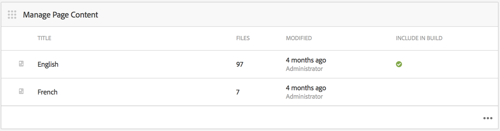
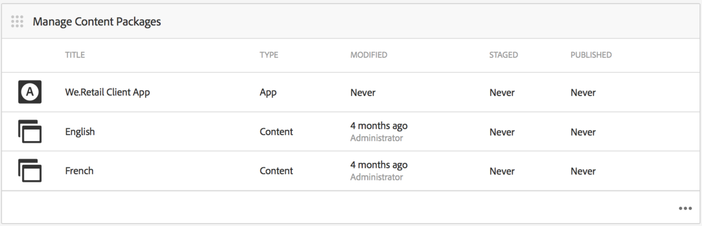
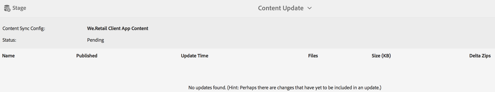
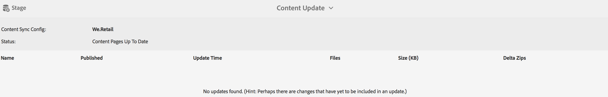

# Creating and Managing App Content{#creating-and-managing-app-content}

{{ue-over-mobile}}

Managing app content requires a collective effort from [developers](#developer), content [authors](#author), and [administrators](#administrator). Authors manipulate pages, which are based on templates and components generated by app developers.

Finally, administrators strategically publish the updated app content.

>[!NOTE]
>
>**Prerequisite**:
>
>In [Deploying and Maintaining](/help/sites-deploying/deploy.md), developers became familiar with system components and templates in Adobe Experience Manager (AEM).

## The Manage Page Content Tile {#the-manage-page-content-tile}

>[!CAUTION]
>
>If you are not using an out-of-the-box app template, to enable new app content to be published OTA, you must configure a Content Sync handler.
>
>See [Mobile with Content Sync](/help/mobile/phonegap-contentsync.md) in Developer's section for more details.

Here, content can be created, edited, and deleted in AEM Mobile in much the same way you would within AEM Sites.

The **Manage Page Content tile** displays the number of pages of managed content and last modified for a particular payload. You can drill-into content to create, copy, move, delete, and update pages by clicking each record in the tile.

Once content has been updated, administrators can publish a content update payload Over-the-Air (OTA) to customers through the **Manage Content Packages tile.**

Select one of the listed content packages to create or edit content such as creating, editing, or removing pages, changing navigation and page order, create or update content such as copy (text) and media.

Note *everything is content*, meaning application styles, copy (text), media, pages, navigation and, targeting of content can all be edited and updated OTA, without a trip to an app store.

To edit AEM Mobile content, *AEM authors *will need a solid understanding of AEM's content editing interface: [Authoring pages in AEM.](/help/sites-authoring/qg-page-authoring.md)

## The Manage Content Packages Tile {#the-manage-content-packages-tile}

Here, *AEM Administrators* can quickly and easily update their apps to deliver engaging experiences and up to date content to drive brand engagement and meet business goals all without the need for a developer or app store resubmission.

Once *AEM Authors* have added or modified content through the Manage Content Tile, *AEM Administrators* are able to push those changes out to customers with a Content Packages update.

The Content Package action allows the *AEM Author* to create and edit page content while the development team makes changes to a Host Application design and implementation including navigation, style, server-side logic, templates, and components and then push those changes out OTA to customers without needing to resubmit to the various stores for distribution.

**To publish new or updated content**

Select a content package from the tile, in this example the English package. Notice that a content update dialog box lists the relevant *Content Sync* configuration. If app content has been modified since a previous update, the status will display *Pending*, as shown below.

Next, select the **Stage** action at the top right to being creating the content update. Add the appropriate update information and press Done.

The *Content Sync* handler then creates the required packages by forming a delta (a package of *only* what has changed). Once completed, this update content package has been staged as shown below.

Staging an update to content allows several updates to be made before publishing them to OTA to mobile devices.

>[!NOTE]
>
>The staged content can be verified using the AEM Verify app before publishing.
>
>See [Mobile Quickstart for AEM Verify](/help/mobile/phonegap-mobile-quickstart.md) for more details on AEM Verify app.

When ready to deliver new content to your app users with Content Sync OTA, select **Publish** as shown below.

### The Next Steps {#the-next-steps}

Once you have learned about Creating and Managing App Content in the application dashboard, see the following resources for other authoring roles:

* [The Manage App Tile](/help/mobile/phonegap-app-details-tile.md)
* [Editing App Metadata](/help/mobile/phonegap-editmetadata.md)
* [App Definitions](/help/mobile/phonegap-app-definitions.md)
* [Creating a New App using Create App Wizard](/help/mobile/phonegap-create-new-app.md)
* [Import an Existing Hybrid App](/help/mobile/phonegap-adding-content-to-imported-app.md)

### Additional Resources {#additional-resources}

To learn about the roles and responsibilities of an Administrator and Developer, see the resources below:

* [Developing for Adobe PhoneGap Enterprise with AEM](/help/mobile/developing-in-phonegap.md)
* [Administering Content for Adobe PhoneGap Enterprise with AEM](/help/mobile/administer-phonegap.md)
