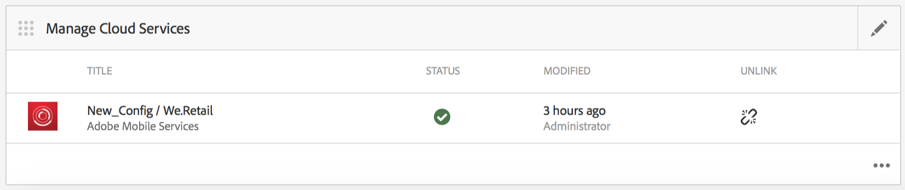
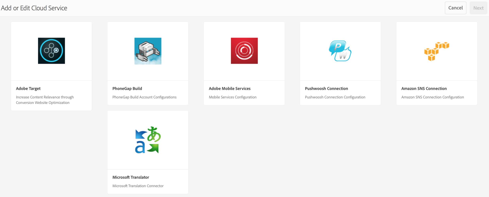
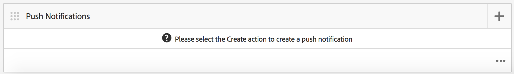
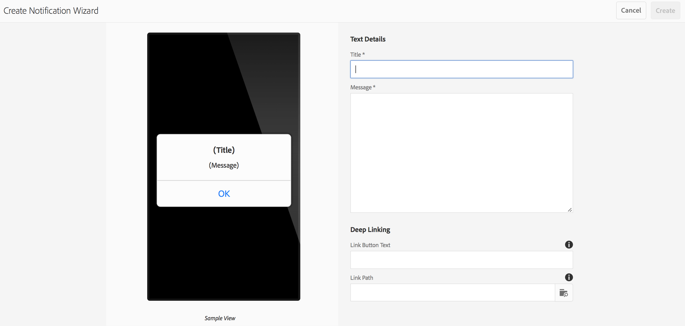
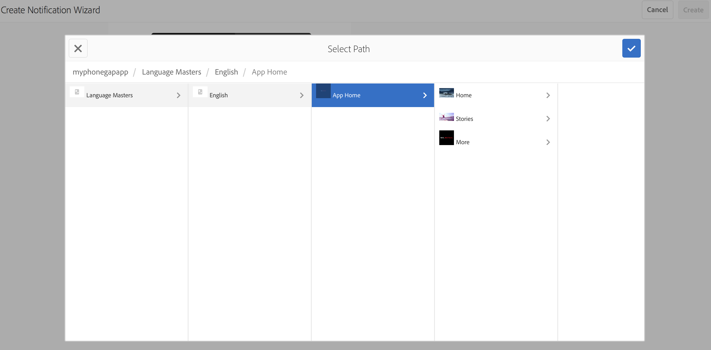
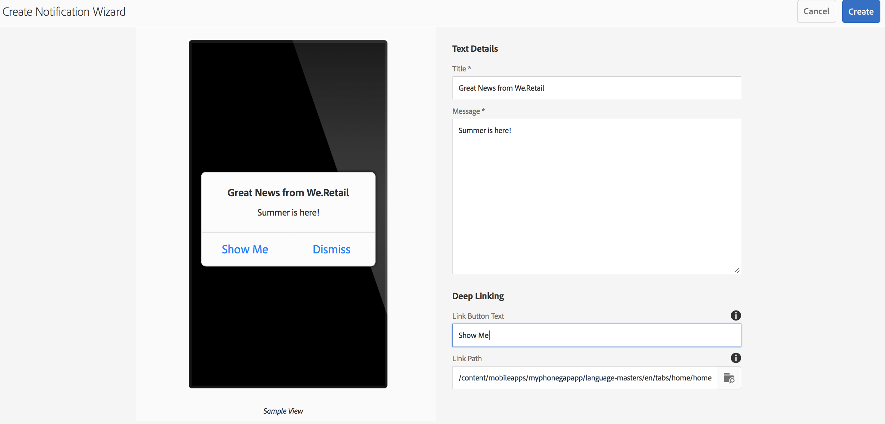
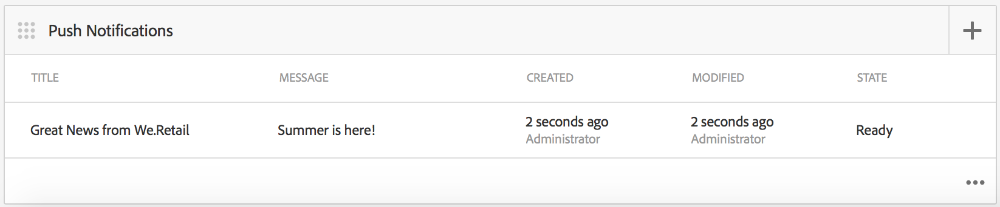

# Push Notifications{#push-notifications}

>[!NOTE]
>
>Adobe recommends using the SPA Editor for projects that require single page application framework-based client-side rendering (e.g. React). [Learn more](/help/sites-developing/spa-overview.md).

Being able to instantly alert your AEM Mobile app users with important notifications is crucial to the value of a mobile app and its marketing campaigns. Here, we describe the steps that need to be taken to allow your app to receive push notifications, and how to configure and send pushes from AEM Mobile to the app installed on the phone. Additionally, this section describes how to configure the [Deep Linking](#deeplinking) feature to your push notifications.

>[!NOTE]
>
>*Push notifications are not guaranteed delivery; they are more like announcements. A best effort is made to make sure everyone receives them but they are not a guaranteed delivery mechanism. Also, the time to deliver a push can vary from less than a second to up to half an hour.*

Using push notifications with AEM requires a few different technologies. First, a push notification service provider must be used to managethenotifications and devices (AEM does not do this, yet). Two providers are configured out-of-the-box with AEM: [Amazon Simple Notification Service](https://aws.amazon.com/sns/) (or SNS), and [Pushwoosh](https://www.pushwoosh.com/). Second, the push technology for the given mobile OS must go through the appropriate service — Apple's Push Notification Service (or APNS) for iOS devices; and Google Cloud Messaging (or GCM) for Android devices. Although AEM does not communicate with these platform specific services directly, some related configuration information must be provided by AEM along with the notifications in order for these services to execute the push.

Once installed and configured (as explained below) it works like this:

1. A push notification is created in AEM, and sent to the service provider (Amazon SNS or Pushwoosh).
1. The service provider receives it and sends it to the core provider (APNS or GCM).
1. The core provider pushes the notification to all devices registered for that push. For each device it uses the cellular data network or WiFi, whichever is currently available on the device.
1. The notification displays on the device if the app it is registered for is not running. A user tapping on the notification will start the app and display the notification within the app. In the case that the application is already running, only the in-app notification is displayed.

This release of AEM supports iOS and Android mobile devices.

## Overview and Procedure {#overview-and-procedure}

To use push notifications in an AEM Mobile app, the following high-level steps must be taken.

Typically, an Experience Manager Developer does the following:

1. Register with Apple and Google messaging services
1. Register with a push messaging service and configure it
1. Add push support to the app
1. Prepare a phone for testing

While an Experience Manager Administrator does the following:

1. Configure push on AEM apps
1. Build and deploy the app
1. Send a Push Notification
1. Configure deep linking *(optional)*

### Step 1: Register with Apple and Google messaging services {#step-register-with-apple-and-google-messaging-services}

#### Using the Apple Push Notification Service (APNS) {#using-the-apple-push-notification-service-apns}

Go to the Apple page [here](https://developer.apple.com/documentation/usernotifications#//apple_ref/doc/uid/TP40008194-CH8-SW1) to become familiar with the Apple Push Notification Service.

To use APNs you need a **Certificate** file (a .cer file), a push **Private Key** (a .p12 file), and a **Private Key Password** from Apple. Instructions on how to do that can be found [here](https://developer.apple.com/library/archive/documentation/NetworkingInternet/Conceptual/RemoteNotificationsPG/).

#### Using the Google Cloud Messaging (GCM) service {#using-the-google-cloud-messaging-gcm-service}

>[!NOTE]
>
>Google is replacing GCM with a similar service called Firebase Cloud Messaging (FCM). For more information on FCM, click [here](https://developers.google.com/cloud-messaging/faq).

Go to the Google page [here](https://developer.android.com/google/gcm/index.html) to become familiar with Google Cloud Messaging for Android.

You will need to follow the steps [here](https://developer.android.com/google/gcm/gs.html) to **Create a Google API project**, **Enable the GCM Service**, and **Obtain an API Key**. You will need the **API Key** to send push notifications to Android devices. Also, record your **Project Number**, which is also sometimes called a **GCM Sender Id**.

The following steps shows a different method of creating GCM API Keys:

1. Log into google and go to the [Google's Developer page](https://developers.google.com/mobile/add?platform=android&cntapi=gcm).
1. Choose your app from the list (or create a new one).
1. Under Android Package Name, enter your app id, i.e. `com.adobe.cq.mobile.weretail.outdoorsapp`. (If that does not work, try again with "test.test".)
1. Click **Continue To Choose and configure services**
1. Select Cloud Messaging, and then click **Enable Google Cloud Messaging**.
1. The new Server API Key and (new or existing) Sender ID will then be displayed.

>[!NOTE]
>
>Record the Server API Key. This value is entered on the site of your push provider.

### Step 2: Register and Configure a Push Messaging Service {#step-register-and-configure-a-push-messaging-service}

AEM is configured to use one of three services for push notifications:

* Amazon SNS
* Pushwoosh
* Adobe Mobile Services

*Amazon SNS* and *Pushwoosh* configurations will allow you to send pushed from inside AEM screens.

*Adobe Mobile Services* configuration allows you to configure and send push notifications from within Adobe Mobile Services using an Adobe Analytics account (but the app needs to be built with this config set to enable AMS push notifications).

#### Using the Amazon SNS messaging service {#using-the-amazon-sns-messaging-service}

>[!NOTE]
>
>*Information about Amazon SNS, and a link to create a new AWS account, can be found [here](https://aws.amazon.com/sns/). You can get a free account for a year.*

If you do not want to use Amazon SNS you can skip these steps.

Follow these steps to set up Amazon SNS for push notifications:

1. **Register with Amazon SNS**

    1. Record your Account Id. The format should be twelve digits with no spaces or dashes, i.e. "123456789012".
    1. Ensure you are in the "us-east" or "eu" region, as a later step (Identity Pool Creation) requires one of those.
    1. After registering, log into the management console and select [SNS](https://console.aws.amazon.com/sns/) (Push Notification Service). Click on "Get Started" if it appears.

1. **Create Access Key and ID**

    1. Click on your login name on the upper right of the screen, and choose Security Credentials from the menu.
    1. Click on Access Keys, and in the space below, click **Create New Access Key**.
    1. Click **Show Access Key**, and copy and save the Access Key ID and Secret Access Key shown. If you choose the option to download the keys, you will get a csv file that contains those same values.
    1. Other security related certificates, and some other, can be managed on this page.

   >[!NOTE]
   >
   >An Access Key can be used for multiple apps.

   For organizations, which use an "AWS Sandbox" account, the steps are very similar, and outlined here:

    1. Click on your login name on the upper right of the screen, and choose My Security Credentials from the menu.
    1. Click on Users in the left list of actions, and choose your user name.
    1. Click on the Security credentials tab.
    1. From here you see your keys and create new keys. Save the keys for later use.

1. **Create a Topic**

    1. Click **Create Topic** and choose a topic name. Record all fields such as Topic ARN, Topic Owner, Region, Display name.
    1. Click **Other Topic Actions** > **Edit Topic Policy**. Under **Allow these users to subscribe to this topic**, select **Everyone.**
    1. Click **Update Policy**.

   >[!NOTE]
   >
   >You can create multiple topics for different scenarios such as dev, test, demo, and so on. The rest of the SNS configuration can remain the same. Build the app with the different topic; push notifications sent to that topic will only be received by the app built with that topic.

1. **Create Platform Applications**

    1. Click Applications, then Create Platform Application. Choose a name and select a platform (APNS for iOS, GCM for Android). Depending on the platform other fields will need to be filled in:

        1. For APNS, a P12 file, a Password, a Certificate and a Private Key must all be entered. These should have been obtained in the step *Using the Apple Push Notification Service (APNS)* above.
        1. For GCM, an API Key must be entered. This should have been obtained in the step *Using the Google Cloud Messaging (GCM) service* above.

    1. Repeat the above step once for each platform you will be supporting. To be able to push to both iOS and Android, two Platform Applications must be created.

1. **Create an Identity Pool**

    1. Use [Cognito](https://console.aws.amazon.com/cognito) to create an Identity Pool, which will store basic data of unauthenticated users. Note, only "us-east" and "eu" regions are supported by Amazon Cognito at this time.
    1. Give it a name, and check the box for "Enable access to unauthenticated identities".
    1. On the next page ("*Your Cognito identities require access to your resources*") click Allow.
    1. On the upper right of the page, click on the link "*Edit identity pool"*. The Identity Pool Id is shown. Save this text for later.
    1. On the same page, choose the drop down next to "Unauthenticated role" and ensure it has the role Cognito_&lt;pool name&gt;UnauthRole selected. Save your changes.

1. **Configure Access**

    1. Login to [Identity and Access Management](https://console.aws.amazon.com/iam/home) (IAM)
    1. Select Roles
    1. Click on the role created in the previous step, called Cognito_&lt;yourIdentityPoolName&gt;Unauth_Role. Record the "Role ARN" displayed.
    1. Open "Inline Policies" if it is not already opened. You should see a policy there with a name like oneClick_Cognito_&lt;yourIdentityPoolName&gt;Unauth_Role_1234567890123.
    1. Click "Edit Policy". Replace the contents of the Policy Document with this snippet of JSON:

    <table>
    <tbody>
     <tr>
     <td>
 
 
{
 
 "Version": "2012-10-17",
 
 "Statement": [
 
 {
 
 "Action": [
 
 "mobileanalytics:PutEvents",
 
 "cognito-sync:*",
 
 "SNS:CreatePlatformEndpoint",
 
 "SNS:Subscribe"
 
 ],
 
 "Effect": "Allow",
 
 "Resource": [
 
 "*"
 
 ]
 
 }
 
 ]
 
}
 
 
 </td>
     </tr>
    </tbody>
    </table>

    1. Click on **Apply Policy**

#### Using the Pushwoosh messaging service {#using-the-pushwoosh-messaging-service}

If you do not want to use Pushwoosh, you can skip this step.

To use Pushwoosh:

1. **Register with Pushwoosh**

    1. Go to pushwoosh.com and create a new account.

1. **Create an API Access Token**

    1. On the Pushwoosh site, go to the API Access menu item to generate an API Access Token. You will need to securely record this.

1. **Create a new app**

    1. For Android support, you need to provide your GCM API key.
    1. When configuring the app, choose Cordova as the framework.
    1. For iOS support you need to provide the Certificate file (.cer), Push Certificate (.p12) and private key password; these should have been obtained from Apple's APNS site. For Framework, choose Cordova.
    1. Pushwoosh will generate an App Id for that app, in the form "XXXXX-XXXXX", where each X is a hexadecimal value (0 through F).

>[!NOTE]
>
>*If a second app is configured in AEM with the same App Id (and other related values: API Access Token, and GCM Id), any push notifications sent via the second app on AEM will go to any other app with that App Id.*

### Step 3: Add push support to the app {#step-add-push-support-to-the-app}

#### Add ContentSync Configuration {#add-contentsync-configuration}

Create two content nodes (one in app-config and one in app-config-dev) called notificationsConfig:

* /content/`<your app>`/shell/jcr:content/pge-app/app-config-dev/notificationsConfig
* /content/`<your app>`/shell/jcr:content/pge-app/app-config/notificationsConfig

With these properties (.content.xml files) :
&lt;jcr:root xmlns:jcr=" [https://developer.adobe.com/experience-manager/reference-materials/spec/jcr/1.0/index.html](https://developer.adobe.com/experience-manager/reference-materials/spec/jcr/1.0/index.html)" xmlns:nt=" [https://developer.adobe.com/experience-manager/reference-materials/spec/jcr/1.0/index.html](https://developer.adobe.com/experience-manager/reference-materials/spec/jcr/1.0/index.html)"
jcr:primaryType="nt:unstructured"
excludeProperties="[appAPIAccessToken]"
path="../../../.."
targetRootDirectory="www"
type="notificationsconfig"/&gt;

>[!NOTE]
>
>The content sync handler looks for those nodes, and if they are not there, it does not write out the pge-notifications-config.json file.

#### Add Client Libraries {#add-client-libraries}

The push notification client libraries must be added to the app by following these steps:

In CRXDE Lite:

1. Navigate to */etc/designs/phonegap/&lt;app name&gt;/clientlibsall.*
1. Double click on the embed section in the properties pane.
1. In the dialog that appears, add a new client lib by clicking the + button.
1. In the new text field, add "cq.mobile.push", and click OK.
1. Add one more called cq.mobile.push.amazon, and click OK.
1. Save the changes.

>[!NOTE]
>
>If push notifications are removed, or are not used, for space considerations on the app, and to avoid console error messages, remove these clientlibs from your app.

### Step 4: Prepare a Phone for Testing {#step-prepare-a-phone-for-testing}

>[!NOTE]
>
>*For push notifications, you need to test on an actual device, as emulators are not able to receive push notifications.*

#### IOS {#ios}

For iOS you will need to use a Mac OS computer and you need to join the [iOS Developer Program](https://developer.apple.com/programs/ios/). Some corporations have corporate licenses which may be available to all developers.

With XCode 8.1, before using Push Notifications you must go to the Capabilities tab in your project, and toggle the Push Notifications toggle ON.

#### Android {#android}

To install the app on an Android phone using CLI (see below: **Step 6 - Build and deploy the app**), you first must put the phone in "developer mode." See [Enabling On-device Developer Options](https://developer.android.com/tools/device.html#developer-device-options) for details on doing this.

### Step 5: Configure push on AEM apps {#step-configure-push-on-aem-apps}

Before building and deploying to your configured mobile device, you must configure the notification settings for the messaging service you decided to use.

1. Create the appropriate authorization groups for push notifications.
1. Login to AEM as the appropriate user, click on the Apps tab.
1. Click on the App.
1. Find the Manage Cloud Services tile and click on the pencil, to modify your cloud configs.
1. Select Amazon SNS Connnection, Pushwoosh Connection, or Adobe Mobile Services, as the notification configuration.
1. Enter the provider properties and click Submit to save them, and Done. They are not verified remotely at this stage, except in the case of AMS.
1. You should now see the config you just entered on the Manage Cloud Services tile.

### Step 6: Build and deploy the app {#step-build-and-deploy-the-app}

**Note:** Refer also to our instructions [here](/help/mobile/building-app-mobile-phonegap.md) on building PhoneGap applications.

There are two ways to build and deploy your app using PhoneGap.

**Note:** For push notification testing, emulators will not suffice because push notifications use a distinct protocol between the push provider (Apple or Google) and the device. Current Mac/PC hardware and emulators do not support this.

1. *PhoneGap Build* is a service offered by PhoneGap that will build your app for you on their servers, and allow you to download it to your device directly. See PhoneGap Build documentation at `https://build.phonegap.com/` to learn how to set up and use PhoneGap Build.

1. *PhoneGap Command Line Interface* (CLI) lets you use a rich set of PhoneGap commands on your command line to build, debug, and deploy your app. Refer to the PhoneGap developer documentation (`https://docs.phonegap.com/en/edge/guide_cli_index.md.html#The%20Command-Line%20Interface`) to learn how to set up and use PhoneGap CLI.

### Step 7: Send a Push Notification {#step-send-a-push-notification}

To create a new notification and send it, follow these steps.

1. Create a new notification

    * In your AEM Mobile app's dashboard, find the Push Notifications tile.
    * In the menu on the upper right, choose "Create". Note that this button will not be available until the cloud config is first set.
    * In the Create Notification Wizard, enter in a title and a message, then click the "Create" button. Your notification is now ready to send immediately or later. It can be edited and the message and/or title can be changed and saved.

1. Send the notification

    * In the Apps dashboard, find the Push Notifications tile.
    * Select the notification, or click on the details button on the bottom right (. . .), to show the list of notifications. This list also indicates if a notification is ready to be sent, has already been sent, or if an error occurred during sending.
    * Select the checkbox for one notification (only) and click the "Send Notification" button above the list. You will have one chance to "Cancel" or "Send" the notification on the dialog that appears.

1. Dealing with the results

    * If the push notification service (Amazon SNS or Pushwoosh) receives the Send request, confirms it as valid, and sends it to the native providers (APNS and GCM) successfully, the Send dialog will close with no message. In the notification list, the status of that notification will be listed as Sent.
    * If the push send fails, the dialog will show a message indicating the problem. In the notification list, the status of that notification will be listed as Error, but if the problem is rectified, the notification can be sent again. In the event of an error, additional error information should appear in the server error log.
    * Note there are some platform differences between iOS and Android push notifications. Among them:

        * Building with CLI will start the app after it is deployed on Android. On iOS, you have to start it manually. Since the push registration step happens at startup, Android apps can receive push notifications right away (since it will have started and registered) while iOS apps will not.
        * On Android, the OK button text is in all caps (and in any other buttons added on the in-app notification), while in iOS it is not.

For AMS Push Notifications, notifications must be composed and sent from the AMS server. AMS provides additional push notification capabilities beyond those provided by AEM's notifications with AWS and Pushwoosh.

>[!NOTE]
>
>*Push notifications are not guaranteed delivery; they are more like announcements. A best effort is made to make sure everyone hears it but they are not a guaranteed delivery mechanism. Also, the time to deliver a push can vary from less than a second to up to half an hour.*

### Configuring Deep Linking with Push Notifications {#configuring-deep-linking-with-push-notifications}

What is Deep Linking? In the context of a push notification, it is a means to allow an app to be opened or directed (if open) to a specified location inside the app.

How does it work? The author of a push notification optionally adds a button label (i.e. "Show me!") to the notification and chooses the page they would like linked in the notification, via a visual path browser. When sent, the push occurs as normal except that in the in-app message, the OK button is replaced by a "Dismiss" button, and the new button specified ("Show me!") also appears. Clicking on the new button will make the app go to the specified page within the app. Clicking Dismiss will just dismiss the message.

If the app is not open, the shade will appear as normal. Taking action on the notification in the shade will open the app and then present the user the deep link buttons based on what was configured in the push notification.

Create the notification, add a button text and link path for the optional deep link:

>[!CAUTION]
>
>.To access the Push Notification tile in your dashboard, follow the steps below.

1. Click the edit on the top right corner of the **Manage Cloud Services** tile.

   

1. Select the **Pushwoosh Connection**. Click **Next**.

   

1. Enter the details of the properties and click **Submit**.

   

   One you submit your configuration, the **Push Notifications** tile displays in the dashboard.

   

### Create Notification Wizard {#create-notification-wizard}

Once the **Push Notifications** tile displays in your dashboard, use the create notification wizard to add the content:

1. Click the add symbol on the top right corner of the **Push Notifications** tile to open the **Create Notification Wizard**.

   

1. Clicking the browse icon in the link path, presents the user with the content structure of the app.

   Once you select the path, click the check icon.

   

   >[!NOTE]
   >
   >The Link Button Text is limited to 20 characters.
   >
   >If the end user doesn't have the latest version of the application and the linked path isn't available, confirming the action of the deep link will bring the user to the main page of the app.

1. Enter the **Text Details** in the **Create Notification Wizard** and click **Create**.

   

   Open the details by clicking on the push notification you created from the **Push Notifications** tile.

   You can edit properties, send notifications, or delete the notification.

   

>[!NOTE]
>
>**Additional Information**:
>
>Pushwoosh and Amazon SNS will be not be supported after 6.4 Release and will be available as an add-on from the package share.

### The Next Steps {#the-next-steps}

Once you understand the details on push notifications for your app, see [AEM Mobile Content Personalization](/help/mobile/phonegap-aem-mobile-content-personalization.md).
