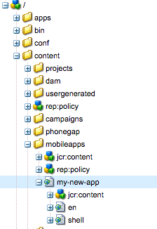

# Structure an App{#structure-an-app}

>[!NOTE]
>
>Adobe recommends using the SPA Editor for projects that require single page application framework-based client-side rendering (e.g. React). [Learn more](/help/sites-developing/spa-overview.md).

An AEM Mobile project involves a diverse set of content types including pages, JavaScript and CSS client libraries, reusable AEM components, Content Sync configurations, and PhoneGap app shell content. Basing your new AEM Mobile app on the [Starter Kit](https://github.com/Adobe-Marketing-Cloud-Apps/aem-phonegap-starter-kit) is a good way to get all the different types of content into our recommended structure to ease both portability and maintainability over the long term.

## Page Content {#page-content}

The pages of your application should all be located below /content/mobileapps in order for them to be recognized by the AEM Mobile console.

By AEM convention, the first page of your app should be a redirect to one of it's children which serves as the default language of the app ('en' in both Geometrixx and Starter Kit cases). The top level locale page typically inherits from the foundation 'splash-page' component (/libs/mobileapps/components/splash-page) which takes care of the initialization necessary to support the installation of over-the-air Content Sync updates (contentInit code can be found at /etc/clientlibs/mobile/content-sync/js/contentInit.js).

## Templates and Components {#templates-and-components}

The template and component code for your app should be located in /apps/&lt;brand name&gt;/&lt;app name&gt;. In conformity with convention, you should place your template and component code in /apps/&lt;brand name&gt;/&lt;app name&gt;. This pattern should be familiar to developers who have already worked with Site in AEM. It is typically followed as /apps/ is locked down to anonymous access by default on publish instances. Accordingly, your raw JSP code is hidden away from potential attackers.

App specific templates can be configured to only be presented by using the `allowedPaths` property node on the template itself, and setting its value to '/content/mobileapps(/.&ast;)?' - or even something more specific if the template should only be usable for a single app. The `allowedParents` and `allowedChildren` properties can also be leveraged for very fine grained control of which templates will be available to an author based on the where the new page is being created.

When creating a new app page component from scratch, it is recommended to set it's `sling:resourceSuperType` property to 'mobileapps/components/angular/ng-page'. This will set your page up for both authoring and rendering as a single-page app and enable you to overlay any .jsp files that your component might need to change. Since ng-page does not include any UI framework at all, a developer will typically end up overlaying (at least) 'template.jsp' (overlaid from /libs/mobileapps/components/angular/ng-page/template.jsp).

Authorable page components, wishing to leverage AngularJS, have an equivalent `sling:resourceSuperType` component located at /libs/mobileapps/components/angular/ng-component which can be overlaid and customized in the same way.

## JavaScript and CSS Clientlibs {#javascript-and-css-clientlibs}

When it comes to client libraries there are a few options available to the developer of where to place them in the repository. The following pattern is offered for guidance, but is not a hard requirement.

If your clientside code can stand on its own and doesn't relate to a specific component of your application - meaning it may be reused in other applications - we recommend storing it in /etc/clientlibs/&lt;brand name&gt;/&lt;lib name&gt;. On the other hand, if the clientlib is specific to a single app, you can nest it as a child of your app's design node; /etc/designs/phonegap/&lt;brand name&gt;/&lt;app name&gt;/clientlibs. This clientlib's category should not be used by other libs, and should be used to embed other libs as necessary. Following this patterns saves the developer from having to add new Content Sync configurations each time a client library is added to the app, instead simply updating the 'embeds' property of the app's design clientlib. For example, take a look at the Geometrixx clientlibs-all Content Sync config node at /content/phonegap/geometrixx-outdoors/en/jcr:content/pge-app/app-config/clientlibs-all.

If your client side code is tightly coupled to a specific component, place that code in a client library nested below the component's location in /apps/, and embed it's category into your app's 'design' clientlib.

## PhoneGap Configuration {#phonegap-configuration}

Each AEM Mobile app contains a directory which hosts the configuration files used by the PhoneGap [command line interface](https://github.com/phonegap/phonegap-cli) and PhoneGap build at `https://build.phonegap.com/` to turn your web content into a runnable application. In the Geometrixx sample for instance, this directory (/content/phonegap/geometrixx-outdoors/shell/jcr:content/pge-app/app-content) is located as part of the Shell; a design decision made due to the fact that it contains only content which cannot be updated over-the-air, such as plugins which deal with device APIs and configuration of the app itself.

In this directory you will also find a number of [Cordova hooks](https://cordova.apache.org/docs/en/edge/guide_appdev_hooks_index.md.html#Hooks%20Guide) which can be used to install plugins, place resource files in their platform specific locations, and other actions which should be executed as part of the build. Note: as an alternative to downloading each plugin as part of the build, you can follow the pattern of the Kitchen Sink app and [include plugin source code](https://github.com/blefebvre/aem-phonegap-kitchen-sink/tree/master/content/src/main/content/jcr_root/content/phonegap/kitchen-sink/shell/_jcr_content/pge-app/app-content/phonegap/plugins) with the rest of your app project.

## The Next Steps {#the-next-steps}

Once you learn about the Structure of the app, see [Creating and Editing the Apps using App Console](/help/mobile/phonegap-apps-console.md).
