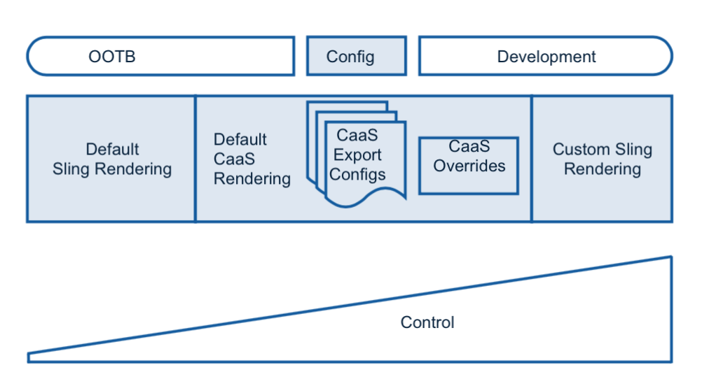

# Rendering and Delivery{#rendering-and-delivery}

{{ue-over-mobile}}

Adobe Experience Manager (AEM) content can easily be rendered by way of [Sling Default Servlets](https://sling.apache.org/documentation/bundles/rendering-content-default-get-servlets.html) to render [JSON](https://sling.apache.org/documentation/bundles/rendering-content-default-get-servlets.html#default-json-rendering) and other formats.

Those out-of-the-box renderings typically walk the repository and return content as is.

AEM, by way of Sling, also supports developing and deploying custom sling renderers to take full control of the rendered schema and content.

Content Services Default Renderers fill the gap between out-of-the-box Sling Defaults and Custom Development allowing customization and control of many aspects of the rendered content without development.

The following diagram shows the rendering of content services.

## Requesting JSON {#requesting-json}

Use **<RESOURCE.caas`[.<EXPORT-CONFIG][.&lt;DEPTH-INT&gt;]`.json** to request JSON.

<table>
 <tbody>
  <tr>
   <td>RESOURCE</td>
   <td>an entity resource under /content/entities  or   a content resource under /content</td>
  </tr>
  <tr>
   <td>EXPORT-CONFIG</td>
   <td>
<strong>OPTIONAL</strong>  
 
an export configuration found under /apps/mobileapps/caas/exportConfigs/EXPORT-CONFIG    If omitted the default export configuration is applied 
 </td>
  </tr>
  <tr>
   <td>DEPTH-INT</td>
   <td><strong>OPTIONAL</strong>    depth recursion for rendering of children as used in Sling rendering</td>
  </tr>
 </tbody>
</table>

## Creating Export Configs {#creating-export-configs}

Export configs can be created to customize JSON rendering.

You can create a configuration node under */apps/mobileapps/caas/exportConfigs.*

| Node Name |Name of the configuration (for rendering selector) |
|---|---|
| jcr:primaryType |nt:unstructured |

The following table shows the properties of Export Configs:

<table>
 <tbody>
  <tr>
   <td><strong>Name</strong></td>
   <td><strong>Type</strong></td>
   <td><strong>Default (if, not set)</strong></td>
   <td><strong>Value</strong></td>
   <td><strong>Description</strong></td>
  </tr>
  <tr>
   <td>includeComponents</td>
   <td>String[]</td>
   <td>include everything</td>
   <td>sling:resourceType</td>
   <td>exclude details for nodes with specified sling:resourceType from JSON export</td>
  </tr>
  <tr>
   <td>excludeComponents</td>
   <td>String[]</td>
   <td>exclude nothing</td>
   <td>sling:resourceType</td>
   <td>include details only for nodes with specified sling:resourceType from JSON export</td>
  </tr>
  <tr>
   <td>excludePropertyPrefixes</td>
   <td>String[]</td>
   <td>exclude nothing</td>
   <td>Property prefixes</td>
   <td>exclude properties that start with specified prefixes from JSON export</td>
  </tr>
  <tr>
   <td>excludeProperties</td>
   <td>String[]</td>
   <td>exclude nothing</td>
   <td>Property names</td>
   <td>exclude specified properties from JSON export</td>
  </tr>
  <tr>
   <td>includeProperties</td>
   <td>String[]</td>
   <td>include everything</td>
   <td>Property names</td>
   <td>
if excludePropertyPrefixes set  this includes specified properties despite matching the prefix being excluded,
 
else (exclude properties ignored) only include these properties
 </td>
  </tr>
  <tr>
   <td>includeChildren</td>
   <td>String[]</td>
   <td>include everything</td>
   <td>child names</td>
   <td>exclude specified children from JSON export</td>
  </tr>
  <tr>
   <td>excludeChildren</td>
   <td>String[]    </td>
   <td>exclude nothing</td>
   <td>child names</td>
   <td>include only specified children from JSON export, exclude other</td>
  </tr>
  <tr>
   <td>renameProperties</td>
   <td>String[]    </td>
   <td>rename nothing</td>
   <td>&lt;actual_property_name&gt;,&lt;replacement_property_name&gt;</td>
   <td>rename properties using replacements</td>
  </tr>
 </tbody>
</table>

### Resource type export overrides {#resource-type-export-overrides}

Create a configuration node under */apps/mobileapps/caas/exportConfigs.*

| name |resourceTypeOverrides |
|---|---|
| jcr:primaryType |nt:unstructured |

The following table shows the properties:

<table>
 <tbody>
  <tr>
   <td><strong>Name</strong></td>
   <td><strong>Type</strong></td>
   <td><strong>Default (if, not set)</strong></td>
   <td><strong>Value</strong></td>
   <td><strong>Description</strong></td>
  </tr>
  <tr>
   <td>&lt;SELECTOR_TO_INC&gt;</td>
   <td>String[] </td>
   <td>-</td>
   <td>sling:resourceType</td>
   <td>For the following sling resource types, do not return the default CaaS json export.  Return a customer json export by rendering the resource as;  &lt;RESOURCE&gt;.&lt;SELECTOR_TO_INC&gt;.json </td>
  </tr>
 </tbody>
</table>

### Existing Content Services Export Configs {#existing-content-services-export-configs}

Content Services include two export configurations:

* default (no config specified)
* page (to render site pages)

#### Default Export Configuration {#default-export-configuration}

Content Services default export configuration is applied if a config is specified in the requested URI.

&lt;RESOURCE&gt;.caas[.&lt;DEPTH-INT&gt;].json

<table>
 <tbody>
  <tr>
   <td><strong>Name</strong></td>
   <td><strong>Value</strong></td>
  </tr>
  <tr>
   <td>excludeProperties</td>
   <td> </td>
  </tr>
  <tr>
   <td>excludePropertyPrefixes</td>
   <td>jcr:,sling:,cq:,oak:,pge-</td>
  </tr>
  <tr>
   <td>includeProperties</td>
   <td>jcr:text,text  jcr:title,title  jcr:description,description  jcr:lastModified,lastModified  cq:tags,tags  cq:lastModified,lastModified</td>
  </tr>
  <tr>
   <td>includeComponents</td>
   <td> </td>
  </tr>
  <tr>
   <td>excludeComponents</td>
   <td> </td>
  </tr>
  <tr>
   <td>includeChildren</td>
   <td> </td>
  </tr>
  <tr>
   <td>excludeChildren</td>
   <td> </td>
  </tr>
  <tr>
   <td>Sling JSON Overrides</td>
   <td>foundation/components/image  wcm/foundation/components/image  mobileapps/caas/components/data/contentReference  mobileapps/caas/components/data/assetlist</td>
  </tr>
 </tbody>
</table>

#### Page Export Configuration {#page-export-configuration}

This configuration extends the default to include grouping children under a child node.

&lt;SITE_PAGE&gt;.caas.page[.&lt;DEPTH-INT&gt;].json

### Additional Resources {#additional-resources}

See the resources below to learn about additional topics in Content Services:

* [Developing Models](/help/mobile/administer-mobile-apps.md)
* [Authoring Content Services](/help/mobile/develop-content-as-a-service.md)
* [Administering Content Services](/help/mobile/developing-content-services.md)
