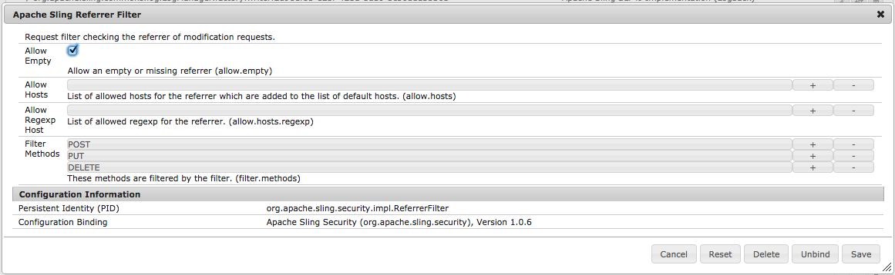

# Setting Your Referrer Filter to Allow Empty{#setting-your-referrer-filter-to-allow-empty}

{{ue-over-mobile}}

To allow the Adobe Experience Manager (AEM) Mobile Application Viewer to view apps on your Author instance, you must set your HTML referrer filter to 'allow empty'.

If you do not intend to use the Application Viewer to review applications within development and staging states, you do not need to change the default setting of the referrer filter.

Within your running Author instance of AEM, navigate to: [http://localhost:4502/system/console/configMgr](http://localhost:4502/system/console/configMgr) and search for 'Apache Sling Referrer Filter'. Click to edit the referrer filter and check the 'allow empty' checkbox (see image below). Next hit the save button and close the browser page.

