# Spaces and Entities{#spaces-and-entities}

{{ue-over-mobile}}

A Space is a convenient location to store entities that are exposed through the Content Services REST API. This is especially useful because an app (or any channel) can be associated with many entities. Forcing Entities to be within a Space forces the best practice of grouping an App's requirements. Optionally, you can associate an app in AEM with a small number of Spaces.

>[!NOTE]
>
>To make something available to any channel from Content Services, it needs to be under a space.

## Creating a Space {#creating-a-space}

If the user wants to expose a bunch of content and assets to a mobile app, the user creates the space using the AEM Mobile dashboard.

For the first time user, who has not configured content services to work with spaces, the AEM Mobile dashboard displays only Apps after selecting **Content Services**.

>[!CAUTION]
>
>**Prerequisites for adding a space**
>
>Check the **Enable AEM Content Services** to work with Spaces and enable it in your AEM Mobile application dashboard.
>
>See [Administering Content Services](/help/mobile/developing-content-services.md) for more details.

Once you configure Spaces in dashboard, follow these steps to create Spaces:

1. Choose **Spaces** from Content Services.

   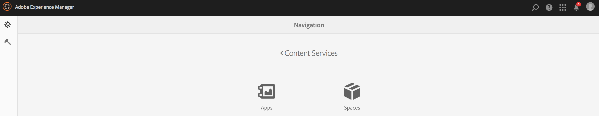

1. Choose **Create** to create a space. Enter **Title**, **Name**, and **Description** for the space.

   Click **Create**.

   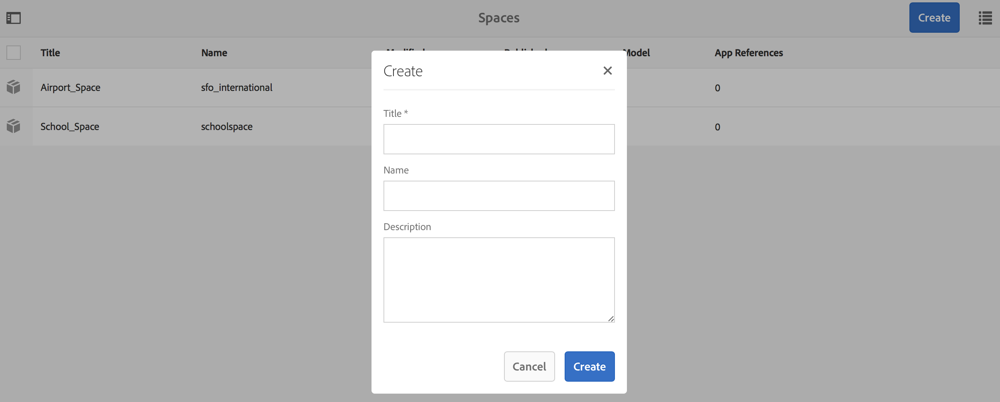

## Managing a Space {#managing-a-space}

After you create a space, click the left to manage the space in the list.

You can view properties of the space, delete the space, or publish the space and its contents to an AEM publish instance.

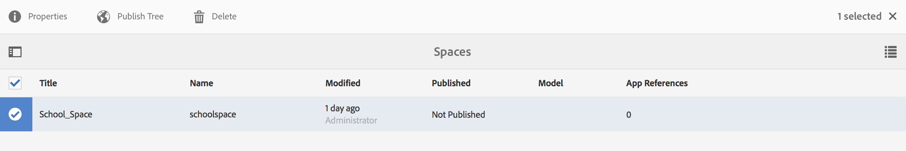

**Viewing and Editing Properties of a Space**

1. Select the space from the list
1. Choose **Properties** from the toolbar
1. Click **Close** when done

**Publishing a Space** When a space is published, all folders and entities in that space are also published.

1. Select the space by clicking on its icon in the Space Console list
1. Choose **Publish Tree**

>[!NOTE]
>
>You can **Unpublish** a Space, which removes the space from the publish instance.
>
>The following image illustrates the actions that can be performed, after you publish the space.

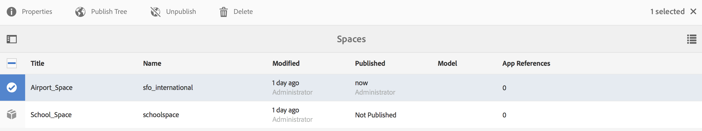

## Working with Folders in a Space {#working-with-folders-in-a-space}

Spaces can include folders to help further organize space's content and assets. Users can create their own hierarchy under a space.

### Creating a Folder {#creating-a-folder}

1. Click on the space in the list in the space console and click **Create Folder**

   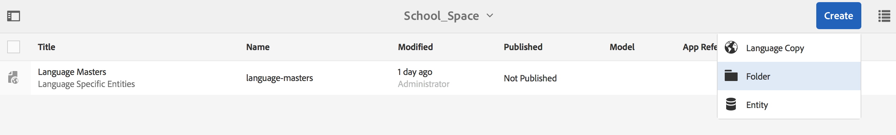

1. Enter the **Title**, **Name,** and **Description** for the folder

   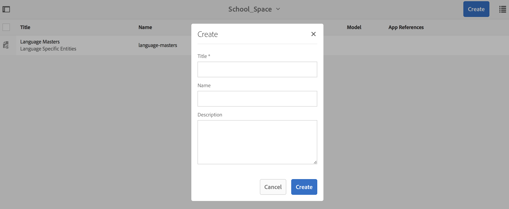

1. Click **Create** to create the folder in a space

## Language Copy {#language-copy}

>[!CAUTION]
>
>Language Copy is not fully functional for this release. It only sets up the structure.

The **Language Copy** feature allows authors to copy their master Language Copy and then create a Project and Workflow to automatically translate the content. Language Copy creates the correct structure. Once you add a folder in a space, you can add Language Copy to your space.

>[!NOTE]
>
>It is recommended that any content that might be translated, should be placed under the Language Copy node.

### Adding Language Copy {#adding-language-copy}

1. After you create space, click that space to create a language copy.

   Click **Create** and choose **Language Copy**.

   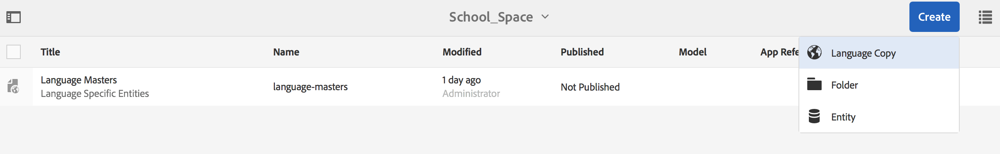

   >[!NOTE]
   >
   >Language Copy nodes can only exist as a direct child of the Space.

1. Choose **Content Package Language&ast;** and enter the **Title&ast;** in **Create Language Copy** dialog.

   Click **Create**.

   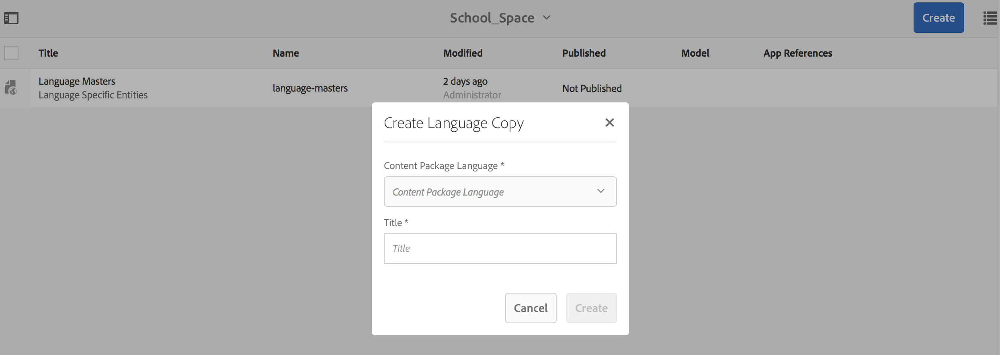

1. Once you create a Language Copy, it appears in your space in **Language Masters**.

   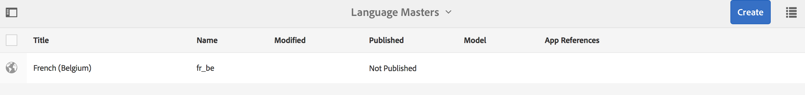

   >[!NOTE]
   >
   >Select **Language Masters** to view the language copy folders.

### Removing a Folder from the Space {#removing-a-folder-from-the-space}

1. Select the folder from the list of space contents
1. Click **Delete** from the toolbar

   >[!NOTE]
   >
   >To navigate into a folder and to see its contents or add a sub folder or entity, click the title of the folder in the space's content list.

## Working with Entities in a Space {#working-with-entities-in-a-space}

Entities represent content that is exposed through the web service endpoint. Entities are stored in spaces so the can be easily found and are kept independent of the AEM repository structure that holds their related content.

You may want to group entities together in some logical gathering. To do so you can create any number of folders.

If entity children, which are other entities, are gathered for data modeling, the developer user may create specific "Group Models" from the "Entity Group" model type, provided out-of-the-box.

>[!NOTE]
>
>Entities are always associated with a space, so most of the entity user interface is accessed through the space console.

### Creating an Entity {#creating-an-entity}

1. Open the Space console and click the title of the space.

   Optionally, you can navigate to the folder by clicking on the title of the folder in the list.

   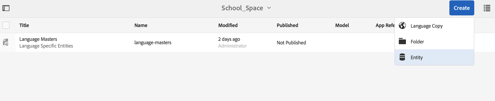

1. Choose the model for the entity. This is the type of entity that you want to create. Click Next.

   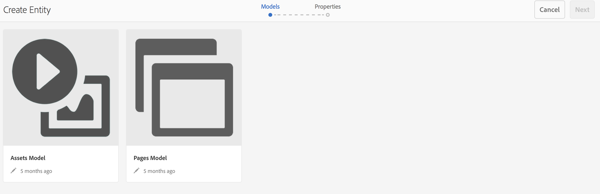

   >[!NOTE]
   >
   >You have the option to choose the **Assets Model**, **Pages Model**, or a model of entity type you created before.
   >
   >See [Creating a Model](/help/mobile/administer-mobile-apps.md), to create your custom entity.

1. Enter a **Title**, **Name**, **Description**, and **Tags** for the entity. Click **Create**.

   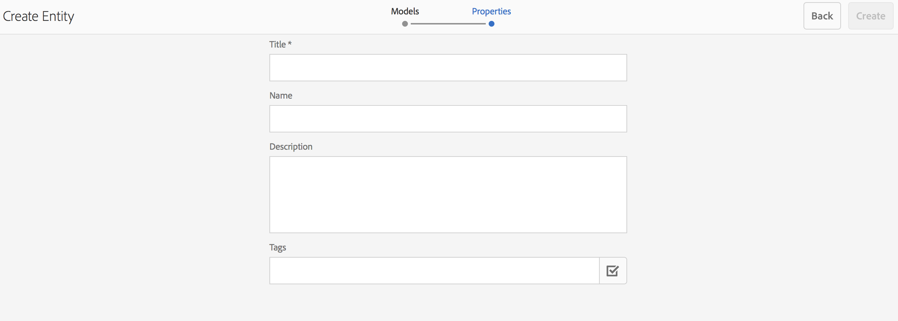

   Once you are done, the entity appears in your space's descendants.

### Editing an Entity {#editing-an-entity}

1. Once you have created an entity, go to your folder or space and choose your entity from the Space console to edit.

   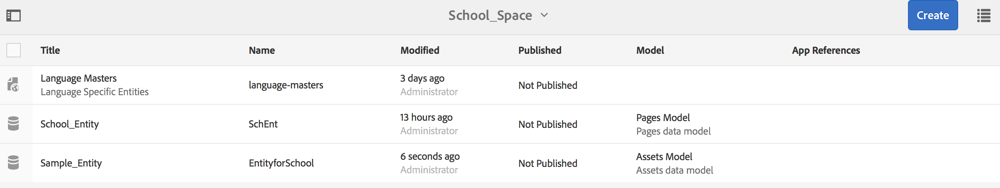

1. Select an entity for editing and click **Edit**.

   

   >[!CAUTION]
   >
   >Depending on the template you choose to create your entity, the UI will be different for both, for editing and viewing properties of your entity. See the steps below for more details.

   ***If you choose the template for creating the entity as Assets Models***, clicking on **Edit** lets you add assets as shown in the figure below:

   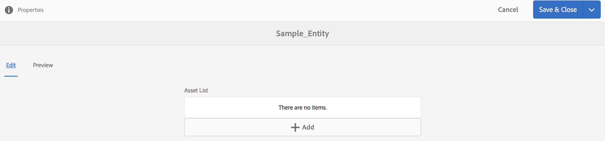

   Alternatively, you can click **Preview** to view the json link.

   

   ***If you choose the template for creating the entity as Pages Models***, clicking on **Edit** lets you add assets as shown in the figure below:

   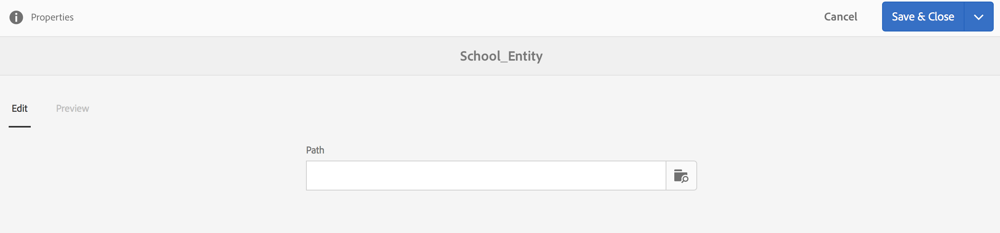

   Click on the icon in the **Path** to add an asset

   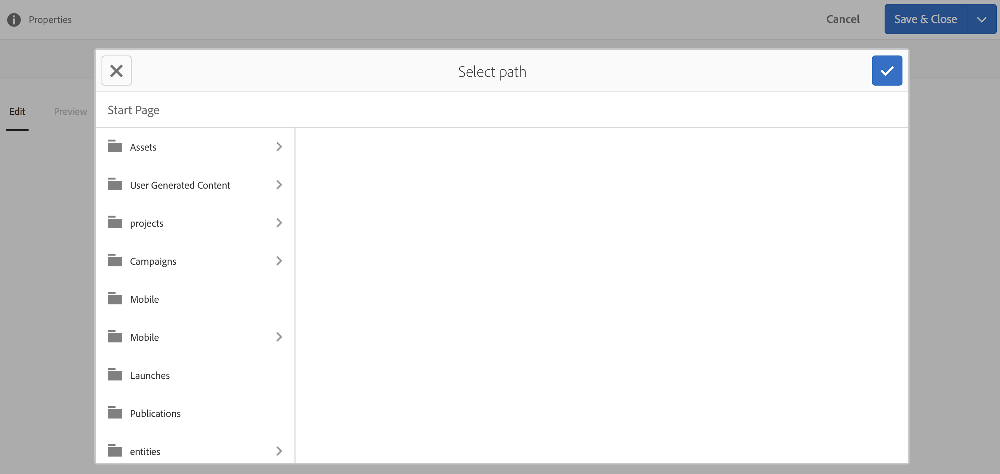

   >[!NOTE]
   >
   >Once you add an entity, it must be saved for the Preview link to work. To view the preview, click **Save**. Clicking on the **Preview** shows the json of the added asset, as shown in the figure below:

   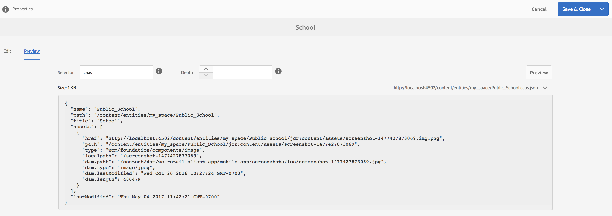

   >[!NOTE]
   >
   >When you are done adding assets to your entity, you can either choose **Save** to save the changes or choose **Save & Close** to save and redirect to the Space console list where the entities are defined.

   Additionally, select an entity from the space console list and click **Properties** to view and edit the properties for a defined entity.

   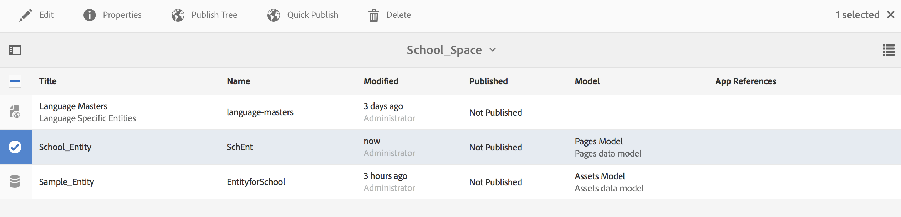

   You can edit the title, description, tags and add the assets to your entity.

   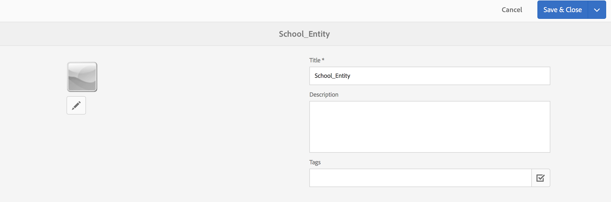

### Removing an Entity {#removing-an-entity}

1. Select the entity from the list of space contents

   

1. Click **Delete** from the toolbar to remove the specific entity from the space

### Publishing an Entity {#publishing-an-entity}

You have the option of choosing **Publish Tree** or **Quick Publish** to publish your entity.

1. Select an entity from the space console list and click **Publish Tree **to publish that entity and its children.

   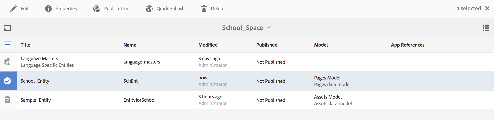

   **Or**,

   Click **Quick Publish** to publish that specific entity.
