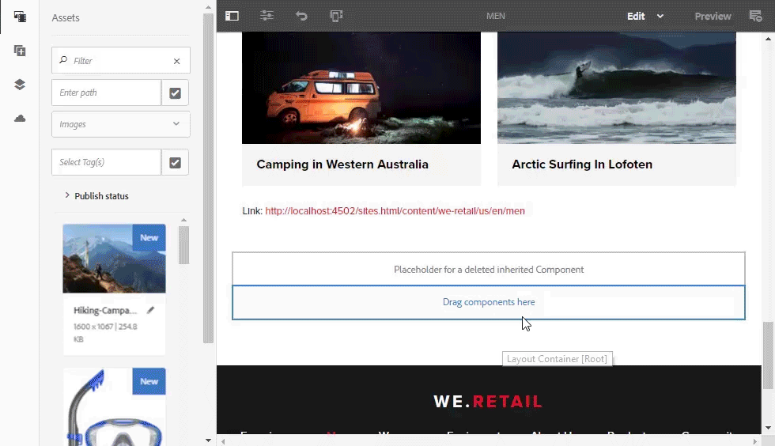

# AEM Assets Release Notes{#aem-assets-release-notes}

Here are the key features and highlights of the AEM 6.5 Assets release.

## Integration with Adobe Creative Cloud and creative workflows {#integration-with-adobe-creative-cloud-and-creative-workflows}

AEM offers various ways to integrate with Adobe Creative Cloud and share assets for use in workflows where the creative and marketing or business teams collaborate closely. AEM 6.5 continues to improve on the integration and streamlines it further to expose more opportunities and streamline the existing methods.

Read on to know the specific capabilities and integrations of AEM 6.5 that you can leverage to best support your content velocity use cases.

### Adobe Asset Link {#aal}

Adobe Asset Link strengthens collaboration between creatives and marketers in the content creation process. Creatives can access content stored in Adobe Experience Manager Assets (AEM Assets), without leaving the apps that they are most familiar with. Creatives can seamlessly browse, search, check out, and check in assets using the in-app panel in Photoshop, Illustrator, and InDesign apps.

Adobe Asset Link is a part of [Creative Cloud for enterprise](https://www.adobe.com/creativecloud/business/enterprise.html) offering. For more information about it, including necessary configuration of your AEM deployment, see [Adobe Asset Link](https://helpx.adobe.com/enterprise/using/adobe-asset-link.html).

### Adobe Stock integration {#stock}

Your organization can use its Adobe Stock enterprise plan within AEM Assets to ensure that licensed assets are broadly available for your creative and marketing projects. You can quickly find, preview, and license Adobe Stock assets that are saved in AEM, using the powerful DAM capabilities of AEM.

Adobe Stock service provides designers and businesses with access to millions of high-quality, curated, royalty-free photos, vectors, illustrations, videos, templates, and 3D assets for all their creative projects.

For more info, see [Use Adobe Stock assets in AEM Assets](/help/assets/aem-assets-adobe-stock.md).

Preview Adobe Stock image and license from within AEM Assets

Search and filter the licensed Adobe Stock images in AEM

### Dynamic references in Adobe InDesign {#dynamic-references-in-indesign}

The AEM Assets used in Adobe InDesign files are dynamic. The references update automatically if the referenced assets moves in the JCR hierarchy. For more information see, [Managing compound assets](/help/assets/managing-linked-subassets.md).

## Brand Portal capabilities {#brand-portal-capabilities}

AEM Assets Brand Portal helps you easily acquire, effectively control, and securely distribute the approved assets to external vendors/agencies and internal business users across devices. It helps improve the efficiency of asset sharing, accelerates the time-to-market for assets, and eliminates the risk of non-compliant usage and unauthorized access.

For more info, see [What's new in Brand Portal](https://helpx.adobe.com/experience-manager/brand-portal/using/whats-new.html).

## Connected Assets {#connectedassets}

In large enterprises the infrastructure required to create websites can be distributed. At times, the website creation capabilities and the required digital assets reside in different silos.

AEM Sites offers capabilities to create web pages and AEM Assets is the Digital Asset Management (DAM) system that supplies the required assets for websites. AEM now supports the above use case by integrating AEM Sites and AEM Assets.

For more info, see [Use assets from a Connected Assets](/help/assets/use-assets-across-connected-assets-instances.md).

Drag and drop DAM assets from an AEM instance in Sites page on a different AEM instance

## Dynamic Media {#dynamic-media}

Dynamic Media provides enhanced rich-media authoring and delivery in AEM Assets to drive cutting-edge experiences that are immersive and personalized. By uploading a single high-quality master asset and using our advanced cloud rendering & viewers, you can deliver any combination of renditions on-the-fly to support your organization’s media strategy.

For more details on new Dynamic Media features see [Dynamic Media Release Notes](https://marketing.adobe.com/resources/help/en_US/s7/release_notes/).

### 360 Video Support {#video-support}

Manage your 360-video files directly in AEM using Dynamic Media’s cutting edge viewers to deliver VR-experiences to desktops, mobile and VR-headsets. For more information see [Using 360 Video](/help/assets/360-video.md).

### Custom Video Thumbnails {#custom-video-thumbnails}

You can now customize the thumbnails for your video assets using frames from the video itself or other content stored in the DAM. For additional instructions see [About Video Thumbnails](/help/assets/video.md#about-video-thumbnails-in-dynamic-media-scene-mode).

### Accessibility Enhancements {#accessibility-enhancements}

Dynamic Media viewers now include support for enhanced accessibility features like Aria-support, screen-readers, and Alt-text. For additional details see [Dynamic Media viewers Release Notes](https://marketing.adobe.com/resources/help/en_US/s7/viewers_ref/index.html).

## Search experience enhancement {#search-experience-enhancement}

AEM 6.5 onwards, marketers can discover the desired assets faster from the search results page. The search facets are updated with the number of assets even before applying the search filter. Seeing the expected count against the filter helps users navigate through the search results efficiently. For more information, see [Search assets in AEM](/help/assets/search-assets.md).

See the number of assets without filtering search results in search facets.

## Usability enhancement {#usability-enhancement}

You can now select all the assets within a folder or from a search result in one go. It helps you to manage multiple assets quickly. The check box selects all the assets that fits the scenario, say a search result and not just the assets that are visible in the AEM interface.

Use Select All option to select all the assets in one click.

## Metadata enhancements {#metadata-enhancements}

Assets lets you create metadata schemas for asset folders, which define the layout and metadata displayed in folder properties pages. You can now assign a folder metadata schema to an existing folder or when creating a new folder. For more information, see [Folder metadata schema](/help/assets/folder-metadata-schema.md).

When specifying cascading metadata, the choices can be loaded from a JSON file at the run-time, say instead of typing manually in the form. For more information, see [Cascading metadata](/help/assets/cascading-metadata.md).

## Reporting enhancements {#reporting-enhancements}

The Content Fragments and link shares are included in the Asset Downloaded report now. For more information, see [Assets reports](/help/assets/asset-reports.md).
