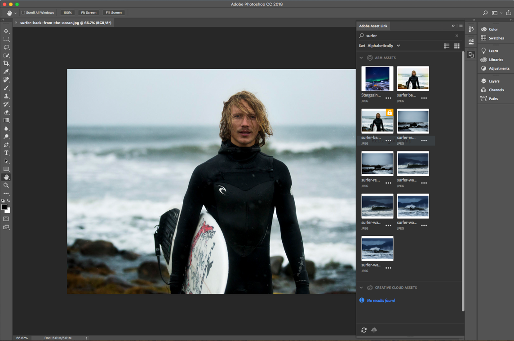
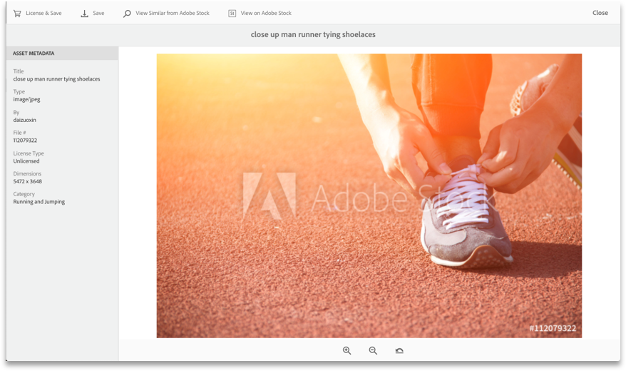
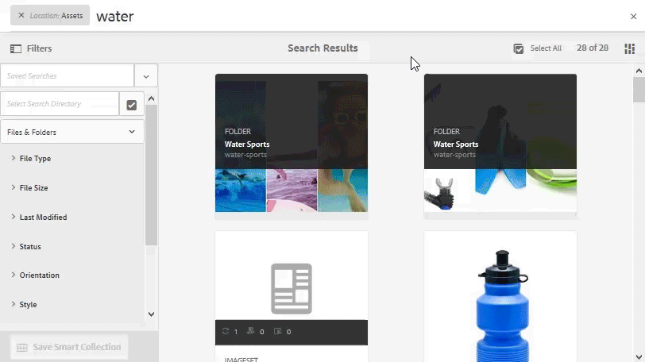

# [!DNL Adobe Experience Manager Assets] release notes {#aem-assets-release-notes}

Here are the key features and highlights of the [!DNL Adobe Experience Manager] 6.5 [!DNL Assets] release.

## Integration with [!DNL Adobe Creative Cloud] and creative workflows {#integration-with-adobe-creative-cloud-and-creative-workflows}

[!DNL Adobe Experience Manager] offers various ways to integrate with [!DNL Adobe Creative Cloud] and share assets for use in workflows where the creative and marketing or business teams collaborate closely. [!DNL Experience Manager] 6.5 continues to improve on the integration and streamlines it further to expose more opportunities and streamline the existing methods.

Read on to know the specific capabilities and integrations of [!DNL Experience Manager] 6.5 that you can use to best support your content velocity use cases.

### Adobe Asset Link {#aal}

[!DNL Adobe Asset Link] strengthens collaboration between creatives and marketers in the content creation process. Creatives can access content stored in [!DNL Experience Manager Assets], without leaving the apps that they are most familiar with. Creatives can seamlessly browse, search, check out, and check in assets using the in-app panel in [!DNL Adobe Photoshop], [!DNL Adobe Illustrator], and [!DNL Adobe InDesign] apps.

[!DNL Adobe Asset Link] is a part of [Creative Cloud for enterprise](https://www.adobe.com/creativecloud/business/enterprise.html) offering. For more information about it, including necessary configuration of your [!DNL Experience Manager] deployment, see [Adobe Asset Link](https://helpx.adobe.com/enterprise/using/adobe-asset-link.html).

### [!DNL Adobe Stock] integration {#stock}

Your organization can use its [!DNL Adobe Stock] enterprise plan within [!DNL Experience Manager Assets] to ensure that licensed assets are broadly available for your creative and marketing projects. You can quickly find, preview, and license [!DNL Adobe Stock] assets that are saved in Experience Manager, using the powerful DAM capabilities of [!DNL Experience Manager].

[!DNL Adobe Stock] service provides designers and businesses with access to millions of high-quality, curated, royalty-free photos, vectors, illustrations, videos, templates, and 3D assets for all their creative projects.

For more info, see [Use Adobe Stock assets in Experience Manager Assets](/help/assets/aem-assets-adobe-stock.md).

*Figure: Preview [!DNL Adobe Stock] image and license from within [!DNL Experience Manager Assets].*

*Figure: Search and filter the licensed [!DNL Adobe Stock] images in [!DNL Experience Manager].*

### Dynamic references in [!DNL Adobe InDesign] {#dynamic-references-in-indesign}

[!DNL Experience Manager Assets] used in [!DNL Adobe InDesign] files are dynamic. The references update automatically if the referenced assets moves in the repository. For more information, see [how to manage compound assets](/help/assets/managing-linked-subassets.md).

## Brand Portal capabilities {#brand-portal-capabilities}

[!DNL Experience Manager Assets Brand Portal] helps you easily acquire, effectively control, and securely distribute the approved assets to external vendors/agencies and internal business users across devices. It helps improve the efficiency of asset sharing, accelerates the time-to-market for assets, and eliminates the risk of non-compliant usage and unauthorized access.

For more information, see [What's new in Brand Portal](https://experienceleague.adobe.com/docs/experience-manager-brand-portal/using/introduction/whats-new.html?lang=en).

## Connected Assets {#connectedassets}

In large enterprises the infrastructure required to create websites can be distributed. At times, the website creation capabilities and the required digital assets reside in different silos.

[!DNL Experience Manager Sites] offers capabilities to create web pages and [!DNL Experience Manager Assets] is the Digital Asset Management (DAM) system that supplies the required assets for websites. [!DNL Experience Manager] now supports the above use case by integrating [!DNL Sites] and [!DNL Assets]. See [how to configure and use Connected Assets feature](/help/assets/use-assets-across-connected-assets-instances.md).

![Drag an asset from an [!DNL Experience Manager] deployment on a [!DNL Sites] page of a different [!DNL Experience Manager] deployment](assets/connected-assets-drag-and-drop-only.gif)

*Figure: Drag an asset from an [!DNL Experience Manager] deployment on a [!DNL Sites] page on a different [!DNL Experience Manager] deployment.*

## Dynamic Media {#dynamic-media}

[!DNL Dynamic Media] provides enhanced rich-media authoring and delivery in [!DNL Experience Manager Assets] to drive cutting-edge experiences that are immersive and personalized. By uploading a single high-quality primary asset and using Adobe's advanced cloud rendering and viewers, you can deliver any combination of renditions on-the-fly to support your organization’s media strategy.

For more details on new [!DNL Dynamic Media] features, see [Dynamic Media Release Notes](https://experienceleague.adobe.com/docs/dynamic-media-developer-resources/release-notes/s7rn2017.html).

### 360 video support {#video-support}

Manage your 360-video files directly in [!DNL Experience Manager] using the cutting edge viewers to deliver VR-experiences to desktops, mobile, and VR-headsets. For more information, see [Using 360 Video](/help/assets/360-video.md).

### Custom video thumbnails {#custom-video-thumbnails}

You can now customize the thumbnails for your video assets using frames from the video itself or other content stored in the DAM. For additional instructions, see [About Video Thumbnails](/help/assets/video.md#about-video-thumbnails-in-dynamic-media-scene-mode).

### Accessibility enhancements {#accessibility-enhancements}

[!DNL Dynamic Media] viewers now support enhanced accessibility features like Aria-support, screen-readers, and Alt-text. For additional details, see [Viewers Reference Guide](https://experienceleague.adobe.com/docs/dynamic-media-developer-resources/library/homeviewers.html).

## Search experience enhancement {#experience-enhancement-for-searching}

[!DNL Experience Manager] 6.5 onwards, marketers can discover the desired assets faster from the search results page. The search facets are updated with the number of assets even before applying the search filter. Seeing the expected count against the filter helps users navigate through the search results efficiently. For more information, see [Search assets in Experience Manager](../assets/search-assets.md).

*Figure: See the number of assets without filtering search results in search facets.*

## Usability enhancement {#usability-enhancement}

You can now select all the loaded assets within a folder or from a search result in one go. It helps you to manage multiple assets quickly. The check box selects all the assets that fit the scenario, say a search result, and not just the assets that are visible in the [!DNL Experience Manager] interface.

*Figure: Use the Select All option to select all the loaded assets in one click.*

## Metadata enhancements {#metadata-enhancements}

[!DNL Assets] let you create metadata schemas for asset folders, which define the layout and metadata displayed in folder properties pages. You can now assign a folder metadata schema to an existing folder or when creating a folder. For more information, see [Folder metadata schema](/help/assets/metadata-config.md#folder-metadata-schema).

When specifying cascading metadata, the choices can be loaded from a JSON file at the run-time, say instead of typing manually in the form. For more information, see [cascading metadata](/help/assets/metadata-schemas.md#cascading-metadata).

## Reporting enhancements {#reporting-enhancements}

The Content Fragments and link shares are included in the downloaded report now. For more information, see [Assets reports](/help/assets/asset-reports.md).
