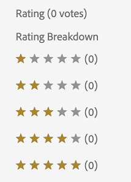
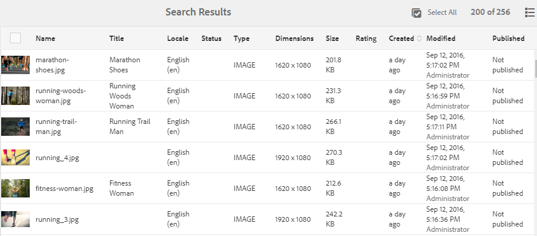
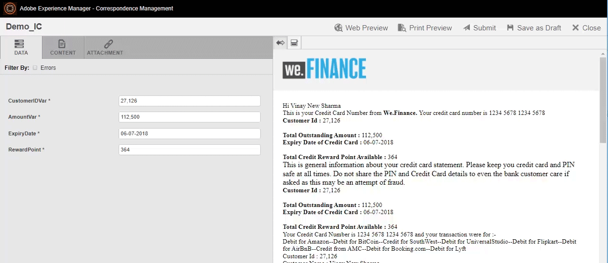
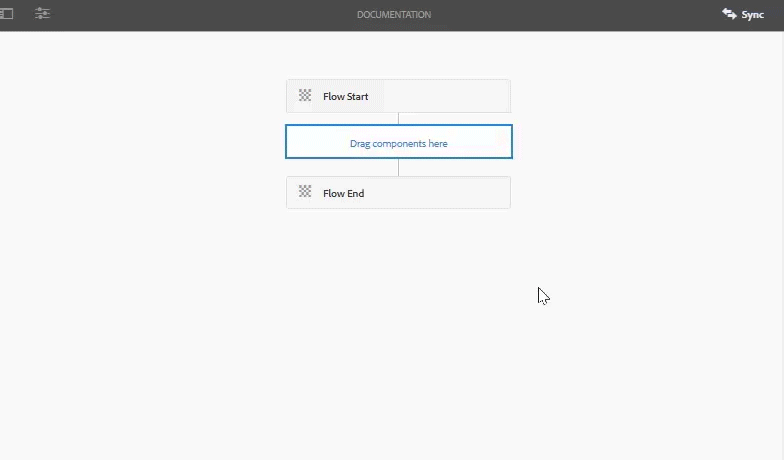
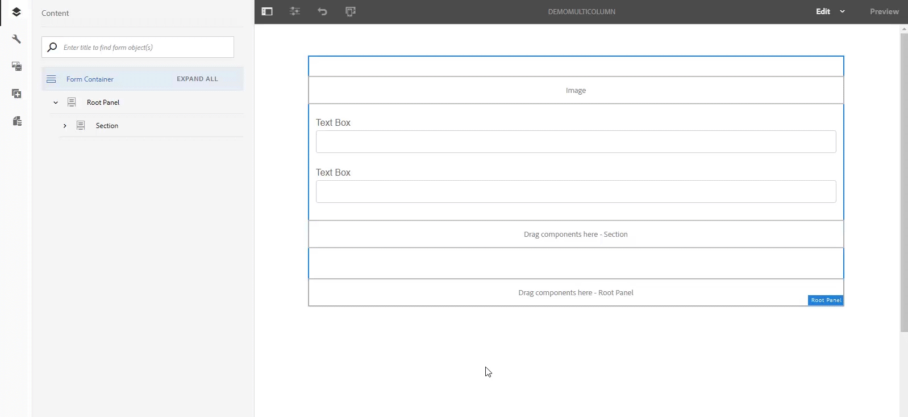

# What is new in [!DNL Adobe Experience Manager] 6.5 Service Pack 10 {#aem-whats-new-service-pack}

<!-- TBD: Downsample this image. We do not need as big an image since customers don't use as big a screen to view. Also, having a 700+ KB decorative image is bad for page load time.
-->

[!DNL Adobe Experience Manager] 6.5 Service Packs provide new features, customer-requested enhancements, and performance, stability, and security improvements at quarterly intervals. The quarterly availability makes it easy to access and adopt new features and innovations.

This article highlights the features included in the latest Service Pack, [key features included in the previous 6.5 Service Packs](#key-features-previous-service-packs), and the [key releases since the last Service Pack](#key-releases-since-last-sp) release.

## [!DNL Adobe Experience Manager Sites] {#aem-sites}

* **Enhanced [!DNL Content Fragment] Models and Editor**: You can now create complex and custom models for structured content using nested [!DNL Content Fragment] models. Content structures are modularized into basic elements that are modeled as sub-fragments. Higher-level fragments reference these sub-fragments. More data type enhancements such as advanced validation rules further enhance the flexibility of content modeling with [!DNL Content Fragments]. The [!DNL Experience Manager] [!DNL Content Fragment] editor supports nested fragment structures in a common editor session, with enhancements such as structure tree view and tabbed breadcrumb navigation through fragment hierarchies.

* **GraphQL API for [!DNL Content Fragments]**: The new GraphQL API is the standard method to deliver structured content in JSON format. GraphQL queries let clients request only the relevant content items to render an experience. Such a selection eliminates content over-delivery (possibility with HTTP REST APIs) that requires content parsing on the client side. GraphQL schemas are derived from [!DNL Content Fragment] models, and API responses are made in JSON format. In [!DNL Experience Manager] as a [!DNL Cloud Service], [GraphQL queries persist](https://experienceleague.adobe.com/docs/experience-manager-cloud-service/assets/admin/graphql-api-content-fragments.html#persisted-queries-caching) and process cache friendly GET requests. It is not yet possible in [!DNL Experience Manager] 6.5.

* **Hierarchy management and future preview**: Users now have an interface to access the content structures of their [!DNL Experience Manager] launches, including the ability to add and remove pages in a launch. This feature enhances the flexibility of [!DNL Experience Manager] launches to author content versions targeted for future publishing. [Time-warp feature](/help/sites-authoring/working-with-page-versions.md#timewarp) lets users preview launches as future content states.

* [!DNL Experience Manager] directly displays a list of all the content models under a folder without content authors having to navigate through the file structure. The functionality now requires fewer clicks and improves authoring efficiency.

* Pathfield in [!DNL Sites] editor allows authors to drag assets from [!DNL Content Finder].

* Platform provides a few accessibility enhancements. See [Platform updates](/help/release-notes/sp-release-notes.md#platform-65100).

## [!DNL Adobe Experience Manager Assets] {#aem-assets}

* [!DNL Experience Manager] extends the Connected Assets functionality to the use of [!DNL Dynamic Media] images in the applicable core components. See [use Connected Assets](/help/assets/use-assets-across-connected-assets-instances.md).

* When sharing individual assets and Collections as a link (using [!UICONTROL Link Sharing] dialog), users can choose whether to let the receiver download original assets, or their renditions, or both. See [Share assets via link](/help/assets/link-sharing.md).

  

* When users download assets shared with them as a link, they can choose to download the original assets, the renditions, or both.

* **Limit sub-assets generated**:
Administrators can limit the number of sub-assets that [!DNL Experience Manager] generates for compound assets such as PDF, PowerPoint, InDesign, and Keynote files.

  

* A new [!DNL Camera Raw] package is available that supports [!DNL Adobe Camera Raw] v10.4. See [process images using [!DNL Camera Raw]](/help/assets/camera-raw.md).

### [!DNL Dynamic Media] {#assets-dynamic-media}

* Many accessibility enhancements are done in [!DNL Dynamic Media] client so that a screen reader can present a more appropriate and useful description of the action or user interface. See [[!DNL Dynamic Media] updates](/help/release-notes/sp-release-notes.md#dynamic-media-65100).

## [!DNL Adobe Experience Manager Forms] {#aem-forms}

>[!NOTE]
>
>The add-on package of [!DNL Experience Manager Forms] is made available a week after the scheduled [!DNL Experience Manager] Service Pack release.

* You can now use Automated Forms Conversion service to [convert PDF Forms in French, German, and Spanish language](https://experienceleague.adobe.com/docs/aem-forms-automated-conversion-service/using/extending-the-default-meta-model.html?lang=en#language-specific-meta-model) to adaptive forms.

* **Error messages in Properties browser**: Added error messages for each property in the Adaptive Forms Properties browser. These messages help understand allowed values for a field.

* **Support to use the literal option to set value for a JSON type variable**: You can use literal option to set value for a JSON type variable in the set variable step of an AEM Workflow. The literal option allows you to specify a JSON in the form of a string.

* **Platform Updates**: [!DNL Adobe Experience Manager Forms] on JEE has added support for the following platforms:
  * [!DNL Adobe Acrobat 2020]
  * [!DNL Ubuntu 20.04]
  * [!DNL Open Office 4.1.10]
  * [!DNL Microsoft Office 2019]
  * [!DNL Microsoft Windows Server 2019]
  * [!DNL RHEL8]

* Added support for `GuideBridge#getGuidePath` API in [!DNL AEM Forms].

## Key features in previous [!DNL Experience Manager] 6.5 Service Packs {#key-features-previous-service-packs}

### Ability to restore deleted pages and tree (6.5.9.0) {#ability-to-restore-pages-tree}

You can now restore the deleted pages and the entire tree view on an [!DNL Experience Manager Sites] page.

### [!DNL Experience Manager Sites] {#aem-sites-previous-service-packs}

#### Sort the Live Copy pages available for rollout (6.5.8.0) {#sort-livecopy-pages}

You can now sort the Live Copy pages available for rollout using the [!UICONTROL Name], [!UICONTROL Last modified date], and [!UICONTROL Last rollout date] properties. The [!UICONTROL Last rollout date] for a page is a new property introduced in this release.

#### Availability of page moves and MSM rollouts as asynchronous operations (6.5.7.0) {#page-moves-msm-asynchronous}

You can now perform the page moves and MSM rollouts as asynchronous operations to reduce their impact on runtime performance. You can schedule the operations for immediate or later execution. The status of associated jobs and process steps is displayed in a console, which is helpful for monitoring large-scale MSM rollouts.

#### Availability of Page Move operation in asynchronous mode (6.5.6.0) {#page-move-asynchronous}

Page Move operation is now available in asynchronous mode. In addition to immediate execution, you can also schedule the Page Move operation for later execution.

#### Accessibility improvements (6.5.5.0) {#accessibility-sites}

* Improved error reporting by adding text information.

* Improved user interface focus during keyboard navigation.

* Improved contrast ratio for various user interface elements.

* Improved consistency of alt attributes for page images.

* Improved consistency of Accessible Rich Internet Applications (ARIA) labels.

* Improved Non-Visual Desktop Access (NVDA) capabilities.

* Improved screen reader support.

#### Other key enhancements (6.5.5.0) {#other-enhancements-sites}

* Anonymous access to CRXDE Lite is disallowed to enhance security. Instead, the users are directed to the login screen. See [Developing with CRXDE Lite](/help/sites-developing/developing-with-crxde-lite.md).

* When copying or pasting a page tree, you now have the option of either pasting the root page or pasting the root page with the subpages of the tree.

* [!DNL Adobe Experience Manager Experience Fragments] exported to [!DNL Adobe Target] workspaces now appear as unique offer types and offer sources in [!DNL Target].

* Multi Site Manager - The Publish trigger now deletes a component from the published page if a component is deleted from the source page.

* Multi Site Manager - When the name of a local component in a [!UICONTROL Live Copy] is identical to the name of a component in the blueprint and the component is rolled out from the blueprint, then the term `_msm_moved` is now added to the name of the local component.

#### Style System enhancements (6.5.4.0) {#style-system-enhancements}

You can now select styles within the component dialog using the enhanced Style System.

#### Performance improvements in various areas (6.5.4.0) {#performance-improvements}

* Reduced the time to load and initialize ContextHub within a site (`contexthub.kernel.js`). It results in faster page loads during a site visit.

* Reduced the time to refresh a page after dragging [!DNL Experience Fragments] to [!DNL Sites] Page Editor.

* Shortened the load time for entries on a [!DNL Sites] page with more than 200 live copies in **[!UICONTROL Live Copy Overview]**.

* Improved handling of incomplete or invalid URLs. Such URLs can slow the Template Editor.

### [!DNL Adobe Experience Manager Assets] {#aem-assets-previous-service-packs}

* Updated the naming of Chinese locales and regions relating to Hong Kong, Macau, and Taiwan, to make them consistent with Chinese social and political views (6.5.9.0).

* An optional configuration is introduced to change casing in the email IDs in ACP API response from [!DNL Adobe Experience Manager] (6.5.9.0).

   ![configuration to change email IDs to lowercase in ACP response from [!DNL Experience Manager]](assets/email-lowcase-config.png)

* Contrast of text and icons against the background is enhanced for various features. This implementation of Web Content Accessibility Guidelines (WCAG) guidelines makes [!DNL Assets] more accessible for users with limited vision and perception of color. See [accessibility enhancements in [!DNL Assets]](sp-release-notes.md#assets-accessibility-6590) (6.5.9.0).
* When using [Connected Assets functionality](/help/assets/use-assets-across-connected-assets-instances.md), you can now view a list of all the [!DNL Sites] pages that use the asset. These references to an asset are available in an asset's [!UICONTROL Properties] page. This allows administrators, marketers, and librarians a complete view of assets usage, allowing for better tracking, management, and brand consistency (6.5.8.0).

* When deleting an asset that is referenced in a web page, [!DNL Experience Manager] displays a warning. You can force delete a referenced asset or check and modify the references that are displayed in the [!DNL Properties] page of the asset. Clicking the references opens the local and remote [!DNL Sites] pages (6.5.8.0).

* [!DNL Assets] and [!DNL Dynamic Media] provide multiple accessibility enhancements. The enhancements are related to keyboard navigation, use of screen readers, similar enhancements to enable use of assistive technologies (AT). See [[!DNL Assets] enhancements](/help/release-notes/sp-release-notes.md#assets-6570) and [[!DNL Dynamic Media] enhancements](/help/release-notes/sp-release-notes.md#dynamic-media-6570) (6.5.7.0)

* Users can sort digital assets in Card and Column views (6.5.7.0).

#### Accessibility enhancements (6.5.6.0) {#accessibility-assets-6560}

* **Enhanced user interface focus during keyboard navigation**, for example focus on:

  * `x` icon in [!UICONTROL Version Preview] dialog of an asset in [!UICONTROL Timeline].

  * Actionable user interface options.

  * Email field on the [!UICONTROL Share Link] dialog, and field to add closed user group in [!UICONTROL Permission] tab of folder [!UICONTROL Properties].
  
* **Enhanced functionality using keyboard keys**

  Users can use keyboard keys to drag controls in Metadata Schema Form editor in browse mode of screen reader.

* **Enhanced usability for screen reader users**, due to the following:

  * Screen readers announce the purpose of video and audio players.

  * Screen readers announce the purpose of the user interface options to remove the tags selected using [!UICONTROL Tags selection dialog] on asset [!UICONTROL Properties].

  * Screen readers announce the row headers and row items of tables, so users know which entries belong to the same row.

  * Descriptive and meaningful page title of search page.
  
  * Screen readers announce the options in search filter panel as expandable accordions.
  
#### Other enhancements in [!DNL Assets] (6.5.6.0) {#other-enhancements-assets-6560}

* User groups associated with folders (private and non-private) are now removed from the repository on [deletion of those folders](/help/assets/private-folder.md#delete-private-folder). However, the existing redundant, orphaned, unused, and auto-generated user groups can be removed from the repository using JMX.

#### Accessibility enhancements in [!DNL Assets] (6.5.5.0) {#assets-accessibility}

[!DNL Experience Manager Assets] is now more accessible in compliance with Web Content Accessibility Guidelines (WCAG). The accessibility has improved because of the following enhancements:

* Many user interface elements, controls, pages, and dialogs are screen reader friendly.

* Many user interface elements, controls, and input form fields are accessible using keyboard.

* Color and contrast of some user interface elements are updated so that users with limited vision or users without perception of color can distinguish these user interface elements. For example, the color of star rating icons (such as in [!UICONTROL Rating] section of [!UICONTROL Advanced] tab in asset [!UICONTROL Properties] or in card view) is changed for appropriate contrast.

  

#### Enhanced exception handling (6.5.5.0) {#exception-handling}

[!DNL Assets] user interface flow has better exception handling. If an asset does not have a type for its dimension, the observed exception is recorded in the log files.

#### Support for 3D assets in [!DNL Dynamic Media] (6.5.5.0) {#support-for-3d}

Support for 3D images in [!DNL Dynamic Media] enables customers to publish and add 3D content to web pages and applications. The support includes:

* Publish common 3D asset formats and generate an asset URL that can be used in web pages and other applications.

* A 3D Web Viewer, powered by [!DNL Adobe Dimension], to interactively view the published 3D assets.

* Publish and view common 3D assets on [!DNL Experience Manager Sites] pages using the [!DNL Sites] WCM component.

#### Configure [!DNL Experience Manager Assets] with [!DNL Brand Portal] (6.5.4.0) {#configure-assets-bp}

The authorization channel between [!DNL Experience Manager Assets] and [!DNL Brand Portal] is changed. Earlier, [!DNL Brand Portal] was configured in Classic UI via Legacy OAuth Gateway, which uses the JWT token exchange to obtain an IMS Access token for authorization. [!DNL Experience Manager Assets] is now configured with [!DNL Brand Portal] through [!DNL Adobe I/O], which procures an IMS token for authorization of your [!DNL Brand Portal] tenant.

The steps to configure [!DNL Experience Manager Assets] with [!DNL Brand Portal] are different depending on your [!DNL Experience Manager] version, and whether you are configuring for the first time, or upgrading the existing configurations. See [Configure Experience Manager Assets with Brand Portal](https://experienceleague.adobe.com/docs/experience-manager-brand-portal/using/publish/configure-aem-assets-with-brand-portal.html) for details.

#### Accessibility enhancements (6.5.4.0) {#accessibility-enhancements-6540}

[!DNL Experience Manager Assets] includes the following accessibility enhancements:

* Arrow keys on keyboard can be used to move and pan areas within zoomed images. For more information, see [preview assets using keyboard keys only](../assets/manage-assets.md#previewing-assets).

* The mixed state checkboxes (in which unless you select all the nested predicates the first-level checkboxes are not selected and are stricken through) in Filters panel are readable by screen readers.

* Date and time format constraints are provided in field labels of date fields, to enable the users to enter the date in correct format using keyboard.
For example, `On Time (MM-DD-YYYY HH:mm)`. Here MM is month in two-digit format, YYYY is year, DD is day in two-digit format, HH is hour in 24-hour military format, and mm is minute.

* Screen readers announce the option to remove selected tags (`X` symbol) and the number of the selected tags.

#### Sortable column for Created date of assets in list view (6.5.3.0) {#sortable-date-created-column}

A new sortable column for created date of assets is added in DAM list view and on asset search results in list view.

#### Visual search for [!DNL Adobe Experience Manager Assets] (6.5.2.0) {#visual-search}

[!DNL Assets] users can search visually similar images. Experience Manager displays the smart tagged images from the DAM repository that are similar to a user-selected image. See [Visual search](../assets/search-assets.md).

### Dynamic Media {#dynamic-media-previous-service-packs}

* [[!DNL Dynamic Media] is more accessible](sp-release-notes.md#assets-accessibility-6590) in terms of:

  * Ease of usage with keyboard keys.
  * Contrast (with background) of text, placeholder text, and controls in various editors.
  * Accessibility and narration by screen readers.

* Deliver best quality images efficiently on devices with high-resolution displays and constrained network bandwidth, with Smart Imaging DPR (Device Pixel Ratio) and network bandwidth optimization. See [Smart imaging FAQs](/help/assets/imaging-faq.md) (6.5.9.0).

* [!DNL Dynamic Media] delivery (`fmt` URL modifier) now supports next-generation image format AVIF (AV1 Image format). For more details and timeline, see [image serving and rendering API fmt](https://experienceleague.adobe.com/docs/dynamic-media-developer-resources/image-serving-api/image-serving-api/http-protocol-reference/command-reference/r-is-http-fmt.html) (6.5.9.0).

#### Invalidate CDN cached content (6.5.6.0) {#invalidate-cdn-cached-content}

You can now use the [!DNL Dynamic Media] user interface to invalidate Content Delivery Network (CDN) cached content. As a result, the updated assets are available instantly instead of waiting for the cache to expire. You can invalidate CDN by:

* Creating a CDN invalidation template: Selecting assets and form associated template-based URLs

* Selecting assets and associated presets through asset picker

* Adding complete asset URLs

#### Selective publishing of assets to [!DNL Experience Manager] and [!DNL Dynamic Media] (6.5.6.0) {#selective-publishing}

You can now choose to selectively publish or unpublish assets to either [!DNL Experience Manager] or [!DNL Dynamic Media] using [!UICONTROL Quick Publish] or [!UICONTROL Manage Publication] wizard. You can also set the `Publish` or `Unpublish` mode at folder level.

#### Smart Imaging for Dynamic Media {#smart-imaging}

Smart imaging uses each user's unique viewing characteristics to automatically serve the right images optimized for their experience, resulting in better performance and engagement. Smart imaging works with your existing image presets and uses intelligence at the last millisecond of delivery to further reduce image file size based on browser or network connection speed. See [Smart Imaging](../assets/imaging-faq.md).

#### Smart crop in video profiles for Dynamic Media (6.5.3.0) {#smart-crop-video}

Smart crop for video – an optional feature available in Video Profiles – uses Adobe Sensei to automatically detect and crop the focal point in any adaptive video or progressive video, regardless of size. See [about using smart crop in video profiles](../assets/video-profiles.md).

### Experience Manager Forms {#aem-forms-previous-service-packs}

#### Support for [!DNL Azul Zulu OpenJDK] (6.5.9.0) {#support-azul-zulu}

You can now develop and operate applications with [!DNL Azul Zulu] builds of [!DNL OpenJDK] for [!DNL Experience Manager Forms] on OSGi deployments. For more information, see [Experience Manager 6.5 Service Pack 9 Release Notes](sp-release-notes.md) and [Technical Requirements](../sites-deploying/technical-requirements.md).

#### Ability to send a notification email to a group using [!UICONTROL Assign Task] (6.5.9.0) {#group-notification-email}

You can now send a notification email to a group email address using the Assign Task workflow step.

#### Ability to retrieve an Interactive Communication draft after modifying the source Interactive Communication (6.5.9.0) {#retrieve-draft-after-source-modifications}

You can now retrieve an interactive communication saved as a draft after you change the source Interactive Communication.

#### Set custom domain name for loading, rendering, and validating the reCAPTCHA service (6.5.9.0) {#set-custom-domain-name-recaptcha}

reCAPTCHA service uses `https://www.recaptcha.net/` as the default domain. You can now modify the settings to set `https://www.google.com/` or any custom domain name to load, render, and validate the reCAPTCHA service.

#### Input data enhancements for [!UICONTROL Invoke Form Data Model Service] workflow step (6.5.9.0) {#input-data-enhancements-fdm}

When you select a form data model and a service in [!UICONTROL Invoke Form Data Model Service] workflow step, you specify service arguments for input data.

If you select [!UICONTROL Relative to Payload] option to attach a file as a service argument, you can now specify the folder path that contains the file instead of the actual file name. Defining the folder name, instead of the file attachment name, enables you to reuse workflow models. You do not limit the workflow model to a single file attachment name.

#### Ability to use multiple master pages in a Document of Record template (6.5.9.0) {#use-multiple-master-pages-dor-template}

You can now use multiple master pages in a Document of Record template. As a result, you can now have different header, footer, fonts, logo information on the title page and other pages of the template.

#### Support page breaks in Document of Record (6.5.9.0) {#support-page-breaks-dor}

You can now add page breaks to a Document of Record. As a result, if a panel breaks within pages, you can add a page break to move the panel to a new page in a Document of Record.

#### Show or hide CAPTCHA component in an adaptive form based on rules (6.5.8.0) {#show-hide-captcha}

You can now validate CAPTCHA either on adaptive form submission or on user action. You can also add conditions to validate CAPTCHA on a user action and show or hide the CAPTCHA component in an adaptive form based on rules.

#### Add custom CAPTCHA services (6.5.8.0) {#add-custom-captcha-services}

[!DNL Experience Manager Forms] provides out of the box support to use Google reCAPTCHA (A separate license of Google reCAPTCHA APIs is required) as a CAPTCHA validation service. You can also use a custom CAPTCHA service to validate CAPTCHAs.

#### Other enhancements (6.5.8.0) {#other-enhancements-forms-6580}

* Improved accessibility of the [!DNL Experience Manager Forms] Date Picker component.

* Added support to generate an Interactive Communication in PCL format using the PrintChannel API.

* When performing a PDFG conversion, you can now enable or disable the [!DNL Experience Manager Forms] registry changes for custom bookmark generation.

#### Performance improvements (6.5.7.0) {#performance-improvements-forms}

[!DNL Experience Manager] 6.5 Service Pack 7 Forms improves the performance for:

* Validating the field values on the server when you submit an adaptive form.

* Converting a PDF form to an adaptive form using the [!DNL Automated Forms Conversion service].

#### Support for Microsoft SQL Server 2016 Always On availability groups for High Availability (6.5.7.0) {#always-on-availability-groups}

[!DNL Experience Manager Forms] now supports [!DNL Microsoft] SQL Server 2016 Always On availability groups for High Availability for OSGi deployments.

#### Form data model HTTP client configuration to optimize performance (6.5.7.0) {#fdm-http-client-config}

[!DNL Experience Manager Forms] form data model when integrating with RESTful web services as the data source now includes HTTP client configurations for performance optimization. See [Configure data sources](../../help/forms/using/configure-data-sources.md#fdm-http-client-configuration).

#### Availability of Reset Option for each component in the Layout mode (6.5.7.0) {#reset-option-layout-mode}

You can now use the reset option for each component in Layout mode of an adaptive form. When you define a multicolumn layout for a panel, you can use this feature to reset individual components within the panel. See [Use layout mode to resize components](../../help/forms/using/resize-using-layout-mode.md#resize-components).

#### Prefill an adaptive form at the client (6.5.6.0) {#prefill-merge-data-at-client}

When you prefill an adaptive form, the [!DNL Experience Manager Forms] server merges data with an adaptive form and delivers the filled form to you. By default, the data merge action takes place at the server.
You can now configure the [!DNL Experience Manager Forms] server to [perform the data merge action at the client](../../help/forms/using/prepopulate-adaptive-form-fields.md) instead of the server. It significantly reduces the time required to prefill and render adaptive forms.

#### Form data model integration with RESTful APIs on a server with two-way SSL implementation (6.5.6.0) {#fdm-integration-rest-apis-two-way-ssl}

[!DNL Experience Manager Forms] form data model can now [integrate with RESTful APIs on a server that has a two-way SSL implemented on it](../../help/forms/using/configure-data-sources.md).

#### Added support for [!DNL Adobe Sign] Text Tags in Automated Forms Conversion Service (6.5.6.0) {#sign-integration-acroform-afcs}

If an AcroForm includes [!DNL Adobe Sign] Text Tags, those fields are now recognized and represented as [!DNL Adobe Sign] fields in the adaptive form converted using [!DNL Automated Forms Conversion service]. A signer can fill such fields while signing the adaptive form.

#### Support to convert colored PDF forms to adaptive forms (6.5.6.0) {#colored-PDF-forms}

You can use [!DNL Automated Forms Conversion service] to convert colored PDF forms to adaptive forms.

#### Support for SMB 2 and SMB 3 protocols (6.5.6.0) {#smb-support}

[!DNL Experience Manager Forms] now supports SMB 2 and SMB 3 protocols.

#### Enhanced caching for translated adaptive form pages (6.5.6.0) {#enhanced-caching-translated-adaptive-forms}

You can now specify [locale as a selector in the adaptive form URL instead of an argument in adaptive form URL](../../help/forms/using/supporting-new-language-localization.md). It helps cache translated adaptive forms on [!DNL Experience Manager Dispatcher]. Caching translated adaptive form was not possible in previous versions. For detailed information about configuring caching for using locale as a selector in the adaptive form URL, see [Configure adaptive form cache at dispatcher](../../help/forms/using/configure-adaptive-forms-cache.md).

#### Save output of form data model service to a variable (6.5.6.0) {#save-fdm-service-to-variable}

Form data model allows you to save output of a form data model service to a variable. [!DNL Experience Manager Forms] now automatically maps the type of the form data model service to the type of variable.

#### Attach multiple files for File Attachment component (6.5.6.0) {#attach-multiple-files}

You can now [attach multiple files](../../help/forms/using/introduction-forms-authoring.md) to the [!UICONTROL File Attachment] component of adaptive forms.

#### Customize the Adobe Experience Manager Inbox columns (6.5.5.0) {#customize-aem-inbox-columns}

You can customize an [!DNL Experience Manager] Inbox to change the default title of a column, reorder the position of a column, and display additional columns based on the data of a workflow. Members of `administrators` or `workflow-administrators` group can customize the columns. For more information, see [Admin Control](../sites-authoring/inbox.md#inbox-admin-control).

#### Save Interactive Communications as a draft (6.5.5.0) {#save-as-draft}

You can use the Agent UI to save one or more drafts for each Interactive Communication and retrieve the draft later to continue working on it. You can specify a different name for each draft to identify it. For more information, see [Save Interactive Communications as a draft](../forms/using/prepare-send-interactive-communication.md#save-as-draft).

#### [!DNL Oracle WebLogic] application server support (6.5.5.0) {#weblogic-support}

Adobe Experience Manager Forms has added support for [!DNL Oracle WebLogic 12] for Adobe Experience Manager Forms on JEE. You can upgrade from a previous version or set up a new Experience Manager 6.5 Forms on JEE server on [!DNL Oracle WebLogic] 12.2.1.4 and later. Later corresponds to the minor version changes, where x in 12.2.1.x is replaced with a version number.

#### Accessibility improvements (6.5.5.0) {#accessibility-improvements}

Adobe Experience Manager Forms includes the following accessibility enhancements:

* When a user previews an adaptive form as an HTML form, the [!UICONTROL Scribble Signature] field retains the tab focus.

* The error messages displayed on submitting an adaptive form now contain the `aria-describedBy` attribute. The attribute is attached to the fields referred in the error message. The `aria-describedby` attribute indicates IDs of the elements that describe the object. It helps establish a relationship between widgets or groups and text that described them.

* If an adaptive form has some mandatory fields, the mandatory attribute is set to `True` for such fields in ARIA accessibility schema.

#### X-509 certificate-based authentication for SOAP-based web services in form data model (6.5.5.0) {#x509-based-authentication-soap}

Form data model now supports X-509 certificate-based authentication while using SOAP web services as the data source. For more information, see [Configure SOAP web services](../forms/using/configure-data-sources.md#configure-soap-web-services).

#### Other key improvements (6.5.5.0) {#other-improvements}

* Experience Manager 6.5 Forms on JEE Document Security is now based on [!DNL Apache Struts 2].

* Added support for [!DNL Oracle Real Applications Cluster (RAC) 19c].

#### Generate printable output in Experience Manager Forms workflows (6.5.4.0) {#generate-printable-output}

The Generate Printable Output workflow step enables you to integrate a source template file with a data file. This integration enables you to print or save different copies of the template file. The step generates a PCL, PostScript, ZPL, IPL, TPCL, or DPL output. For more information on this feature, see [Forms-centric workflow on OSGi - Step Reference](../forms/using/aem-forms-workflow-step-reference.md).

#### Multi-column support for adaptive forms and interactive communications in Layout mode (6.5.4.0) {#multi-column-adaptive-forms}

You can now define the number of columns for a panel in adaptive forms and interactive communications. Switch to layout mode to use the new multi-column option. For more information, see [Use Layout mode to resize components](../forms/using/resize-using-layout-mode.md).

#### Experience Manager Inbox customizations (6.5.4.0) {#aem-inbox}

The new Admin Control option enables the administrators to:

* Customize header text and logo.

* Control the display of navigation links available in the header.

The Admin Control option is visible only to the members of the `administrators` or `workflow-administrators` group. For more information on this feature, see [Your Inbox](../sites-authoring/inbox.md).

#### Rich text support in HTML5 forms (6.5.4.0) {#rich-text-support}

Convert a text field in an XFA form to a rich text field in an HTML5 form. For more information, see [Designing form templates for HTML5 forms](../forms/using/designing-form-template.md).

#### Accessibility enhancements (6.5.4.0) {#forms-accessibility-enhancements-6540}

Experience Manager Forms includes the following accessibility enhancements:

* Screen readers announce checkboxes, links, Date Picker, and Date Input fields correctly in an adaptive form.

* Each page of an adaptive form now includes one title and one main landmark label.

#### Share and request access to Inbox items of an Experience Manager Forms user (6.5.3.0) {#share-request-access}

You can share your Inbox items with another user. Once another user gains access to your Inbox items, the user can claim and take appropriate action on shared items. Similarly, you can request access to Inbox items from other users. See [Share and request access to Inbox items of a user](../forms/using/configure-shared-queues-osgi.md).

#### Configure the out-of-office settings for Inbox items of an Experience Manager Forms user (6.5.3.0) {#configure-out-of-office}

If you plan to be out of the office, you can specify what happens to items that are assigned to you for that period.
You have the option of specifying a start date and time and an end date and time for your out-of-office settings to be in effect. You can set a default person to whom all of your items are sent. See [Configure Out of Office settings](../forms/using/configure-out-of-office-settings.md).

#### Generate multiple interactive communications using Batch API for Experience Manager Forms (6.5.3.0) {#generate-multiple-ic}

You can use the Batch API to produce multiple interactive communications from a template. The template is an interactive communication without any data. The Batch API combines data with a template to produce an interactive communication. The API is useful in the mass production of interactive communications. For example, telephone bills, credit card statements for multiple customers. See [Generate multiple interactive communications using Batch API](../forms/using/generate-multiple-interactive-communication-using-batch-api.md).

<!-- TBD: Check if the wider team released anything in FY21.
-->

## Key releases since [!DNL Adobe Experience Manager] 6.5 SP9 {#key-releases-since-last-sp}

Between May 27, 2021 and August 26, 2021, Adobe released the following, in addition to the Service Packs:

* [!DNL Adobe Experience Manager] as a Cloud Service [2021.6.0](https://experienceleague.adobe.com/docs/experience-manager-cloud-service/release-notes/release-notes/2021/release-notes-2021-6-0.html), [2021.7.0](https://experienceleague.adobe.com/docs/experience-manager-cloud-service/release-notes/release-notes/2021/release-notes-2021-7-0.html), and [2021.8.0](https://experienceleague.adobe.com/docs/experience-manager-cloud-service/release-notes/release-notes/release-notes-current.html?lang=en).

* [[!DNL Experience Manager] desktop app 2.1 (2.1.3.3)](https://experienceleague.adobe.com/docs/experience-manager-desktop-app/using/release-notes.html).

* [Experience Manager Screens: Feature Pack 202105](https://experienceleague.adobe.com/docs/experience-manager-screens/user-guide/release-notes/release-notes-fp-202105.html?lang=en)

>[!MORELIKETHIS]
>
>* [[!DNL Experience Manager] 6.5 documentation](https://experienceleague.adobe.com/docs/experience-manager-65.html)
>* [General availability release notes for [!DNL Experience Manager] 6.5](release-notes.md)
>* [Service pack release notes for [!DNL Experience Manager] 6.5](sp-release-notes.md)
