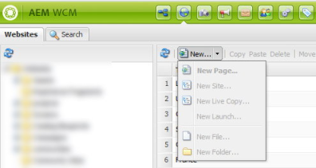
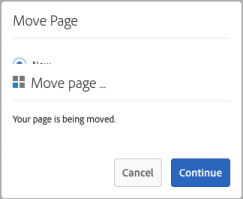
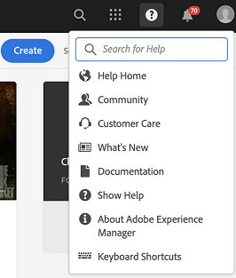
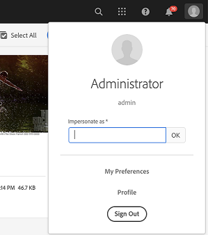

# Hotfixes and Feature Packs included in the previous service packs {#hotfixes-and-feature-packs-included-in-previous-service-packs}

## [!DNL Adobe Experience Manager] 6.5.9.0 {#experience-manager-6590}

[!DNL Adobe Experience Manager] 6.5.9.0 includes new features, key customer-requested enhancements, and performance, stability, and security improvements, that are released since the availability of 6.5 release in April 2019. The service pack is installed on [!DNL Adobe Experience Manager] 6.5.

The key features and enhancements introduced in [!DNL Adobe Experience Manager] 6.5.9.0 are:

* [!DNL Experience Manager Sites] Dynamic Media Foundation component now lets you turn on or off the optimization for higher resolution devices when using responsive Image Preset or Smart Crop.

* To improve performance, the `hidden=false` condition is moved from JCR query to [!UICONTROL QueryBuilder] evaluator. To verify that a hidden predicate is working after the change, [!DNL Experience Manager] checks that any hidden folder is not displayed.

* Ability to restore deleted pages and tree on an [!DNL Experience Manager Sites] page.

* Support for a new user to refresh the access token using a refresh token for mailer configuration service.

* [Support for SMTP XOAUTH2](/help/sites-administering/notification.md#setting-up-oauth) mechanism for the mail configuration service.

* Support for [!DNL MongoDB] versions 4.2 and 4.4.

* Occurrences of names related to Hong Kong, Macau, and Taiwan are updated as per the new naming conventions for Chinese locales and regions.

* Accessibility enhancements in [!DNL Experience Manager] [[!DNL Assets]](#assets-accessibility-6590) and [[!DNL Dynamic Media]](#accessibility-dm-6590).

* Smart Imaging DPR (Device Pixel Ratio) and network bandwidth optimization lets you deliver best quality images efficiently; on devices with high-resolution displays and constrained network bandwidth. For details and timeline, see [smart imaging FAQs](/help/assets/imaging-faq.md).

* [!DNL Dynamic Media] delivery (`fmt` URL modifier) supports the next-generation image format AVIF (AV1 Image format). For more details and timeline, see [image serving and rendering API fmt](https://experienceleague.adobe.com/docs/dynamic-media-developer-resources/image-serving-api/image-serving-api/http-protocol-reference/command-reference/r-is-http-fmt.html).

* Ability to send a notification email to a group using [!UICONTROL Assign Task] workflow step.

* Ability to retrieve an Interactive Communication draft after modifying the source Interactive Communication.

* Set custom domain name for loading, rendering, and validating the reCAPTCHA service in [!DNL Experience Manager Forms].

* Input data enhancements for [!UICONTROL Invoke Form Data Model Service] workflow step.

* Ability to use multiple master pages in a Document of Record template in [!DNL Experience Manager Forms].

* Support page breaks in Document of Record in [!DNL Experience Manager Forms].

* The built-in repository (Apache Jackrabbit Oak) is updated to 1.22.7.

For a complete list of features and enhancements introduced in [!DNL Experience Manager] 6.5.9.0, see [what is new in [!DNL Adobe Experience Manager] 6.5 Service Pack 9](new-features-latest-service-pack.md).

>[!NOTE]
>
>Starting with Service Pack 9, [!DNL Experience Manager] customers can develop and operate their [!DNL Experience Manager] applications with distributions of the [!DNL Azul Zulu] builds of OpenJDK, standards-compliant with Java™ SE.
>Support for the [!DNL Azul Zulu] JDKs is also provided by Adobe to the [!DNL Experience Manager] customers.
>You can download the relevant versions of the [!DNL Azul Zulu] JDKs from [Adobe Software Distribution](https://experience.adobe.com/#/downloads/content/software-distribution/en/aem.html).
>The usage rights for the Oracle Java™ technology, as distributed by Adobe, will expire by the end of December 2022. [!DNL Experience Manager] customers are encouraged to plan and implement usage for the [!DNL Azul Zulu] JDKs latest by this date. For more information about the usage of the [!DNL Oracle Java™] technology and [!DNL Azul Zulu] technology, refer to the associated [FAQs](https://experienceleague.adobe.com/docs/experience-manager-65/assets/adobe-azul-openjdk-license-agreement.pdf).

The following is the list of fixes provided in [!DNL Experience Manager] 6.5.9.0 release.

### [!DNL Sites] {#sites-6590}

* Published pages with Authentication Requirement property enabled do not redirect to the login page and return 404 error message (NPR-36354).

* When creating a hyperlink, the option to search a link does not work in the text component (NPR-35849).

* A traversal query is triggered on using the `com.day.cq.wcm.commons.ReferenceSearch` API. It impacts performance of [!DNL Experience Manager] server (NPR-36407).

* Nested layout container inside another resized layout container shows an incorrect number of columns for its child components, resulting in these components not being aligned to the grid (NPR-36359).

* External Linkchecker displays valid external links as invalid links (NPR-36289).

* After displaying references for some time, the references panel starts showing an error message (NPR-36167).

* When moving a component, the automatically created parsys, does not have the `sling:resourceType` node (NPR-36165).

* When trying to sync a livecopy (while using roll-out configs [!UICONTROL Activate on Blueprint activation] and [!UICONTROL De-activate on Blueprint activation]) if a component is deleted in the livecopy master, the sync fails and a `NullPointerException` is logged (NPR-36127).

* When a user types in improvised text for tag (tag that does not exist on the system) and presses Enter, the tag appears under the field but when the Content Fragment is saved and reopened, the improvised tag disappears (NPR-36132).

* Inbox does not have option display the status of Asynchronous Operations (NPR-36104).

* A duplicate component is created after restoring inheritance (NPR-36000).

* When using the `RemoteContentRenderingService`, the request to the `RemoteContentRendererRequestHandler.getRequest` always includes the root page for the  `ComponentExporter`, but does not include the requested page if it is not included with the root model based on the traversal depth and filtering options set. The request must always include the requested page so that the SPA has enough information to render a response (NPR-35961).

* onTime/offTime items do not activate/deactivate on the expected onTime/offTime (NPR-35936).

* When you publish a page containing an Experience Fragment that has no `cq:lastModified` property, a `NullPointerException` occurs (NPR-35914).

* When trying to resize a component within a container, resizing back to the original size is not possible. When the component container size is reduced, it is not possible to set the size back to the original (NPR-35809).

* In the rollout dialog, either triggered in the editor or from the Live Copy Overview, the status icons for detached, suspended, or not created pages is wrong (NPR-35691).

* Multi-Site Manager rollout on-page properties of master ignore rollout page and subpages checkbox (NPR-35634).

* Restore tree functionality, available in the classic UI is missing from Touch UI (CQ-4315352, CQ-4309415).

* Issues while reverting inheritance and rolling out page on an [!DNL Experience Manager Sites] page (NPR-36033).

### [!DNL Assets] {#assets-6590}

The following user experience enhancements are done in [!DNL Assets]:

* To view assets not sorted based on any of the [!UICONTROL Create], [!UICONTROL Modify], or [!UICONTROL Name] parameters, [!DNL Adobe Experience Manager] offers a [!UICONTROL None] option within [!UICONTROL Sort by] options. The [!UICONTROL None] option ensures that the assets in the Assets user interface (in Card, Column, and Insights view) are in the same order as they exist in JCR node (NPR-36356).

* To make the email ID lowercase in ACP API response from [!DNL Adobe Experience Manager] an optional setting is introduced; as the [!DNL Adobe Asset Link] users could not check-in assets if their ID was not having all characters in lowercase. The [!DNL Adobe Asset Link] panel consumes the ACP API response from [!DNL Adobe Experience Manager] (CQ-4317704).

The following accessibility enhancements are available in [!DNL Assets] as part of service pack 9:

Contrast (with background) of the following text and icons is improved, so that the users with limited vision and perception of color can comprehend:
  
* Asset title on [!UICONTROL Properties] page (NPR-35967).
* Star rating icons in [!UICONTROL Rating] sections at various places (NPR-36009).
* Text on the asset and folder Card view (NPR-35966).
* Placeholder text on the [!UICONTROL Timeline] view (NPR-35965).
* Asset names on the asset search results (NPR-35964).
* Placeholder text on the [!UICONTROL Link Sharing] dialog (NPR-35963).
* [!UICONTROL Metadata], [!UICONTROL Status], and [!UICONTROL Other] text in [!UICONTROL List] option in the [!UICONTROL View Settings] dialog (NPR-35910).
* [!UICONTROL Location] and [!UICONTROL Type to search] placeholder texts in global search (NPR-35909).
* Expand and collapse icons under [!UICONTROL Content Tree] (NPR-35908).
* The [!UICONTROL Assets] text on the page where assets folders are displayed (NPR-35905).
* Text in [!UICONTROL Asset Metadata], [!UICONTROL Usage Statistics] within [!UICONTROL Overview] option in asset details page (NPR-35904).
* Text for shortcut keys for [!UICONTROL properties] and [!UICONTROL edit] options in asset details page (NPR-35904).

The following bug fixes are available in [!DNL Assets] as part of service pack 9:

* The tags created from within a tag selection element in a [!UICONTROL Folder Metadata Schema] form are not saved (NPR-36119).

* When a small ellipse is used to annotate assets, the ellipse overlaps with the number of the annotation in the print version (NPR-36114).

* Sometime, in Column view, [!DNL Experience Manager] does not prompt for duplicate asset conflict when a duplicate asset is uploaded (NPR-36048).

* Share Link dialog does not close by clicking close button if it is opened and no changes are made (NPR-36030).

* When multiple assets are selected to update the properties, sometimes either an error occurs, or properties of a deselected asset get updated (NPR-36002).

* When on asset upload whitespaces are added in the beginning or end of asset file names, with remaining characters same as the name of an existing asset in the repository, the existing asset is replaced without logging any error (NPR-36001).

* When video is played in the asset details page, the play and pause options do not function (NPR-35999).

* When unpublishing assets in bulk, Brand Portal generates an error suggesting that the request URI is too long (NPR-35954).

* When an asset with long annotation text is printed, the annotation text is trimmed, even if space is available (NPR-35948).

* The option to move to Next page is disabled on selecting the page on select Templates view on Create Catalog page (CQ-4315462).

* When update asset workflow is started on the video asset, the page refreshes repeatedly (CQ-4313375).

* DAM folders cannot be deleted or moved, and an exception is logged (NPR-35942).

### [!DNL Dynamic Media] {#dynamic-media-6590}

In [!DNL Adobe Experience Manager] 6.5.9.0, the following accessibility enhancements are available in [!DNL Dynamic Media]:

* When you open the dialog to add assets using keyboard keys in [!UICONTROL Image Set] editor:
  * Screen readers narrate that the dialog is opened.
  * Keyboard focus moves to the dialog when it opens.
  * Keyboard focus moves back to Add Asset option when the dialog is closed (CQ-4312134).

* You can now add and edit Hotspots on assets using keyboard keys in Hotspot editor (CQ-4305965).

* You can now put hyperlink on hotspot through Hotspot management using keyboard keys. The screen reader focus now moves to the field to edit URL Path and option to Open selection dialog (CQ-4290735).

* Contrast (with background) of text and controls on Image Set Editor page is improved, so that the users with limited vision and perception of color can comprehend (CQ-4290733).

* You can now navigate to asset sharing options on Viewer Preset Editor and collapse the expanded share option using keyboard keys (CQ-4290724).

* You can now navigate and view tooltips on the information icons and alert icons on Basic and Advanced tabs of Edit Video Encoding page using keyboard keys (CQ-4290722).

* Screen readers now narrate the instructions for various fields in Appearance tab and Behavior tab on Viewer Preset Editor (CQ-4290721).

* When navigating the Edit Image Preset page in Form mode, screen reader narrates the purpose and names of various fields and controls (CQ-4290717).

* When navigating assets detail page, screen readers now describe the purpose of various options within Viewers (CQ-4290716).

* Contrast (with background) of the placeholder text All Renditions in Renditions option of asset details page is improved, so that users with limited vision and perception of color can comprehend (CQ-4290713).

* Visual asterisk to signify mandatory field is now provided in Title field of asset in Image Set Editor, and screen readers announce the required information for the field (CQ-4290712).

* Screen readers can now access and narrate the purpose of various interactive options within Viewers in asset details page (CQ-4290708).

Adobe Experience Manager 6.5.9.0 Assets fixes The following issues in [!DNL Dynamic Media]:

* Custom ViewerPresets and CSS are not replicated to [!DNL Dynamic Media] when [!DNL Dynamic Media] is activated selectively and disabled by [default](https://experienceleague.adobe.com/docs/experience-manager-cloud-service/assets/dynamicmedia/config-dm.html#troubleshoot-dm-config) (NPR-36232).

* When attempting to preview video renditions on asset details page, the videos are slow to load (CQ-4320122).

* Browser page gets unresponsive and slows down when uploading more than 200 assets with Duplicate Asset Detector enabled (CQ-4319633).

* When a panoramic image asset is added on the panoramic media component on a page, then an Uncaught Reference error is logged (CQ-4317666).

* When interactive media viewer is implemented with Experience Fragment, the Experience Fragment is not opened from the publisher and an error is logged (CQ-4317655).

* [!UICONTROL Publish to Dynamic Media] option is not available within [!UICONTROL Quick Publish] options in [!UICONTROL Properties] page (CQ-4317199).

* Site Authors with read-only permissions can use smart crop functionality on assets and edit the smart cropped renditions (CQ-4316450).

* Video annotations do not work for folder paths where [!DNL Dynamic Media] configuration is not enabled, even if the [!DNL Experience Manager] instance is set up in [!DNL Dynamic Media] mode (CQ-4314950).

* When the assets title has double byte, multi-byte, high ASCII, Cyrillic, surrogate pair, Hebrew, Arabic, and GB18030 characters, then on publishing to Dynamic Media the asset title have a question mark (&#63;) (CQ-4311872).

>Known video playback issues in Dynamic Media *on Experience Manager 6.5.9.0 only*:
>
>* <!-- CQDOC-18116 -->You cannot play video renditions from the asset's Details page on Experience Manager - Dynamic Media running in hybrid mode.
>* <!-- CQDOC-18116 -->You cannot stream videos on Experience Manager - Dynamic Media running in hybrid mode.

### Platform {#platform-6590}

* When you generate a thumbnail for a blueprint and roll out the changes to the live copy, the inheritance for some fields does not work (CQ-4319517).

* When you create a folder, select the Orderable property, and add more than 20 assets to the folder, selecting all assets in the folder displays a wrong count (CQ-4316243).

* When you refresh a page, the sorting of folder or assets does not display appropriate results (CQ-4316200).

* Handlebars JavaScript library is upgraded to v4.7.7 (NPR-36375).

* Custom bundles are not updated when installing a new code package using Package Manager (NPR-35949).

* A `resourceresolver` Sling bundle is causing `Sling:alias` query to fail (NPR-35335).

* The context path gets removed when setting up SSL in Experience Manager (NPR-35294).

* The `SegmentNotFound` exception is returned after a long running session (NPR-36405).

### Integrations {#integrations-6590}

* Unable to save page properties with inheritance enabled for Cloud Services Experience Fragments (NPR-36107).

* IMS user interface pagination and lazy loading does not display appropriate results (NPR-36046).

* When you create A4T Target configuration and select the reporting source as [!DNL Adobe Analytics], there are no Adobe Target-enabled report suites available in the dropdown list (NPR-36006).

### Projects {#projects-6590}

* Cannot save the properties of a project as the JCR path to the project is not resolved due to an extra forward slash (`/`) appended to the project path (NPR-36191).

### Screens {#screens-6590}

* [!DNL Experience Manager Screens] players cannot authenticate if a custom two-factor authentication handler is used (NPR-35854).

### Commerce {#commerce-6590}

* The [!UICONTROL Commerce Catalog] wizard fails to load more than 40 items in the Column view (CQ-4318379).

### Translation projects {#translation-6590}

* Update or Overwrite options do not display while retranslating an `es` to `es_es` page (NPR-36170).

* When the auto-approve option is selected for a project with human translation, the job status displays as `Unknown` (NPR-35981).

* When you are translating a page, the reference path of [!DNL Experience Fragments] does not update to the destination [!DNL Experience Fragment] reference path (NPR-35911).

* When you make changes in the parent and child pages and send the parent page for translation, the child pages are incorrectly translated as well (NPR-35896).

* When there are multiple concurrent translation projects for a selected page, the [!UICONTROL Go To Projects] option does not link to the latest translation project (NPR-35454).

* When you publish assets to [!DNL Dynamic Media], [!DNL Experience Manager] displays an incorrect message for unpublished tags (CQ-4315914, CQ-4315913).

* When you open a deleted job, [!DNL Experience Manager] displays an incorrect message (CQ-4315910).

### Workflow {#workflow-6590}

* When you click Complete, Delegate, or Open actions for items available in Inbox, there is no visual clue for the completion of these actions (NPR-36317).

### [!DNL Communities] {#communities-6590}

* In spam filtering, the system consumes 100% of the Java™ heap space making the Experience Manager server unresponsive (NPR-36316, NPR-36493). 
* In forums, the JCR sessions data originating from `SearchCommentSocialComponentListProvider` is leaked (NPR-36235).
* Opening a specific inbox message reflects all the messages with improper pagination and other issues (NPR-35917).

### [!DNL Brand Portal] {#brandportal-6590}

* The Asset Sourcing feature flag is auto-enabled on configuring [!DNL Experience Manager Assets] with [!DNL Brand Portal] (NPR-36010). 

### [!DNL Forms] {#forms-6590}

>[!NOTE]
>
>* [!DNL Experience Manager Forms] releases the add-on packages one week after the scheduled [!DNL Experience Manager] Service Pack release date.

**Adaptive Forms**

* Language initialization issues in [!DNL Experience Manager Forms] 6.5.7.0 while generating multiple translation dictionaries (NPR-36439).
* When you add an attachment to adaptive form fragment and submit the form, [!DNL Experience Manager Forms] displays the following error message (NPR-36195):

  ```TXT
   POST /content/forms/af/attachmentissue/jcr:content/guideContainer.af.submit.jsp HTTP/1.1] com.adobe.aemds.guide.servlet.GuideSubmitServlet [AF] Invalid file name or mime type for file resulted in submission failure
  ```

* When you use human translation to update a dictionary and then preview an adaptive form, the modifications do not display (NPR-36035).

**Interactive Communications**

* When you upload an image using the Interactive Communications Print channel and edit it, the image is not visible anymore (NPR-36518).

* On editing a text asset and populating a placeholder, all the interactive elements are removed from the navigation pane (NPR-35991).

**Workflow**

* When you call the REST endpoint of an [!DNL Experience Manager Forms] service on JBoss®, [!DNL Experience Manager] displays the following error message (NPR-36305):

   ```TXT
   Invalid input. The maximum length of 2000 characters was exceeded.
   ```

**BackendIntegration**

* Unable to save a form data model while binding Read service argument to a literal value that contains a dash (NPR-36366).

**Document Security**

* When you set certification and HSM for GlobalSign, [!DNL Experience Manager Forms] displays the `Unsuported Algorithm` and `Invalid TSA Certificate` error messages while adding a timestamp to LTV (NPR-36026, NPR-36025).

**Document Services**

* Updates to [!DNL Gibson] library for integration with [!DNL Experience Manager Forms] (NPR-36211).

**Foundation JEE**

* When you select Endpoint Management on the AdminUI, [!DNL Experience Manager Forms] displays the `endpoint registry failure` error message (CQ-4320249).

For information on security updates, see [[!DNL Experience Manager] security bulletins page](https://helpx.adobe.com/security/products/experience-manager.html).

## [!DNL Adobe Experience Manager] 6.5.8.0 {#experience-manager-6580}

[!DNL Adobe Experience Manager] 6.5.8.0 includes new features, key customer-requested enhancements, and performance, stability, and security improvements, that are released since the availability of 6.5 release in April 2019. The service pack is installed on [!DNL Adobe Experience Manager] 6.5.

The key features and enhancements introduced in [!DNL Adobe Experience Manager] 6.5.8.0 are:

<!-- TBD:
* Using the Connected Assets functionality, it is now possible to connect up to 3 [!DNL Sites] instances with 1 [!DNL Assets] instances. The configuration user interface now allows the administrators to provide the details of these [!DNL Sites] instances. -->

* When using [Connected Assets functionality](/help/assets/use-assets-across-connected-assets-instances.md), you can now view a list of all the [!DNL Sites] pages that use the asset. These references to an asset are available in an asset's [!UICONTROL Properties] page. This allows administrators, marketers, and librarians a complete view of assets usage, allowing for better tracking, management, and brand consistency.

* When deleting an asset that is referenced in a web page, [!DNL Experience Manager] [displays a warning](/help/assets/use-assets-across-connected-assets-instances.md#asset-usage-references). You can force delete a referenced asset or check and modify the references that are displayed in the [!DNL Properties] page of the asset. Clicking the references opens the local and remote [!DNL Sites] pages.

* Sorting the Live Copy pages available for rollout using the [!UICONTROL Name], [!UICONTROL Last modified date,] and [!UICONTROL Last rollout date] properties.

* The built-in repository (Apache Jackrabbit Oak) is updated to 1.22.6. <!-- TBD: Mention the version -->

For a complete list of features and enhancements introduced in [!DNL Experience Manager] 6.5.8.0, see [what is new in [!DNL Adobe Experience Manager] 6.5 Service Pack 8](new-features-latest-service-pack.md).

The following is the list of fixes provided in [!DNL Experience Manager] 6.5.8.0 release.

### [!DNL Sites] {#sites-6580}

* When a page is moved to blueprint, the destination of links is not updated (NPR-35724).
* Tizen based player fails to authenticate on certain browsers. The issue occurs with browsers that do not support the samesite=none attribute (NPR-35589).
* An unlocked responsive container does not display allowed components (NPR-35565).
* When you create a live copy of a newly added page, the language master creates two copies for each domain (NPR-35545).
* Deadlock in the SCR Component Registry when many threads are blocked due to `org.apache.felix.scr.impl.ComponentRegistry` timer. As a result, [!DNL Experience Manager] stops responding for an indefinite time (GRANITE-33125,FELIX-6252).
* When you search a specific asset in the side rail, the result contains some not-searched assets (NPR-35524).
* When you enable SSL for an Experience Manager instance, the context path is removed (NPR-35477).
* When you create a list, add some text as the first element, add a table as the second element, and add a list inside the table, the parent list distorts (NPR-35465).
* When you use different plugins on consecutive list items, an extra <br> tag is added to the list items (NPR-35464).
* When a list is placed between two paragraphs, you cannot add a table to the list (NPR-35356).
* When you start an AEM instance upgrade from AEM 6.3 to AEM 6.5, the upgrade instance takes longer to start (NPR-35323).
* When you replicate an AEM asset that includes a bracket (). in the name, the replication fails (GRANITE-27004, NPR-35315).
* When you add headings to a Rich Text Editor, the paragraph button is disabled (NPR-35256).
* When you add an item to an existing list, it deletes the succeeding collapsible or toggle list (NPR-35206).
* When the Rollout page option is selected, a dialog box with all the available live copies appears, and automatic rollout takes place. The live copies of pages are rolled out to all geographies without user action (NPR-35138).
* When you use the include children option, the Manage Publication option does not list all pages. Only 22 pages are listed (NPR-35086). 
* When a policy is edited, the text component does not retain the policy changes (NPR-35070).
* When indenting some items in a numbered list, all items keep the same number although numbering should start from 1 for items with the same indentation (CQ-4313011).
* When minification is enabled, you are not able to edit any page or component. The issues started after installing AEM 6.5 Service Pack 7 (CQ-4311133).
* Omni search and asset filters return irrelevant or no results (CQ-4312322, NPR-35793).
* When multiple pages simultaneously access a client library, the HTML library manager fails to load the client library. It leads to the incorrect rendering of pages (NPR-35538).
* The context path gets removed automatically when you set up an SSL in [!DNL Experience Manager] (NPR-35294).
* Package manager does not log out users after clicking the Logout option (NPR-35160).

### [!DNL Assets] {#assets-6580}

[!DNL Adobe Experience Manager] 6.5.8.0 [!DNL Assets] fixes the following issues and provides the following enhancements.

* Upon restoring a previous version of an asset, the event DamEvent.Type RESTORED is not triggered in the OSGi console (NPR-35789).
* `IndexWriter.merge` causes `OutOfMemoryError` error as smart tagging functionality creates large `/oak:index/lucene` and `/oak:index/ntBaseLucene` indexes (NPR-35651).
* An error message is displayed when trying to save an [!UICONTROL Asset Contribution] type folder with multibyte characters in the name (NPR-35605).
* When cascading metadata subtype fields are used, an incorrect 'Please fill out this field' error occurs (NPR-35643).
* When an existing asset is dragged on the [!DNL Assets] user interface and a new version is created, the changes in the metadata are not persistent (NPR-34940).
* When creating rules in metadata schema editor for a cascading menu, the [!UICONTROL Dependant On] option repeats the same name (NPR-35596).
* Similarity search does not work after editing [!UICONTROL Assets Admin Search Rail] (NPR-35588).
* From within a folder, if you open asset search in the left rail by clicking [!UICONTROL Filter], the filter in [!UICONTROL Status] > [!UICONTROL Checkout] > [!UICONTROL Checked out] does not work (NPR-35530).
* If you attempt to delete all Smart Tags of an asset and save the changes, the tags are not removed. However, the user interface indicates that the changes are saved (NPR-35519).
* Users are not able to rearrange or sort assets in list view in an orderable folder (NPR-35516).
* If you edit the default metadata schema, the tags field in asset's [!UICONTROL Properties] page changes into a text field. The change allows unaware users to add on-demand tags and the tags are stored as a string in the repository (NPR-35478).
* When downloading an asset, if you provide a name that does not have a valid email address, the download option is unavailable. However, if another option in the download dialog is selected, the button is enabled, but an email is not sent (NPR-35365).
* Users are unable to check-in assets after editing those in [!DNL Adobe InDesign] and receive error about lack of permissions (NPR-35341).
* Handlebars JavaScript library is upgraded to v4.7.6 (NPR-35333).
* Metadata editor interface stops working as expected when you start from bulk metadata edit and de-select items until a single item remains selected (NPR-35144).
* Global navigation does not open the correct console when clicked from within `assets.html` page (CQ-4312311).
* [!DNL Assets] does not display RGB rendition for an asset that has RGB rendition (CQ-4310190).
* The [!UICONTROL Relate] option in menu is not displayed properly in the [!UICONTROL Properties] page (CQ-4310188).
* If filetype filter for documents is used to search assets and create a Smart Collection, the filter is not applied when the collection is accessed. Instead, all types of assets are displayed in the search (NPR-35759).
* You cannot drag and add assets in a Lightbox from the [!DNL Assets] user interface (NPR-35901).
* When a new version of an existing asset is created after resolving the naming conflict, the metadata of original asset is overwritten (CQ-4313594).
* When you filter asset search using a search filter or predicate, open an asset to view or edit it, and go back to the search results page, the filter does not work. All the searched assets are listed unfiltered (NPR-35913).

#### [!DNL Dynamic Media] {#dynamic-media-6580}

* The URL option for RESS image preset is enabled on the asset details page. Now, both URL and RESS options are available on the asset details page when RESS image preset is selected in the dynamic renditions section. (CQ-4311241)
* Interactive media component - interactive video does not work if the user has [!DNL Experience Manager] with selective publish configuration (CQ-4311054).
* If you move assets across folders, the synchronization between [!DNL Experience Manager] and [!DNL Dynamic Media–Scene7] via API is very slow (CQ-4310001).
* When using Omnisearch, the size of the logs increases significantly (CQ-4309153).
* When selective sync is enabled and an asset is copied (not moved) into a sync folder, it does not sync as expected (CQ-4307122).
* For uploaded assets that get auto-published to DM, the status does not display Published on AEM. Also, the Dynamic Media Publish status column does not show the correct published status (CQ-4306415).
* If an asset is published on [!DNL Experience Manager] and is set to publish to [!DNL Dynamic Media] on activation, the `scene7FileStatus` metadata value does not update as expected (CQ-4308269).
* When editing the video profile, [!DNL Experience Manager] does not display the height and bitrate values set for the video preset. The fields appear blank (CQ-4311828).

### [!DNL Commerce] {#commerce-6580}

* Unable to create a custom tag for all products in Commerce (CQ-4310682).

* Product asset reference update causes replication threads to be in the wait state until the ProductAssetListener thread completes its commits to the JCR (NPR-35269).

### Platform {#platform-6580}

* When you use a Coral Tab View component with no tabs and then trigger a Foundation validator, the following error occurs (NPR-35636):

  ```TXT
   Uncaught TypeError: Cannot set property 'invalid' of undefined
    at enable (foundation.js:10703)
    at foundation.js:10710
  ```

* SCD forward replication fails for Delete events for nodes that include a comma in the name (NPR-35191).

* After you upgrade to AEM 6.5.7, the builds start failing. The reason is, an old version or no jackson-core is embedded in the uber-jar (GRANITE-33006).

### User Interface {#ui-6580}

* When you switch from Card view to List view for documents in a folder in the Assets console, sorting does not work appropriately (NPR-35842).

* When you hyperlink text in a text component, the search feature does not display appropriate results (NPR-35849).

* When a value is not provided to a hidden field that is marked required, it blocks you from saving a component (NPR-35219).

### Integrations {#integrations-6580}

* When you use different values for IMS Tenant ID and Target Client code, [!DNL Experience Manager] fails to integrate with [!DNL Adobe Target] (NPR-35342).

### Translation projects {#translation-6580}

* Issues when exporting or importing a translation job in [!DNL Experience Manager] (NPR-35259).

### Campaign {#campaign-6580}

* When you create a campaign page using an out-of-the-box template in Touch UI and open the Email tab on the page properties dialog, the personalization variable for the subject and body fields remains disabled (CQ-4312388).

### [!DNL Communities] {#communities-6580}

* On adding a page structure to a community group, the [!UICONTROL Group] title in the breadcrumb is changed to the title of the first [!UICONTROL Page] (NPR-35803).
* Unlike moderators, a standard community member is not able to access and edit any draft post (NPR-35339).
* Broken access control and denial of service with `DSRPReindexServlet` which brings the communities site down until the indexing is complete (NPR-35591).
* Removing [!UICONTROL All Users] from the [!UICONTROL Administrators] field does not actually remove them from the back-end (NPR-35592, NPR-35611).
* The [!UICONTROL Compose Message] component does not return any result when the entered text is a partial-match (NPR-35666).

* You may notice some performance impact and slowness, when attempting to add tags to a new blog by selecting **[!UICONTROL Add Tags]**. To improve performance, install [cqTagLucene-0.0.1.zip hotfix](https://experience.adobe.com/#/downloads/content/software-distribution/en/aem.html?package=/content/software-distribution/en/details.html/content/dam/aem/public/adobe/packages/cq650/hotfix/cqTagLucene-0.0.1.zip).

### [!DNL Brand Portal] {#brandportal-6580}

* Adding a member to an [!UICONTROL Asset Contribution] type folder shows [!UICONTROL Add User or Group] caption in the user interface, although only Brand Portal active users are supported and not groups (NPR-35332).

### [!DNL Forms] {#forms-6580}

>[!NOTE]
>
>[!DNL Experience Manager Forms] releases the add-on packages one week after the scheduled [!DNL Experience Manager] Service Pack release date.

**Adaptive Forms**

* When you insert a table with a repeatable row to a repeatable panel that has multiple instances in an adaptive form, the table always gets added to the first instance of the panel (NPR-35635).

* When the tab focus reaches the CAPTCHA component again after successfully verifying it once in an adaptive form, [!DNL Experience Manager Forms] displays the `Provide Captcha phrase to proceed` error message (NPR-35539).

**Interactive Communication**

* When you submit a translated form, the submission messages display in English and do not translate to the appropriate language (NPR-35808).

* When you include a hide condition in the attached XDP or document fragments, the Interactive Communication fails to load (NPR-35745).

**Correspondence Management**

* When you are editing a letter, the modules with conditions take a longer time to load (NPR-35325).

* When you select an asset from the left navigation pane that is not included in a letter and then select the next asset, the blue highlight is not removed from the previously selected asset (NPR-35851).

* When you edit text fields in a letter, [!DNL Experience Manager Forms] displays the `Text Edit Failed` error message (CQ-4313770).

**Workflow**

* When you try to open an adaptive form on an [!DNL Experience Manager Forms] mobile application for iOS, the application stops to respond (CQ-4314825).

* The [!UICONTROL To-do] tab in the HTML workspace displays HTML characters (NPR-35298).

**XMLFM**

* When you generate an XML document using the Output Service, the `OutputServiceException` error occurs for some of the XML files (CQ-4311341, CQ-4313893).
  
* When you apply superscript property to the first character of the bullet, the bullet size gets smaller (CQ-4306476).

* The PDF forms generated using the Output Service do not include borders (CQ-4312564).

**Designer**

* When you open an XDP file in [!DNL Experience Manager Forms] Designer, a designer.log file gets generated in the same folder as the XDP file (CQ-4309427, CQ-4310865).

**HTML5 Forms**

* When you select a checkbox in an adaptive form in [!DNL Safari] web browser for [!DNL iOS 14.1 or 14.2], additional fields do not display (NPR-35652).

**Forms Management**

* No confirmation message to indicate the successful bulk upload of XDP files to CRX repository (NPR-35546).

**Document Security**

* Multiple issues reported for the [!UICONTROL Edit Policy] option on AdminUI (NPR-35747).

### Known issues in 6.5.8.0 {#known-issues-6580}

* If you are upgrading your [!DNL Experience Manager] instance from 6.5 to 6.5.8.0 version, you can view `RRD4JReporter` exceptions in the `error.log` file. Restart the instance to resolve the issue.

* If you install [!DNL Experience Manager] 6.5 Service Pack 5 or a previous service pack on [!DNL Experience Manager] 6.5, the runtime copy of your assets custom workflow model (created in `/var/workflow/models/dam`) is deleted.
To retrieve your runtime copy, Adobe recommends to synchronize the design-time copy of the custom workflow model with its runtime copy using the HTTP API:
`<designModelPath>/jcr:content.generate.json`.

* Contact Adobe Customer Care if you encounter issues when editing and creating cascading rules in [!UICONTROL Folder Metadata Schema Forms Editor] and [!UICONTROL Metadata Schema Forms Editor] using [!UICONTROL Define Rule] dialog. The rules that are already created and saved are working as expected.

* If a folder in the hierarchy is renamed in [!DNL Experience Manager Assets] and the nested folder containing an asset is published to [!DNL Brand Portal], the title of the folder is not updated in [!DNL Brand Portal] until the root folder is published again.

* When a user selects to configure a field for the first time in an adaptive form, the option to save a configuration does not display in Properties Browser. Selecting to configure some other field of the adaptive form in the same editor resolves the issue.

* If [!UICONTROL Connected assets configuration] wizard returns a 404 error message after installation, manually reinstall the `cq-remotedam-client-ui-content` and `cq-remotedam-client-ui-components` packages using the Package Manager.

* The following errors and warning messages may display during installation of Experience Manager 6.5.x.x:
  * “When the Adobe Target integration is configured in Experience Manager using the Target Standard API (IMS authentication), then exporting Experience Fragments to Target results in wrong offer types getting created. Instead of type “Experience Fragment”/source “Adobe Experience Manager,” Target creates several offers with type “HTML”/source “Adobe Target Classic.”
  * `com.adobe.granite.maintenance.impl.TaskScheduler`: No maintenance windows found at granite/operations/maintenance.
  * Adaptive Form server-side validation fails when aggregate functions such as SUM, MAX, and MIN are used (CQ-4274424).
  * `com.adobe.granite.maintenance.impl.TaskScheduler` - No maintenance windows found at granite/operations/maintenance.
  * Hotspot in a Dynamic Media interactive image is not visible when previewing the asset through Shoppable Banner viewer.
  * `com.adobe.cq.social.cq-social-jcr-provider bundle com.adobe.cq.social.cq-social-jcr-provider:1.3.5 (395)[com.adobe.cq.social.provider.jcr.impl.SpiSocialJcrResourceProviderImpl(2302)]` : Timeout waiting for reg change to complete unregistered.

## [!DNL Adobe Experience Manager] 6.5.7.0 {#experience-manager-6570}

[!DNL Adobe Experience Manager] 6.5.7.0 is an important update that includes new features, key customer requested enhancements, and performance, stability, and security improvements, that are released since the availability of 6.5 release in April 2019. The Service Pack is installed on [!DNL Adobe Experience Manager] 6.5.

The key features and enhancements introduced in [!DNL Adobe Experience Manager] 6.5.7.0 includes:

* Performing the page moves and MSM rollouts as asynchronous operations to reduce their impact on runtime performance.

* Users can sort digital assets in Card and Column views.

* [!DNL Assets] and [!DNL Dynamic Media] provide multiple accessibility enhancements. The enhancements are related to keyboard navigation, use of screen readers, and enabling users to use similar assistive technology (AT). See [[!DNL Assets] enhancements](#assets-6570) and [[!DNL Dynamic Media] enhancements](#dynamic-media-6570).

* [Form data model HTTP client configuration](../../help/forms/using/configure-data-sources.md#fdm-http-client-configuration) to optimize performance.

* [Availability of Reset Option for each component](../../help/forms/using/resize-using-layout-mode.md#resize-components) in the Layout mode

* [!DNL Experience Manager] 6.5 Service Pack 7 Forms improves the performance for:

  * Validating the field values on the server when you submit an adaptive form.

  * Converting a PDF form to an adaptive form using the [!DNL Automated Forms Conversion service].

* Support for [!DNL Microsoft SQL Server] 2019 in [!DNL Experience Manager Forms].

* Support for [!DNL Microsoft] SQL Server 2016 Always On availability groups for High Availability for OSGi deployments.

* The built-in repository (Apache Jackrabbit Oak) is updated to version 1.22.5.

For a complete list of features and enhancements introduced in [!DNL Experience Manager] 6.5.7.0, see [What's new in [!DNL Adobe Experience Manager] 6.5 Service Pack 7](new-features-latest-service-pack.md).

The following is the list of fixes provided in [!DNL Experience Manager] 6.5.7.0 release.

### [!DNL Sites] {#sites-6570}

* When you open the [!UICONTROL Timewrap] option for a page, keep the Timeline side rail option open, and navigate to [!UICONTROL Sites] console, the `Failed to Load` error occurs (NPR-34951).

* The [!UICONTROL Timewrap] option does not display images for the selected date and time range (NPR-34951).

* When a filter calls `getHeader()` from a page containing a Content Fragment, the `java.lang.AbstractMethodError` error occurs (NPR-34942).

* When the path of a page contains multiple content substrings, previews fail to render, and the version compare function also fails (NPR-34740).

* When you set a numeric value for the `String` type label property of a component, you can delete the component and undo the delete operation. However, after undoing the delete, the label property changes from `String` to `Long` (NPR-34739).

* The following exception occurs on adding an Experience Fragment based on a template with a locked layout to a page (NPR-34632):

   ```TXT
   org.apache.sling.api.SlingException: Cannot get DefaultSlingScript: org.apache.sling.api.SlingException: Cannot get DefaultSlingScript: org.mozilla.javascript.EcmaError: TypeError: Cannot call method "getChildren" of null
   ```

* When you move a folder, it results in traversal issues and the following error occurs (NPR-34554):

   ```TXT
   org.apache.sling.api.SlingException: Cannot get DefaultSlingScript. org.apache.jackrabbit.oak.query.RuntimeNodeTraversalException: The query read or traversed more than 100000 nodes. To avoid affecting other tasks, processing was stopped
   ```

* When new assets are created, published, and moved to a new location, the `Request to complete move operation` workflow gets created and results in an Aborted state. Uploading a new asset and executing a `move` operation results in creating the `Request to complete move operation` workflow in pending state (NPR-34543).

* When you export an Experience Fragment from [!DNL Experience Manager] 6.5.2 environment to [!DNL Target] Standard, the API call fails because the workspace property is not available for [!DNL Target] Standard (NPR-34557).

* Users cannot publish pages through the [!UICONTROL manage publication] option because the [!UICONTROL Publish] option disappears (NPR-34542).

* When you add some styles to the text, a `<div>` tag is added to the text, and the style cannot be applied to the text anymore (NPR-34531).

* When you select an item in a pop-up menu and update the required files, it does not allow saving dialog values as the other menu has an empty required field (NPR-34529).

* When you create a page from a custom template and move it within the blueprint hierarchy, components deleted earlier from the page starts showing up on the page within the live copy hierarchy (NPR-34527).

* Once an article style is applied to a content, it cannot be removed (NPR-34486).

* All live copies and copies of an Experience Fragment point to the same [!DNL Adobe Target] offer ID (NPR-34469).

* Bulleted list items are displayed in addition to the numbered list (NPR-34455).

* The compare to source option fails to show the difference between the source page and the edited version of a page (NPR-34285).

* When you delete a page, the versioning details are not configurable (NPR-34159).

* When a user selects the [!UICONTROL Open Selection] dialog option, the keyboard focus moves to the hidden control present on the page (CQ-4307779, CQ-4293601).

* When you move a published folder on the Author, the folder paths are not updated accordingly on the Publish instance (CQ-4305144).

* When a user select the `Enter` key on the [!UICONTROL Select All] option, the keyboard focus does not move to the [!UICONTROL Create Control] option (CQ-4293599).

* When you select the `Esc` key, the focus is not restored to the parent control (CQ-4293593, CQ-4293590).

* Improved WCAG compliance for [!DNL Sites] UI and Core components (CQ-4293448).

* [!UICONTROL Zoom] and [!UICONTROL Scale] functions are disabled for the [!DNL Sites Editor] page (CQ-4282353).

* After you use the Rotate Right option, the screen reader stops narrating the current rotation or flip state (CQ-4282128).

* Done and Cancel Configure dialog buttons have many tab-stops (CQ-4274601).

* Moving of pages with a similar name on the same level is not allowed (NPR-35041).

* After selecting the Clear (x) option, the keyboard focus does not move to the [!UICONTROL Filter] field (CQ-4293581).

* When you upgrade to [!DNL Experience Manager] 6.5.6.0, behavior of the inherited paragraph system changes and it does not work properly (NPR-35117).

* Keyboard users are not able to shift the tab focus in an appropriate order after selecting the [!UICONTROL Action] section on an [!DNL AEM Sites] page (CQ-4307786).

* After selecting an option in the link target menu list of the RTE toolbar when editing a content fragment, the content fragment author dialog starts to flicker (CQ-4305532).

* Keyboard users are not able to select the options in the [!UICONTROL Add Component] drop-down list using the Down arrow key (CQ-4295097).

* The tab focus does not shift in an appropriate order when selecting a date from the Calendar menu in the [!UICONTROL Assets] tab of a [!DNL Sites] page (CQ-4293600).

* The tab focus does not shift to the next or previous options for keyboard users after deleting the Link or Text options available when editing a Sites page (CQ-4293597).

* Keyboard users are not able to shift tab focus back to More options in the [!UICONTROL Actions] section after viewing the available options and pressing the `Esc` key (CQ-4293592).

* When you activate the [!UICONTROL Rotate] option for an image in the [!UICONTROL Edit] mode, the tab focus, instead of remaining on Rotate, shifts to the [!UICONTROL Redo] option for the keyboard users (CQ-4293587).

* In the [!UICONTROL Open Selection] dialog available on the [!UICONTROL Link and Actions] tab, the tab focus shifts to hidden elements in the page after the [!UICONTROL Cancel] option (CQ-4293579).

* When keyboard users edit an image, navigate to the [!UICONTROL Finish] option, and press the Enter key, the screen readers do not announce the completion (CQ-4282351).

* The Move up and Move down options available on the [!UICONTROL Link and Actions] dialog are not available to the screen reader and keyboard users (CQ-4281120).

* Keyboard users are not able to restore the tab focus after navigating to the Close (X) option on the [!UICONTROL Properties] page (CQ-4293581, NPR-34653).

### [!DNL Assets] {#assets-6570}

[!DNL Adobe Experience Manager] 6.5.7.0 [!DNL Assets] fixes the following issues and provides the following enhancements.

* The following enhancements are done for accessibility in [!DNL Experience Manager Assets] in this release. For more information, see [accessibility features in [!DNL Assets]](/help/assets/accessibility.md).

  * When navigating timeline using a keyboard, the `Esc` key can collapse the [!UICONTROL Show All] option without losing the focus (CQ-4293598).
  * When navigating using keyboard tab key, after removing the last tag from the added tags, the tag field retains the focus (NPR-35109).
  * [!DNL Experience Manager] components now contain appropriate information for name, role, and value to be used by screen readers (NPR-34255).
  * After you delete the Type/Size combo box, Link combo box, Language combo box, or Text edit box, the keyboard focus returns to the next or the previous user interface elements or to a more relevant user interface element (CQ-4293585).
  * When hovering pointer over options, tips such as Select and Download appear. Users who use a screen magnifier may not see the file thumbnails because of these tips. Now, it is possible to preserve the focus, after removing the option using `Escape` key. (CQ-4293554).
  * Upon selecting a grid cell from the grid present in the page, the focus shifts to the action bar that appears on the screen (CQ-4282127).
  * Visual users can differentiate between normal text and a link, as visual clues (underline and chevron icon) are displayed for links to all solutions in [!DNL Experience Manager] home page (CQ-4282072).

* The following user experience enhancement is done in [!DNL Assets]:

  * Enable sorting of assets in card view and column view (NPR-35097).

* After the upgrade to 6.5, if a JSON file is generated using the Assets HTTP API, there are issues with the encoding used in the file (NPR-35129).

* Users of a group that is not provided the permission to create Collections (Create Collection option is unavailable) are still able to create collections by directly accessing the URL `https://[aem_server]:[port]/mnt/overlay/dam/gui/content/collections/createcollectionwizard.html/content/dam/collections?contentPath=/content/dam/collections` (NPR-35115).

* When sorted by name, the searched assets are sorted in case-sensitive manner. This creates two separate sorted lists based on casing that appearing in ordered manner in the search results (NPR-35068).

* When a Content Fragment is opened in the editor, warning messages (`Invalid value specified for a metadata property`) are logged in the error logs (NPR-35012).

* Users without administrator privilege can edit expired assets using [Experience Manager] desktop app. (NPR-34993).

* When the same Asset is dragged on the Assets user interface and a new version is created, the changes in the metadata are not persistent (NPR-34940).

* When editing Collections, a user can delete the title of the Collection and successfully save the changes (NPR-34889).

* When uploading a duplicate image, a delete option is presented. Selecting delete lets the images upload. DAM Update Asset workflow is also triggered (NPR-34744).

* When using [!DNL Adobe Asset Link] with [!DNL Adobe InDesign], the search results do not contain folders and collections but only contain assets (NPR-34699, CQ-4303666).

* Hovering pointer on card view, makes the screen scroll as a result of (automatic) focus on the quick actions available in the card (NPR-34514).

* When editing the properties of multiple assets in bulk, selecting the [!UICONTROL Save] option closes the bulk editor view and redirects to the main [!DNL Assets] page. This behavior is same as the behavior of [!UICONTROL Save & Close] option and is not expected (NPR-34546).

* The smart collection does not present the correct user interface setting after saving. The query is saved properly but the interface always displays the last added Option predicate (NPR-34539).

* When adding assets to [!DNL Experience Manager], the metadata without a namespace does not get imported (NPR-34530).

* When dragging an asset on a folder to move it, the user interface also displays the option to [!UICONTROL Drop in Lightbox] and [!UICONTROL Drop in Collection]. Even if the move operation is canceled, the user interface continues to display the latter two options (NPR-34526).

* The symbol `%>` is displayed on the collections page (NPR-34499).

* In column view, [!DNL Assets] displays duplicate folder and asset names when scrolling upward and downward before all assets get displayed (NPR-34464).

* If you create a private folder immediately after creating a public folder, then the public folder uses the private folder settings (NPR-34415).

* In the card view, the cards are not listed in alphabetical order and cards cannot be sorted alphabetically (NPR-34234).

* When reopening cascading rules, the choices are not maintained on the user interface (CQ-4301452).

#### [!DNL Dynamic Media] {#dynamic-media-6570}

* The following enhancements are done for accessibility in [!DNL Dynamic Media] (CQ-4290306). For details, see [accessibility features in [!DNL Dynamic Media]](/help/assets/accessibility-dm.md).

  * Screen readers (JAWS, Narrator) narrate the name, role, and state for the menu items in the Embed size menu option (CQ-4290927).
  * Users can navigate the Email link dialog using the `Tab` key (CQ-4290926).
  * The workflow to create video encoding profiles is more user-friendly given the screen reader enhancement (CQ-4290623, CQ-4290622).
  * When navigating using `Tab` key, the focus moves to the appropriate user interface elements in the workflow to create an interactive video (CQ-4290621, CQ-4290620, CQ-4290619).
  * The Publish page, Edit Asset page, Edit Smart Crops page, and Image Set Editor page are improved to comply with web standards. Assistive technology (AT) users can now navigate these pages easily and take actions such as cropping images (CQ-4290617, CQ-4290616, CQ-4290613, CQ-4290612, CQ-4290610, CQ-4290614).
  * Viewers are improved to let users navigate using a keyboard (CQ-4290615).
  * The keyboard and screen reader users can use the crop functionality (CQ-4290609).
  * The keyboard users can better manage the hotspots (CQ-4290604, CQ-4290603).

* Remote Imagesets are not editable in [!DNL Experience Manager] if the company name and folder name are the same (NPR-31340).

* The z-index order is incorrect when you try to preview the output after adding a hotspot to a [!DNL Dynamic Media] image or after editing a [!DNL Dynamic Media] video or an [!DNL Experience Fragment] with an image (CQ-4307267).

* [!DNL Dynamic Media] sync fails when mixed media sets are reprocessed (CQ-4307184).

* If an asset is moved to a folder on which auto-synchronization to [!DNL Dynamic Media] is configured, the asset does not synchronize (CQ-4307122).

* [!DNL Dynamic Media] video is not playing on iOS devices with the native HTML5 video controls (CQ-4306977, CQ-4306727).

* Cannot download images on which SmartCrop is applied (CQ-4304558).

* Cannot selectively publish folders to Dynamic Media (CQ-4304526).

* Unpublishing a video file from [!DNL Experience Manager] do not unpublish the Adaptive Video Set from a configured Scene7 deployment (CQ-4304405).

* Adding a panoramic image asset in a panoramic media component and refreshing the page results in `Uncaught ReferenceError: $ is not defined` error (CQ-4302810).

* In the [!UICONTROL Viewer Presets Editor], when editing [!UICONTROL PanoramicImage/PanoramicImage_VR] preset, in the `PanoramicView` component, the `PANORAMICVIEW_AUTOROTATE` modifier label is not available (CQ-4302443).

* Video captions are not displayed if the video is not the first in a MixedMediaSet (CQ-4298161).

* HTML5 eCatalog Viewer on iPhones mobile devices cannot turn the pages or flip the pages (CQ-4296611).

* When scrolling swatches on a mobile device, the swatches scroll to the right and out of the visible area for a few seconds before scrolling back into view (CQ-4296439).

* When a Viewer Preset Master Record is created, the CSS and artwork do not get published and only the viewer preset gets published (CQ-4262205).

* When attempting to link an Experience Fragment for a given hotspot in the [!UICONTROL Interactive Video/Images] component, it does not show the selected Experience Fragment path. Instead, it returns an empty value from the path field (NPR-35146, CQ-4298136).

* Cannot preview an Experience Fragment in IVV Editor (CQ-4308560).

* When adding a hotspot to an image and selecting an Experience Fragment, it is not possible to select the subfolders and the variants of the Experience Fragment (CQ-4307455).

* The non-image assets do not show as published after uploading (CQ-4306415).

#### [!DNL Experience Manager] 3D assets {#three-d-assets-6570}

* `DAM CQ MIME Type` service applies incorrect MIME types to 3D assets leading to incorrect rendering (NPR-34731).

### [!DNL Commerce] {#commerce-6570}

* The Commerce product collection user interface does not list more than 15 products within a collection (NPR-34502).

### Platform {#platform-6570}

* An HTTP session over HTTPS is not invalidated (NPR-35083).
* A `NullPointerException` is returned when starting daily or weekly maintenance tasks from user interface (NPR-34953).
* The W3C validator reports warnings for compliant client library JavaScript files (NPR-34898).
* The `AudienceOmniSearchHandler` function uses a deprecated index (NPR-34870).
* Signing out from Experience Manager does not clear the cookies (NPR-34743).
* The `findByTitle` function of the `TagManager` API does not work if the tag name contains a special character (NPR-34357).
* The process to import user sync package fails (NPR-34399).
* Added support for `ariaLabel` and `ariaLabelledby` properties to the `Coral.Masonry` component (GRANITE-29962).
* Dispatcher cache is not refreshed for pages with content fragments after installing the latest core component packages (CQ-4306788).
* Localized tag names with quotation marks (`"`) are not displayed properly on the user interface (CQ-4305439).

### User interface {#ui-6570}

* The [!UICONTROL Link to] field in component properties displays autocomplete suggestions that do not match the specified string (NPR-34865).

* AEM displays the following error message when you schedule a daily maintenance window distributed between 2 days (NPR-35280):

   ```TXT
   ERROR The start time must precede (be less than) the end time
   ```

### Integrations {#integrations-6570}

* Editing an existing [!DNL Adobe Launch] configuration fails (NPR-35045).
* Cannot export [!DNL Experience Fragments] to [!DNL Adobe Target] if using IMS configuration and [!DNL Adobe Target Standard] environment (NPR-34555).
* The [!UICONTROL Create] option appears on the [!UICONTROL Audiences] page on navigating from a folder to the [!UICONTROL Audiences] page (NPR-35151).

### Sling {#sling-6570}

* The default login health check validates the credentials of a user that does not exist (NPR-34686).

### Translation projects {#translation-6570}

* On canceling a translation project in [!DNL Experience Manager], the request to cancel it is not sent to the translation provider (NPR-34433).

### [!DNL Communities] {#communities-6570}

* All the instances of inequitable terminology in the product are replaced with accepted equivalents (NPR-34311).
* [!DNL Google+] is removed from the list of social sharing options (NPR-33877).

### [!DNL Brand Portal] {#brandportal-6570}

* The user interface does not respond on selecting the assets in the [!UICONTROL List View] (NPR-34728).

### [!DNL Forms] {#forms-6570}

>[!NOTE]
>
>[!DNL Experience Manager Forms] releases the add-on packages one week after the scheduled [!DNL Experience Manager] Service Pack release date.

>[!NOTE]
>
>[!DNL Experience Manager] Service Pack does not include fixes for [!DNL Forms]. They are delivered using a separate [!DNL Forms] add-on package. In addition, a cumulative installer is released that includes fixes for [!DNL Experience Manager Forms] on JEE. For more information, see [Install AEM Forms add-on](#install-aem-forms-add-on-package) and [Install AEM Forms on JEE](#install-aem-forms-jee-installer).

**Adaptive Forms**

* Unable to edit an adaptive form using Classic UI after applying [!DNL Experience Manager] Service Pack 6 (NPR-35126).

* When you convert a PDF to an adaptive form, you cannot set a value for a nested panel using a form data model on the tabbed layout. In addition, there are issues when setting a value for Radio Button Groups dynamically with a static array using the code editor (NPR-35062).

* When you enter Japanese characters in a text field component in an adaptive form, you can specify more characters than the maximum limit of 35 characters (NPR-35039).

* The adaptive form displays unwanted parameters, such as `owner` and `status`, on the **[!UICONTROL Thank you]** page displayed after submitting the form (NPR-34989).

* The [!UICONTROL File Selection] dialog for the [!UICONTROL Attachment] component displays the unsupported file types as well for selection resulting in error during adaptive form submission (NPR-34970).

* When you insert an adaptive form in an [!DNL Experience Manager Sites] page that includes text before the form, the cursor focus directly moves to the form instead of the text before the form (NPR-34947).

* [!UICONTROL Preview with Data] option to prefill an adaptive form using an [!DNL Experience Manager] 6.2 data XML file does not work appropriately (NPR-35087).

* When you update the data dictionary for an adaptive form, the form does not get translated as the adaptive form returns cached values (NPR-34845).

* Fragments take longer time to load in an adaptive form because of cache invalidation (NPR-34567).

* Tab navigation does not work appropriately for screen readers in an adaptive form (NPR-34544).

**Correspondence Management**

* Unable to save values for XML tags with numeric data, which includes float type, as a draft (NPR-35050).

* When you migrate the assets from ES3, the assets include two non-editable default conditions (NPR-34972).

* When you edit a data dictionary in a letter, the [!UICONTROL Lent Content] section displays spinning rectangles instead of useful information (NPR-34853).

**Interactive Communication**

* The rollout configuration name for Interactive Communication, available after installing the [!DNL Forms] add-on package, duplicates the standard rollout configuration name (NPR-34976).

**Document Security**

* When you save a new document security policy, Experience Manager Forms displays the `Relative validity period is required` error message (NPR-34679).

* Document Security is not able to protect PDF 2.0 document (CQ-4305851).

For information on security updates, see [Experience Manager security bulletins page](https://helpx.adobe.com/security/products/experience-manager.html).

## [!DNL Adobe Experience Manager] 6.5.6.0 {#experience-manager-6560}

Adobe Experience Manager 6.5.6.0 is an important update that includes new features, key customer requested enhancements, and performance, stability, and security improvements, that are released since the general availability of 6.5 release in **April 2019**. It can be installed on top of Adobe Experience Manager 6.5.

The key features and enhancements introduced in Adobe Experience Manager 6.5.6.0 includes:

* Selectively publish or unpublish assets to either [!DNL Experience Manager] or [!DNL Dynamic Media] using [!UICONTROL Quick Publish] or [!UICONTROL Manage Publication] wizard.

* Use the [!DNL Dynamic Media] user interface to invalidate Content Delivery Network (CDN) cached content.

* Publishing the asset contribution folders from Brand Portal to Experience Manager Assets is now supported through proxy server as well.

* The auto-generated groups of private folder are now cleaned up on deletion of the private folder in [!DNL Experience Manager Assets].

* The descriptions of modifiers in video [!UICONTROL Viewer] preset editor has been updated in [!DNL Dynamic Media].

* A new company setting is provided to reflect the status of [!DNL Dynamic Media] connector.

* The default options for `test` and `aiprocess` are updated to `Thumbnail`, from `Rasterize` previously in Dynamic Media, to ensure that users need to create only thumbnail and skip the page extraction and keyword extraction. 

* [Prefill an adaptive form at the client](../../help/forms/using/prepopulate-adaptive-form-fields.md#prefill-at-client).

* [Form data model integration with RESTful APIs on a server with two-way SSL implementation](../../help/forms/using/configure-data-sources.md).

* [Enhanced caching for translated adaptive form pages](../../help/forms/using/configure-adaptive-forms-cache.md).

* Support for [Adobe Sign Text Tags in Automated Forms Conversion Service](https://experienceleague.adobe.com/docs/aem-forms-automated-conversion-service/using/convert-existing-forms-to-adaptive-forms.html).

* Support to [convert colored forms to adaptive forms](https://experienceleague.adobe.com/docs/aem-forms-automated-conversion-service/using/convert-existing-forms-to-adaptive-forms.html) using [!DNL Automated Forms Conversion service].

* Support for SMB 2 and SMB 3 protocols.

* The built-in repository (Apache Jackrabbit Oak) is updated to version 1.22.4.

For a complete list of features and enhancements introduced in Experience Manager 6.5.6.0, see [What's new in Adobe Experience Manager 6.5 Service Pack 6](new-features-latest-service-pack.md).

The following is the list of fixes provided in [!DNL Experience Manager] 6.5.6.0 release.

### [!DNL Sites] {#sites-6560}

* In [!DNL Sites] or [!DNL Screens], select a Project and click [!UICONTROL Management Publications]. Users cannot advance in the [!UICONTROL Manage Publication] wizard due to user interface errors. Specifically, the [!UICONTROL Publish] option does not work (NPR-34099).
* The position of iParsys (Inherited Paragraph System) is not reverted to its original default position after deselecting [!UICONTROL Cancel Inheritance] or [!UICONTROL Disable Inheritance] options (NPR-34097).
* If the `RolloutConfigManagerFactoryImpl` is not able to load a rollout config, it does not attempt to load the missing configs. It returns the cached configurations (NPR-34092).
* In Text core component, after using source HTML edit option, the class from `em` tag is removed (NPR-34081).
* After upgrading from Experience Manager 6.3.3 to Experience Manager 6.5.3, the roll-out process takes much longer and the rollout fails with a timeout error (NPR-34049).
* The `htmlwriter` doesn't encode back the attribute values. The markup that is present in the XF markup is exported with decoded attribute values (namely `"` instead of `&#34`). It causes issues on the Target side with Visual Experience Composer that uses the XF exported (NPR-34048).
* When moving pages in [!DNL Experience Manager Sites], enhance the logging to capture the version creation failure with reason (NPR-34014).
* In [!DNL Rich Text Editor] if all text is removed then the paragraph tag gets removed as well (NPR-33976).
* When the `siteadmin` page (in Classic UI) is opened or refreshed, the options in the `New` menu are disabled (NPR-33949).

  

* A [!DNL Content Fragment] cannot be used as a `TemplatedResource` as it fails in `ContentFragmentUsePojo` (NPR-33911).
* Synchronous and asynchronous move operations can lead to errors due to concurrent transfers. Page move operations are restricted to asynchronous move only. It prevents concurrent move of pages (NPR-33875).
* [!UICONTROL Manage Publication] operation to replicate content from Author to Publish instance fails and generates a JavaScript error (NPR-33872).
* When multiple pages or assets are selected to create versions, the new version is created only for the last selected page or asset (NPR-33866).
* Move a blueprint page with live copies to another folder. When moving it to the original folder, the move operation fails without any error (NPR-33864).
* When move action is used to rename a web page in the [!DNL Sites] Console, it displays two overlapped dialogs at the last step of the wizard (NPR-33831).

  

* The `cq:acLinks` and `cq:acUUID` properties for [!DNL Adobe Campaign] on the copy are removed during copy and paste operation (NPR-33794).
* When attempting a rollout on a child page of a detached parent live copy, [!DNL Experience Manager] generates a null pointer exception (NPR-33676).
* The [!DNL RTE] components in a layout container are not visible when the layout container is copied and pasted again on the page. The [!DNL RTE] components are not editable but are displayed upon a page refresh (NPR-33662).
* When resizing a layout component for different breakpoints (medium and large), the layout does not behave as expected (NPR-33608).
* In inline editing mode in [!DNL RTE], dragging an image does not work for Text component (NPR-33602).
* It is possible to create a component in a blueprint page with the same name as the page name. During rollout, `_msm_moved` is suffixed to rename the component. The component is moved to the end of the [!UICONTROL Paragraph System] (NPR-33535).
* When offTime or onTime is set on many pages or assets, it is resource-intensive and slows the system during startup and shutdown (NPR-33482).
* A user with CRUD permissions on `/content/experience-fragment` is not able to delete a folder (NPR-33436).
* You can select [!UICONTROL HTML & JSON] as the option for [!UICONTROL Adobe Target export format] on a parent folder in [!DNL Experience Fragments] section. The same properties are displayed in Touch-enabled UI for the subfolders of this parent folder. However, in CRXDE, for `cq:adobeTargetExportFormat`, it displays just HTML instead of displaying `html,json` (NPR-33423).
* Publish or Unpublish from a Page Alias is not supported. Remove the option that seems to claim otherwise (NPR-33415).
* A specific tag can be moved from one location to another in [!DNL Experience Manager]. It can also be applied to different pages before and after moving. When editing the properties of the pages, the tag is not displayed for editing even though the tag is the same (NPR-33353).
* A page template does not render properly when a layout container is deleted from a template that contains multiple layout containers (NPR-33347).
* In the template editor, try to delete a template that is used by more than 100000 pages under `/content/`. An error is displayed without any error message (NPR-33312).
* Redirection to [!DNL Experience Manager] page with anchor does not work on Author instance as `PageRedirectServlets` puts query string after a URL fragment or an anchor (NPR-34288).
* Creating a brand under `/content/campaign` results in a structure that does not allow to create campaigns. [!UICONTROL Create Brand] option leaves the newly created brand without ability to create [!UICONTROL Offers and Activities] as there is no [!UICONTROL Create] option (NPR-34113).
* You can suspend the [!DNL Live Copy] of a page and inheritance are broken in as seen in the Editor mode. In the page properties, the icon representing inheritance incorrectly indicates that the inheritance exists and is not broken (NPR-34017).
* Pages with many references cannot be moved asynchronously and sometimes the move operation fails (CQ-4297969).
* A web page with `/` character in the URL becomes unresponsive while authoring. When a component is added while authoring, the CPU usage increases and browser stops responding (CQ-4295749).
* In the browse mode, NVDA does not narrate a value selected from Type/Size menu option. The visual focus is not on the selected element. User who rely on a screen reader cannot use the browse mode (CQ-4294993).
* When creating a web page, users can select [!UICONTROL Content Page] template. In the [!UICONTROL Social Media] tab, users select a [!UICONTROL Preferred XF variation]. To select an Experience Fragment in NVDA browse mode, users cannot use keyboard keys (CQ-4292669).
* Updated the handlebars library to the more secure v4.7.3 (NPR-34484).
* Multiple cross site scripting instances in [!DNL Experience Manager Sites] components (NPR-33925).
* The folder name field when creating a new folder is vulnerable to stored cross site scripting (GRANITE-30094).
* The search results on the[!UICONTROL  Welcome] page and the path completion template are vulnerable to cross site scripting (NPR-33719, NPR-33718).
* Creating a binary property on an unstructured node results in cross site scripting on the binary property dialog (NPR-33717).
* Cross site scripting when using [!UICONTROL Access Control Test] option on the CRX DE interface (NPR-33716).
* User inputs are not appropriately encoded for various components when sending information to the client (NPR-33695).
* Cross site scripting in Calendar view for Experience Manager Inbox (NPR-33545).
* A URL that ends with `childrenlist.html` displays an HTML page instead of a 404 response. Such URLs are vulnerable to cross site scripting (NPR-33441).


### [!DNL Assets] {#assets-6560}

**Accessibility enhancements in Experience Manager Assets**

* Using the keyboard keys, users can now access and focus on the interactive user interface options in [!UICONTROL References] list of assets (NPR-34115).

* Screen reader now announces the intended action of the predicates on search page (NPR-34104).

* Search page and search result page now have more informative titles for better understanding of screen reader users (NPR-34093).

* Screen readers now announce the options to delete the selected tags in [!UICONTROL Basic] tab of asset [!UICONTROL Properties] page (NPR-33972).

* The elements in each row in list view are now announced as the elements of the same row by screen readers (NPR-33932).

* User focus when navigating using `Tab` key now moves to the close option in version preview (NPR-33863).

* User focus now moves to search icon after Omnisearch is closed (NPR-33705).

* The actionable user interface options now have more prominent visual focus with enhanced contrast when navigated using keyboard keys. The keyboard users can identify the focused areas (NPR-33542).

* The drag functionality using keyboard now works in [!UICONTROL Metadata Schema Editor] in browse mode of screen reader (CQ-4296326).

* In the link sharing dialog, when navigating in browse mode, a screen reader,

  * Does not narrate the table information as soon as the dialog is loaded.

  * Can navigate to all the listed auto-suggestions.

  * Narrates the displayed auto-suggestions for the [!UICONTROL Add Email Address/Search] (CQ-4294232).

* Use of the `Esc` key to remove the quick action icons from card view no longer removes keyboard focus from the last focused item (CQ-4293554).

* For interactive options on the user interface, screen reader now announces their purpose rather than the literal names of the icons (CQ-4272943).

* Keyboard focus now successfully moves to [!UICONTROL Flyout], [!UICONTROL InlineZoom], [!UICONTROL Shoppable_Banner], [!UICONTROL Zoom_dark], [!UICONTROL Zoom_light], [!UICONTROL ZoomVertical_dark], and [!UICONTROL ZoomVertical_light] options when navigating using keyboard Tab key in asset details [!UICONTROL Viewers] in [!DNL Dynamic Media] (CQ-4290605).

* [!UICONTROL Save & Close] option on asset [!UICONTROL Properties] page can now be accessed using keyboard keys (NPR-34107).

* Error messages due to incorrect user name and password combinations on login page are now announced by screen readers each time the error occurs (NPR-33722).

* In [!DNL Experience Manager] header section, when navigating in browse mode, screen reader now announces,

  * Auto-edited suggestions in [!UICONTROL Type to search] in Omnisearch.

  * The state as expanded or collapsed for [!UICONTROL Solutions], [!UICONTROL Help], [!UICONTROL Inbox], and [!UICONTROL User] options.

  * The [!UICONTROL Searching Help] status message that is displayed when user enters a search string in [!UICONTROL Search for Help] field under [!UICONTROL Help] option.
  
  
  
  *Figure: [!UICONTROL Search for Help] in [!UICONTROL Help] menu.*
  
  * The error message if incorrect value is entered in [!UICONTROL Impersonate as] field under [!UICONTROL User] option and focus correctly moves to the text field (NPR-33804).
  
  
  
  *Figure: [!UICONTROL Impersonate as] field in [!UICONTROL User] menu in header.*

* User can now change focus using the keyboard within:

  * [!UICONTROL Search/Add Email Address] field in the [!UICONTROL Link Sharing] dialog.
  
  * [!UICONTROL Add User or Group] field under [!UICONTROL Closed User Group] in the [!UICONTROL Permissions] tab of folder [!UICONTROL Properties] (NPR-34452).

**Issues fixed in Experience Manager Assets**

[!DNL Adobe Experience Manager] 6.5.6.0 [!DNL Assets] provides fixes to the following issues:

* Annotations are not highlighted when selected from the asset's timeline (CQ-4302422).

* Preview of marketing collateral assets (such as Brochure, Flyer, and Business card) created using [!DNL Adobe InDesign] template does not display line breaks and paragraph breaks (NPR-34268).

* Text extraction and hence the full-text search for the uploaded PDF files does not work (NPR-34164). To fix it, restart the [!DNL sAdobe Experience Manager] deployment after installing Service Pack 6.

* Timeline of multi-page assets displays annotations applied to all the sub assets when browsing the asset in Timeline view, instead of displaying the annotations specific to the specific sub assets (NPR-34100).

* Assets folders are not getting published using [!UICONTROL Manage Publication] option if the folders contain resources in JavaScript, CSS, or JSON file formats (NPR-34090).

* Deselecting or removing the applied tags or filters in Omnisearch executes the search query multiple times, which leads to increase in the search time (NPR-34078).

* In card view when a workflow (on an asset in a folder) is in progress or pending, the page reloads until the workflow is complete or terminated. Therefore, authors cannot work on those assets in the folder for which they have to scroll down (NPR-33986).

* If user moves a published asset to a new location, then the asset gets republished even if [!UICONTROL Republish] option is deselected. This leads to many orphaned assets lying on the publish instance. The default behavior, however, is that move operation on a published asset automatically unpublishes it; this asset is republished if author selects the [!UICONTROL Republish] option when moving the asset (NPR-33934).

* The [!UICONTROL Move Assets] page for assets in collections does not load all the HTML content, such as [!UICONTROL Adjust/ Republish] option. Therefore, users cannot complete the move operation (NPR-33860).

* Moving an asset and adding special characters in the name and title of the moved assets creates an extra folder (with the same name) at the new location of the asset (NPR-33826).

* [!UICONTROL Download] button for an asset gets disabled when [!UICONTROL Email] option is selected on the [!UICONTROL Download] dialog (NPR-33730).

* The error ‘Request-URI too long’ is observed on performing bulk operations on assets, such as bulk metadata editing (NPR-33723).

* JavaScript error is observed and users cannot select or delete the choices generated in [!UICONTROL Dropdown] field by [!UICONTROL Add through JSON path] functionality in the [!UICONTROL Folder Metadata Schema Form Editor], if the uploaded JSON file has space or special characters in value (NPR-33712).

* The static renditions of assets are not updated when asset is updated using [!UICONTROL Open] option in [!DNL desktop app] or [!DNL Adobe Asset Link] and are synced back to [!DNL Adobe Experience Manager] (CQ-4296279).

* In column view the move operation on a set of assets also moves those assets which were selected before using [!UICONTROL Filter] option for them. Note that use of [!UICONTROL Filter] option deselects the previous selection (NPR-34018).

* Backslashes are added before special characters in search suggestions of assets, which have special characters in their name (NPR-33834).

* When creating rules for dropdown in [!UICONTROL Folder Metadata Schema Form], user cannot select values from [!UICONTROL Field Choices] column (CQ-4297530).

* The run-time copy of assets custom workflow model (created in `/var/workflow/models/dam`) is deleted when you install [!DNL Experience Manager] 6.5 Service Pack 5 or a previous version on [!DNL Experience Manager] 6.5 (NPR-34532). To retrieve the run-time copy, sync the design-time copy of the workflow model with the run-time copy using HTTP API:
`<designModelPath>/jcr:content.generate.json`.

**Issues fixed in Dynamic Media**

* If user defines the encoding settings in edits after creating the video profile, then the smart crop settings are removed from video profiles (CQ-4299177).

* Assets flicker on page load when user toggles between side rail options (for example, [!UICONTROL Overview], [!UICONTROL Timeline], [!UICONTROL Viewers]) on asset details page (NPR-34235).

* Following issues are observed with reprocess job:

  * Job ID is missing in job handle returned by reprocess job.

  * Reprocess job for video logs only filename and not full path.
  
  * Reprocess job does not have option to set the asset type as static.

  * `ExcludeFromAVS` option is not provided (CQ-4298401).

* The Smart Crop functionality fails with error when image profile is added to a folder having multiple (for example, 11) aspect ratios (NPR-34082).

* DAM update assets workflow is triggered when user scrolls down on [!UICONTROL Workflow Archive] page on [!UICONTROL Workflow] tab within [!UICONTROL Tools] in [!DNL Adobe Experience Manager] configured with Dynamic Media Scene7 (CQ-4299727).

* Symbols in [!UICONTROL Behavior] tab of [!UICONTROL Viewer Preset Editor] are not localized (CQ-4299026).

* The main view displays image in incorrect layout that does not fit in viewer, if the viewer is in responsive mode (CQ-4298293).

* Changes to image presets in [!UICONTROL Adobe Experience Manager] do not sync to Scene7 Publishing System (CQ-4299713).

### [!DNL Commerce] {#commerce-6560}

* Links to assets from products are not refactored when assets are moved (NPR-34098).

### Platform {#platform-6560}

* Cannot download logs using the Diagnosis tool on an upgraded Experience Manager instance (NPR-34336).
* Upgrade fails with an error due to dependencies on a specific version of the `cq-wcm-api` foundation package (CQ-4300520).
* The default values for the **[!UICONTROL Connect Timeout]** and **[!UICONTROL Socket Timeout]** settings for the Default Agent (publish) configuration are not specified (NPR-33707).
* Updates to the mapping configuration under `/etc/map.publish` do not reflect on the site pages (NPR-34015).
* [API reference documentation](https://helpx.adobe.com/experience-manager/6-5/sites/developing/using/reference-materials/javadoc/com/day/cq/tagging/package-summary.html) does not include the documentation for the `com.day.cq.tagging` package (CQ-4295864).

### User Interface {#ui-6560}

* The Offloading Browser interface does not display all job topics (NPR-34308).
* The [Configuration Browser](/help/sites-administering/configurations.md) interface does not display all configurations (NPR-33644).
* On pressing the `Esc` key when searching for users to impersonate, the **[!UICONTROL User]** dialog closes instead of the user list (NPR-34084).

### Integrations {#integrations-6560}

* Activities with long names are not synchronized with [!DNL Adobe Target] (NPR-34254).

* Selecting a property while creating a new Adobe Launch configuration results in the following error message (NPR-33947):

   ```javascript
   GET http://hostname:Port/libs/cq/dtm-reactor/content/configurations/createcloudconfigwizard/jcr:content/body/items/form/items/wizard/items/general/items/fixedcolumns/items/container/items/general/items/property/data.html?query=&start=0&end=25&imsConfigurationId=Adobe%20Launch&companyId=&_charset_=utf-8 400 (Bad Request)
   ```

### Translation Projects {#translation-6560}

* A translation project is not created if the user's `authorizableID` includes special characters (NPR-33828).

### Sling {#sling-6560}

* Health Check and Pattern Detector have overlapping functionality. As a result, Heath check is removed from the product (NPR-33928).

### WCM {#wcm-6560}

* Foundation Components - When you add a foundation image component to a page and reference an image, the `Undo` operation does not work (NPR-34516).

* Unable to use the Page Move operation (CQ-4303028).

### [!DNL Communities] {#communities-6560}

* Sharing a post on social media is showing an obsolete option Google+ (NPR-33877).

* Community member is unable to modify group template or other Group Function settings (NPR-33530).

* Hyperlink tags on images are not generated properly in a forum post (NPR-33464).

* Accessibility failures are identified in Community Assignment feature (NPR-33442).

* The existing users of a community group added through admin console are removed from the user list on any modification in the community group console (NPR-34315).

* The `TagFilterServlet` leaks potentially sensitive data (NPR-33868).

<!--
* Tag filters are vulnerable to sensitive information disclosure (NPR-33868).
-->

### [!DNL Forms] {#forms-6560}

>[!NOTE]
>
>[!DNL Experience Manager] Service Pack does not include fixes for [!DNL Forms]. They are delivered using a separate [!DNL Forms] add-on package. In addition, a cumulative installer is released that includes fixes for [!DNL Experience Manager Forms] on JEE. For more information, see [Install AEM Forms add-on](#install-aem-forms-add-on-package) and [Install AEM Forms on JEE](#install-aem-forms-jee-installer).

After installing the [!DNL Experience Manager Forms] 6.5.6.0 add-on package:

* Stop the [!DNL Experience Manager Forms] instance.

* Delete `bcpkix-1.51`, `bcmail-1.51`, and `bcprov-1.51` JAR files from the `crx-repository\launchpad\ext` directory.

* Delete` sling.bootdelegation.class.org.bouncycastle.jce.provider.BouncyCastleProvider` property from the `sling.properties` file.

* Restart the [!DNL Experience Manager Forms] instance.

**Adaptive Forms**

* When there is a missing adaptive form fragment, the adaptive form fails to render (NPR-34302).

* Help content description for an adaptive form fields display a paragraph HTML tag (NPR-34116).

* When you select the **[!UICONTROL Revalidate on Server]** property, the adaptive form fails to submit (NPR-33876).

* The **[!UICONTROL Submit to REST endpoint]** submit action does not work for an adaptive form (CQ-4299044).

* Accessibility: When you try to submit an adaptive form without uploading an attachment for a mandatory field, the focus does not shift to the attachment field automatically (CQ-4298065).

* When you add rows to a table of an adaptive form, the **[!UICONTROL Add to top]** and **[!UICONTROL Add to bottom]** options does not display appropriate results (CQ-4297511).

* The [!UICONTROL Value Commit] script is triggered incorrectly, which results in data loss in an adaptive form (CQ-4296874).

* Date Picker does not work correctly for localized adaptive forms (NPR-34333).

* When there is an underscore or space in the filename, you are unable to attach the file to an adaptive form (CQ-4301001).

* When a nested repeatable panel has more occurrences than its parent, all the occurrences of such the nested repeatable panel fail to prefill (NPR-33666).

* Adaptive forms have some open resource resolvers. These lead to submission failures. The issue occurs intermittently (CQ-4299407).

* When you open the field configuration for the first time, the properties icon does not display (CQ-4296284).

* Users can edit submission metadata, such as `afPath`, `afSubmissionTime` and `signers`, when submitting an adaptive form. To resolve the issue, the metadata values are removed from the form submission data on the client side. Users can use the `FormSubmitInfo` object to retrieve these values from the server (NPR-33654).

* User inputs are not appropriately encoded for [!DNL Forms] components when sending information to the client (NPR-33611).

**Workflow**

* When a workflow approver uploads an attachment, the attachment is renamed to `undefined` (NPR-33699).

* [!DNL Experience Manager] Workflow Purge operation fails and displays the following error message (NPR-33575):

   `java.lang.UnsupportedOperationException: The query read more than 500000 nodes in memory`

* [!DNL Experience Manager Forms] app for [!DNL Windows] stops responding after submitting a form (NPR-34409).

* When you install AEM Service Pack, the **To Do** list of items does not display as links. The text for the **To Do** items include HTML tags (NPR-34317).

**Interactive Communication**

* When you include a text document fragment with nested repeatable components, the Interactive Communication fails to save (NPR-34095).

**Correspondence Management**

* When you modify a text document fragment that includes data dictionary values, the Agent UI stops responding (NPR-33930).

* Copy-pasting content from a [!DNL Microsoft Word] document to a text document fragment in a letter results in formatting issues (NPR-33536).

**Document Services**

* When you generate a PDF file from an XDP file using Output and Forms services, it results in missing and overlapping text (NPR-34237, CQ-4299331).

* When you convert an HTML file to PDF, the `MaxReuseCount` attribute is not configurable (NPR-33470).

* When you download a PDF file that includes Reader Extensions interactive features, you cannot add an attachment to the PDF file using [!DNL Adobe Reader] (NPR-33729).

**Document Security**

* Unable to execute the Sign operation with HSM-based certificates in a PDF file after installing [!DNL Experience Manager] Service Pack (NPR-34310).

**Designer**

* Unable to open XForms in Designer version 6.5.x (CQ-4295322).

* When you open Designer, the Welcome screen displays an incorrect year (CQ-4295289).

* When you install [!DNL Acrobat DC] on the server, the **[!UICONTROL Distribute Form]** option is inactive (CQ-4296304).

For information on security updates, see [Experience Manager security bulletins page](https://helpx.adobe.com/security/products/experience-manager.html).

## [!DNL Adobe Experience Manager] 6.5.5.0 {#experience-manager-6550}

Adobe Experience Manager 6.5.5.0 is an important update that includes new features, key customer requested enhancements, and performance, stability, and security improvements, that are released since the general availability of 6.5 release in **April 2019**. It can be installed on top of Adobe Experience Manager 6.5.

Some key features and enhancements introduced in [!DNL Adobe Experience Manager] 6.5.5.0 includes:

* Anonymous access to CRXDE Lite is disallowed. Instead, the users are directed to the login screen. See [Developing with CRXDE Lite](/help/sites-developing/developing-with-crxde-lite.md).

* Customize the column names that display in [!DNL Adobe Experience Manager] Inbox.

* Improved accessibility in various areas in Experience Manager Web Content Management (WCM) such as Page Editor, Core Components, RTE, and Admin user interface.

* Save an [!DNL Interactive Communication] as a draft.

* Support for [!DNL Oracle WebLogic 12] for Experience Manager Forms on JEE.

* Improved exception handling in [!DNL Adobe Experience Manager Assets] user interface flow.

* To get publish URL for Dynamic Media Scene7, a new method `getRemoteAssetPublishURL` is added to `com.day.cq.dam.api.s7dam.scene7.ImageUrlApi` interface.

* [Accessibility enhancements](#assets-6550) in [!DNL Adobe Experience Manager Assets] in compliance with Web Content Accessibility Guidelines (WCAG).

* Removed Package Share integration from within Adobe Experience Manager.

* The built-in repository (Apache Jackrabbit Oak) is updated to version 1.22.3.

For complete list of features, key highlights, key features introduced in Experience Manager 6.5 Service Pack 5, see [What's new in Adobe Experience Manager 6.5 Service Pack 5](new-features-latest-service-pack.md) .

The following is the list of fixes provided in [!DNL Experience Manager] 6.5.5.0 release.

### [!DNL Sites] {#sites-6550}

* Experience Manager Sites provides an option to publish or unpublish a page from its alias. The option does not work (NPR-33415).
* When a layout container is deleted from a template containing multiple templates, the template does not render correctly (NPR-33347).
* When an Experience Manager Sites page is part of a large content set with multiple live-copies, the page version history preview fails to load (NPR-33311).
* When you use the Move command to rename an Experience Manager Sites page, the page title is not updated (NPR-33264).
* When you move pages through the column view, the columns disappear (NPR-33216).
* When the name of a local component in a language copy is identical to the name of a component in the blueprint and the component is rolled out from blueprint, term `_msm_moved` is not added to the name of the local component (NPR-33208).
* The Page Redirect servlet appends .html to an Experience Manager Sites URL where ResourceType is not `cq:Page` (NPR-33176).
* When you paste a subtree, there is no option to decide if corresponding subpages are to be pasted or not (NPR-33149).
* The number of results in live usages of a component is limited to number 49 (NPR-33058).
* When you base a Content Fragment on a schema and it contains a mandatory text area or a path field, the Content Fragment fails to save (NPR-33007).
* When you create a custom component using the default Experience Fragment component and use it in Experience Manager Sites pages, Experience Manager does not display references (usage) for the custom component (NPR-32852).
* When you rename a folder with a large number of references, many references to the folder are not updated (NPR-32765).
* When you enable the source edit option it becomes available for inline full-screen options but remains missing for edit dialog and full-screen options of the rich text editor (NPR-32763).
* If you have a multi-field and it contains a required field (such as a dropdown or a pathfield) in the page properties of a blueprint, when a page containing such a multi-field is rolled out, the page properties of the live copy are not saved (NPR-32751).
* Screen readers cannot use the heading structure to navigate a page. In addition, the Components tab has the wrong label (NPR-32648).
* When pagination starts, Experience Fragments Picker does not load all the items (NPR-32605).
* Author permissions to read, modify, create, and delete live copies are revoked. Each Author had to explicitly provide read and modify permissions to move pages within a Blueprint (NPR-32550).
* Content authors fail to create Launch for a page that has an integration with Adobe Analytics (NPR-32548).
* When a user resumes inheritance with synchronization, the live copy of the parent page does not synchronize with the blueprint and displays an incorrect status (NPR-32500).
* Experience Manager Sites editor page takes more than 15 seconds to load (NPR-32413).
* Certain fields do not display the Cancel inheritance option (NPR-32362).
* When you select a path for an Experience Fragment component and select the Open Selection Dialog checkbox, you are not navigated to the selected path in the Path Browser (NPR-32308).
* When you upgrade from Experience Manager 6.2 to Experience Manager 6.5, the Parsys component of static templates do not display correctly. The height of the the Parsys component is set to 0 and the components inside it are not visible (NPR-33663).
* When a user copies and pastes a Layout Container on the same page, components in a Layout Container do not display (NPR-33648).
* Dispatcher health check displays `Invalid cookie header` warning message in the log files (NPR-33629).
* Reflected XSS in PreferencesServlet (NPR-33438).
* Anonymous users can access CRXDE Lite features (GRANITE-27790).

### [!DNL Assets] {#assets-6550}

>[!IMPORTANT]
>
>Windows users of [!DNL Experience Manager desktop app] are advised to upgrade to [desktop app version 2.0.3.2](https://experienceleague.adobe.com/docs/experience-manager-desktop-app/using/release-notes.html#what-is-new) to access the DAM repository on [!DNL Adobe Experience Manager 6.5.5.0] instance. As they can encounter issues when accessing the DAM repository on [!DNL Adobe Experience Manager] 6.5.5.0 instance using the desktop app version 2.0.2.

**Accessibility enhancements in Experience Manager Assets**

* It is now possible to bring keyboard focus on [!UICONTROL Comments] list and clickable option to [!UICONTROL Create] version comments under [!UICONTROL Create new version] in [!UICONTROL Timeline] panel of assets (NPR-33424).

* It is now possible to reach [!UICONTROL View Settings] option for assets and change settings in [!UICONTROL View Settings] dialog using keyboard keys (NPR-33420).

* The list box popup of combo box (in various fields on different pages) now shows entries as a list of options that can be announced by screen readers (NPR-33516).

* The sort functionality of sortable headers (in list view, [!UICONTROL Timeline] view, and [!UICONTROL Manage Publication] page) are now announced by screen readers and sorting controls on column headers are accessible using keyboard (NPR-32979).

* The clickable elements such as comment cards, version updates, combo boxes, and chevron icons of menus can now be focused upon and interacted with using a keyboard (NPR-33514).

* Functionality (or purpose of action) of insights icons (for usage, impressions, and clicks) on [!UICONTROL Insights View] are now correctly announced by screen readers (NPR-33513).

* Read-only form fields (for example disabled fields on [!UICONTROL Basic tab] of asset [!UICONTROL Properties]) are now focusable using keyboard (NPR-33493, CQ-4273031).

* Labels in various input fields are now permanent labels (thus accessible) and not just placeholder labels, which disappeared when text was entered (NPR-33475).

* Different heading levels (such as page titles and section headings) are now perceived as headings with different levels to screen reader users (NPR-33471).

* Interactive user interface elements, such as links and options (on header and zoom options of assets page, folder navigation), are now accessible using a keyboard (NPR-33468, CQ-4271412).

* The [!UICONTROL Options], [!UICONTROL Scope], and [!UICONTROL Workflows] progress indicators on [!UICONTROL Manage Publication] page are now correctly read out by screen readers as progress indicators, instead of tabs (NPR-33416).

* The color of star rating icons (such as in [!UICONTROL Rating] section of [!UICONTROL Advanced] tab in asset [!UICONTROL Properties] or in card view) is changed for appropriate contrast to be visible to users with limited vision and without perception of color (NPR-33414).

* Chevron up arrow next to [!UICONTROL Comment] field on assets details page can now be accessed using keyboard keys (NPR-33397).

* The expanded and collapsed states of [!UICONTROL Tags] dialog on asset [!UICONTROL Properties] and left rail navigation (on assets user interface) are now correctly announced by screen readers (NPR-33396).

* Titles of all the browsed pages on [!DNL Adobe Experience Manager] Assets are now unique (NPR-33343).

* When navigating tree structure various elements of the tree view control are now correctly announced by screen readers (NPR-33304).

* Different versions of assets in [!UICONTROL Timeline] view on assets details page are now accessible using keyboard keys (NPR-33283).

* Names of search suggestions appearing in Omnisearch combo box are now announced by screen readers when using search functionality (NPR-33280).

* Clickable elements and [!UICONTROL Go to link] in [!UICONTROL References rail] are now announced by screen readers as clickable elements (NPR-33278).

* Table structure information (such as row 1, cell 1, table) of [!UICONTROL Share Link] dialog is no more announced by screen readers, when the dialog opens (NPR-33268).

* The purpose of various combo box elements (such as Path field and option to open Selection dialog in Basic tab of asset Properties) are now correctly announced by screen readers (NPR-33235).

* Information that the rows in list view table are selectable is now communicated to screen reader users when keyboard focus is on them. When a pointer hovers on the rows, the screen readers announce the information (NPR-33234).

* Options (having [!UICONTROL x]) to remove each of the selected tags below the [!UICONTROL Tags] field in [!UICONTROL Basic] tab of [!UICONTROL Properties] are now accessible to screen readers (NPR-33206).

* Calendar date picker is now focusable and actionable using keyboard by screen reader users and sighted keyboard users (NPR-33200).

* The toggle to switch between list view and card view now correctly exposes its functionality (of adjusting views) to screen reader (NPR-33069).

* Menu in the left rail is now accessible. Functionality and purpose of expanding the menu is appropriately announced by screen readers (NPR-33068).

* List box and many other user interface elements are now accessible to non-sighted screen reader users, and following information about them is announced by screen readers (NPR-33040):

  * whether user input is required on an element before form submission.
  * whether an element is not editable.
  * whether a widget is selected or not.

* The option to open filter sidebar can now be accessed using keyboard (NPR-32842, CQ-4273018).

* Check box control in column header of list view is now accessible and purpose of using the control is announced by screen readers (NPR-32722, NPR-33005).

* Labels for hours (HH) and minutes (mm) fields in calendar date picker are now permanent labels instead of placeholder labels, and do not disappear when user enters text in these fields (NPR-32720).

* The links text of notifications (that appear after clicking the bell icon) is now announced to screen reader users, who use tab to access each link (NPR-32645).

* [!UICONTROL Select], [!UICONTROL Download], [!UICONTROL Properties], and [!UICONTROL More Actions] options on asset cards in [!UICONTROL Insights View] are now accessible using keyboard (NPR-32609).

* Visually hidden content (such as content of header menu bar on search results) is no more announced by screen readers when accessed using keyboard (NPR-32606).

* Purpose of the labels on controls to move to next and previous months in calendar date picker are now announced by screen readers (NPR-32604).

* Star rating icons are now focusable and actionable using keyboard keys (NPR-32513).

* Functionality to control video volume is now accessible through tab (to focus on volume slider) and arrow keys (to adjust volume) on keyboard (NPR-32065).

* The purpose of lower bound ([!UICONTROL From]) and upper bound ([!UICONTROL To]) input fields of File Size filter is now announced to non-sighted screen reader users (NPR-32064).

* The [!UICONTROL Languages] menu in [!UICONTROL Create and Translate] form is now accessible to screen readers in browse mode (CQ-4293906).

* The [!UICONTROL References] panel is now accessible with following enhancements (NPR-33261, CQ-4293798):

  * In browse mode, screen reader focus no longer moves to hidden multiline edit fields under [!UICONTROL Site References], [!UICONTROL Asset References], [!UICONTROL Copies], and [!UICONTROL Form References] sections.

  * Screen readers now announce the role of [!UICONTROL Site References] and [!UICONTROL Language Copies] elements.

  * The focus of screen readers in browse mode shifts in a meaningful sequence to various elements.

* [!UICONTROL Metadata Schema Editor] page and its elements are now accessible using keyboard and are screen reader friendly (CQ-4290962, CQ-4272953).

* The purpose of `X` symbol to remove the selected tags is now announced by screen readers along with the number of selected tag (CQ-4273017).

* To avoid confusion for non-sighted users using screen reader, decorative icons and images are now ignored by screen readers (CQ-4272944).

**Issues fixed in Experience Manager Assets**

[!DNL Adobe Experience Manager] 6.5.5.0 Assets provides fixes to the following issues:

* [!UICONTROL Start] option on [!UICONTROL Create Workflow] dialog for assets in a collection is disabled, thereby preventing workflow from getting triggered (NPR-32471).

* When using cascading popup in metadata schemas, on selecting and saving a drop-down option containing an apostrophe (from the child drop-down) the selected apostrophe option disappears after reopening asset [!UICONTROL Properties] (NPR-32649).

* [!UICONTROL Assets Insights Sync Job] stops and fails if it encounters invalid entries (on the Analytics side) instead of moving to the next entry (NPR-32674).

* Gyroscope is not functional as motions sensors are disabled by default on mobile browsers in panoramic viewer (CQ-4272937).

* [!UICONTROL Connected Assets Configuration] wizard fails to work with 404 error, on installing 6.5.3 on 6.5.1 (NPR-32730).

* During the XMP writeback process, all custom namespace metadata properties change the custom namespace prefix to ns2 as opposed to the namespace prefix that is configured (NPR-32748).

* Lazy loading is not triggered and only 100 assets are displayed on selecting to review the tasks from notifications inbox (NPR-32750).

* `NullPointerException` is observed due to missing node preferences in newly created user profile (SAML/SSO). This error prevents newly logged in users to use [!DNL Adobe Experience Manager Stock] integration (NPR-32777).

* Traversal warnings are observed in logs on opening a smart collection containing more than 10,000 assets (NPR-32980).

* Asset names are changed to lowercase when moving assets from one folder to another in [!DNL Adobe Experience Manager] working on Dynamic Media Scene7 runmode (NPR-32995).

* A searched asset cannot be deleted after navigating to its properties from the search results and then going back to search results to delete it (NPR-32998).

* [!UICONTROL Next] option remains disabled on selecting destination folder in [!UICONTROL Move Assets] interface (NPR-33356).

* [!UICONTROL Next] option is not enabled on selecting parent node (where single child folder is visible) and then selecting child folder (NPR-33275).

* Check in and check out permissions are disabled on Adobe Asset Link (AAL) for users with delete permission, even if other permissions such as read, create, or modify are granted (NPR-33272).

* Smart Crop renditions are not available in asset download dialog (NPR-33167).

* Exception is observed in logs on opening renditions rail for a PDF under a folder with smart crop profile (CQ-4294201).

* Image Presets do not publish, if [!UICONTROL Dynamic Media sync mode] is disabled by default on Experience Manager with Dynamic Media Scene7 runmode (CQ-4294200).

* Asset processing while bulk upload gets stuck and workflow instance shows stuck instances of DAM update asset (CQ-4293916).

* Creating a Dynamic Media configuration on Experience Manager works, but on the user interface nothing happens on selecting Save (CQ-4292442).

* Preview of F4V video assets is not working in progressive playback on Safari/Mac (CQ-4289844).

* Extra folder is created on smart-cropping an asset that is inside a parent folder with dot `.` character in its name (CQ-4289337).

* Thumbnail is broken, and video processing banner is not shown when a video is copied (CQ-4284125).

* Dimensional viewer incorrectly displays empty thumbnails in Firefox for some models with empty camera views (CQ-4283447).

* Performance issues fixed in 6.5.5.0 are (CQ-4279206):

  * It takes too long to upload large binaries to Dynamic Media Image Processing servers.

  * Thumbnail generation time on Experience Manager increases because of Dynamic Media Scene7 architecture.

* Dynamic Media Scene7 migration issues fail for customers with large number of assets (CQ-4279206).

* Layout of video 360 viewer is broken if `setVideo` is used, and video shifts down on using `video= modifier` (CQ-4263201).

* An error message displays while installing the Experience Manager SDL package (NPR-33175).

* SSRF vulnerability in Experience Manager (NPR-33435).

### Platform {#platform-6550}

* The [!DNL Sling] filter is not called if the `sling:match` map entry is created under `/etc/maps` (NPR-33362).
* Experience Manager crashes due to segmentation fault with [!DNL Apache Lucene] (NPR-32988).
* [!DNL Jackson] core package missing from Experience Manager uberjar file (NPR-32848).
* CRXDE Lite does not load content for users without read permission on the `jcr:primaryType` property for a node (NPR-32611).
* [!DNL Granite] maintenance task scheduler re-initializes too often during Experience Manager deployments (CQ-4294627).
* When an SQL query execute for a long time, for example 7 hours, Experience Manager stops responding (NPR-33044).

### User Interface {#ui-6550}

* Radio button selection does not persist in a multifield (NPR-33309).
* Lazy loading limit does not work for the list view (NPR-33124).
* Omnisearch results page does not display a message if there are no matches (NPR-32974).
* Omnisearch filter returns all matches under `/content` node ignoring the selected location (NPR-32849).

### Integrations {#integrations-6550}

* Internal cache is cleared when a page with an Adobe Target component is published (NPR-33162).
* Integration with Adobe Target does not work on [!DNL Windows Internet Explorer] 11 (NPR-33111).
* When configuring Adobe Target, the [!UICONTROL Company] and [!UICONTROL Report Suite] fields do not appear on selecting a reporting source (NPR-32502).
* When exporting [!DNL Experience Fragments] using [!DNL Adobe I/O], metadata like Source Product is not exported into Adobe Target (NPR-32159).
* Authorized IMS users in local Experience Manager admin group cannot create or modify IMS configurations (NPR-33045).
* Adobe Launch configurations page does not display all records (NPR-33011).
* Users in content-authors group cannot edit properties of an Adobe Target component due to JavaScript error (NPR-32996).
* Cross-site scripting for JSON (NPR-32744).

### Translation Projects {#translation-6550}

* Translated tags are not imported into Experience Manager from third-party translation services (NPR-33154).
* Translation configuration page displays incorrect translation provider than the one used for the translation (NPR-32971).
* Adding an experience fragment folder to an existing translation project creates a new project (NPR-32843).
* A `NullPointerException` error is seen in the logs on running a translation job (NPR-32628).

### WCM {#wcm-6550}

* Page Editor - The [!DNL Sites] Page Editor does not allow the keyboard-only users to skip to the main content instead of shifting tab focus through all options available in the header (CQ-4293883).
* Page Editor - Panels that use Well component and include saved data do not display due to updates in [!DNL Chrome] and [!DNL Firefox] versions (CQ-4292995).
* MSM - Deleting a component from the page does not delete the component from the published version of the page (CQ-4292360).

### [!DNL Brand Portal] {#assets-brand-portal-6550}

* Removing a published metadata schema from [!DNL Brand Portal] results in an error (CQ-4292063).
* If an administrator configures [!DNL Experience Manager Assets] 6.5.4 with Brand Portal via Adobe Developer Console, the [!DNL Brand Portal] user is not able to publish a contribution folder's asset from [!DNL Brand Portal] to [!DNL Experience Manager] (NPR-33046).
* Duplicate replication of the parent folders causing conflicts (NPR-33001).

### [!DNL Communities] {#communities-6550}

* Cannot delete a card in moderation console using the quick edit menu option (NPR-33117).
* An error occurs on accessing the [!UICONTROL Activity Stream] page (NPR-33146).
* Groups deleted on author instance are not removed from all publish instances (NPR-33199).
* Authors, after creating a new group, are not redirected to the [!UICONTROL Community Group] section on [!DNL Internet Explorer] 11 (NPR-33205).
* Accessing a message in Experience Manager Inbox does not change the status of the message to Read (NPR-32764).
* Editing a [!DNL Communities] group and changing the thumbnail image does not update the group thumbnail image (NPR-32599).
* A user is not able to send an email to another user in a community (NPR-32598).
* A submitted blog does not display until the user refreshes the page (NPR-32391).
* While creating a version of notifications and subscriptions of User Generated Content (UGC), an incorrect ID of the source page is stored (CQ-4279355, CQ-4289703).
* Cross-site scripting issue (NPR-33203).

### Workflow {#workflow-6550}

* The [!UICONTROL Timeline] option in the left rail takes more time to load than expected (NPR-32851).
* After restarting an Experience Manager instance, the email for the review task for a collection includes an incorrect payload link (NPR-32774).

### [!DNL Forms] {#forms-6550}

>[!NOTE]
>
>Experience Manager Service Pack does not include fixes for [!DNL Forms]. They are delivered using a separate Forms add-on package. In addition, a cumulative installer is released that includes fixes for AEM Forms on JEE. For more information, see [Install Experience Manager Forms add-on](/help/release-notes/sp-release-notes.md#install-aem-forms-add-on-package) and [Install Experience Manager Forms on JEE](/help/release-notes/sp-release-notes.md#install-aem-forms-jee-installer).

* Correspondence Management: The order of assets in a target area shuffles after submitting a letter (NPR-33359, NPR-33153).
* Adaptive Forms: When a user edits an adaptive form, the [!UICONTROL Start Workflow] option available in the [!UICONTROL Page Information] menu does not work (NPR-33004).
* Adaptive Forms: The user is not able to save an adaptive form with more than one attachment (NPR-32997).
* Adaptive Forms: Changing the panel layout in an adaptive form results in an error (CQ-4293880).
* Adaptive Forms: A new line to a string in an adaptive forms dictionary adds `&#xa;` characters to the dictionary (NPR-33266).
* Adaptive Forms accessibility: When a user previews an adaptive form as an HTML form, the [!UICONTROL Scribble Signature] field is not able to retain tab focus (NPR-33159).
* Adaptive Forms accessibility: The error messages that display on submitting an adaptive form do not link to an `aria-describedBy` attribute (NPR-33071).
* Adaptive Forms accessibility: Fields marked mandatory in an adaptive form do not have the mandatory attribute set to True in the ARIA accessibility schema (NPR-33070).
* PDFG Service: When a user converts a text file to a PDF, Japanese characters do not render correctly (NPR-33238).
* PDFG Service: `CreatePDF` operation fails to convert a PDF file to PDF OCR format (NPR-32994).
* PDFG Service: PDF conversion fails for the 200th instance of an [!DNL OpenOffice] document (NPR-32766).
* BackendIntegration: Form data model requests fail as the refresh token expires due to incorrect inactive state (NPR-33169).
* Designer: Screen readers execute the tabbing order based on the default geographic order instead of the custom tabbing order defined in the XDP file (NPR-32160).
* Designer: If the tagging option is enabled, the subform border disappears in the generated PDF output (NPR-32778).
* Stored XSS with the GuideSOMProviderServlet (NPR-32700).

## Adobe Experience Manager 6.5.4.0 {#experience-manager-6540}

Adobe Experience Manager 6.5.4.0 is an important update that includes new features, key customer requested enhancements and performance, stability, security improvements, released since the general availability of 6.5 release in **April 2019**. It can be installed on top of Adobe Experience Manager 6.5.

Some key features and enhancements introduced in Adobe Experience Manager 6.5.4.0 include:

* Adobe Experience Manager Assets is now configured with Brand Portal through [!DNL Adobe I/O] Console.

* A new [Generate printable Output](../forms/using/aem-forms-workflow-step-reference.md) step is now available for Adobe Experience Manager Forms workflows.

* [Multi-column support](../forms/using/resize-using-layout-mode.md) for layout mode for adaptive forms and Interactive Communications.

* Support for [Rich Text](../forms/using/designing-form-template.md) in HTML5 forms.

* [Accessibility enhancements](new-features-latest-service-pack.md#accessibility-enhancements) in Experience Manager Assets.

* The built-in repository (Apache Jackrabbit Oak) is updated to version 1.10.8.

* You can now sync selective content subtrees to *Dynamic Media - Scene7 mode* instead of all available at `content/dam`.

* Form data model integration with SOAP web service now supports choice groups or attributes on elements.

* SOAP input or output and complex data structures now support Dynamic Group Substitution.

For a complete list of features and key highlights introduced in the latest Service Packs, see [What's new in Adobe Experience Manager 6.5 Service Packs](new-features-latest-service-pack.md).

### Sites {#sites-fixes}

* When a URL of an Adobe Experience Manager Sites pages contains a colon (`:`) or percentage symbol (`%`), the browser stops responding and CPU usage spikes (NPR-32369, NPR-31918).

* When an Experience Manager Sites page is opened for editing and a component is copied, the paste action remains unavailable for some placeholders (NPR-32317).

* When the Manage Publication wizard is opened, an Experience Fragment linked to a Core Component is not displayed in the lists of published references (NPR-32233).

* Live copy overview in Touch UI takes much longer than Classic UI to render (NPR-32149).

* When server-time and machine-time are in different time zones, scheduled publish time displays server time in Touch UI, whereas in Classic UI, machine time is displayed (NPR-32077).

* Experience Manager Sites fails to open a page with a suffix in the URL (NPR-32072).

* When a user edits a Content Fragment, a deleted variation of the Content Fragment is restored (NPR-32062).

* Users are allowed to save a Content Fragment without providing any information in the required fields (NPR-31988).

* kernel.js and ui.js are not pre-complied or cached. It leads to additional time in rendering pages (NPR-31891).

* When PageEventAuditListener is enabled, the length of the commit queue increases. It impacts the performance of many operations such as bulk publishing, navigation, bulk asset movement (NPR-31890).

* When Experience Fragments are dragged, high response time is observed (NPR-31878).

* When you select the Drag component here option in a responsive grid’s placeholder, a GET request is sent and the request results in HTTP 403 error (NPR-31845).

* When moving the content within the same folder, the page move option is disabled (NPR-31840).

* In editable templates structure mode, the allowed components list in layout container displays incorrect results. Only components with design dialog are displayed in the layout container (NPR-31816).

* When a page has read-only permissions for a user, the Open properties option is visible in sites.html but not in editor.html (NPR-31770).

* When a user clicks the Create button, the page option is not available (NPR-31756).

* Unable to synchronize campaign in Adobe campaign containing OOTB (Out of the box) design importer component (NPR-31728).

* When you try to change a bullet list to numbered list, only the first two items of the list are changed (NPR-31636).

* When a page is un-authored and the child node is selected, the selection dialogue still displays the initial node. When the page is authored and user clicks browse, the page redirects to the root node instead of the authored node (NPR-31618).

* The view configuration dialog box does not work properly for Inbox customization workflow feature (NPR-32503 and NPR-32492).

* An error message displays while viewing workflow information using Inbox (CQ-4282168).

### Assets {#assets-6540-enhancements}

* The button to trigger workflow on assets collection page is disabled (NPR-32471).

* A folder with no name gets created in SPS (Scene7 Publishing System) while moving an asset from one folder to another in Experience Manager with Dynamic Media Scene7 configuration (NPR-32440).

* The action to move all the assets (using Select All and then move) to a folder containing published assets fails with error (NPR-32366).

* Rendition generation for assets with ${extension} fail (NPR-32294).

* Version history URLs are displayed under Referenced By field on assets Property page (NPR-31889).

* ZIP file downloaded from DAM can't be opened using WinZip (NPR-32293).

* Original permissions of a folder are updated when Folder Settings are opened to change folder title or thumbnail image and then saved (NPR-32292).

* Calendar icon for activation scheduled is not showing in Status column (in Classic UI of DAM asset listing) for assets the activation of which is scheduled for a later date and time (NPR-32291).

* Snippet creation using snippet templates gives error on searching for collections during the snippet creation process (NPR-32290).

* Multiple search queries get fired when multiple tags are selected from search filter (NPR-32143).

* Experience Manager Assets UI displays truncated filenames when assets with more than 50 characters in filename are uploaded (NPR-32054).

* All the check boxes in Filter panel are cleared when the first and the second check boxes are cleared, when level two check boxes of the check box tree in Adobe Stock were selected (NPR-31919).

* Files and Folder search using Omnisearch facets gives exception (NPR-31872).

* Field highlighting for mandatory field selection in metadata editor is not removed even after selecting the required field, when the dependency rules are set in corresponding metadata schema form (NPR-31834).

* Complete names of leaf level tags (from tags hierarchy) do not show in asset Properties page (NPR-31820).

* Use of back command from asset Properties page on Safari browser gives error (NPR-31753).

* Touch UI search (done through Omnisearch) results page automatically scrolls up and loses user's scroll position (NPR-31307).

* Assets detail page of PDF assets do not show action buttons except To Collection and Add Rendition buttons in Experience Manager running on Dynamic Media Scene7 run mode (CQ-4286705).

* Assets take too long to process through the batch upload process of Scene7 (CQ-4286445).

* Save button does not import Remote Set when user has not made any changes in Set Editor in Dynamic Media Client (CQ-4285690).

* 3D asset thumbnail is not informative, when a supported 3D model is ingested into Experience Manager (CQ-4283701).

* The unprocessed status of smart crop video viewer preset appears twice on the banner text alongside the preset name (CQ-4283517).

* Incorrect container height of an uploaded 3D model previewed in 3D viewer is observed on asset’s details page (CQ-4283309).

* Carousel Editor does not open in IE 11 on Experience Manager Dynamic Media Hybrid mode (CQ-4255590).

* Keyboard focus gets stuck in Email drop-down in Download dialog, in Chrome and Safari browsers (NPR-32067).

* Sync all content checkbox is not enabled by default while trying to add DM cloud config on Experience Manager (CQ-4288533).

### Foundation UI {#foundation-ui-6540}

* Mouse control shifts to previous filter field instead of staying in the existing filter field while searching assets using Filter panel (NPR-32538).

* Platform Tagging: Search for tags by typing in the tag fields shows tags outside the root boundaries and does not respect the `rootPath` property of tag fields (NPR-31895).

* Platform UI: Path browser breaks if invalid path is added in text field (NPR-31884).

* Notification gets hidden behind a sticky menu on page selection (NPR-31628).

### Platform {#platform-sling-6540}

* (HTL) Underscores replace colons in the path section of URL (NPR-32231).

### Projects {#projects-6540}

* Create button is not visible to the user even if the user has permission to create project in the subfolder (NPR-31832).

### Projects Translation {#projects-translation-6540}

* Translation project creation breaks the UI when the Trim Spaces option is activated in `Apache Sling JSP Script Handler` (NPR-32154).

* Error in UI and Null point exception in error logs is observed when any tag, to be translated, is added to a translation project (NPR-31896).

### Integrations {#integrations-6540}

* Launch library URL generation is based only on `path` and `library_name` values from the Launch API, and is not based on `library_path` value (NPR-31550).

* An error message displays while processing LiveFyre related items (FYR-12420).

* ReportSuitesServlet is vulnerable to SSRF (NPR-32156).

### WCM Template Editor {#wcm-template-editor-6540}

* In editable templates structure mode, allowed components list in layout container is not displaying link button component (CQ-4282099).

### WCM Page Editor {#wcm-page-editor-6540}

* Error is observed on selecting an overlay and then selecting responsive grid Drag components here (CQ-4283342).

### Campaign Targeting {#campaign-targeting-6540}

* Target cloud configuration fails with the error get mboxes request failed (CQ-4279880).

### Brand Portal {#assets-brand-portal-6540}

* Brand Portal users are not able to publish contribution folder assets to [!DNL Assets] on upgrading to [!DNL Adobe I/O] on Experience Manager 6.5.4 (CQDOC-15655). For an immediate fix on Experience Manager 6.5.4, it is recommended to [download the hotfix](https://www.adobeaemcloud.com/content/marketplace/marketplaceProxy.html?packagePath=/content/companies/public/adobe/packages/cq650/hotfix/cq-6.5.0-hotfix-33041) and install on your author instance.

* Metadata schema popup values are not visible in asset properties (CQ-4283287).

* Metadata subschema do not display tabs based on MIME types in asset properties (CQ-4283288).

* Unpublish metadata schema populates an error message although the schema is removed at backend.

* Preview image do not display for a published asset (CQ-4285886).

* User is unable to publish or unpublish assets containing single quote in the name (CQ-4272686).

* Terms and conditions do not display while downloading multiple assets (CQ-4281224).

* Minor security vulnerabilities addressed.

### Communities {#communities-6540}

* Create Member form is displayed as a blank page (NPR-31997).

* User is unable to view the Analytics report on author instance (NPR-30913).

### Oak- Indexing and Queries {#oak-indexing-6540}

* MS Word and MS Excel documents, containing JPEG image, when parsed with Tika parser fail to parse and class not found error is observed (NPR-31952).

### Forms {#forms-6540}

>[!NOTE]
>
>Experience Manager Service Pack does not include fixes for Experience Manager Forms. They are delivered using a separate Forms add-on package. In addition, a cumulative installer is released that includes fixes for Adobe Experience Manager Forms on JEE. For more information, see [Install Experience Manager Forms add-on](/help/release-notes/sp-release-notes.md#install-aem-forms-add-on-package) and [Install Experience Manager Forms on JEE](/help/release-notes/sp-release-notes.md#install-aem-forms-jee-installer).

* Correspondence Management: Letters display extra characters after submission to post process workflows (NPR-32626).

* Correspondence Management: Letters display a drop-down placeholder as a text component after submission to post-process workflows (NPR-32539).

* Correspondence Management: The default values defined in the letter template do not display in the Preview mode (NPR-32511).

* Mobile Forms: The submit button displays as expanded in size while rendering an XDP form in an HTML version (NPR-32514).

* Document Services: URL access issues for Letters and some other pages after applying Service Pack 2 (NPR-32508, NPR-32509).

* Document Services: If the number of transactions on a server exceeds a specific limit, the HTML to PDF conversion fails and the file type settings are removed from [!DNL Forms] server (NPR-32204).

* Adaptive Forms: Browser accessibility tool reports failures in adaptive forms according to the WCAG2 Level AA guidelines (NPR-32312, NPR-32309, CQ-4285439).

* Adaptive Forms: Chrome browser accessibility tool reports a best practice failure (NPR-32310).

* Adaptive Forms: Translation issues while configuring an adaptive form embedded in an Experience Manager Sites page (NPR-32168).

* Workbench: An error message displays while using Get PDF Properties operation for PDF Utilities service (NPR-32150).

* Document Security: A protected PDF file fails to open offline with DisableGlobalOfflineSynchronizationData option set to True (NPR-32078).

* Designer: If the tagging option is enabled, the subform border disappears in the generated PDF output (NPR-32547, NPR-31983, NPR-31950).

* Designer: If there are merged cells in a table, the accessibility test fails for the output PDF file converted from an XDP form using the output service (CQ-4285372).

* Foundation JEE: If an Experience Manager Forms server is disconnected from a cluster, caching issues prevent it from reconnecting to the server (NPR-32412).

## Adobe Experience Manager 6.5.3.0 {#experience-manager-6530}

[!DNL Adobe Experience Manager] 6.5.3.0 is an important release that includes performance, stability, security, and key customer fixes and enhancements released since the general availability of 6.5 release in **April 2019**. It can be installed on top of [!DNL Adobe Experience Manager] 6.5.

Some key highlights of this Service Pack release are:

* The built-in repository (Apache Jackrabbit Oak) is updated to version 1.10.6.

* [!DNL Experience Manager Assets] now supports ZIP archives created using Deflate64 algorithm.

* New column for created date, which is sortable, has been added in DAM list view and on asset search results in list view.

* Asset sorting based on Name column has been enabled in List view.

* [!DNL Dynamic Media] now supports Smart Crop video assets. Smart Crop is a machine learning driven feature that re-crops a video while moving the frame to follow the focal point of the scene.

* [!DNL Dynamic Media] supports Smart Imaging.

* Ability to [set Out of Office](../forms/using/configure-out-of-office-settings.md) preferences in [!DNL Experience Manager] workflows.

* Ability to [share Inbox or Inbox items](../forms/using/configure-shared-queues-osgi.md) with other users in [!DNL Experience Manager] workflows.

* Ability to [generate Interactive Communications in a Batch mode](../forms/using/generate-multiple-interactive-communication-using-batch-api.md).

* Updated version of jQuery bundled in ContextHub to 3.4.1.

### Assets {#assets-6530-enhancements}

**Product Enhancements**

* [!DNL Experience Manager Assets] now supports ZIP archives created using Deflate64 algorithm (NPR-27573).

* New column for created date, which is sortable, is added in DAM list view and on asset search results in list view (NPR-31312).

* In the list view, users can sort the list of assets using [!UICONTROL Name] column (NPR-31299).

* The GLB, GLTF, OBJ, and STL files can be previewed in [!UICONTROL Asset Details] page in DAM (CQ-4282277).

* `ReplicationOnModifyListener` event is triggered for chunk nodes during chunk upload in [!DNL Dynamic Media] (CQ-4281279).

* [!DNL Dynamic Media] now supports Smart Crop video assets. Smart Crop is a machine learning driven feature that re-crops a video while moving the frame to follow the focal point of the scene (CQ-4278995).

* [!DNL Dynamic Media] supports Smart Imaging (CQ-4222249).

* Search or browse view is set as the default view in Foundation picker if query parameters are passed in request (NPR-31601).

**Fixes**

* Metadata for some PDF documents is not updated and saved to the PDF when its title is modified (NPR-31629).

* Asset sharing does not work for an asset that has plus character (`+`) in the file name (NPR-31547).

* Edits in the default search form Assets Admin Search Rail do not work as expected (NPR-31502).

* Suggestions are not displayed when using Omnisearch on assets view for searching assets (NPR-31496).

* Asset references within collections are not updated when the referenced assets are moved to another location, in cases where the same assets are referenced by different collection by different users (NPR-31486).

* Duplicate IPTC tags are added to asset metadata (NPR-31328).

* The search result count does not update accurately when a search is triggered from the filter rail (NPR-31316).

* All the check boxes are cleared on deselecting the second-level check boxes in the File Type filter, and text in the search bar is not in sync with the selected or deselected properties (NPR-31287).

* All the members (users/ groups) cannot be removed from the Members section of a folder; on attempting to remove all the users, logged in user gets added to the list (NPR-31171).

* Assets with plus symbol (`+`) in the file name cannot be deleted (NPR-31162).

* Create drop down menu, which is visible in top menu on selecting a folder, does not show 'Folder' as a create option (NPR-30877).

* Folder selection Create > FileUpload action item is missing when ACL for Deny `jcr:removeChildNodes` and `jcr:removeNode` on path are applied for a user (NPR-30840).

* DAM workflows go into stale state when certain mp4 assets are uploaded, causing all the remaining workflows to go into stale state (NPR-30662).

* Out of Memory Error is observed when a large PDF files (of several Gigabytes) is uploaded to DAM and its sub-assets are processed (NPR-30614).

* Bulk movement of assets is failing and displaying warning message (NPR-30610).

* Asset names are changed to lower case when moving assets from one folder to another in [!DNL Experience Manager] running in [!DNL Dynamic Media]&ndash;Scene7 mode (NPR-31630).

* Error is observed while editing a remote imageset, for the image residing in the folder named same as Scene7 company name (NPR-31340).

* [!DNL Dynamic Media] assets containing references are not getting published (NPR-31180).

* Uploads from [!DNL Dynamic Media]7&ndash;Scene7 mode to [!DNL Dynamic Media Classic] are taking too long to complete (NPR-31048).

* Hotspot added to an image asset is not visible through Interactive Image Viewer in asset details page (NPR-30979).

* Huge sling jobs are created and Processing banner re-appears when actions done on assets in [!DNL Experience manager Assets] are passed to Scene7 (NPR-30947).

* Conflict occurs on creating Language Copy of assets and assets are not uploaded to Scene7 (NPR-30932).

* Dynamic renditions downloaded from [!DNL Experience Manager] running in [!DNL Dynamic Media]&ndash;Hybrid mode are broken (they are of text type with content 'unable to find image' instead of image content type) (NPR-30876).

* [!DNL Dynamic Media] Encode Video workflow is failing to generate thumbnail for the video that is migrated from [!DNL Dynamic Media Classic] to [!DNL Dynamic Media]&ndash;Scene7 mode on Adobe Experience Manager (CQ-4282011).

* IpsApiException observed while migrating assets from one instance to another using different Scene7 company IDs (CQ-4280548).

* 3D Asset thumbnail is not informative, when a supported 3D model is ingested into [!DNL Experience Manager] (CQ-4283701).

* Scroll buttons are displayed in viewer, if a 3D asset has few camera views (CQ-4283322).

* Incorrect container height of an uploaded 3D model previewed in DimensionalViewer on Asset Details page (CQ-4283309).

* Videos cannot be played with SmartCropVideoViewer on Internet Explorer 11 and Safari (CQ-4281422).

* Use of move button to move multiple assets, from one folder to another, fails in [!DNL Experience Manager] running on [!DNL Dynamic Media]&ndash;Scene7 runmode (CQ-4280384).

* Distorted video is seen on asset details when MIME type is other than MP4 (CQ-4279704).

* Videos newly ingested in folders with video profile remain in processing state even after encode percentage completes to 100% (CQ-4279389).

* Moving assets from a folder creates large numbers of sling jobs (Scene7 API calls) than ideally required (CQ-4278664).

* Names of the imageset are changed to lower case in Scene7, when imageset (or mediaset) is created and named with appropriate naming convention in DAM (CQ-4281112).

* Scene7 Migrator sets publish state incorrectly (CQ-4263492).

* Touch UI search (done through Omnisearch) results page automatically scrolls up and loses user's scroll position in Content Fragments (CQ-4282898).

* PDF files are not indexed and content within is not searchable (CQ-4278916).

* An error "Group not listed by user picker: expected false to equal true" is observed on adding Closed User Group with different `principalName` and `authorizableId` (CQ-4278177).

* Assets UI Column View is showing all paths regardless of specific tenant's dam root path (CQ-4278175).

* Asset selector’s search is not working as expected (CQ-4275886).

* Rendition Workflows are failing (CQ-4271928).

* DAM Event Purge deletes the latest (`maxSavedActivities`) event data and holds the data created earlier (NPR-31336).

* Touch UI search (done through Omnisearch) results page automatically scrolls up and loses user's scroll position (NPR-31307).

* The action bar and asset count are not updating on selecting all and then deselecting some items (folders/individual assets) in Touch UI (NPR-31118).

* An exception displays in [!DNL Experience Manager] while polling for job details of an Asset (CQ-4283569).

### Sites

* If the LiveCopy inheritance is broken, live copy pages display language copy links instead of LiveCopy links (NPR-30980).
* For a new Blueprint, If the number of records is more than 40, only the first 40 records are displayed. Blueprint displays blank lines for the rest of the records (NPR-31182).
* When a user adds Japanese or Korean characters in the description property of a menu, the menu displays distorted characters for Japanese and Korean language text (NPR-31331).
* Rich Text Editor (RTE) does not allow to insert an embedded Table as a list item (NPR-30879).
* Out of the box, scaffolding Rich Text Editor (RTE). applies inline font-size to elements, unexpectedly (NPR-31284).
* When a user focuses on left rail fields and uses a keyboard shortcut to paste content, it pastes the content of the page editor clipboard instead of the content copied from the left rail fields (NPR-31172).
* When a user adds a File Upload field to a multi-field, the image path is stored in the component node instead of the multi-field node (NPR-30882).
* The `ResponsiveGridExporter` API does not return `com.day.cq.wcm.foundation.model.impl.export.AllowedComponentsExporter` interface. The `com.day.cq.wcm.foundation.model.impl` package is declared as a private package (NPR-31398).

<!-- Review: NPR-31398 has fixVersion as 6530. However, it is mentioned twice in 6530 and 6520 as fixed. 
Remove one mention of this fix.
-->

* When a page containing some Experience Fragments is opened in non-editor mode (either in Author without the `editor.html` prefix and `wcmmode=disabled`, or in Publisher)., the request ends in HTTP status error code `500` (NPR-30743).
* Users cannot change their password and access their profile page (NPR-31161).

### Search and user interface {#ui-interface-and-search}

* When switching from the card view to the list view on a search results page, there is a lag before the page can be scrolled (NPR-31286).

* The [!UICONTROL Select All] checkbox is hidden in the list view on [!DNL Sites] user interface (NPR-31614).

* The [!UICONTROL Select All] count on a search result page is incorrect (NPR-31120).

* The metadata editor displays tags that do not exist (NPR-31119).

### Translation {#translation}

* Two calendar pop-ups appear on selecting the Due Date option in a Translation Job (NPR-31270).

### Platform

* The Mime type option in the Web console does not work (NPR-31108).

* Client certificate is not accepted when configuring single sign-on (NPR-31165).

* Updates in buffer size configuration for Jetty-based HTTP service are not saved (NPR-30925).

* QueryBuilder now supports orderby `fn:name()` in xpath queries (NPR-31322).

* Duplicate activation tree is created on upgrading from [!DNL Experience Manager] 6.3 (NPR-31513).

* Forwarded requests do not preserve response headers that are set during sling authentication (NPR-30013).

* Search within the picker components does not work (NPR-31692).

* An error is displayed when attaching a ZIP file to an [!DNL Experience Manager Communities] post due to different versions of Apache POI and Apache Tika bundle (NPR-31018).

* The `org.apache.sling.distribution.api` bundle is hidden in the configuration manager and therefore not available to custom bundles (NPR-31720).

### Projects

* Switching calendar views does not work (NPR-31271).

### Brand Portal {#assets-brand-portal-6530}

**Product Enhancements**

* Asset Sourcing import workflow in [!DNL Experience Manager Assets] is modified to fetch only the newly created assets from [!DNL Brand Portal] to [!DNL Experience Manager], and skip the assets that already exist in the NEW folder to avoid replication (CQ-4278527).

**Fixes**

* Incorrect icon appears on creating a new Contribution folder in Asset Sourcing feature (CQ-4282825).
* On creating a new Contribution folder, one or both subfolders (NEW and SHARED) does not appear inside the Contribution folder (CQ-4282424).
* System throws an exception if the user tries to republish Contribution folder from [!DNL Experience Manager] to [!DNL Brand Portal] after receiving new assets in the Contribution folder from [!DNL Brand Portal] end (CQ-4279740).
* Creation of Contribution folder within a Contribution folder (nested folder) is prohibited to avoid complexity (CQ-4278391).
* System throws an exception on uploading the [!DNL Brand Portal] user list (.csv file) imported from [!DNL Experience Manager] Admin Console. Only Email, FirstName, and LastName fields in the .csv file are mandatory (CQ-4278390).

### Communities {#communities-6530}

**Fixes**

* Quick links to manage groups (Open/Edit/Publish/Delete Groups) are not visible to the Community administrators (Group admin/Site admin) (NPR-31627).
* A submitted blog is not displayed unless the page is manually refreshed/reload (NPR-31599).
* The JCR query used by the "Mentions" feature is case sensitive and takes too long to return results (NPR-31475).
* [!DNL Experience Manager] 6.5 UberJar file throws exception, `cq-social-translation` bundle missing from [!DNL Experience Manager] 6.5 UberJar file (NPR-31186).
* Jackson Databind libraries updated to version 2.9.9.3 to address new vulnerabilities (NPR-30967).
* Activities and Notifications titles are inconsistent (NPR-30941).
* Pagination is not working properly in [!DNL Communities] Blogs (NPR-30914).
* Analytics reports are not populated in [!DNL Experience Manager] author environment, blank page appears (NPR-30913).

### Oak {#oak}

* Lucene index updates causing author server to slow down (NPR-31548).

### Forms {#forms-6530}

>[!NOTE]
>
>[!DNL Experience Manager] Service Pack does not include fixes for [!DNL Experience Manager Forms]. They are delivered using a separate Forms add-on package. In addition, a cumulative installer is released that includes fixes for [!DNL Experience Manager Forms] on JEE. For more information, see [Install Experience Manager Forms add-on](/help/release-notes/sp-release-notes.md#install-aem-forms-add-on-package) and [Install Experience Manager Forms on JEE](/help/release-notes/sp-release-notes.md#install-aem-forms-jee-installer).

#### Forms add-on package {#forms-add-on-package-6530}

**Adaptive Forms**

* Strings contain the dictionary key while localizing adaptive forms (NPR-31110).

**Interactive Communication**

* **MissingNode.toString()** returns inaccurate results after upgrading Jackson libraries to 2.10.0 (NPR-31549).

* Text editor randomly removes space characters from the text copied from Microsoft Word (NPR-31113).

**Correspondence Management**

* Captions and tooltips do not display while migrating letters from LiveCycle ES4SP1 to [!DNL Experience Manager] 6.5 (NPR-31615).

* **Textflow formatting is no more supported** error message displays while saving letters as drafts (NPR-30463).

**Workflow**

* OSGi workflow fails due to 100% CPU utilization (NPR-31233).

**HTML5 Forms**

* Generating HTML5 preview of an XDP form displays a flicker while adding instances of a subform (NPR-30909).

#### Forms on JEE installer {#forms-jee-installer-6530}

**Forms - Document Services**

* SOAP web service using MTOM in a .NET project displays exceptions for AssemblerServiceClient invoke and HtmlToPDF2 methods (NPR-4281771).

* Security vulnerability 2012-5784 and 2014-3596 found with AXIS 1.4 jar, and fix provided with [AXIS1.4.1 jar](https://helpx.adobe.com/aem-forms/quick-fixes/6-5/jee-patch-0014.html) (NPR-31015).

**Foundation JEE**

* Action configuration does not load the process names for Invoke a Forms Workflow submit action (NPR-31478).

### Feature Packs Included {#feature-packs-included-6530}

>[!NOTE]
>
>For [!DNL Experience Manager Forms] customers, it is essential to install [!DNL Experience Manager Forms] add-on package after installing any [!DNL Experience Manager] Service Pack, Cumulative Fix Pack, or Feature Pack.

#### Forms - Foundation JEE {#forms-foundation-jee-feature}

* [!DNL Experience Manager] Forms support for Oracle 18c (NPR-29155).

## Adobe Experience Manager 6.5.2.0 {#experience-manager-6520}

[!DNL Adobe Experience Manager] 6.5.2.0 is an important release that includes performance, stability, security, and key customer fixes and enhancements released since the general availability of [!DNL Adobe Experience Manager] 6.5 in **April 2019**. It can be installed on top of [!DNL Experience Manager] 6.5.

Some key highlights of this Service Pack release are:

* The built-in repository (Apache Jackrabbit Oak) is updated to version 1.10.3.
* Added a configuration property to allow exporting Experience Fragments directly to user-defined workspaces for [!DNL Adobe Target].
* Assets users can search visually similar images. [!DNL Experience Manager] displays the smart tagged images from the DAM repository that are similar to a user-selected image. See [visual search](../assets/search-assets.md#visualsearch).

* Enhanced the Connected Assets functionality to add support to fetch documents from remote DAM deployments. Site Authors can now search and filter supported documents types in Content Finder. The remote documents can be added to Download component on web pages. See [use connected assets](../assets/use-assets-across-connected-assets-instances.md).

* EnhanceDocument type filters with more MIME types to support multi-valued options.
* Introduced an external Reprocess workflow for multi-resource support.
* Optimized [!DNL Dynamic Media] performance by using default asset filters for replication.
* Restored crop/rotate Asset editing options for DMS7.
* Implemented an option to mute a video on load in VideoPlayer.
* Fix to ensure that Asset UI column view shows tenant-specific content only.
* Fix to allow style accordion changes to reflect in search results.

### Assets

**Product Enhancements**

* Enhanced the Connected Assets functionality to add support to fetch documents from remote DAM deployments. Site Authors can now search and filter supported documents types in Content Finder. The remote documents can be added to Download component on web pages. Hotfix for CQ-4270245. See [use connected assets](/help/assets/use-assets-across-connected-assets-instances.md).

* [!DNL Experience Manager Assets] users can search visually similar images. [!DNL Experience Manager] displays the smart tagged images from the DAM repository that are similar to a user-selected image. See [visual search](../assets/search-assets.md#visualsearch).

**Fixes**

* Asset paths in URLs and folders metadata generated by the ACP API are not URL encoded. GRANITE-26198: Hotfix for CQ-4271814
* Unzipping an archive with a folder having a percent sign (%) in its name can not be opened using [!DNL Experience Manager Assets] interface. NPR-29989: Hotfix for CQ-4270467
* Touch UI: During the manage publication wizard, references are added after the page in the post request body, causing all the assets to publish after the page, and when the page gets rendered, some of the assets in the publish instance get missed. NPR-29985: Hotfix for CQ-4270724
* Unrelate Asset feature does not work for related assets that have special characters (characters that become URI encoded) in the name. NPR-30387: Hotfix for CQ-4274446
* When editing a content fragment, the version is getting created with the wrong user.
* Failure during the creation of collections on Tenant based system. NPR-30114: Hotfix for CQ-4272948
* Asset UI column view is not respecting the current tenant's dam root path but accessing all tenant dam paths. NPR-30636: Hotfix for CQ-4275481
* Possible cross-site scripting (XSS) attack through restricted file alert window as the injected image can be seen. NPR-30617: Hotfix for CQ-4270133
* MultiTenant: Tenants saving folder properties observe both success prompt and error message describing action was not successful, "Unable to edit properties. Insufficient permissions." hence, confusing them. NPR-30545: Hotfix for CQ-4275333
* Asset selector dialog does not allow selection of asset, hence unable to update source using the relate source replacement functionality. NPR-30502: Hotfix for CQ-4275029
* [!UICONTROL DAM Update Asset] workflow - In the stale state on uploading large size mp4 files. NPR-30480: Hotfix for CQ-4271352
* Create Review Task functionality does not work due to null payload making all subsequent review task-related actions to fail. NPR-30468: Hotfix for CQ-4274263
* Adobe Smart Tag connectivity issue through Datapower. NPR-30026: Hotfix for CQ-4269457
* Assets UI Column View throws an error when attempting to open the filters left the rail. NPR-30501: Hotfix for CQ-4273862
* When adding groups synced from LDAP in the Closed User Group (CUG) properties of an Asset Folder, the group do not get saved and retrieved. NPR-30615: Hotfix for CQ-4274689
* Filter search style and orientation fields do not apply the autocompleted value to the search query. NPR-30620: Hotfix for CQ-4275724
* Asset share link of a folder with space and "&" character in the name displays blank gray cards for some assets. NPR-30557: Hotfix for CQ-4270187
* Folder metadata schema form is not automatically detecting datatype and hence, not creating the related TypeHint in form submission. NPR-30599: Hotfix for CQ-4275227
* Crop and rotate Asset editing options are disabled from the DMS7 authoring UI. NPR-30118: Hotfix for CQ-4273221
* Share Link feature is not working on [!DNL Experience Manager] instance with DMS7 configuration. NPR-30080, NPR-30492: Hotfix for CQ-4273651
* Adding the [!DNL Dynamic Media]&ndash;Scene7 component to the page, and then publishing the page does not trigger the dmscene7 configuration every time. NPR-30641: Hotfix for CQ-4275962
* Added an IPSJobJournal in [!DNL Experience Manager] to create only one Intrusion Prevention Systems (IPS) job per processing profile. NPR-30490: Hotfix for CQ-4273614
* [!DNL Dynamic Media]: Added default filters to exclude assets from being replicated to the [!DNL Experience Manager] publish node. NPR-30538: Hotfix for CQ-4274678
* Introduced an external Reprocess workflow for multi-resource support to allow folder as a payload. The workflow has two steps - reprocesses assets with no handles via metadata map to next step and reuploads all assets without asset handle to S7 in a single IPS job. For more details, see Configuring [!DNL Dynamic Media] Cloud Services. NPR-30489: Hotfix for CQ-4272903
* Uploading an incorrect CSV after correct CSV wipes out correct CSV. Hotfix for CQ-4277694, CQ-4277814
* The incorrect icon specific to the contribution folders to be removed. Hotfix for CQ-4277580
* On selecting a user in Asset contribution tab's user picker, the name of the user is not appearing in the table and Delete user dialog on properties page show wrong text. Hotfix for CQ-4277875
* Contributors cannot be added to the Asset contribution folder from the user picker by selecting user and clicking add. Hotfix for CQ-4277824, CQ-4278087
* Search by lower case user name does not work in the user picker. Hotfix for CQ-4277958, CQ-4277930
* Non-admins can publish assets in a new folder of an Asset contribution folder. Hotfix for CQ-4278200
* dam-user (non-admin) does not have the option of adding contributors to the Asset contribution folder. Hotfix for CQ-4278192
* "Create" button is visible in the Asset contribution folder. Hotfix for CQ-4277560
* Sorting search query by relevance returns [!DNL InDesign] documents along with [!DNL InDesign] templates. Hotfix for CQ-4273864
* If the user has an uppercase email id, users are not able to check-in for those assets which have been previously checked out. Hotfix for CQ-4276575
* The Delete operation only applies to the presets that are selected, and if the screen automatically refreshes the list after the operation, it shows other presets that have already refreshed. Hotfix for CQ-4261461
* Configuring [!DNL Dynamic Media] Cloud Services in [!DNL Dynamic Media]&ndash;Hybrid mode results in multiple empty report suites created in [!DNL Analytics], and with no report suite id stored in [!DNL Experience Manager], resulting in report suite duplication. Hotfix for CQ-4249780
* Rename operation in [!DNL Experience Manager] asset to duplicated name fails to synchronize to Scene7. Hotfix for CQ-4276763
* User-Generated Content is displayed incorrectly in the search filter panel. Hotfix for CQ-4273875
* Find similar' option is not available for TIFF images. Hotfix for CQ-4278238
* Implemented option to mute video on load in VideoPlayer. Hotfix for CQ-4266465
* Viewers - VideoViewer: poster=none works incorrectly in case of an external video used. Hotfix for CQ-4265536
* Wait icon is visible during video play on IE11 and MS Edge browsers. Hotfix for CQ-4251539
* 3.8 SDK and 5.13 viewers README files are not updated and contain information from previous releases. Hotfix for CQ-4273737
* Content Fragment gets versioned even before saving the changes. NPR-30616: Hotfix for CQ-4273088
* Replace Asset#getMetadata(String) with Asset#getMetadataValueFromJcr(String) in thumbnail process. NPR-30491: Hotfix for CQ-4273067
* Uploading jpg causes multiple instances of the message: "ReplicateOnModifyWorker Replicating UPDATED" for each asset, causing performance degradation.
* Unpacking zip archive using 'Extract Archive' feature causes issues with folders whose name contain percent (%) in their title. NPR-29990: Hotfix for CQ-4270467

### Sites {#sites-6520}

* If the LiveCopy inheritance is broken, live copy pages display language copy links instead of LiveCopy links (NPR-30980).
* For a new Blueprint, If the number of records is more than 40, only first 40 records are displayed. Blueprint displays blank lines for rest of the records (NPR-31182).
* Rich Text Editor (RTE) plug-in of the text component displays distorted characters for Japanese and Korean language text (NPR-31331).
* Rich Text Editor (RTE) does not allow to insert an embedded Table as a list item (NPR-30879).
* Out of the box scaffolding Rich Text Editor (RTE) is applies inline font-size to elements, unexpectedly (NPR-31284).
* When a user focuses on left rail fields and uses keyboard shortcut to paste content, it pastes content of page editor clipboard instead of the content copied from left rail fields (NPR-31172).
* When a user adds a File Upload field to a multi-field, the image path is stored in the component node instead of the multi-field node (NPR-30882).
* The `ResponsiveGridExporter` API does not return `com.day.cq.wcm.foundation.model.impl.export.AllowedComponentsExporter` interface. The `com.day.cq.wcm.foundation.model.impl` package is declared as private package (NPR-31398).
* When a page containing some Experience Fragments is opened in non-editor mode (either in Author without the `editor.html` prefix and `wcmmode=disabled`, or in Publisher), the request ends in HTTP status error code 500 (NPR-30743).

### WCM - Page Editor {#wcm-page-editor-6520}

**Product Enhancements**

* `EnhanceDocument` type filters with more MIME Types to support multi-valued options. Hotfix for CQ-4270694

### Content Fragment Management {#content-fragment-management-6520}

* The query used by the Content Fragment models UI is very slow and eventually results in an error. Hotfix for CQ-4270807

### UI - Foundation {#ui-foundation}

* Shortcuts trigger which prevents the user from using 'm,' 'p,' 'e' within specific user interfaces. NPR-30355: Hotfix for GRANITE-26346
* Closing [!DNL Experience Manager Assets] Search UI does not reset the left rail to Content selection preventing the user from opening the filter rail the second time subsequently. NPR-30509: Hotfix for CQ-4274716
* Multi-tenant environment: [!DNL Experience Manager Assets] UI top navigation is not available and throwing JavaScript error. NPR-30104: Hotfix for GRANITE-26344

### Translation {#translation-6520}

* Translation issue - Only a few components are getting translated using Machine Translation. NPR-30079: Hotfix for CQ-4273764

### Platform {#platform-6520}

* [!DNL Experience Manager] Default Mail Sender is unable to send mail to a remote SMTP server over TLS v1.2. NPR-30476: Hotfix for GRANITE-26605

### Projects {#projects-6520}

* dam:folderThumbnailPaths values do not get refreshed and display old thumbnails even after deleting the assets within the folder. NPR-30424: Hotfix for CQ-4273667
* When completing the "move" option, the Title and Name of the asset remains unchanged. NPR-30647: Hotfix for CQ-4276265

### Communities {#communities-6520}

* User Sync Diagnostics is completely broken and fails to work. NPR-30004, NPR-29943: Hotfix for CQ-4270287, CQ-4271348

### Sling {#sling}

* Upgraded instance from 6.3.3.2 to 6.5 is resulting in duplicate OSGi configurations. NPR-30130: Hotfix for CQ-4274016

### Integration

* The customized content is not displayed correctly on the publish instance until the restart of the instance. NPR-30377: Hotfix for CQ-4273706
* When configuring Launch on a website, the library address has a slash (/) pre-pended causing manual intervention each time. NPR-30694: Hotfix for CQ-4275501

### Forms {#forms-6520}

>[!NOTE]
>
>[!DNL Experience Manager] Service Pack does not include fixes for [!DNL Experience Manager Forms]. They are delivered using a separate [!DNL Forms] add-on package. In addition, a cumulative installer is released that includes fixes for [!DNL Experience Manager Forms] on JEE. For more information, see [Install Experience Manager Forms add-on](/help/release-notes/sp-release-notes.md#install-aem-forms-add-on-package) and [Install Experience Manager Forms on JEE](/help/release-notes/sp-release-notes.md#install-aem-forms-jee-installer).

The key highlights for [!DNL Experience Manager] 6.5.2.0 forms are:

* Added 'Auto' setting to `RenderAtClient` in `PDFFormRenderOptions` API for [!DNL Experience Manager] Forms OSGi.

#### Forms add-on package

**Back end integration**

* Unable to configure Form Data Model using an AWS hosted load balanced URL. NPR-30123: Hotfix for CQ-4273359
* While creating the Form Data Model (FDM) with the Web Service Definition Language (WSDL), the error message `Caused by: com.adobe.aem.dermis.exception.DermisException: java.lang.Exception: Unable to handle content type` is returned: NPR-30477: Hotfix for CQ-4272921

**Correspondence Management**

* ``Create Correspondence UI's (CCR UI) rendition fails intermittently with below error in console:
 `- Uncaught Error: variable [object Object]is already known the letter`- NPR-30127

**Interactive Communication**

* A field marked required in form data model is displayed as required in Create Correspondence UI (CCR UI). NPR-30623: Hotfix for CQ-4274902

**Forms - Workflow**

* Unmapped output variables on Watched Folders cause invocation to fail. Hotfix for CQ-4264451

**HTML5 Forms**

* When the custom code or project is deployed for the second time, the page does not render and the following error occurs:

  `org.apache.sling.scripting.sightly.SightlyException.`

  NPR-30539: Hotfix for CQ-4272509

* When using NonVisual Desktop Access in Browse mode to read an HTML5 form, the Chrome browser reads "graphic" before each Scalable Vector Graphic (SVG) in the form design. NPR-30449: Hotfix for CQ-4274732

#### Forms JEE installer

**Forms - Document Security**

* Applying a signature with timestamp fails with error: ALC-DSC-003-000: com.adobe.idp.dsc.DSCInvocationException: Invocation error. NPR-30820: Hotfix for CQ-4275852

**Forms - Document Services**

* If the "SubmitURL" contains an ampersand (&), parsing errors are seen in the log when POST request is made to `renderpdf` servlet. NPR-30865: Hotfix for CQ-4278232

**Forms - Foundation JEE**

* HTMLtoPDF service is not show maxReuseCount in JMX console. NPR-30134, NPR-30304: Hotfix for CQ-4273763
* Adding or editing a Web Service connection by invoking web services from [!DNL Experience Manager Forms] Workbench throws an error: ClassNotFoundException org.apache.axis.message.SOAPBodyElement. NPR-30105: Hotfix for CQ-4273217

### Feature Packs Included

>[!NOTE]
>
>For [!DNL Experience Manager Forms] customers, it is essential to install [!DNL Experience Manager Forms] add-on package after installing any [!DNL Experience Manager] Service Pack, Cumulative Fix Pack, or Feature Pack.

#### Sites {#sites-feature-packs-included}

* Added a configuration property to allow exporting Experience Fragments directly to user-defined workspaces for [!DNL Adobe Target]. NPR-29189: Hotfix for CQ-4249782

#### Forms - Document Services {#forms-document-services-1}

* Added 'Auto' setting to `RenderAtClient` in `PDFFormRenderOptions` API for [!DNL Experience Manager Forms] OSGi. NPR-30759: Hotfix for CQ-4278193

## Adobe Experience Manager 6.5.1.0 {#experience-manager-6510}

 [!DNL Adobe Experience Manager] 6.5.1.0 is an important release that includes performance, stability, security, and key customer fixes and enhancements released since the general availability of [!DNL Adobe Experience Manager] 6.5 in *April 2019.* It can be installed on top of [!DNL Experience Manager] 6.5.

Some key highlights of this Service Pack release are:

* Enabled the inclusion of dynamic-UI-state in tracking events as custom attributes.
* Included support for the delivery of 360-degree video assets in [!DNL Dynamic Media]&ndash;Scene7 mode.
* Enabled *Japanese Word Wrap* feature via the styles plugin of Rich Text Editor. For more information, see [Configure Japanese word wrap](/help/sites-administering/configure-rich-text-editor-plug-ins.md#jpwordwrap)

### Assets

* Updated DAM DMGateway interface for S3 multipart support. NPR-29740: Hotfix for CQ-4226303
* Renditions preview generates `Only empty tenantId is currently supported` error after upgrading to [!DNL Experience Manager] 6.5. NPR-29986: Hotfix for CQ-4272353
* Delete dialog is not visible to allow deletion of jobs. NPR-29720: Hotfix for CQ-4271074
* After adding asset title in the properties page, when a user attempts to close the page, [!DNL Experience Manager] opens the properties page again. NPR-29627: Hotfix for CQ-4264929
* VersioningTimelineEventProvider should provide root version along with node of the type nt: version. Hotfix for GRANITE-26063
* Implemented the ability to upload and play 360 spherical videos in [!DNL Experience Manager] DM-Scene7 mode. Hotfix for CQ-4265131
* Live copy retrieves incorrect status if the source is edited. Hotfix for CQ-4265451
* Enabled Multi-Site Manager support for [!DNL Experience Manager Assets]. Hotfix for CQ-4271453, CQ-4268621, CQ-4257491
* [!DNL Experience Manager] interface should display an additional entry for the current version of the asset in the timeline history, displaying the latest check-in comment from [!DNL Adobe Asset Link]. Hotfix for CQ-4262864
* Content Fragment Timeline displays an error message when properties are missing. Hotfix for CQ-4272560
* An issue with Scene7 video player when expanded to full screen. Hotfix for CQ-4266700
* ZoomVerticalViewer: Pan buttons should not be displayed if a single image asset is used. Hotfix for CQ-4264795
* Deleting a child node in the live copy should detach the liveRelationship. Hotfix for CQ-4270395
* The metadata schema only contains items from the global configuration and is missing the ones from the active tenant. The formPath URL value reverts to the default even when changed. NPR-29945: Hotfix for CQ-4262898
* Publish image presets to [!DNL Brand Portal] fails with 500 error code. NPR-29510: Hotfix for CQ-4268659

### Sites

* Empty properties and multiple properties do not propagate from blueprint during rollout. Reset live copy with blueprint does not work for components. NPR-29253: Hotfix for CQ-4264928, CQ-4264926, CQ-4267722
* CoralUI, when used with `Multifield`, stores the `fileReferenceParameter` at the component level instead of multifield level. NPR-29537: Hotfix for CQ-4266129
* Enhancement of [!DNL Experience Manager] text component and Text Editor to Japanese. NPR-29785: Hotfix for CQ-4265090
* Page restored with Timewarp should refer to the correct picture at the time of versioning. NPR-29431: Hotfix for CQ-4262638
* An issue with the inheritance of Style System nodes from parent to child. NPR-29516: Hotfix for CQ-4270330
* An error message while setting up the social posting to [!DNL Facebook] authentication. NPR-29211: Hotfix for CQ-4266630
* The rendered thumbnail on Content Fragment shows internal calendar representation for Date and Time field. NPR-29531: Hotfix for CQ-4269362
* Opening the permissions tab in Coral2 implementation does not show the buttons. Hotfix for CQ-4269419

### Commerce

* ConstraintViolationException, when running lazy content migration for e-commerce. NPR-29247: Hotfix for CQ-4264383

### Content Fragment Management

* Parsing error when opening a Content Fragment which has characters dollar `($)` and open brace `({)`. Hotfix for CQ-4270266

### Experience Fragments

* Export [!DNL Experience Manager] Experience Fragments to [!DNL Adobe Target]. Hotfix for CQ-4265469
* Experience Fragments export to target fails with smart image. Hotfix for CQ-4269606

* The user hits a dead end when tries to move the Experience Fragments through Omnisearch in card view. Hotfix for CQ-4263848

### WCM - Page Editor

* Reflected Cross-site scripting (XSS) when using an invalid selector. Hotfix for CQ-4270397

### Replication

* User-provided data is not escaped on output in the `cq/replication/components/agent` component, resulting in a stored Cross-site scripting (XSS) vulnerability. Hotfix for CQ-4266263

### Workflow

* Dialog participant's calendar picker field broken. NPR-29727: Hotfix for CQ-4270423

### WCM - SPA Editor

* Enabled fetching pre-rendered content from a remote endpoint. Hotfix for CQ-4270238
* Warnings in logs when opening a SPA Template Page rendered server-side. Hotfix for CQ-4270238

### WCM - MSM

* Upgrade to [!DNL Experience Manager] 6.4.3 makes Multi-Site Manager take a long time to roll out. Hotfix for CQ-4271410

### Integration

* BrightEdge credentials fail with connection error. NPR-29168: Hotfix for CQ-4265872

* An exception message is displayed when trying to edit and save the [!DNL Experience Manager] launch configuration. NPR-29176: Hotfix for CQ-4265782/CQ-4266153

### User Interface

* Added support for tracking dynamic-UI-states as custom attributes while tracking certain events in the foundation tracking API. Hotfix for GRANITE-26283
* Unable to set the tracking feature on the submit button. Hotfix for GRANITE-26326
* The wizard is unable to set the tracking feature on the submit button. NPR-29995, NPR-30025: Hotfix for CQ-4264289

### Communities

* Unable to align new badges in the dropdown on the member profile page. NPR-29381: Hotfix for CQ-4267987
* Visitors and members, with no moderator privileges, are able to see unapproved/pending posts by pasting the URL. NPR-29724: Hotfix for CQ-4271124, CQ-4271441
* High response time up to 40-50 seconds is observed on user sign-in for Community. NPR-29677: Hotfix for CQ-4269444

### Replication

* Replication Agent component is susceptible to a vulnerability which discloses sensitive information to unauthorized users. NPR-29611: Hotfix for GRANITE-25070

* Session leak during OAuth for every replication to [!DNL Brand Portal]. NPR-30001: Hotfix for GRANITE-26196

### Projects

* Publish [!DNL Experience Manager Assets] from [!DNL Experience Manager] Author /content/dam/mac folder to [!DNL Brand Portal] doesn't work. NPR-29819: Hotfix for CQ-4271118

### Platform

* HtmlLibraryManager deletes all of the contents of crx-quickstart on cache invalidation. NPR-29863: Hotfix for GRANITE-26197

### Felix

* Memory Usage details do not show up in the system console when using Java11\. NPR-29669

### Forms

The key highlights for [!DNL Experience Manager Forms] 6.5.1.0 are:

* OSGi only: Added a new attribute `PAGECOUNT` in Output and Forms Service.

* OSGI only: Enabled support to create static PDF files using Forms Service.
* Enabled permissions on XMLForm.exe for administrator and root users.
* Enabled support for ADFS v3.0 for Dynamics on-premise integration.

#### Forms add-on package

**Backend Integration**

* Failure in fetching protected Web Service Definition Language (WSDL). NPR-29944: Hotfix for CQ-4270777
* When [!DNL Experience Manager Forms] is installed on IBM WebSphere, creating a form data model based on SOAP fails. Hotfix for CQ-4251134
* Enabled support for Active Directory Federation Services (ADFS) v3.0 for Microsoft Dynamics on-premise integration. Hotfix for CQ-4270586
* When title of a data source is changed, the form data model does not display the updated title. Hotfix for CQ-4265599
* If name of an entity or attribute contains hyphen or space, expressions fail to evaluate such entities and attributes. Hotfix for CQ-4225129

* Incorrect output is observed when a colon is present in the primitive string output. Hotfix for CQ-4260825

* Even when no content is expected from the REST API output, form data model's invoke operation throws an error. Hotfix for CQ-4268828

**Adaptive Forms**

* Unable to add new instance in Adaptive Form Fragment during lazy loading. NPR-29818: Hotfix for CQ-4269875
* Verify component does not log or display any error for Document of Record templates. Hotfix for CQ-4272999
* Added support to disable layout editor for Adaptive Forms. Hotfix for CQ-4270810
* Restored the verify step for Adaptive Forms in [!DNL Experience Manager] 6.5. Hotfix for CQ-4269583

* Adaptive Form field validation failure breaks [!DNL Adobe Sign]. Hotfix for CQ-4269463
* When an [!DNL Experience Manager Forms] instance has more than 20 adaptive form fragments and name of all the form fragments starts with the same string, the search returns no or only recent 20 created fragments. Hotfix for CQ-4264414, CQ-4264914

* Performance issues when Adaptive Forms app is used with large dataset. . Hotfix for CQ-4235310

* When accessed through anonymous account on a publish instance, the GuideRuntime script fails to load. Hotfix for CQ-4268679

**Forms - Interactive Communication**

* Interactive Communication template does not list header and footer components in allowed component list. Hotfix for CQ-4237895
* When you create an interactive communication print template containing an image field, the title of the chart is set to blank. Hotfix for CQ-4264772
* Line color of a chart, when deleted, is set to undefined. Hotfix for CQ-4264762
* Layout layer changes made on Document Fragment disappear on performing keep changes sync. Hotfix for CQ-4266054
* Form data model element inside a Document Fragment bound to a text field does not show inheritance icon and allows binding. Hotfix for CQ-4261089
* Print Channel render API does not have the option to pass data as a parameter in the API. Hotfix for CQ-4263540
* Agent settings are not visible as Editable by Agent checkbox gets unchecked when binding type is changed from Text fragment to None/Data Model Object for String field/variable. Hotfix for CQ-4261953
* On the submission of Agent UI, resulting web data json file stores information for inheritance-cancelled unbound fields. Hotfix for CQ-4265621

**Forms - Workflow**

* When a form is resubmitted from the outbox of adaptive forms app, it results in loss of data. NPR-28345: Hotfix for CQ-4260929
* Documents are not closed while saving for non-variable cases. Hotfix for CQ-4269784
* Adaptive Forms app has dropped support for Microsoft Windows 8.1. Hotfix for CQ-4265274
* When an image of more than 2 MB is attached as a field level attachment to a form in the Android version of [!DNL Experience Manager Forms] app, the app crashes. Hotfix for CQ-4265578

* Enabled pre-population options for Interactive Communication Print Channel in Assign task. Hotfix for CQ-4265577
* Users are not able to view a shared task until they become member of the group to which the task is assigned. Hotfix for CQ-4248733
* Save or submit of JEE applications on Adaptive Form app is blocked on Windows. Hotfix for CQ-4268704
* The form data model associated with the form data model variable is not visible. Hotfix for CQ-4266554
* No support for the status variable of document sign using variable support. Hotfix for CQ-4266312
* Submissions from workspace fail with umlaut character. Hotfix for CQ-4263172
* On an upgraded setup, if the workflow is opened for editing, an error is shown instead of workflow name in watch folder user interface (UI). Hotfix for CQ-4238579

**Forms - Management**

* When an extension other than xsd or schema.json is uploaded, upload does not happen and, no error message is generated. Hotfix for CQ-4266716

**Forms - Correspondence Management**

* [!DNL Experience Manager Forms] 6.5 Create Correspondence UI (CCR UI) fails to open correspondence created with [!DNL Experience Manager Forms] 6.3. Hotfix for CQ-4266392
* Sum function in XDP does not work if the DDE data type is of type number. Hotfix for CQ-4227403
* Letters in-memory cache invalidation logic to be updated, because when an asset is published, its last modified time is not updated. Hotfix for CQ-4250465
* Unable to Publish Document fragment, DD & Letters. Hotfix for CQ-4272893

#### Forms JEE installer

**PDF Generator**

* CAD files to PDF conversion are failing with 64-bit JDK. NPR-29924, NPR-29925: Hotfix for CQ-4272113
* Replaced the name of PhantomJS to WebToPDF for HTMLtoPDF conversion. NPR-29933: Hotfix for CQ-4234545
* An error is generated while converting zip file to PDF. Hotfix for CQ-4268628

**Forms - Designer**

* When a full accessibility check is performed on the static PDF created using [!DNL Experience Manager Forms Designer], the Primary Language check fails due to missing language attribute. Hotfix for CQ-4272923, CQ-4271002

**Forms - Document Security**

* Digital Signature with Hardware Security Module (HSM) is not working on OSGi Linux on Java 11 and Java 8\. NPR-29838: Hotfix for CQ-4270441
* Digital Signature with Hardware Security Module (HSM) is not working on JEE Linux, and all supported app servers i.e., JBoss and Websphere. NPR-29839: Hotfix for CQ-4266721
* Verifying signatures in a PDF using PDF Advanced Electronic Signatures (PAdES) generates InvalidOperationException. NPR-29842: Hotfix for CQ-4244837
* Added Document Security Extension support for Office 2019\. Hotfix for CQ-4254369, CQ-4259764

**Forms - Document Services**

* PDF fails conversion to PDF/A-1b with Form field does not have appearance dict. NPR-29940: Hotfix for CQ-4269618

* OSGi: Unable to determine the number of pages generated during rendering. NPR-28922: Hotfix for CQ-4270870
* Enabled support for Static PDF files using Forms Service in [!DNL Experience Manager Forms OSGi]. NPR-28572: Hotfix for CQ-4270869
* Unable to change the permissions on the XMLForm.exe. NPR-29828, NPR-29237: Hotfix for Q-4267080
* The static PDF created by the [!DNL Experience Manager Forms] server’s output module does not populate the language attribute/tag with the language of the document created. NPR-27332: Hotfix for CQ-4271002

**Forms - Foundation JEE**

* Unavailable pdfg_srt in final artifacts causes the installer to fail. NPR-29854: Hotfix for CQ-4270137
* LCBackupMode.sh is not working. NPR-29840: Hotfix for CQ-4269424
* UDP port reference should be removed from user interface (UI) for WebSphere. Hotfix for CQ-4264782

### Feature Packs Included

#### Assets - Included

* Enabled Multi-Site Manager support for [!DNL Experience Manager Assets]. For more information, see [Reuse assets using MSM for Experience Manager Assets](https://experienceleague.adobe.com/docs/experience-manager-65/assets/using/reuse-assets-using-msm.html). NPR-29199: Hotfix for CQ-4259922

#### Sites - Included

* Export [!DNL Experience Manager] Experience Fragments to [!DNL Adobe Target]. For more details, see [The Experience Fragment Link Rewriter Provider - HTML](https://helpx.adobe.com/experience-manager/6-5/help/sites-developing/experience-fragments.html#TheExperienceFragmentLinkRewriterProviderHTML). Hotfix for CQ-4265469

#### Forms - Document Services - Included

* OSGi only: Added a new attribute PAGECOUNT in Output and Forms Service.. NPR-28922: Hotfix for CQ-4270870
* OSGi only: Enabled support to create static PDF files using Forms Service. NPR-28572: Hotfix for CQ-4270869
* Enabled permissions on XMLForm.exe for administrator and root users. NPR-29237: Hotfix for CQ-4267080

### OSGi bundles and Content Packages

The following text documents list the OSGi bundles and Content Packages included in [!DNL Experience Manager] 6.5.1.0

List of OSGi bundles included in [!DNL Experience Manager] 6.5.1.0

[Get File](assets/6_5-bundle-list.txt)

List of Content Packages included in [!DNL Experience Manager] 6.5.1.0

[Get File](assets/6_5-content-package-list.txt)
