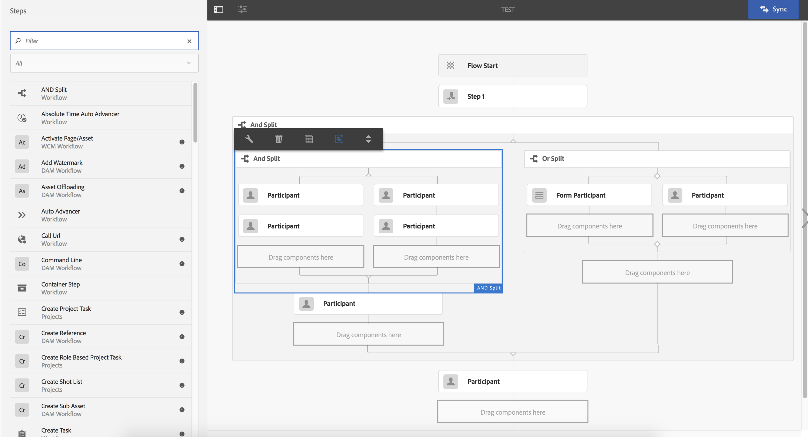
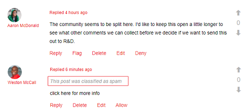
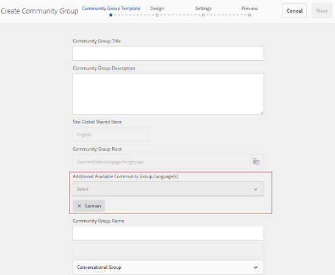
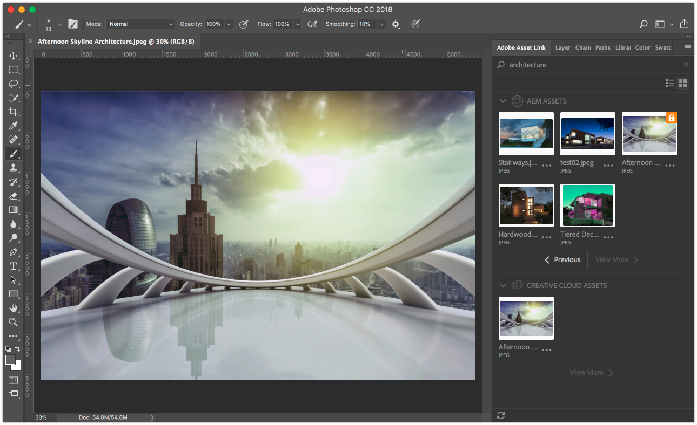
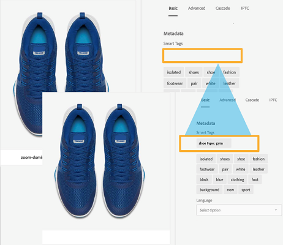

# General Release Notes for Adobe Experience Manager 6.4 {#general-release-notes-for-adobe-experience-manager}

## Release Information {#release-information}

<table> 
 <tbody>
  <tr>
   <th>Product</th> 
   <td>Adobe Experience Manager  </td> 
  </tr>
  <tr>
   <th>Version</th> 
   <td>6.4</td> 
  </tr>
  <tr>
   <th>Type</th> 
   <td>Major release</td> 
  </tr>
  <tr>
   <th>General availability date</th> 
   <td>April 4, 2018  </td> 
  </tr>
  <tr>
   <th>Recommended updates</th> 
   <td>See <a href="https://helpx.adobe.com/experience-manager/aem-releases-updates.html">AEM releases and updates</a></td> 
  </tr>
 </tbody>
</table>

### Trivia {#trivia}

The release cycle for this version of Adobe Experience Manager started April 27, 2017, went through 22 iterations of quality assurance and bug fixing, and ended on March 22nd, 2018. The total number of customer related issues including enhancements and new features fixed in this release is 704.

Adobe Experience Manager 6.4 is generally available since April 4, 2018.

>[!NOTE]
>
>Adobe recommends to install the latest service pack as all the new feature packs are only delivered via [Service Packs](https://helpx.adobe.com/experience-manager/maintenance-releases-roadmap.html).

## What's new {#what-s-new}

Adobe Experience Manager 6.4 is an upgrade release to the Adobe Experience Manager 6.3 code base. It provides new and enhanced functionality, key customer fixes, high priority customer enhancements and general bug fixes oriented toward product stabilization. It also includes the majority of all Adobe Experience Manager 6.3 feature packs, hot fix, and service pack releases.

The list below provides an overview - while the subsequent pages list the full details.

### Experience Manager Foundation {#experience-manager-foundation}

Full list of changes in [AEM Foundation](wcm-platform.md).

The platform of Adobe Experience Manager 6.4 build on top of updated versions of the OSGi-based framework (Apache Sling and Apache Felix) and the Java Content Repository: Apache Jackrabbit Oak 1.8.2.

The Quickstart uses Eclipse Jetty 9.3.22 as servlet engine.

#### User Interface {#user-interface}

Various enhancements have been made to the UI to make it more productive and easier to use.

* [New Content Tree rail](/help/sites-authoring/basic-handling.md#content-tree) to quickly navigate a hierarchy. In combination with the list view, this restores the Classic UI interaction model.
* Improved scrolling experience in card and list view of large folders. 
* [Improved interaction with the search results](/help/sites-authoring/search.md) - the back button restores the prior search result.
* [Additional keyboard shortcuts](/help/sites-authoring/keyboard-shortcuts.md), for most common actions, such as to open a particular rail, to edit, move and delete item, or to open properties.
* [Ability to disable keyboard shortcuts](/help/sites-authoring/user-properties.md) (enable/disable in Preferences). 
* [Stop showing time stamps across all UI](/help/sites-authoring/user-properties.md) relative after 7 days (set default in Preferences).

See the [Authoring documentation](/help/sites-authoring/home.md) for more information on these features.

>[!CAUTION]
>
>Adobe does not plan to make further enhancements to the Classic UI. AEM 6.4 has the Classic UI included, and customers upgrading from earlier releases can keep using it as is. Note that Classic UI remains fully supported while being deprecated. [Read more](/help/sites-deploying/ui-recommendations.md).

#### Content Repository {#content-repository}

* Faster and more efficient compaction by Online Revision Cleanup. Internal tests show that the new tail compaction is up to 10 times faster and can reclaim more disk space with less IOPS compared to AEM 6.3. This results in less performance impact while the Online Revision Cleanup is running. For more information, please see [the documentation page](/help/sites-deploying/revision-cleanup.md#full-and-tail-compaction-modes).  

* Continuous Revision Cleanup for MongoMK replaces scheduled cleanup maintenance
* Improved efficiency for Revision Cleanup on Document Nodestores

#### Search & Indexing {#search-indexing}

* Enhanced support for Indexing Operations via oak-run (CLI):

    * Index consistency check
    * Indexing statistics
    * Index configuration Im/Export
    * Reindexing

* Reduced Lucene related repository growth for an overall improved system performance

For more information, please visit [this documentation page](/help/sites-deploying/indexing-via-the-oak-run-jar.md).

#### Monitoring {#monitoring}

* A new [System Overview](/help/sites-administering/operations-dashboard.md#system-overview) provides a snapshot view on all performance-related system status & activities 
* A new set of [Health Checks](/help/sites-administering/operations-dashboard.md#health-checks) around Indexing, Queries and Maintenance

#### Projects and Workflows {#projects-and-workflows}

* All-new [Workflow Editor to create and edit workflow models](/help/sites-developing/workflows-models.md).

#### Upgrade from earlier version {#upgrade-from-earlier-version}

* [Backward Compatibility](/help/sites-deploying/backward-compatibility.md): Backward compatible features in 6.4, helps your custom code remain compatible in most cases and reduces upgrade effort.
* [Upgrade Complexity Assessment](/help/sites-deploying/pattern-detector.md): New Pattern Detector tool to assess the complexity of your upgrades, before you upgrade.
* [Repository Restructuring](/help/sites-deploying/repository-restructuring.md): significant restructuring (primarily /etc) to facilitate easier upgrades and promote implementation best practices
* For more general information regarding Upgrades, please see the [this page](/help/sites-deploying/upgrade.md) for more details.

### Experience Manager Sites {#experience-manager-sites}

Full list of changes in [AEM Sites and Add-ons](sites.md).

#### Fluid Experiences {#fluid-experiences}

The introduction of Fluid Experiences at the start of 2017, backed by Content Fragments, Experience Fragments and Content Services were the start to evolve to a multi-channel-first content management. AEM 6.4 extends each of the areas significantly:

**[Content Fragments](/help/assets/content-fragments.md)**

New in 6.4 are a visual [content model](/help/assets/content-fragments-models.md) editor and a new [configurable component](https://helpx.adobe.com/experience-manager/core-components/using/content-fragment-component.html) to provide flexible HTML output and JSON to include in Content Services.

**Experience Fragments**

Creating variations in a fragment with the same content but different layout is now more efficient, thanks to the Building Blocks capability. On top of sending Experience Fragments to Facebook and Pinterest, now it's possible to send them to Adobe Target as offer.

**Content Services**

Various enhancements to Sling Model Exporter and the Core Components are included to provide a robust JSON output to embed content in mobile apps and experiences build with single-page apps.

#### Getting Sites Built Quicker {#gettings-sites-built-quicker}

AEM 6.4 completes the transformation to the next generation component model. The Core Components concept introduced in AEM 6.3, and now joined by the Style System, provides an efficient way to build new and extend existing sites.

Recommended tutorial to learn on how to best leverage the new component model: [Getting Started with AEM Sites - WKND Tutorial](https://helpx.adobe.com/experience-manager/kt/sites/using/getting-started-wknd-tutorial-develop.html)

#### Screens Add-on {#screens-add-on}

Delivering a consistent message across all marketing channels including Digital Signage and kiosk networks is what AEM Screens stands for. AEM 6.4 adds support to run the Signage Player on Microsoft Windows and Google Chrome OS hardware. Further, enhancements to remote device management and schedules (groups of channels) are available.

For more information on the Screens updates, see [AEM Screens User Guide](/help/screens/home.md).

### Experience Manager Communities {#experience-manager-communities}

AEM 6.4 adds many new features and enhancements to Communities. Full list of changes is available in [AEM Communities](communities-release-notes.md). Highlights for this release are:

#### Enhancements to Moderation {#enhancements-to-moderation}

**Automatic spam detection**

New spam detection engine has been provided to filter out unwanted user generated content on community sites and groups. Once enabled from system/console/configMgr, it marks a piece of user generated content as spam based on a pre-defined set of spam words. To know more about spam detection engine, refer [automoderating community user generating content](/help/communities/moderate-ugc.md#spam-detection).

**New filters for QnA**

New filters, named Answered and Not Answered, have been added to bulk moderation console to filter QnA questions. To know how the Answered and Unanswered status filters work, refer [bulk moderating user generated content](/help/communities/moderation.md#main-pars-note-521961797).

**Bookmark moderation filters**

Ability to bookmark the pre-defined moderation filters on moderation console has been provided. These filters are appended toward the end of the URL string, therefore can be shared, reused and revisited later. Know how to bookmark filters in [bulk moderation console](/help/communities/moderation.md#main-pars-note-429176623).

#### Delete UGC and user profiles {#delete-ugc-and-user-profiles}

AEM 6.4 Communities exposes [out-of-the-box APIs](/help/communities/user-ugc-management-service.md) and sample [servlet](https://github.com/Adobe-Marketing-Cloud/aem-communities-ugc-migration/tree/master/bundles/communities-ugc-management-servlet) to enable end users have control over their data. These APIs also enable data processing and data controlling organizations to serve EU GDPR compliance requests.

#### Enhancements to Site and Group Management {#enhancements-to-site-and-group-management}

**Create multi-locale groups in a single step**

Capability to create multi-lingual groups in single operation has been provided. To create such groups, users can navigate to Group Collection of the desired communities site from the Sites console. Create a group, and specify the desired languages in Community Group Template page. To know more about this functionality, refer [community groups console](/help/communities/groups.md).

**[Delete community sites and groups in a click](/help/communities/groups.md)**

Delete icon is now available on respective sites and groups, while navigating from global navigation. Using this icon deletes all the items and content associated with the site or group, and removes all the user associations. To know more about this functionality, refer [managing community sites](/help/communities/create-site.md#main-pars-text-fe17) and [managing community groups](/help/communities/groups.md#main-pars-text-5e8c).

#### Enhancements to Enablement {#enhancements-to-enablement}

Assignment and Catalog functions are now available within groups. This enables learning content to be created, managed and published for a specific set of targeted community members. To know more about enabling community groups, refer [managing enablement resources](/help/communities/resource.md).

### Experience Manager Assets {#experience-manager-assets}

AEM 6.4 brings in several new features and enhancements to Assets including new, improved CreativeCloud integration, key Artificial Intelligence innovations, improved metadata management, reporting enhancements, and overall user experience improvements. The full list of changes available in [AEM Assets](assets.md). The highlights of the release are:

**Adobe Asset Link**

Adobe Asset Link in Creative Cloud for enterprise streamlines collaboration between creatives and marketers in the content creation process. It is a new native capability in Creative Cloud for enterprise that connects Photoshop CC, Illustrator CC, and InDesign CC to AEM — without creatives having to leave their tools of choice.

To learn more about this capability, prerequisites, and how to access it, see [Adobe Asset Link](https://www.adobe.com/creativecloud/business/enterprise/adobe-asset-link.html).

**AEM desktop app**

AEM desktop app has been updated to Version 1.8, which is compatible with AEM 6.4. The full list of changes for AEM desktop app is provided in a dedicated [AEM desktop app release notes](https://helpx.adobe.com/experience-manager/desktop-app/release-notes.html) document.

Improvements introduced since the AEM 6.3 release include the ability to upload hierarchical folders in the background, a new UI to monitor asset background operations, enhanced caching, networking and login, as well as overall stability improvements. The documentation also includes a [best practices guide](https://helpx.adobe.com/experience-manager/desktop-app/aem-desktop-app.html).

**Adobe Sensei Services**

New capabilities include Enhanced Smart Tags, with the ability to learn customer business taxonomy, automatically tag digital assets with customer-specific tags and Smart Translation Search, which improves discoverability in multiple languages by translating search terms on the fly. To learn more about this feature, see [Enhanced Smart Tags](/help/assets/enhanced-smart-tags.md).

**Metadata**

Various enhancements include the ability to import and export metadata simultaneously for large numbers of assets and advanced metadata constructs, such as [Cascading Metadata](/help/assets/cascading-metadata.md).

**Reports**

Asset reporting underwent a big overhaul in AEM 6.4 with new reporting framework, user experience, and more OOTB reports for customer usecases. To learn how to generate various reports, see [Asset Reports](/help/assets/asset-reports.md).

**User Experience**

Multiple enhancements to improve browsing, searching and admin experience for Assets users such as scrolling experience, search back button, improved search filters and many more. The full list available in [AEM Assets](assets.md).

**Brand Portal**

Various enhancements in areas of metadata, reporting, digital rights, login experience, and publish performance for asset distribution. To know about the new enhancements and features, see [What's new in AEM Assets Brand Portal](https://helpx.adobe.com/experience-manager/brand-portal/using/whats-new.html).

#### Dynamic Media Add-on {#dynamic-media-add-on}

AEM 6.4 includes many new features and enhancements to Dynamic Media. The full list is available in [AEM Assets](assets.md). Key highlights include the following:

**Smart Crop**

Smart Crop, powered by Adobe Sensei, automatically provides non-destructive cropping of images, preserving the point of interest for responsive design. You can preview cropped image suggestions and manually adjust them, if necessary. This feature also enables automated swatch generation for product imagery.

See [Image Profiles](/help/assets/image-profiles.md) documentation to learn more about using Smart Crop.

See [Adding Dynamic Media Assets to Pages](/help/assets/adding-dynamic-media-assets-to-pages.md) to learn more about working with Smart Crop in the Dynamic Media component.

**Smart Imaging**

Smart imaging leverages each user's unique viewing characteristics to automatically serve images optimized for their experience, resulting in better pefromance and engagement.

See [Smart Imaging](/help/assets/imaging-faq.md) documentation to learn more.

**Emerging Media & Viewer Enhancements**

New viewers, including Panoramic and VR, let you provide more immersive experiences.

See [Panoramic Images](/help/assets/panoramic-images.md) documentation to learn more.

**3D Assets**

New integration with [Adobe Dimension CC](https://www.adobe.com/products/dimension.html), a Creative Cloud application for authoring 3D experiences.

See [Working with 3D assets](/help/assets/assets-3d.md) documentation to learn more.

### Experience Manager Forms {#experience-manager-forms}

AEM 6.4 Forms brings in several new features and enhancements. The highlights include:

* Multi-channel Interactive Communications
* Prefill Interactive Communications from business applications
* Workflow modernization and mobile worker support
* Lazy loading fragments
* Single-hop upgrade from LiveCycle to Experience Manager Forms 6.4

More details on [AEM Forms](forms.md) release notes page. Also, see the [Summary of new features and enhancements in AEM 6.4 Forms](/help/forms/using/whats-new.md) for information about new and improved features and documentation resources.

### Experience Manager Livefyre {#experience-manager-livefyre}

You can integrate Livefyre with your AEM 6.4 instance. Information on how to integrate Livefyre with AEM is located here:

* [Integrating Livefyre](https://https://helpx.adobe.com/experience-manager/6-4/sites/administering/using/livefyre.html)

### Leverage Customer Focused Development {#leverage-customer-focused-development}

Adobe is using a customer focused development model that allows customers to contribute to all stages of the development process, during specification, development and testing. Our thanks goes to all contributing customers and partners in this process.

Adobe has the procedures and processes in place to enable collection, prioritization, and tracking of customer focused bug resolution and enhancement request development. The [Adobe Marketing Cloud Support Portal](https://helpx.adobe.com/marketing-cloud/contact-support.html) is integrated with the Adobe Enhancement & Defect Tracking System. Customer questions are identified and resolved with Customer Care where possible. When escalated to R&D, all customer information is captured, and used for prioritization and reporting purposes. Priority is given in development to paid support and warrantee issues and paid customer enhancements.

This process of prioritization has yielded more than 500 customer focused changes fixed in AEM 6.4.

## List of files that are part of the Release {#list-of-files-that-are-part-of-the-release}

**Foundation**

* Standalone Quickstart: cq-quickstart-6.4.0.jar
* Application Server Quickstart: cq-quickstart-6.4.0.war
* Dispatcher 4.3.1 or newer for various web servers and platforms ([download link](https://helpx.adobe.com/experience-manager/dispatcher/release-notes.html))
* Plug-in for Eclipse IDE ([read more and download](/help/sites-developing/aem-eclipse.md))  

* Extension for Brackets Code Editor ([read more and download](/help/sites-developing/aem-brackets.md))
* Maven/Gradle dependencies ([download link](https://repo.adobe.com/nexus/content/repositories/releases/com/adobe/aem/uber-jar/6.1.0/))

**Sites**

* Core Components ([GitHub project](https://github.com/Adobe-Marketing-Cloud/aem-core-wcm-components))
* We.Retail Reference implementation ([read more](/help/sites-developing/we-retail.md))
* Project Blueprint Archetype ([GitHub project](https://github.com/Adobe-Marketing-Cloud/aem-project-archetype))
* AEM Screens Players for various target platforms ([download](https://download.macromedia.com/screens/))
* Smart Content Language Models. English is pre-installed - more languages can be downloaded

    * [German](https://www.adobeaemcloud.com/content/marketplace/marketplaceProxy.html?packagePath=/content/companies/public/adobe/packages/cq630/product/smartcontent-model-de)
    * [Spanish](https://www.adobeaemcloud.com/content/marketplace/marketplaceProxy.html?packagePath=/content/companies/public/adobe/packages/cq630/product/smartcontent-model-es)
    * [Italian](https://www.adobeaemcloud.com/content/marketplace/marketplaceProxy.html?packagePath=/content/companies/public/adobe/packages/cq630/product/smartcontent-model-it)
    * [French](https://www.adobeaemcloud.com/content/marketplace/marketplaceProxy.html?packagePath=/content/companies/public/adobe/packages/cq630/product/smartcontent-model-fr)

* [Dialog Conversion Tool](/help/sites-developing/dialog-conversion.md) to migrate Classic UI components to Coral 3

**Assets**

* Adobe Experience Manager desktop app ([read more](https://helpx.adobe.com/experience-manager/desktop-app/aem-desktop-app.html) and [download](https://helpx.adobe.com/experience-manager/kb/download-companion-app.html))

* Package to add enhanced PDF Rasterizer ([read more](/help/assets/aem-pdf-rasterizer.md) and [download](https://www.adobeaemcloud.com/content/marketplace/marketplaceProxy.html?packagePath=/content/companies/public/adobe/packages/cq630/product/assets/aem-assets-pdf-rasterizer-pkg))

* Package to add extended RAW image support ([read more](/help/assets/camera-raw.md))

**Forms**

* Packages for AEM Forms capabilities:

    * [adobe-aemfd-aix-pkg](https://www.adobeaemcloud.com/content/marketplace/marketplaceProxy.html?packagePath=/content/companies/public/adobe/packages/cq640/fd/AEM-FORMS-6.4-AIX)
    * [adobe-aemfd-linux-pkg](https://www.adobeaemcloud.com/content/marketplace/marketplaceProxy.html?packagePath=/content/companies/public/adobe/packages/cq640/fd/AEM-FORMS-6.4-LX)
    * [adobe-aemfd-solaris-pkg](https://www.adobeaemcloud.com/content/marketplace/marketplaceProxy.html?packagePath=/content/companies/public/adobe/packages/cq640/fd/AEM-FORMS-6.4-SOL)
    * [adobe-aemfd-win-pkg](https://www.adobeaemcloud.com/content/marketplace/marketplaceProxy.html?packagePath=/content/companies/public/adobe/packages/cq640/fd/AEM-FORMS-6.4-WIN)
    * [adobe-aemfd-osx-pkg](https://www.adobeaemcloud.com/content/marketplace/marketplaceProxy.html?packagePath=/content/companies/public/adobe/packages/cq640/fd/AEM-FORMS-6.4-OSX)

## Languages {#languages}

The user interface is available in following languages:

* English
* German
* French
* Spanish
* Italian
* Brazilian Portuguese
* Japanese
* Simplified Chinese
* Traditional Chinese (limited support)
* Korean

Experience Manager 6.4 has been certified for GB18030-2005 CITS to use the Chinese Encoding Standard.

## Install & Update {#install-update}

See [installation instructions](/help/sites-deploying/custom-standalone-install.md) for setup requirements.

Please see [upgrade documentation](/help/sites-deploying/upgrade.md) for detailed instructions.

## Supported Platforms {#supported-platforms}

Please find the complete matrix of supported platforms incl. Support-Level on [AEM 6.4 Technical Requirements](/help/sites-deploying/technical-requirements.md) 

>[!NOTE]
>
>Oracle has moved to a "Long Term Support" (LTS) model for Oracle Java SE products. Java 9 and 10 are non-LTS releases by Oracle (see [Oracle Java SE support roadmap](https://www.oracle.com/technetwork/java/eol-135779.html)). Adobe will only provide support for LTS releases of Java to run AEM in production. Therefore Java 8 is the recommended version to use with AEM 6.4.

## Deprecated and Removed Features {#deprecated-and-removed-features}

Adobe constantly evaluates capabilities in the product and over time plans to replace capabilities with more powerful versions, or decides to re-implemented selected parts to be better prepared for future expectations or extensions.

For Adobe Experience Manager 6.4, [read the list of deprecated and removed capabilities](deprecated-removed-features.md). The page also contains pre-announcement of changes in 2019 and important notice for customers that update from prior releases.

## Detailed Changes Lists {#detailed-changes-lists}

[AEM Sites](sites.md)

[AEM Assets](assets.md)

[AEM Communities](communities-release-notes.md)

[AEM Forms](forms.md)

[AEM Foundation](wcm-platform.md)

## Known Issues {#known-issues}

[List of known issues](known-issues.md)

### Product Download and Support (Restricted Sites) {#product-download-and-support-restricted-sites}

These sites are only available to customers. If you are a customer and need access, please contact your Adobe account manager.

*  [Product Download at licensing.adobe.com](https://licensing.adobe.com/)

* [Customer Support at daycare.day.com](https://daycare.day.com)

