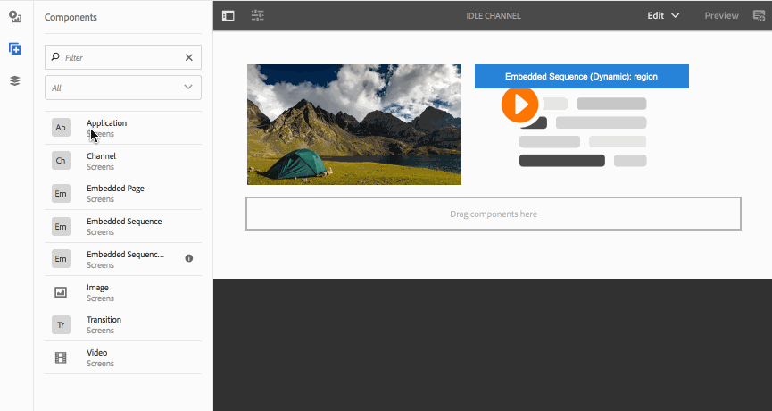

# Adding Components to a Channel{#adding-components-to-a-channel}

Components are the fundamental elements of the AEM (Adobe Experience Manager) experience. You can use a number of components and add it to your channel in an AEM Screens project.

## Components in AEM Screens {#components-in-aem-screens}

AEM Screens provide different AEM components that can be used in a Screens project.

### Viewing AEM Screens Components {#viewing-aem-screens-components}

Whenever you create an AEM Screens project, you will see a list of default components that can be added to the project.

To view the default components to your Screens project, follow the steps below:

1. Select the channel. For example, **We.Retail In Store** --&gt; **Channels** --&gt; **Idle Channel**.

1. Click **Edit** from the action bar to open the AEM editor.
1. Click the **+** icon from the side bar to open the components.
1. All the components that are included by default in an AEM Screens project displays, as shown in the figure below.

 

### Adding a New Component {#adding-a-new-component}

AEM provides a number of other components. You can always add other components (not included by default) to your project, given that those are compatible with AEM Screens.

The following example shows the addition of a Livefyre component to a an AEM Screens project:

1. Select the channel where you want to add a new component. For example, **We.Retail In Store** --&gt; **Channels** --&gt; **Idle Channel**.

1. Click** Edit f**rom the action bar to open the editor.
1. Select **Design** mode.
1. Select the entire design editor on the right and click on the settings symbol to open the **ParSys Design** dialog box.
1. You can select the components that you want to import to your AEM Screens project. The following example shows the the addition of **Livefyre** component to an AEM Screens project.

>[!NOTE]
>
>Similarly, you can add any number of other new components that are compatible with AEM Screens to your project.

## Understanding AEM Screen Components {#understanding-aem-screen-components}

The following section explains the AEM Screens components' that you can use in your project.

>[!NOTE]
>
>To view the properties of any component, select the component and click on the hammer icon to open/view properties.

### Application {#application}

The **Application** component allows you to add an application to your channel.

Application component has the following properties:

| **Property** |**Description** |
|---|---|
| ***Application Path*** |Select the absolute path where the application exists. |
| ***Duration (ms)*** |Select the duration of the application. By default, the duration is set to -1, that means the element runs forever (that is, single page application). Setting the duration value >0, shows the element for the specified duration and then moves on to the next one. |

The following example shows how to embedd an application component along with the preview of its properties:

>[!NOTE]
>
>Refer to the example above to view properties of each of the components below.

### Channel {#channel}

The **Channel** component allows you to add an entire channel to your project.

The Channel component has the following properties:

<table> 
 <tbody> 
  <tr> 
   <td><strong>Property</strong></td> 
   <td><strong>Description</strong></td> 
  </tr> 
  <tr> 
   <td><strong><em>Channel Path</em></strong></td> 
   <td>Select this absolute path where the application exists.  </td> 
  </tr> 
  <tr> 
   <td><strong><em>Duration (ms)</em></strong></td> 
   <td>Select the entire duration of the channel. Setting the duration as -1 indicates that the embedded channel will run its full length in a particular channel.</td> 
  </tr> 
 </tbody> 
</table>

### Embedded Page {#embedded-page}

An **Embedded Page** allows you to add an embedded page to your project. For example, it can be a web application or a product catalog.

The Embedded page has the following properties:

<table> 
 <tbody> 
  <tr> 
   <td><strong>Property</strong></td> 
   <td><strong>Description</strong></td> 
  </tr> 
  <tr> 
   <td><strong><em>Page Path  </em></strong></td> 
   <td>Select this absolute path where the channel exists.  </td> 
  </tr> 
  <tr> 
   <td><strong><em>Duration (ms)</em></strong></td> 
   <td>Select the entire duration of the channel. Setting the duration as -1 indicates that the embedded channel will run its full length in a particular channel.</td> 
  </tr> 
 </tbody> 
</table>

### Embedded Sequence {#embedded-sequence}

>[!NOTE]
>
>Refer to [Embedded Sequences](embedded-sequences.md) under Authoring Screens section, to learn in detail about embedded sequences.

An Embedded Sequence allows you to add an embedded sequence channel inside your existing channel (with other assets).

The Embedded Sequence has the following page properties:

<table> 
 <tbody> 
  <tr> 
   <td><strong>Property</strong></td> 
   <td><strong>Description</strong></td> 
  </tr> 
  <tr> 
   <td>Channel Path</td> 
   <td>Select the absolute path of the sequence that you want to include in your channel.  </td> 
  </tr> 
  <tr> 
   <td><strong><em>Duration (ms)</em></strong></td> 
   <td>Select the entire duration of the channel. Setting the duration as -1 indicates that the embedded channel will run its full length in a particular channel.</td> 
  </tr> 
  <tr> 
   <td><strong><em>Strategy</em></strong></td> 
   <td>Set it to <strong>original</strong> or <strong>single</strong>. Setting the value to <strong>original</strong> means that the subsequence will run fully on each cycle of the parent sequence. The other possible value is <strong>single</strong> and that would only show one item of the subsequence on each run (for instance, the 1st item on the first loop, 2nd item on the second loop, and so on.)</td> 
  </tr> 
 </tbody> 
</table>

### Dynamic Embedded Sequence {#dynamic-embedded-sequence}

A dynamic embedded sequence allows to add a sequence similar to the above mentioned except by channel role.

Refer to [Embedded Sequences](embedded-sequences.md) under Authoring Screens section, to learn in detail about embedded sequences.

The dynamic embedded sequence has the following properties:

<table> 
 <tbody> 
  <tr> 
   <td><strong>Property</strong></td> 
   <td><strong>Description</strong></td> 
  </tr> 
  <tr> 
   <td><strong><em>Channel Assignment Role</em></strong>  </td> 
   <td>Enter the channel role.  </td> 
  </tr> 
  <tr> 
   <td><strong><em>Duration (ms)</em></strong></td> 
   <td>Select the entire duration of the channel. Setting the duration as -1 indicates that the embedded channel will run its full length in a particular channel.</td> 
  </tr> 
  <tr> 
   <td><strong><em>Strategy</em></strong></td> 
   <td>Set it to <strong>original</strong> or <strong>single</strong>. Setting the value to <strong>original</strong> means that the subsequence will run fully on each cycle of the parent sequence. The other possible value is <strong>single</strong> and that would only show one item of the subsequence on each run (for instance, the 1st item on the first loop, 2nd item on the second loop, and so on.)</td> 
  </tr> 
 </tbody> 
</table>

### Image {#image}

An Image allows you to add an image to your channel.

The image asset has three tabs namely **Image**, **Accessibility**, and **Sequence**:

| **Property** |**Description** |
|---|---|
| **Image** |
| ***Image Asset*** |Select the image asset. |
| ***Title*** |Title of the image. |
| ***Link To*** |Add a link to the image. |
| ***Description*** |Brief description for the image. |
| ***Size*** |Size of the image. |
| **Accessibility** |
| ***Alternative Text*** |Alternative text to the image. |
| **Sequence** |
| ***Duration*** |Select the entire duration of the image. Setting the duration as -1 indicates that the embedded image will run its full length in a particular channel. |

### Transition {#transition}

The Transition component allows you to add a transition to your Screens project.

The transition component has the following properties:

| **Property** |**Description** |
|---|---|
| ***Type*** |The type of the transition between the element before and the one after. It can be a fade effect, or a slide effect from the four slides of the screen. |
| ***Duration (ms)*** |Select the entire duration of the transition. Setting the duration as -1 indicates that the embedded transition will run its full length in a particular channel. |

### Video {#video}

The Video component allows you to add a video to your Screens project.

The video component has the following properties:

<table> 
 <tbody> 
  <tr> 
   <td><strong>Property</strong></td> 
   <td><strong>Description</strong></td> 
  </tr> 
  <tr> 
   <td><em><strong>Video asset</strong></em></td> 
   <td>Select the link to the video.</td> 
  </tr> 
  <tr> 
   <td><em><strong>Duration</strong></em></td> 
   <td>Select the duration of the video. By default, the duration is set to -1, that means the element runs forever. Setting the duration value &gt;0, shows the element for the specified duration and then moves on to the next one.  </td> 
  </tr> 
  <tr> 
   <td><em><strong>Rendering</strong></em></td> 
   <td>
If the video aspect ratio does not fit the screen, you can adjust the rendering to either <strong>contain</strong> or <strong>cover</strong>.
 
<em>Contain</em> means the full video is displayed and the missing areas are padded with a black border.
 
<em>Cover</em> means the video covers the whole viewport, but some parts that overflow on the sides are hidden.
 </td> 
  </tr> 
  <tr> 
   <td><em><strong>Size</strong></em></td> 
   <td>Size of the video.</td> 
  </tr> 
 </tbody> 
</table>

