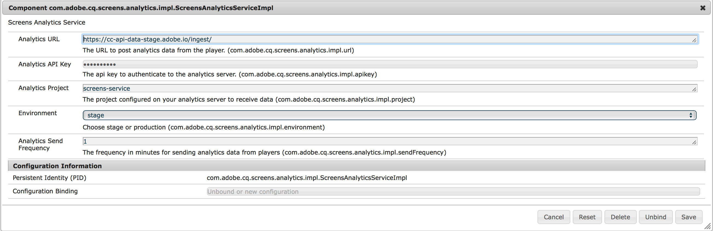

# Adobe Analytics Integration with AEM Screens{#adobe-analytics-integration-with-aem-screens}

>[!CAUTION]
>
>This AEM Screens functionality is only available, if you have installed AEM 6.4.2 Feature Pack 2 and AEM 6.3.3 Feature Pack 4.  

>
>To get access to either of these Feature Packs, you must contact Adobe Support and request access. Once you have permissions you can download it from Package Share.

This section covers the following topics:

* **Overview**
* **Architectural Details**
* **Configuring the Properties**

## Overview {#overview}

***AEM Screens*** leverages Adobe Analytics, and with that you can achieve something unique in the market - cross-channel analytics that help correlate content shown in location with other data sources.

AEM Screens provides an out of the box integration with Adobe Analytics and provides you with a proof of play.

This section describes the following functionality involved with connecting an AEM Screens project with Adobe Analytics:

* Allows for proof of play reporting by device
* Allows for proof of play reporting by asset
* Ensures that all player events are captured and timestamped
* Ensures that all player events are stored locally if the play is not connected to a network

Adobe Analytics Integration with AEM Screens thus enforces the following *goals*:

* Enable ROI from digital signage implementations
* Integrate Analytics as a foundation for future enablement of gathering and analyzing usage information

## Architectural Details {#architectural-details}

The following architectural diagram explains the Adobe Analytics Integration with AEM Screens:

## Enabling Adobe Analytics in AEM Screens {#enabling-adobe-analytics-in-aem-screens}

The Adobe Analytics settings can be configured from the OSGi console.

Navigate to **Adobe Experience Manager Web Console Configuration** to configure Adobe Analytics for AEM Screens, as shown in the figure below:

### Configuring the Properties {#configuring-the-properties}

>[!CAUTION]
>
>Before you configure the properties, please contact your Adobe Relationship Manager to create a ticket to obtain an **Anaytics API Key** and **Anaytics Project** for use with AEM Screens.

The following table highlights the properties with their description for configure Adobe Analytics for AEM Screens:

<table> 
 <tbody>
  <tr>
   <td><strong>Property</strong></td> 
   <td><strong>Description</strong></td> 
  </tr>
  <tr>
   <td><strong>Analytics URL</strong></td> 
   <td>URL to post analytics data from the player  </td> 
  </tr>
  <tr>
   <td><strong>Analytics API Key</strong></td> 
   <td>API key to authenticate to the Adobe Analytics server (provided by the Accounts Manager)</td> 
  </tr>
  <tr>
   <td><strong>Analytics Project</strong></td> 
   <td>AEM Screens project configured on your analytics to receive data (provided by the Accounts Manager)</td> 
  </tr>
  <tr>
   <td><strong>Environment</strong></td> 
   <td>
Stage or Production environment.
 
<em>For development/stage</em> - https://cc-api-data-stage.adobe.io/ingest/  <em>For Production</em> - https://cc-api-data.adobe.io/ingest/
 </td> 
  </tr>
  <tr>
   <td><strong>Analytics Send Frequency</strong></td> 
   <td>Frequency in minutes for sending analytics data from the players. By default, it is set to 15 mins.</td> 
  </tr>
 </tbody>
</table>

>[!NOTE]
>
>By default, the **Analytics Send Frequency **is 15 minutes.

#### Using Adobe Analytics Service in AEM Screens {#using-adobe-analytics-service-in-aem-screens}

This scenario invokes Analytics API through REST calls from an analytics service in the firmware and instrument screens-core components to explicitly create and send events specific to a particluar use case while allowing extensibility where any custom message can be sent to Analytics from a custom developed channel.

Analytics events are stored offline in indexedDB and later chunked and sent to the cloud.

>[!NOTE]
>
>To learn more about the ***Sequencing ***and*** Standard Data Model for Events***, please refer to [Configuring Adobe Analytics for AEM Screens](configuring-adobe-analytics-aem-screens.md) in Developer's section of AEM Screens.

