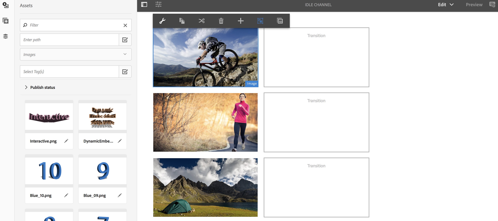
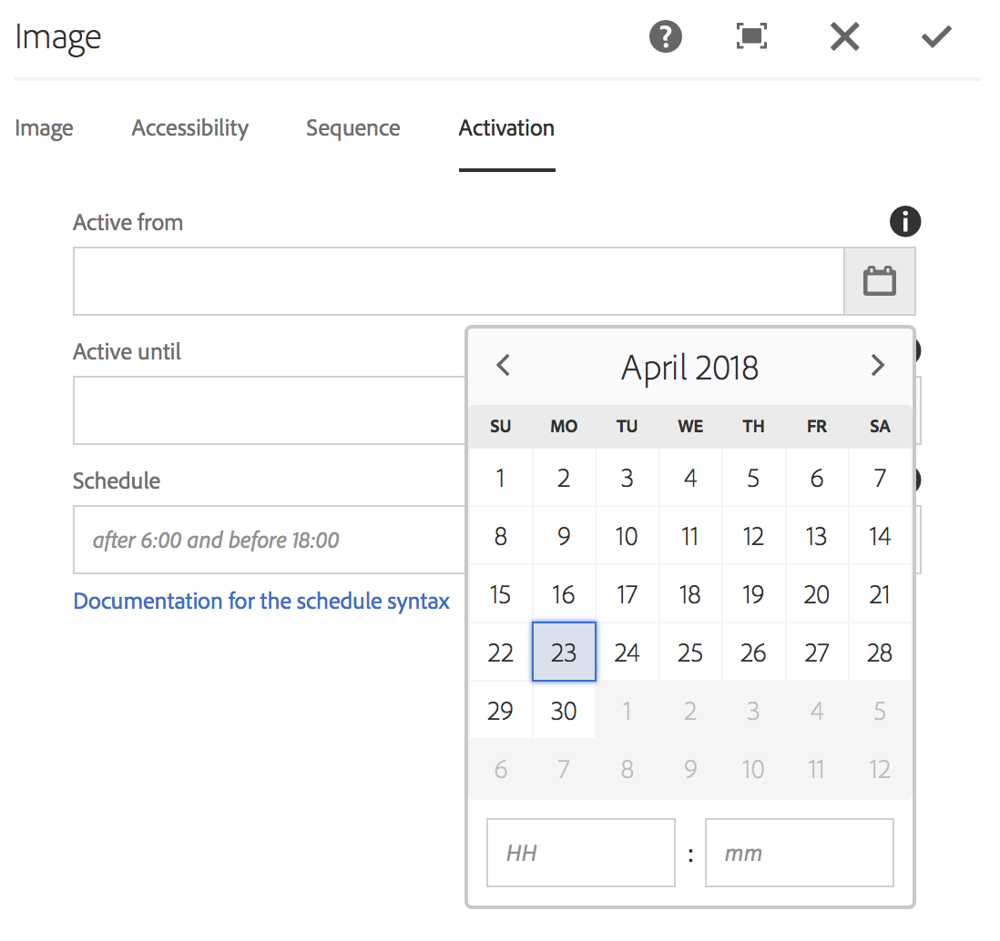
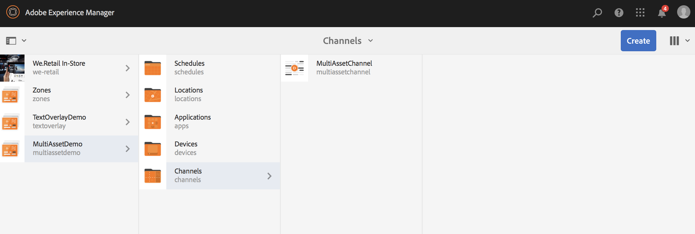
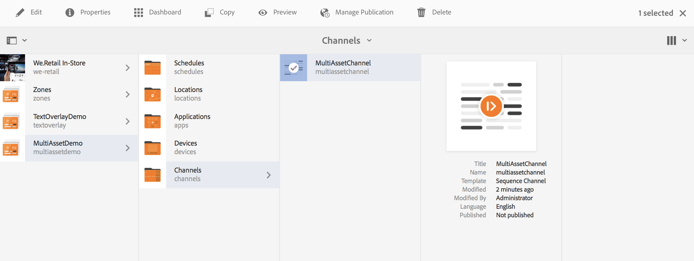
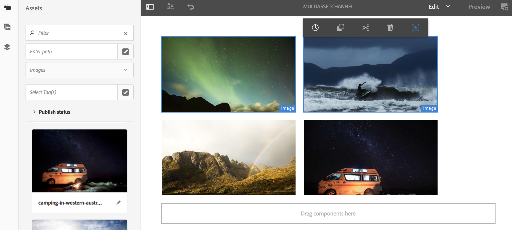
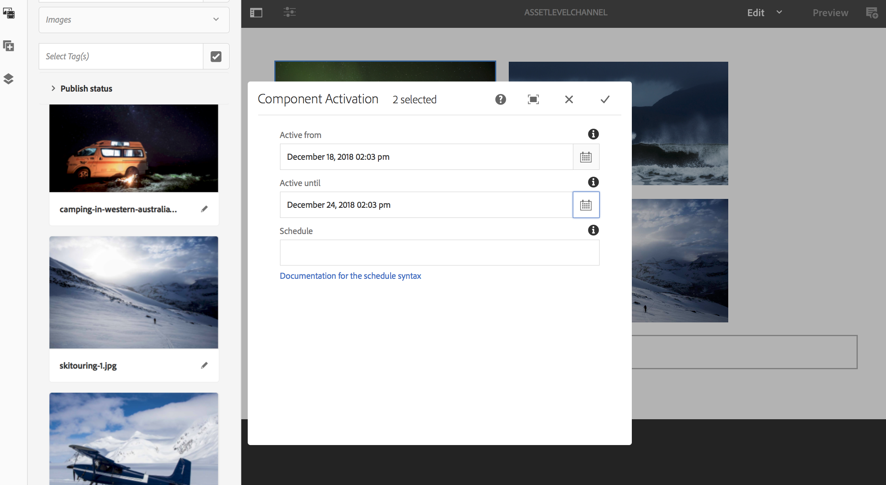
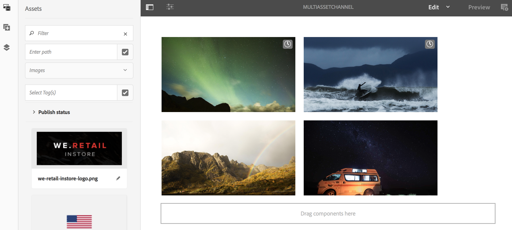

# Asset Level Scheduling{#asset-level-scheduling}

<!--removed from TOC: admitteddomains: @adobe.com;@caesars.com-->

This section describes asset level scheduling for the assets used in Channels.

The following topics are covered in this section:

* OvervieW
* Using Asset Level Scheduling
* Handling Recurrence in Assets
* Multi Asset Scheduling  

>[!CAUTION]
>
>This AEM Screens functionality is only available, if you have installed AEM 6.3 Feature Pack 3 or AEM 6.4 Screens Feature Pack 1.
>
>To get access to this Feature Pack, you must contact Adobe Support and request access. Once you have permissions you can download it from Package Share.

## Overview {#overview}

***Asset Level Scheduling***, allows you to activate a specific asset in a channel for a scheduled time frame in the player's local timezone. This is available for images, videos, transitions, pages, and embedded channels (dynamic or static).

*For example*, you want a special promotion to be displayed only during happy hour (2PM to 5PM) on Mondays and Wednesdays.

With this feature, not only can you specify start and end date and time but also a recurrence pattern.

## Using Asset Level Scheduling {#using-asset-level-scheduling}

Asset Level Scheduling is done by configuring the **Activation** tab while accessing properties of an asset.

Follow the steps below to perform asset level scheduling:

1. Select any channel and click **Edit** from the action bar to add or edit content in your channel.

   

   >[!NOTE]
   >
   >To learn in detail on how to
   >
   >* Create a project, see [Creating a new Project](creating-a-screens-project.md).
   >* Create and add content to a channel, see [Managing Channels](managing-channels.md).

1. Click **Edit** to open the channel editor and select an asset you want to apply the scheduling to.

   

1. Select the asset and click on top left **Configure** icon to open the properties of the image.

   Click the **Activation** tab.

   

1. You can specify the the date from the date picker from the **Active from** and **Active until** fields.

   If you select the** Active from** and **Active until** date and time, the asset will display and loop only between that start date/time and end date/time respectively.

   

## Handling Recurrence in Assets {#handling-recurrence-in-assets}

You can schedule assets to recur at certain intervals on daily, weekly, or monthly basis too as per your requirement.

Suppose you want to display an image only on Fridays from 1:00 pm until 10:00 pm. You can use the Activation tab to set the desired recurring interval for your asset.

### Adding a Recurring Event for your Asset {#adding-a-recurring-event-for-your-asset}

1. Select the asset and click on **Configure** icon to open the properties dialog box.
1. After entering the start date/time and end/date time, you can use a cron expression or a natural text version to specify your recurrence schedule.

   You can search the web for a free cron expression generator and then copy and paste the cron expression into the **Schedule** and your asset will display for the particular interval of day and time.

   *Alternatively*, instead of using cron expression, you can also use the natural text version such as *after 6:00 and before 18:00* on Friday to accomplish your task. Enter the text in the **Schedule** to display your asset.

## Multi-asset Scheduling {#multi-asset-scheduling}

>[!CAUTION]
>
>The **Multi-asset Scheduling** feature is only available, if you have installed AEM 6.3 Feature Pack 5 or AEM 6.4 Feature Pack 3.

***Multi-asset Scheduling*** allows the user to select multiple assets and apply a playback schedule to all selected assets.

### Prerequisites {#prerequisites}

To use multi-asset level scheduling for your assets, create an AEM Screens project with a sequence channel. For example, the following use case showcases the implementation of the feature:

* Create an AEM Screens project titled as **MultiAssetDemo**
* Create a channel titled as **MultiAssetChannel** and add content to the channel, as shown in the figure below

Follow the steps below to select multiple assets and schedule their display in an AEM Screens project:

1. Select **MultiAssetChannel** and click **Edit** from the action bar to open the editor.

   

1. Select multiple assets from the editor and click **Edit Activation** (top left icon).

   

1. Select the date and time in **Active from** and **Active until **from the **Component Activation** dialog box. Click the check mark icon when you are done selecting the schedules.

   

1. Click refresh to check the assets to which multi-asset schedule is applied.

   >[!NOTE]
   >
   >The schedule icon is visible on the top right corner to those assets that have muti asset scheduling.

   

