# Configuring Author and Publish in AEM Screens{#configuring-author-and-publish-in-aem-screens}

This page highlights the following topics:

* **Configuring Author and Publish Instances**
* **Setting Up Publish Topology**
* **Managing Publication: Delivering Content Updates from Author to Publish to Device**

## Prerequisites {#prerequisites}

Before getting started with author and publish servers, you should have prior knowledge of:

* **AEM Topology**
* **Creating and Managing AEM Screens Project**
* **Device Registration Process**

>[!NOTE]
>
>This AEM Screens functionality is only available, if you have installed AEM 6.4 Screens Feature Pack 2. To get access to this Feature Pack, you must contact Adobe Support and request access. Once you have permissions you can download it from Package Share.

## Configuring Author and Publish instances {#configuring-author-and-publish-instances}

>[!NOTE]
>
>To learn more about the author and publish architectural overview and how the content is authored on an AEM author instance and then forward-replicated to multiple publish instances, refer to [Author and Publish Architectural Overview](author-publish-architecture-overview.md).

The following section explains how to setup replication agents on author and publish topology.

You can set up a simple example, where you host an author and two publish instances:

* Author --&gt; localhost:4502 
* Publish 1 (pub1) --&gt; localhost:4503   
* Publish (pub2) --&gt; localhost:4504

### Setting up Replication Agents on Author {#setting-up-replication-agents-on-author}

To create replication agents, you must learn how to create a standard replication agent.

There are 3 replication agents are needed for Screens:

1. **Default Replication Agent ***(specified as*** Standard Replication Agent**)

1. **Screens Replication Agent**
1. **Reverse Replication Agent**

Follow the same steps to create a reverse replication agent.

1. Navigate to your AEM instance --&gt; hammer icon --&gt; **Operations** --&gt; **Configuration**.

   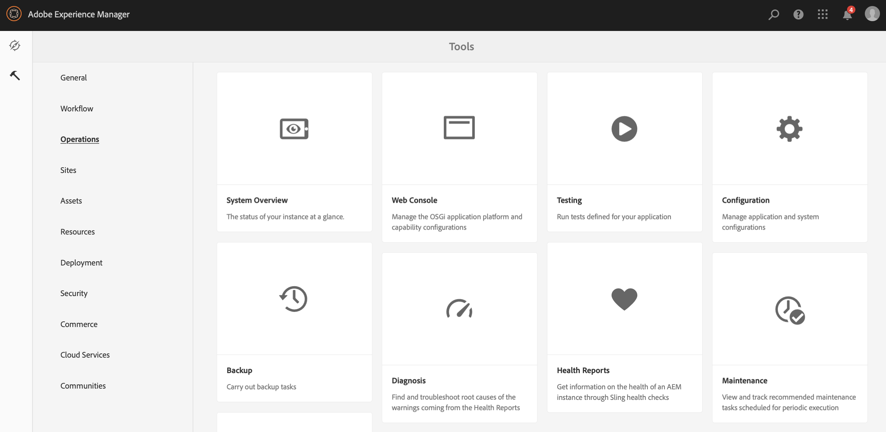

1. Select the **Replication** from the left navigation tree.

   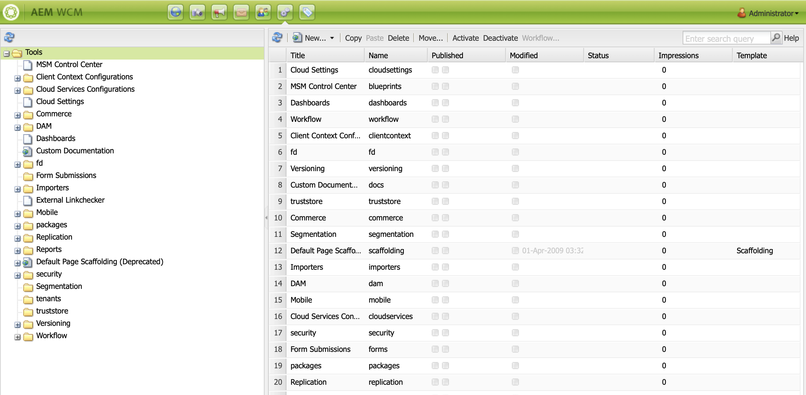

1. Select the **Agents on author** from the **Replication** folder and click **New** to create a new standard replication agent.

   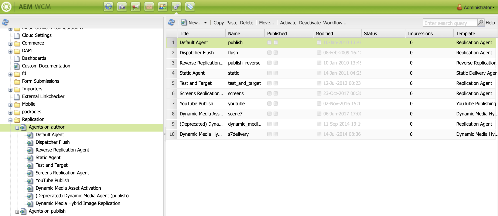

1. Enter the **Title** and **Name** to create the replication agent and click **Create**.

   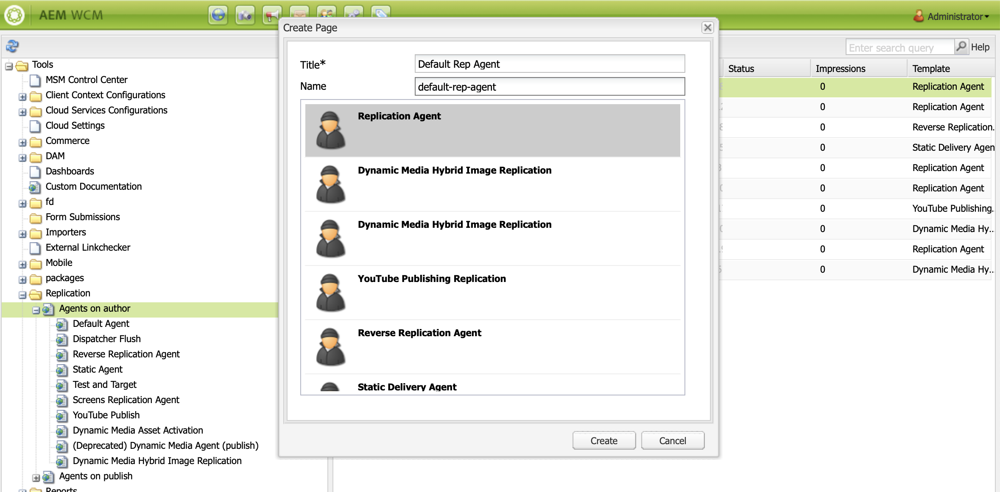

1. Right click the replication agent and click **Open** to edit the settings.

   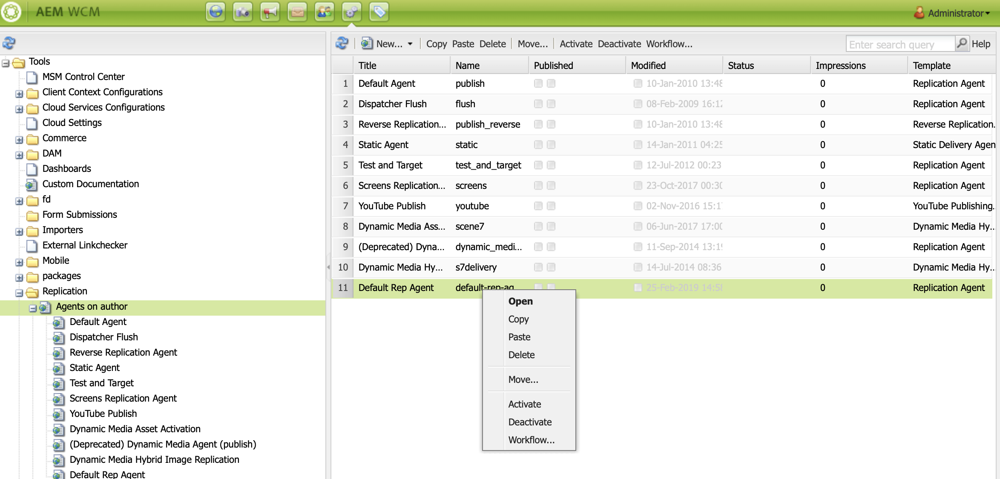

1. Click **Edit** to open the **Agent Settings** dialog box to enter the details.

   

1. Navigate to the **Transport** tab and enter the **URI**, **User** and **Password**.

   

   >[!NOTE]
   >
   >You can also copy and rename an existing default replication agent.

#### Creating Standard Replication Agents  {#creating-standard-replication-agents}

1. Create standard replication agent for pub1 (out-of-the-box default agent should already be configured) (for example, *https://&lt;hostname&gt;:4503/bin/receive?sling:authRequestLogin=1*)  

1. Create standard replication agent for pub2. You can copy rep agent for pub1 and update the transport to be used for pub2 by changing the port in the transport configuration. (for example, *https://&lt;hostname&gt;:4504/bin/receive?sling:authRequestLogin=1*)

#### Creating Screens Replication Agents {#creating-screens-replication-agents}

1. Create AEM Screens replication agent for pub1. Out-of-the-box, there is a one named Screens Replication Agent that points to port 4503. This needs to be enabled.
1. Create AEM Screens replication agent for pub2. Copy the Screens replication agent for pub1 and change the port to point to 4504 for pub2.

#### Creating Screens Reverse Replication Agents {#creating-screens-reverse-replication-agents}

1. Create standard reverse replication agent for pub1.
1. Create standard reverse replication agent for pub2. You can copy reverse rep agent for pub1 and update the transport to be used for pub2 by changing the port in the transport configuration.

## Setting up Publish Topology {#setting-up-publish-topology}

### Step 1: Configure Apache Sling Oak-Based Discovery {#step-configure-apache-sling-oak-based-discovery}

Set up Apache Sling Oak-Based Discovery for all Publish instances in the topology   
  
For each publish instance:

1. Navigate to https://&lt;host&gt;:&lt;port&gt;/system/console/configMgr
1. Select **Apache Sling Oak-Based Discovery Service** Configuration.
1. Update Topology connector URLs: add URLs of all partaking publish instances that is, [http://localhost:4502/libs/sling/topology/connector](http://localhost:4502/libs/sling/topology/connector)
1. Topology connector Whitelist: adapt to IPs or subnets covering partaking publish instances
1. Enable **Auto-Stop Local-Loops**

The configuration should be identical for each publish instance and the auto-stop Local-loop prevents an infinite loop.

### Step 2: Verify Publish Topology {#step-verify-publish-topology}

For any of the Publish instances navigate to https://&lt;host&gt;:&lt;port&gt;/system/console/topology. You should see each publish instance represented in the topology.

### Step 3: Setup ActiveMQ Artemis Cluster {#step-setup-activemq-artemis-cluster}

This step allows you to create encrypted password for ActiveMQ Artemis cluster.  
The cluster user and password of all publish instances in the topology needs to be identical. The password of the ActiveMQ Artemis configuration needs to be encrypted. Since each instance has its own encryption key it is necessary to use Crypto Support to create an encrypted password string. Then encrypted password will be used in the OSGi config for ActiveMQ.

On each Publish Instance:

1. In the OSGi Console navigate to **MAIN** --&gt; **Crypto Support** (*https://&lt;host&gt;:&lt;port&gt;/system/console/crypto*).

1. Type in the desired plain text password (same for all instances) in **Plain Text**
1. Click **Protect**.
1. Copy the value **Protected Text** to notepad or text editor. This value will be used in the OSGi config for ActiveMQ.

Since each publish instance by default has unique crypto keys you need to perform this step on each pub instance and save the unique key for the next configuration.

*For example*,

Pub1 - {1ec346330f1c26b5c48255084c3b7272a5e85260322edd59119828d1fa0a610e}   
Pub2 - {8d3d113c834cc4f52c2daee0da3cb0a21122a31f0138bfe4b70c9ead79415f41}

### Step 4: Activate ActiveMQ Artemis Cluster {#step-activate-activemq-artemis-cluster}

On each publish instance:

1. Navigate to the OSGi Config manager *https://&lt;host&gt;:&lt;port&gt;/system/console/configMgr*
1. Select **Apache ActiveMQ Artemis JMS Provider** Configuration
1. Update the following:

* ***Cluster Password***: (use encrypted value from previous step per respective instance)
* ***Topics***: {name: 'commands', address: 'com.adobe.cq.screens.commands', maxConsumers: 50}

### Verify ActiveMQ Artemis Cluster {#verify-activemq-artemis-cluster}

Follow the steps below on each Publish instance:

1. Navigate to the OSGi Console -&gt; Main &gt; ActiveMQ Artemis ([http://localhost:4505/system/console/mq](http://localhost:4505/system/console/mq)).
1. Verify and check to view the ports of other instances under Cluster Information &gt; Topology &gt; nodes=2, members=2. 
1. Send a Test Message (top of the screen under Broker Information)
1. Enter the following changes in fields:

    1. **Destination**: /com.adobe.cq.screens/devTestTopic
    1. **Text**: Hello World
    1. View the error.log of each instance to see that the message was sent and received across the cluste

>[!NOTE]
>
>Navigating to OSGI console, may take a few seconds after saving the configuration in the preceeding step. You can also check the error.log for more details.

As an example, the following image displays on successful configuration of ActiveMQ Artemis Server.

If you do not see the following configuration from */system/console/mq*, then navigate to */system/console/mq* and click **Restart** to restart the broker.

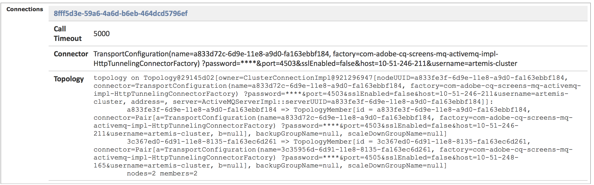 

### Remove referrer header requirement {#remove-referrer-header-requirement}

Follow the steps on each Publish instance:

1. Navigate to **Configuration Manager** from **OSGi Console**. 
1. Select **Apache Sling Referrer Filter**.
1. Update config and **check Allow Empty**.

## Configuring Author and Publish Instance {#configuring-author-and-publish-instance}

Once you have set up the publish toplogy, you need to configure the author and publish instances, to view the practical results of implementation:

>[!NOTE]
>
>**Prerequisites**
>
>To get started with this example, create a new AEM Screens project followed by creating a location, display, and channel in your project. Add content to your channel and assign the channel to a display.

### Step 1: Starting an AEM Screens Player (device) {#step-starting-an-aem-screens-player-device}

1. Launch a separate browser window.
1. Go to Screens player using the [web browser](http://localhost:4502/content/mobileapps/cq-screens-player/firmware.html) or launch the AEM Screens app. When you open the device you will notice the device's state as unregistered.

>[!NOTE]
>
>You can open an AEM Screens player using the AEM Screens app you downloaded or using the web browser.

### Step 2: Registering a Device on Author {#step-registering-a-device-on-author}

1. Go to [http://localhost:4502/screens.html/content/screens/we-retail](http://localhost:4502/screens.html/content/screens/we-retail) or select your project and navigate to Devices &gt; Device Manager. 
1. Select **Register Device**.
1. Click **Device Registration** to view the device.
1. Select the device you want to register and click **Register Device**.
1. Verfiy the registration code and click **Validate**.
1. Enter a title for your device and click **Register**.

#### Step 3: Assigning the Device to Display {#step-assigning-the-device-to-display}

1. Click **Assign Display** from the dialog box from the preceeding step.
1. Select the display path for your channel from the **Locations** folder.
1. Click **Assign**.
1. Click **Finish** to complete the process, and now the device is assigned.

Check your player and you will see the content that you added in your channel.

### Step 4: Publishing Device Configuration to Publish Instances {#step-publishing-device-configuration-to-publish-instances}

**Verifying the Device**

Before, you perform the steps below, make sure to verify the Device ID. To verify, search for the device id in CRXDELite, with the path as */home/users/screens/{project}/devices*.

Follow the steps below to replicate the device user:

1. Navigate to the user admin page (e.g: [http://localhost:4502/useradmin](http://localhost:4502/useradmin)).
1. Search for the **screens-devices-master** group
1. Right click on the group, and click **Activate**

>[!CAUTION]
>
>Do not activate author-publish-screens-service as it is a system user, used by the Author Job.

You can also activate the device from the Device Management Console. Follow the steps below:

1. Navigate to your Screens project --&gt; **Devices**.
1. Click **Device Manager** from the action bar.
1. Select the device and click **Activate** from the action bar, as in shown in the figure below.

>[!NOTE]
>
>Alternatively, once you have activated the device you also can edit or update the server URL by clicking **Edit server URL** from the action bar, as shown in the figure below and your changes will be propagated to the AEM Screens player.

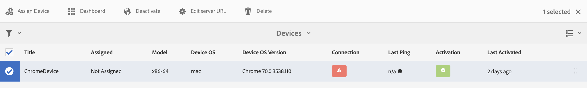 

## Publishing Check list {#publishing-check-list}

The following points summarizes the Publishing Check list:

* *Screens Device User* - This is stored as an AEM user and be activated from **Tools** &gt; **Security** &gt; **Users**. The user will be prefixed with "screens" with a long serialized string.

* *Project* - The AEM Screens project.  

* *Location* - Location that device is connected to.
* *Channel(s)* - one or more channels that are being displayed at the location
* *Schedule* - if using a schedule ensure this is published
* *Location, Schedules, and Channel Folder* - if the corresponding resources are inside a folder.

Once you verify the checklist, you need to verify the following changes/behavior in your channel:

* After publishing the device config open the Screens player config and point it to the Publish instance. Also, you can also activate the device from the device management console.  
* Update some channel content on Author and publish it and verify that the updated channel now displays on the AEM Screens player.
* Connect the Screens player to a different publish instance and verify behavior above.

### Step 5: Pointing the Device to Publish Instance in the Admin Panel {#step-pointing-the-device-to-publish-instance-in-the-admin-panel}

1. View the admin UI from the Screens player, long press on the top left corner to open the Admin menu, on your touch enabled AEM Screens player, or by using a mouse. 
1. Click the **Configuration **option from the side panel.
1. Change author instance to publish instance in **Server**.

View the changes in your AEM Screens player.

Alternatively, you can also update/edit the server URL from the device management console using the following steps:

1. Navigate to your AEM Screens project and select the **Devices** folder.
1. Click **Device Manager** from the action bar.
1. Select the device and click **Edit server URL** from the action bar, as shown in the figure below and your changes will be propagated to the AEM Screens player.

 

## Managing Publication: Delivering Content Updates from Author to Publish to Device {#managing-publication-delivering-content-updates-from-author-to-publish-to-device}

You can publish and unpublish content from AEM Screens. The Manage Publication feature allows you to deliver content updates from author to publish to device. You can publish/unpublish content for your entire AEM Screens project or only for one of your channel, location, device, application, or a schedule.

### Managing Publication for an AEM Screens Project {#managing-publication-for-an-aem-screens-project}

Follow the steps below to deliver content updates from author to publish to device for an AEM Screens Project:

1. Navigate to your AEM Screens project.
1. Click **Manage Publication** from the action bar to publish the project to publish instance.

   

1. The **Manage Publication** wizard opens. You can select the **Action** and also schedule the publishing time for now or later. Click **Next**.

   

1. Check the box to select the entire project from **Manage Publication** wizard.

   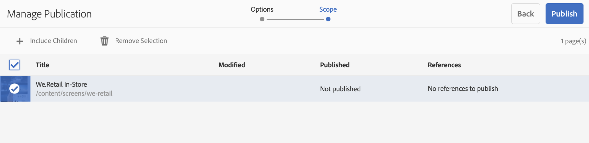

1. Click **+ Include Children** from the action bar and un-check all the options to publish all the modules in your project and click **Add** to publish.

   >[!NOTE]
   >
   >By default, all the boxes will be checked and you will have to manually un-check the boxes to publish all the modules in your project.

   

1. Click **Publish** from the **Manage **Publication wizard**.

   

   >[!NOTE]
   >
   >Wait for a few seconds/minutes so that the content reaches publish instance.
   >
   >The **Manage Publication** with update offline content is a two-step process and the steps must be in correct order.
   >
   > 1. The workflow will not work if **Update Offline Content** is triggered before publish using **Manage Publication**.
   > 1. The workflow will not work if there are no changes in the project and nothing for **Update Offline Content**.
   > 1. The workflow will not work if author does not completes the replication process (contents are still uploading to publish instance) after clicking the **Publish** button in the managing publication workflow.
   
1. Once you have completed the manage publication workflow, you must trigger the update offline content in author, that will create the update offline on the author instance.

   Navigate to the project and click **Update Offline Content** from the action bar. This action forwards the same command to publish instance, so that the offline zips are created on the publish instance as well.

   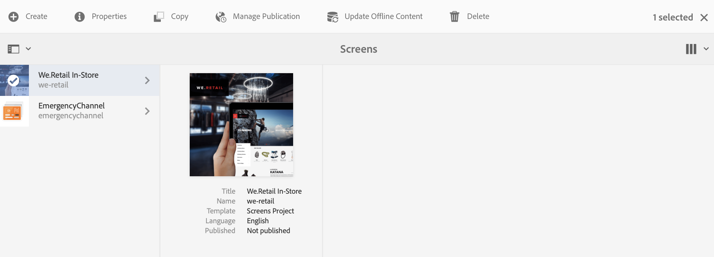

   >[!CAUTION]
   >
   >You must first publish and then trigger the update offline content, as summarized in the preceding steps.

### Managing Publication for a Channel {#managing-publication-for-a-channel}

Follow the steps below to deliver content updates from author to publish to device for a Channel in an AEM Screens Project:

>[!NOTE]
>
>Follow this section only if there are changes in a channel. If a channel does not have any changes after the previous update offline content, then the managing publication workflow for an individual channel will not work.

1. Navigate to your Screens project and select the channel.
1. Click **Manage Publication** from the action bar to publish the channel to publish instance.

   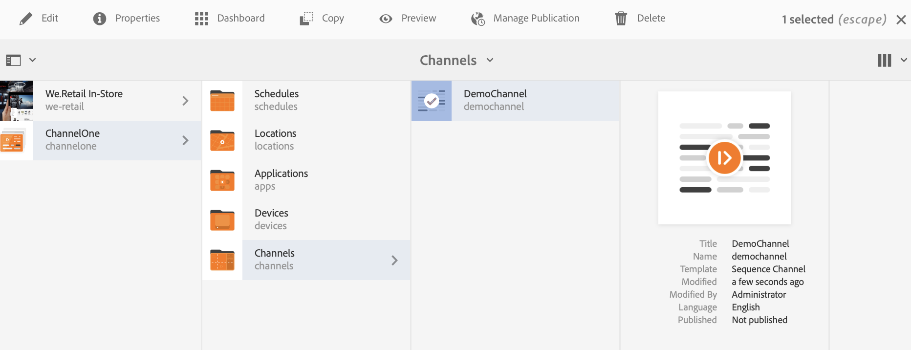

1. The **Manage Publication** wizard opens. You can select the **Action** and also schedule the publishing time for now or later. Click **Next**.

   

1. Click **Publish **from the** Manage **Publication wizard.** 
   **

   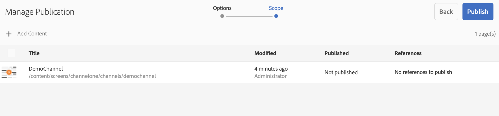

   >[!NOTE]
   >
   >Wait for a few seconds/minutes so that the content reaches publish instance.

1. Once you have completed the manage publication workflow, you must trigger the update offline content in author, that will create the update offline on the author instance.

   Navigate to the channel dashboard and click **Update Offline Content**. This action forwards the same command to publish instance, so that the offline zips are created on the publish instance as well.

   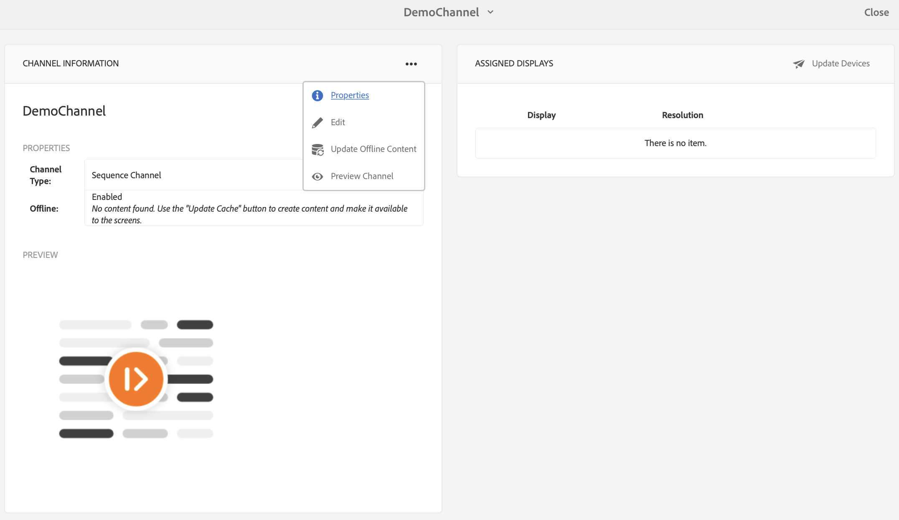

   >[!CAUTION]
   >
   >You must first publish and then trigger the update offline content, as summarized in the preceding steps.

### Channel and Device Re-assignment: {#channel-and-device-re-assignment}

If you have re-assigned a device, you must publish both the initial display and the new display, once the device has been re-assigned to the new display.

Similarly, if you have re-assigned a channel, you must publish both the initial display and the new display, once the channel has been re-assigned to the new display.
