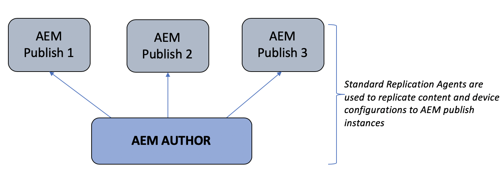

# Author and Publish Architectural Overview{#author-and-publish-architectural-overview}

This page highlights the following topics:

* **Introduction to Publish Servers**
* **Architectural Overview**
* **Registration Process**

## Prerequisites {#prerequisites}

Before getting started with author and publish servers, you should have prior knowledge of:

* **AEM Topology**
* **Creating and Managing AEM Screens Project**
* **Device Registration Process**

>[!NOTE]
>
>This AEM Screens functionality is only available, if you have installed AEM 6.4 Screens Feature Pack 2. To get access to this Feature Pack, you must contact Adobe Support and request access. Once you have permissions you can download it from Package Share.

## Introduction {#introduction}

AEM Screens architecture resembles a traditional AEM Sites architecture. Content is authored on an AEM author instance and then forward-replicated to multiple publish instances. AEM Screens devices can now connect to an AEM publish farm via load balancer. Multiple AEM publish instances can be added to continue to scale the publish farm.

*For example*, an AEM Screens content author issues a command on the authoring system for a particular device that is configured to interact with a publish farm or an AEM Screens content author that obtains information about devices that are configured to interact with publish farms.

The following diagram illustrates the author and publish environments.

 

## Architectural Design {#architectural-design}

There are five architectural components, facilitating this solution:

* ***Replicating*** content from author to publish for display by devices
* ***Reverse*** replicating binary content from publish (received from devices) to author
* ***Sending*** commands from author to publish via specific REST APIs
* ***Messaging*** between publish instances to synchronize device information updates and commands
* ***Polling*** by the author of publish instances to obtain device information via specific REST APIs

### Replication (Forward) of Content and Configurations  {#replication-forward-of-content-and-configurations}

Standard replication agents are used to replicate screens channel content, location configurations and device configurations. This allows authors to update the content of a channel and optionally go through some sort of approval workflow before publishing channel updates. A replication agent needs to be created for each publish instance in the publish farm.

The following diagram illustrates the replication process:

>[!NOTE]
>
>A replication agent needs to be created for each publish instance in the publish farm.

### Screens Replication Agents and Commands  {#screens-replication-agents-and-commands}

Custom Screens specific replication agents are created to send commands from the Author instance to the AEM Screens device. The AEM Publish instances serve as an intermediary to forward these commands to the device.

This allows authors to continue to manage the device such as, send device updates and take screenshots from the author environment. The AEM Screens replication agents have a custom transport configuration, like standard replication agents.

### Messaging between Publish Instances  {#messaging-between-publish-instances}

In many cases a command is only meant to be sent to a device a single time. However in a load-balanced publish architecture it is unknown which publish instance the device is connecting to.

Therefore, the author instance sends the message to all Publish instances. However only a single message should then be relayed to the device. To ensure correct messaging some communication must take place between publish instances. This is achieved using *Apache ActiveMQ Artemis. *Each publish instance is placed in a loosely coupled Toplogy using Oak-based Sling discovery service and ActiveMQ is configured so that each publish instance can communicate and create a single message queue. The Screens device polls the publish farm via the load balancer and picks up the command from the top of the queue.

### Reverse Replication {#reverse-replication}

In many cases, following a command, some sort of response is expected from the Screens device to be forwarded to the Author instance. In order to achieve this AEM ***Reverse replication*** is used.

* Create a reverse replication agent for each publish instance, akin to the standard replication agents and the screens replication agents.
* A workflow launcher configuration listens for nodes modified on the publish intance and in turn triggers a workflow to place the Device's response in the Publish instance's outbox.
* A reverse replication in this context is only used for binary data ( such as, log files and screenshots) provided by the devices. Non-binary data is retrieved by polling.
* Reverse replication polled from the AEM author instance retrieves the response and saves it to the author instance.

### Polling of Publish Instances  {#polling-of-publish-instances}

The author instance needs to be able to poll the devices to get a heartbeat and know the health status of a connected device.

Devices ping the load balancer and get routed to a publish instance. The status of the device is then exposed by the publish instance through a Publish API served @ **api/screens-dcc/devices/stati** for all active devices and **api/screens-dcc/devices/&lt;device_id&gt;/status.json** for a single device.

The author instance polls all publish instances and merges the device status responses into a single status. The scheduled job that polls on author is *com.adobe.cq.screens.impl.jobs.DistributedDevicesStatiUpdateJob* and can be configured based on a cron expression.

## Registration {#registration}

Registration continues to originate on the AEM author instance. AEM Screens Device is pointed to the author instance and registration is completed.

Once a device has been registered on the author environment the device configuration and channel/schedule assignments are replicated to the AEM publish instances. The AEM Screens Device configuration is then updated to point to the Load Balancer in front the AEM publish farm. This is intended to be a one-time setup, once the Screens Device is successfully connected to the publish environment it can continue to recieve commands originating from the author environment and there should be no need to ever connect the Screens device to the author environment directly.

 

### The Next Steps {#the-next-steps}

Once you understand the architectural design of author and publish setup in AEM Screens, refer to [**Configuring Author and Publish for AEM Screens**](author-and-publish.md) for more details.
