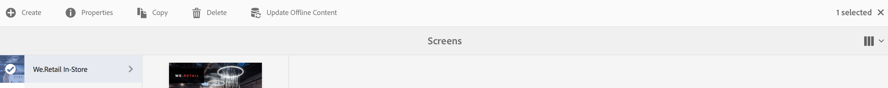
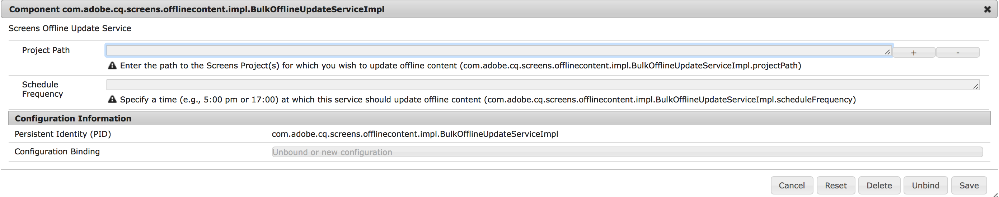

# Bulk Offline Update{#bulk-offline-update}

<!--Removed from metadata: admitteddomains: @adobe.com;@caesars.com-->

This section covers the following topics on Bulk Offline Update:

* **Overview**
* **Using Bulk Offline Update**

>[!CAUTION]
>
>This AEM Screens functionality is only available, if you have installed AEM 6.3 Feature Pack 3 or AEM 6.4 Screens Feature Pack 1.
>
>To get access to this Feature Pack, you must contact Adobe Support and request access. Once you have permissions you can download it from Package Share.

## Overview {#overview}

Bulk Offline Update, allows you to update all the channel in bulk. It avoids the hassle of navigating to a particular channel and update the content. Rather, you can update all the content in channels for one specific project in one instant.

You can also schedule this activity for a time of lower network traffic.

>[!NOTE]
>
>The Bulk Offline Update feature is optimized to update only those channels that have been modified.

## Using Bulk Offline Update {#using-bulk-offline-update}

You can manually use bulk offline update from the User Interface (UI) or schedule the bulk update from OSGi services.

### Using AEM Screens User Interface {#using-aem-screens-user-interface}

Follow the steps below to use bulk offline update for an AEM Screens project:

1. Navigate to your AEM Screens project.
1. Select the project and click **Update Offline Content** from the action bar to manually update the channel content.

   

### Adobe Experience Manager Web Console Configuration {#adobe-experience-manager-web-console-configuration}

Follow the steps below to use bulk offline update for an AEM Screens project:

1. Adobe Experience Manager Web Console Configuration.
1. Search for bulk offline update services.

   

1. Add the following properties:

   **Project Path** Specify the path of your AEM Screens project. The path is usually `/content/screens/<Name of your project>`.

   *For example*, /content/screens/we-retail. You can find this path in the URL by selecting any project under AEM Screens (do not click the icon).

   >[!NOTE]
   >
   >Specify the project path relative to your channel.

   **Schedule Frequency** Specify a time, for example, 5:00 pm or 17:00 at which this service should update offline content.

1. Click **Save** to save your settings and your content will be updated at the specified time.

