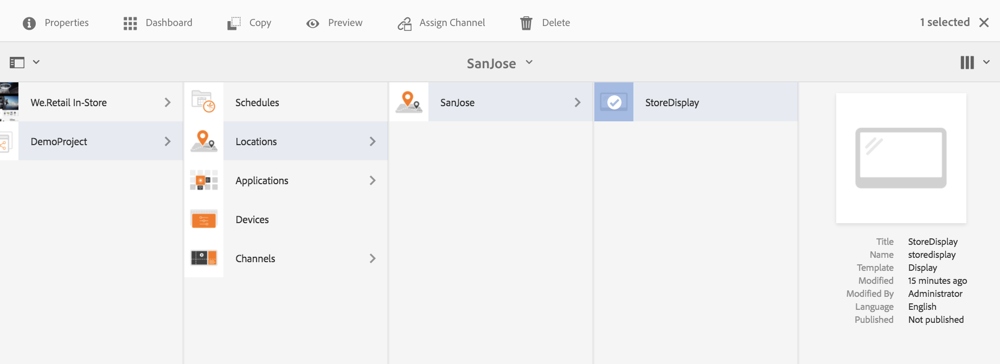

# Channel Assignment {#channel-assignment}

This section covers the following topics:

* **Assigning a Channel**
* **Understanding Properties of Channel Assignment dialog box**
* **Dayparting**

Once you defined a display, you need to assign a channel to a display.

This page shows assigning channel to your displays.

**Pre-requisites**:

* [Configuring and Deploying Screens](/help/screens/configuring-screens-introduction.md)
* [Create and Manage Screens Project](/help/screens/creating-a-screens-project.md)
* [Create and Manage Channels](/help/screens/managing-channels.md)
* [Create and Manage Locations](/help/screens/managing-locations.md)
* [Create and Manage Displays](/help/screens/managing-displays.md)

## Assign a Channel {#assign-a-channel}

Follow the steps below to assign a channel to a display:

1. Navigate to the required display, for example, **DemoProject** &gt; **Locations** &gt; **SanJose** &gt; **StoreDisplay**.

   

1. Tap/click **Assign Channel** in the action bar

   Or,

   Tap/click **Dashboard**and click **+Assign Channel** from the **ASSIGNED CHANNNELS** panel to open the **Channel Assignment** dialog box.

   

   You can configure the following properties from the **Channel Assignment** dialog box:

   **Channel Role**:

   Channel role defines the context of the display. The role is targeted by various actions and is independent of the actual channel that fulfils the role.

   **Reference Channel**:

   Reference channel allows you to provide a reference to the desired channel, either by channel name or by channel path.

    * **by path**: you provide an explicit reference using the absolute path of the channel.
    * **by name**: You enter the name of the channel that will resolve to an actual channel by context. This feature allows you to create local version of a channel, in order to dynamically resolve location-specific content. For example, a channel with name *deals of the day*, where the actual content would be different in two cities, but you still have the sane channel role on all the displays.

   **Priority:**

   Priority is used to order the assignments in case multiple ones match the playing criteria. The one with the highest value will always take precedence over lower values. For example, if there are two channels A and B. A has a priority of 1 and B has a priority of 2, then channel B is displayed, as it has a higher priority than A.

   The priority for a channel is set as a number (1 for minimum) in the **Channel Assignment **dialog box, as mentioned above. Additionally, the assigned channels are sorted based on descending priority.

   **Supported Events**:

    * **Initial Load**: loads the channel when the player is started. It can be assigned to multiple channels in combination with schedule
    * **Idle Screen**: loads when the screen is idle. It can be assigned to multiple channels in combination with schedule
    * **Timer**: needs to be set when a schedule is provided
    * **User Interaction**: the player will switch to the specified channel, if there is a user interaction on the screen (touch) in an idle channel and will load when the screen is touched

   **Schedule**:

   Schedule allows you to provide a description in text when the channel should appear. It also let's you define a start date (**active from**) and an end date (**active until**) for the channel to be shown. The syntax for the schedule expression is based on later.js' text and cron syntaxes:

    * [https://bunkat.github.io/later/parsers.html#text](https://bunkat.github.io/later/parsers.html#text)
    * [https://bunkat.github.io/later/parsers.html#cron](https://bunkat.github.io/later/parsers.html#cron)

   **Show Attraction Tooltip**:

   Show attraction tooltip defines if the attraction tooltip ("*Touch anywhere to begin*") must be shown or not while the channel is running.

1. Click **Save** to assign the created channel to a display.

## Dayparting {#dayparting}

Schedules when when combined with **Dayparting**, allows you to set a global schedule with multiple channels running at specific times of the day, and re-use that setup for all your displays at once.

DayParting refers to as splitting up a day into time slots and specifying which content plays at the desired time. AEM Screens allows you to schedule channels in terms of dayparting within a day, week, or month as per the requirement.

The following examples explain dayparting in channels in three different scenarios:

### Playing content on a single day divided into multiple time slots {#playing-content-on-a-single-day-divided-into-multiple-time-slots}

This example shows how a Restaurant uses dayparting to showcase its breakfast, lunch and dinner menu.

Here, we will divide each day into three different time slots, so that channel content plays as per the specified time of the day: 

| **Channel** |**Role** |**Priority** |**Schedule** |
|---|---|---|---|
| Menu_A |Breakfast |  |after 6:00 and before 11:00 |
| Menu_B |Lunch |  |after 11:00 and before 15:00 |
| Menu_C |Dinner |  |after 15:00 and before 20:00 |

#### Playing content on a particular day of the week {#playing-content-on-a-particular-day-of-the-week}

This example shows the dayparting achieved in a casino where live event occurs every weekend from 8:00 pm until 10:00 pm and specials are available for dinner menu after 10:00 pm until 1:00 am.

<table> 
 <tbody> 
  <tr> 
   <td><strong>Channel</strong></td> 
   <td><strong>Role</strong></td> 
   <td><strong>Priority</strong></td> 
   <td><strong>Schedule</strong></td> 
  </tr> 
  <tr> 
   <td>LiveConcert</td> 
   <td>Weekend</td> 
   <td> </td> 
   <td>Oct 21, 2017 - Oct 22, 2017   after 20:00 before 22:00</td> 
  </tr> 
  <tr> 
   <td>SpecialsDinner</td> 
   <td>Weekend</td> 
   <td> </td> 
   <td>Oct 21, 2017 - Oct 22, 2017   after 22:00 before 1:00</td> 
  </tr> 
 </tbody> 
</table>

### Playing content for a particular month/months {#playing-content-for-a-particular-month-months}

This example shows the dayparting for a store that displays their summer collection from the months of June until August and fall collection from September until the end of October.

Here, you will create dayparting as per months, so that channel content plays as per the specified months of the year. 

| **Channel** |**Role** |**Priority** |**Schedule** |
|---|---|---|---|
| SummerCollection |Summer |  |June 01, 2017 - Aug 31, 2017 |
| FallCollection |Fall |  |Sep 01, 2017 - Oct 30, 2017 |

>[!NOTE]
>
>Additionally, you can define ***Priority*** for each of the channels. For example, if two channels are set for the same day and time or for the same month, then the channel with higher priority is played first. The minimum value for priority can be set as 0.

### Playing content for channels with same priority {#playing-content-for-channels-with-same-priority}

This examples shows the dayparting for a store that displays their winter collection with the same schedule in the month of December. But since the Channel B has priority set as 2, during that week; channel B plays its content rather than Channel A.

| **Channel** |**Role** |**Priority** |**Schedule** |
|---|---|---|---|
| A |Winter |1 |Dec 01, 2017 - Dec 31, 2017 |
| B |Christmas |2 |Dec 24, 2017 - Dec 31, 2017 |

