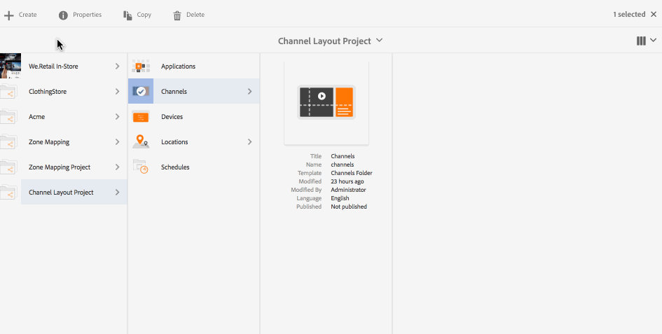
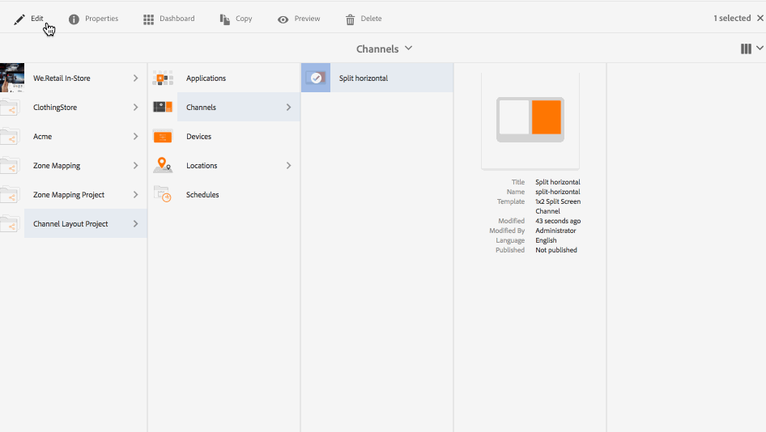
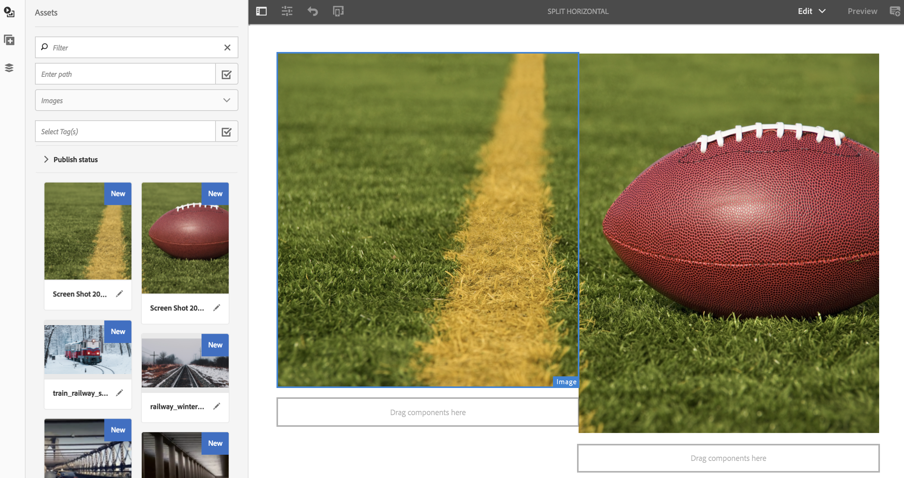
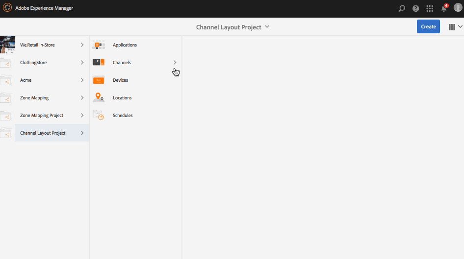
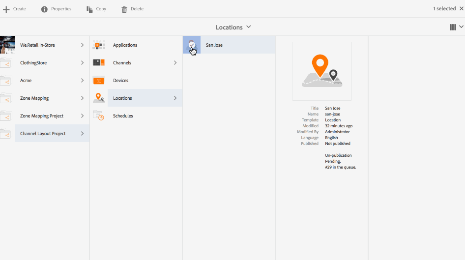
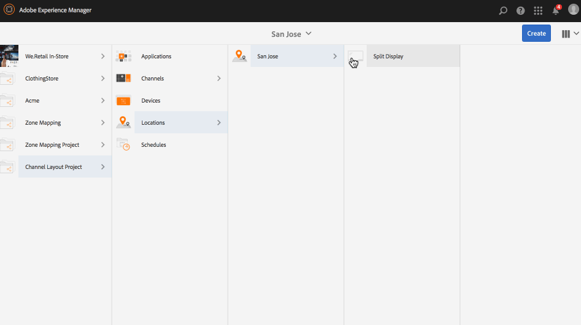
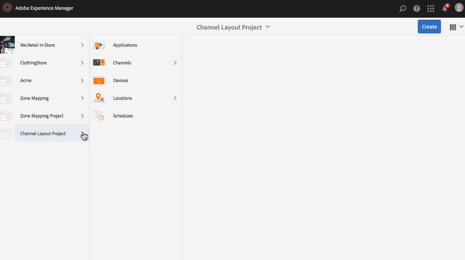

# Channel Layout Editor{#channel-layout-editor}

***Channel Layout Editor*** allows you to create multi zone content and use variety of assets such as videos, images, and text that can be combined in a single screen in contexual ways. You can pull in images, videos, and texts and allow it all to blend together and create an intuitive and interactive digital experience.

As per the project requirements, sometimes you need multiple zones in a channel and edit them as one comprehensive unit. For example, a product sequence with a related social media feed running in three separate zones on a single channel.

## Overview {#overview}

While creating a channel, you can use diffrent templates in order to create zones in your channel. You can add an image, video, or an embedded channel to leverage content as per your project requirements.

### Use Case Description {#use-case-description}

The following use case describes creating multi-zones in a channel.

1. ***Creating a Screens Project***

    1. Select the Adobe Experience Manager link (top left) and then **Screens**. Alternatively, you can go directly to: http://localhost:4502/screens.html/content/screens.
    1. Click **Create** to create a new Screens project.
    1. Select **Screens** from the **Create Screens Project** wizard and click **Next**. 
    1. Enter the title as **Channel Layout Project** and click **Create**.

   

1. ***Creating a Channel***

    1. Navigate to **Channel Layout Project**.
    1. Click **Create** from the action bar. A wizard will open.
    1. Choose the **1x2 Split Screen Channel** and click **Next**. 
    1. Enter the **Title** as **Split horizontal** and click **Create**.

   

1. ***Adding Content to your channel***

    1. Navigate to the **Channel Layout Project** you created and select the channel (**Split Channel**).
    1. Click **Edit** from the action bar and the editor for the **Split Channel** opens.
    1. Click the icon that toggles side panel on left hand side of the action bar to open the assets and components. Drag and drop the components you want to add to your channel.

   

   >[!NOTE]
   >
   >As an example, fhe following two images are added to the channel in the editor.

   

1. ***Creating a Location***

    1. Navigate to the Locations folder where you want to create your display (**Channel Layout Project**--&gt; **Locations**).
    1. Click **Create** from the action bar. 
    1. Select **Location** from the **Create** wizard and click **Next**.
    1. Enter **Title** for your location as **San Jose**.
    1. Click **Create**.

   

1. ***Creating a new Display***

    1. Navigate to the location where you want to create your display (**Acme** --&gt; **Locations** --&gt; **San Jose**) and select **San Jose**.
    1. Click **Create** from the action bar. Select **Display** from the **Create** wizard and click **Next**.
    1. Enter **Title** for your display location (enter the title as **Split Display)**.
    1. Under the **Display** tab, choose the details of the Layout. Choose the **Resolution** as **Full HD**. Choose the **Number of Devices Horizontally** as 1 and the **Number of Devices Vertically** as **1**.
    1. Click **Create**.

   

1. ***Assigning a channel***

    1. Navigate to the display from **Channel Layout Project** --&gt; **Locations** --&gt; **San Jose** --&gt; **Split Display**.
    1. Select **Split Display** and tap/click **Assign Channel** from the action bar, Or,
    1. Click **Dashboard** and select **+Assign Channel** at the top right from **ASSIGNED CHANNELS & SCHEDULES** panel. **Channel Assignment** dialog box opens.
    1. Enter the **Channel Role** as **Split**.
    1. Select **Reference Channel** by path. Select the channel folder path (**Channel Layout Project** --&gt; **Channels** --&gt; **Split horizontal**) in the Channel.
    1. Select the **Priority** for this channel as **1**.
    1. Choose the **Supported Events** as **Initial Load** and **Idle Screen**.
    1. Click **Save**.

   

1. ***Registering and Assigning the Device***

    1. Launch a separate browser window. Go to Screens player using the web browser or launch the AEM Screens app.
    1. When you open the device you will notice the device's state as unregistered. From the AEM dashboard, navigate to **Channel Layout Project** --&gt; **Devices**.
    1. Click **Device Manager** from the action bar.
    1. Click **Device Registration** and you will see the pending devices. Select the device you want to register and click **Register Device**.
    1. You will need to validate the code by verifying the code from the web browser or AEM Screens player. Click **Validate** to navigate to **Device Registration** screen.
    1. Enter Title as **NewD** and click **Register** and the device will be registered.
    1. Click **Assign Display** to move on to the next step where you assign the device to a display.
    1. Click Assign Device fand select the display path for your channel () as /content/screens/Test_Project/Locations/TestLocation/TestDisplay. Click **Assign**.
    1. Click **Finish** to complete the process, and now the device is assigned.

   

#### Viewing Content in AEM Screens Player {#viewing-content-in-aem-screens-player}

Load your AEM Screens Player or use the web browser. You will notice the content of the channel displayed in your Screens player. The content is displayed as 1x2 split screen channel template.

 

### Inference {#inference}

Using the available templates while creating a channel allows you to leverage and sisplay your content in different zones. The above example shows the use case for 2x2 template.

The following images show the layout that can be acheived using different templates.
