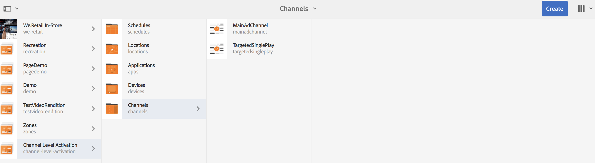
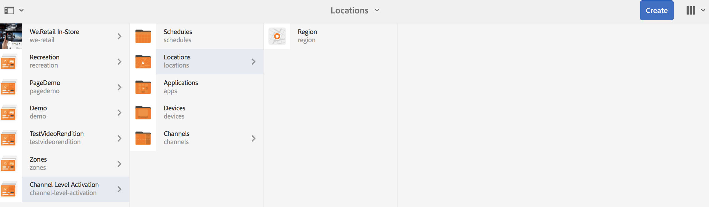
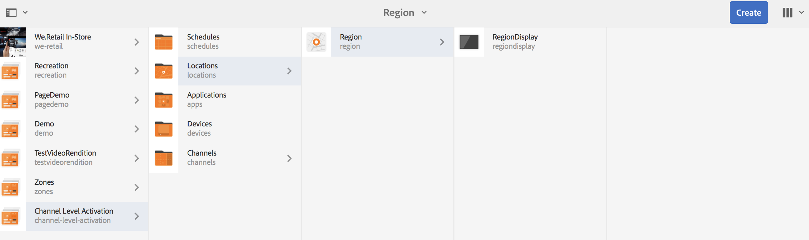
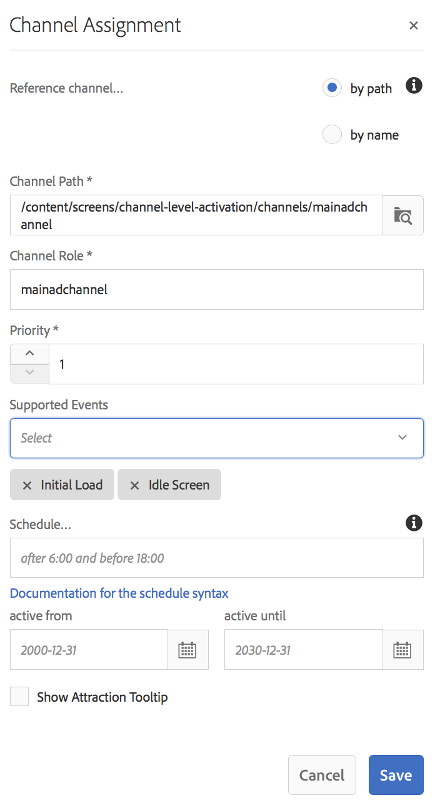
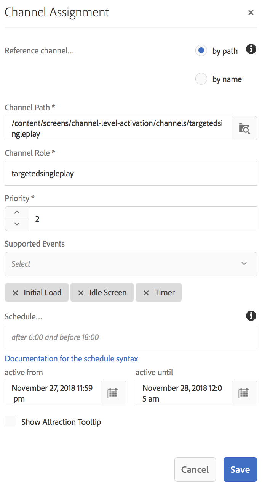
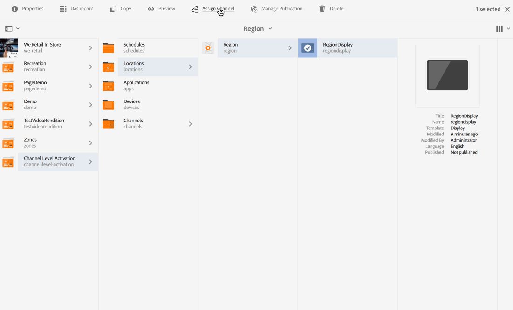

# Channel Level Activation - Single Event Playback{#channel-level-activation-single-event-playback}

Using Channel Level Activation covers the following topics:

* **[Overview](/help/screens/channel-level-activation.md#overview)**
* **[Using Channel Level Activation as a Single Event Playback](/help/screens/channel-level-activation.md#using-channel-level-activation)**

    * **[Prerequisites](/help/screens/channel-level-activation.md#prerequisites)**
    * **[Implementation](/help/screens/channel-level-activation.md#implementation)**

* **[Viewing the Results](/help/screens/channel-level-activation.md#viewing-the-results)**

## Overview {#overview}

***Channel Level Activation*** allows the channels to switch after a particluar set schedule. The single event channel replaces the main channel after a set schedule and plays for a particular time, until the main channel plays its content again.

The following example provides a solution by focusing on the following key terms:

* a ***main sequence channel*** for the global sequence
* a ***single event channel*** that runs only once at a set time 
* a ***set schedule and priority*** for the single playback event that occurs inside the main sequence channel

## Using Channel Level Activation {#using-channel-level-activation}

The following section explains the creation of a single event playback inside a channel for an AEM Screens project.

### Prerequisites {#prerequisites}

Before you start implementing this functionality, please make sure you have the following prerequisites ready to start implementing channel level activation:

* Create an AEM Screens project (in this example, **Channel Level Activation**)  

* Create a channel as **MainAdChannel** under **Channels** folder

* Create another channel as **TargetedSinglePlay** under **Channels** folder  

* Add relevant assets to both the channels

The following image shows the **Channel Level Activation** project with **MainAdChannel** and **TargetedSinglePlay** channels in **Channels** folder.

>[!NOTE]
>
>For additional information on how to create a project and how to create a sequence channel, please refer to resources below:
>
>* [Creating and Managing Projects](/help/screens/creating-a-screens-project.md)  
>
>* [Managing a Channel](/help/screens/managing-channels.md)
>

### Implementation {#implementation}

Implementing Channel Level Activation in an AEM Screens project involves three major tasks:

1. **Setting up Project taxonomy including Channels, Locations, and Displays**
1. **Assigning Channels to Display**
1. **Setting up a Schedule and Priority**

Follow the steps below to implement the functionality:

1. **Create a Location**

   Navigate to your **Locations** folder in your AEM Screens project and create a location as **Region**.

   

   >[!NOTE]
   >
   >To learn how to create a location, please refer to **[Creating and Managing Locations](/help/screens/managing-locations.md)**.

1. **Create Display under Location**

    1. Navigate to **Channel Level Activation** > **Locations** > **Region**.
    1. Select **Region** and click **+ Create** from the action bar.
    1. Select **Display** from the wizard and create a display titled as **RegionDisplay.**

   

1. **Assign Channels to Display**

   For **MainAdChannel:**

    1. Navigate to **Channel Level Activation** > **Locations** > **Region** > **RegionDisplay** and click **Assign Channel** from the action bar.
    1. **Channel Assignment** dialog box opens.
    1. Select **Reference Channel**.. by path.
    1. Select the **Channel Path** as **Channel Level Activation** --&gt; ***Channels*** --&gt; ***MainAdChannel***.
    1. The **Channel Role** is populated as **mainadchannel**.
    1. Select the **Priority** as **1**. 
    1. Select the **Supported Events** as **Initial Load** and **Idle Screen**.
    1. Click **Save**.

   

   >[!NOTE]
   >
   >You can also assign channel from the display dashboard by navigating to **Channel Level Activation** --&gt; **Locations** --&gt; **Region** --&gt; **RegionDisplay** and clicking **Dashboard** from the action bar. Click **+ Assign Channel** from the **ASSIGNED CHANNELS & SCHEDULES** panel.

   Similarly, assign channel **TargetedSinglePlay** for display**:

    1. Navigate to **Channel Level Activation** --&gt; **Locations** --&gt; **Region** --&gt; **RegionDisplay** and click **Assign Channel** from the action bar.
    1. **Channel Assignment** dialog box opens.
    1. Select **Reference Channel**.. by path.
    1. Select the **Channel Path** as **Channel Level Activation*** --&gt; ***Channels*** --&gt; ***TargetedSinglePlay***.*
    1. The **Channel Role** is populated as **targetedsingleplay**.
    1. Set the **Priority** as **2**. 
    1. Select the **Supported Events** as **Initial Load**, **Idle Screen **and** Timer***, *as shown in the figure below.
    1. Choose the date in **active from** as November 27, 2018 11:59 pm and in **active until** as November 28, 2018 12:05 am.* 
       *
    1. Click **Save**.* 
       *

   >[!CAUTION]
   >
   >You must set the priority for **TargetedSinglePlay** channel higher than the **MainAdSegment** channel.

   

   >[!NOTE]
   >
   >To choose the same day, you have to select the next day and the manually edit the date to the same day but for a later time. This restricts the user from selecting a past date. Please refer to the example below:

   

## Viewing the Results {#viewing-the-results}

Once you have the set up for channels and display complete, please launch the AEM Screens player to view the content.

The player displays the content of **MainAdChannel** and exactly at 11:59 pm (as set in the schedule), the **TargetedSinglePlay** channel will display its content until 12:05 am and then the **MainAdChannel** will resume playing its content again.

>[!NOTE]
>
>To learn about AEM Screen Player, please refer to the following resources:
>
>* [**AEM Screens Player downloads**](https://download.macromedia.com/screens/)
>* [**Working with AEM Screens Player**](/help/screens/working-with-screens-player.md)
>

