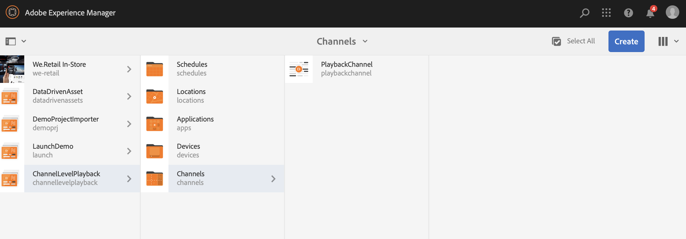
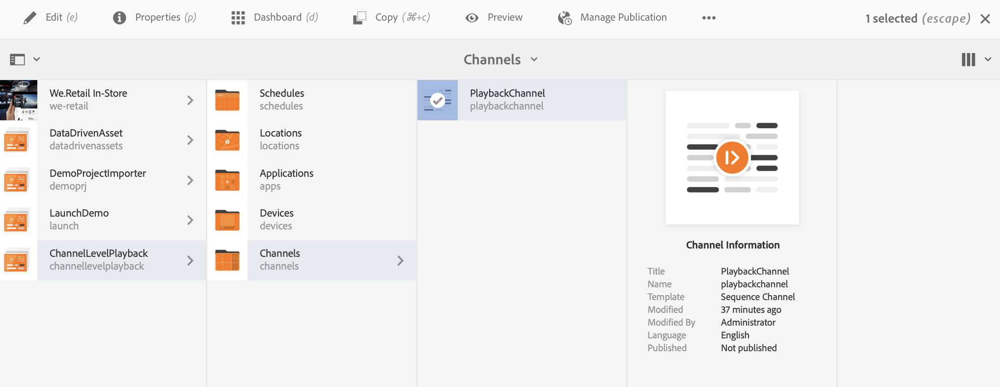
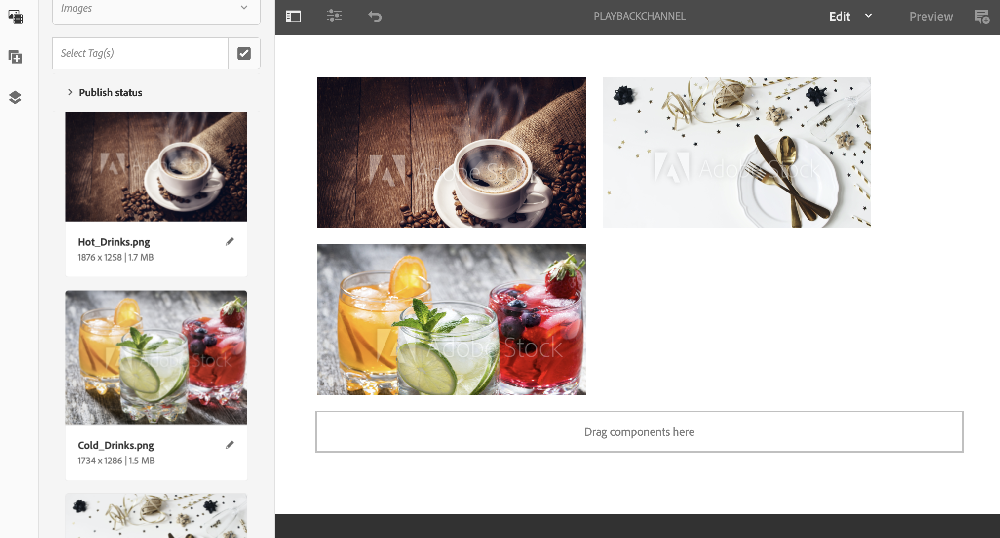
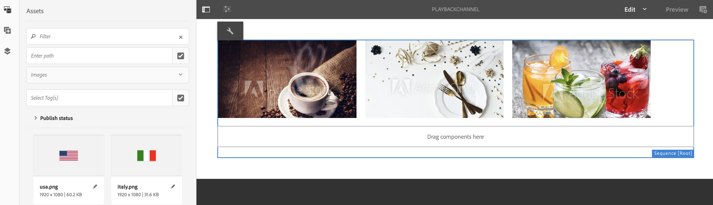
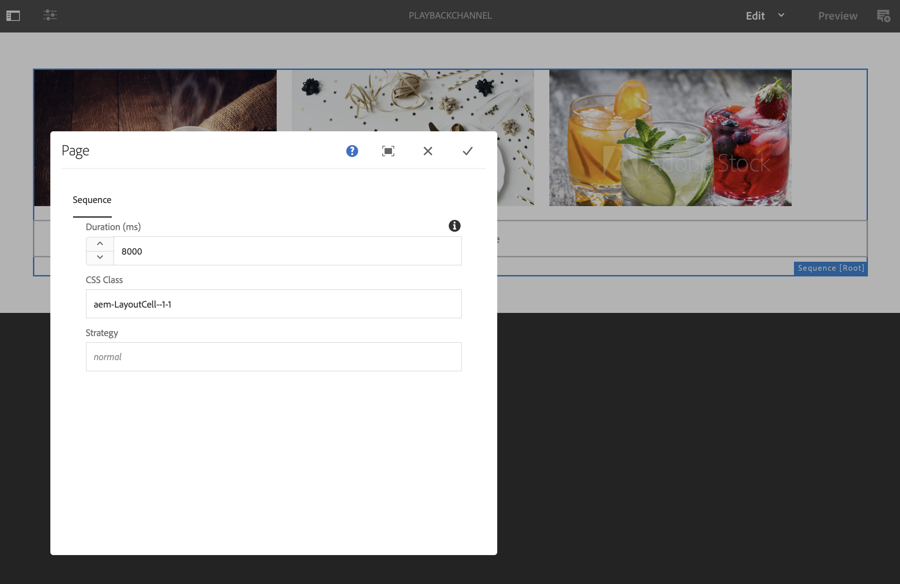
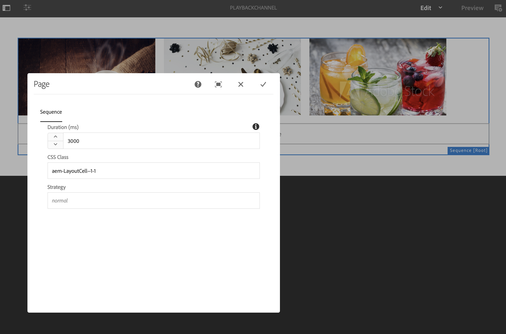

# Channel Level Bulk Image Playback Duration{#channel-level-bulk-image-playback-duration}

## Overview {#overview}

Once you create a sequence channel and add images to it, by default, all images will assume the playback duration defined in the Channel level configuration. Any individual image can still override the default and have a different playback duration, this is accomplished by editing the playback duration of the specific image component.

### Prerequisites {#prerequisites}

Before you start implementing this functionality, make sure you have set up a project as a prerequisite to start implementing this functionality. For example,

1. Create an AEM Screens project (in this example, **ChannelLevelPlayback**)  

1. Create a sequence channel as **PlaybackChannel** under **Channels** folder

1. Add content to **PlaybackChannel**

## Editing Channel Level Image Playback Duration Assignment {#editing-channel-level-image-playback-duration-assignment}

The section below explains how to edit the playback duration of content in an AEM Screens channel.

### Updating the Playback Duration for Images in a Channel {#updating-the-playback-duration-for-images-in-a-channel}

Follow the steps below to learn how to update Channel Level Image Playback Duration Assignment:

1. Navigate to the sequence channel **PlaybackChannel**.

   

1. Click **Edit** from the action bar to open the editor.

   

1. Add two or more images in the channel editor, as shown in the figure below.

   

1. Select all the images in the channel and click the wrench icon on the top left (as shown in the figure below) to open Channel level Configure dialog box.

   

1. **Page** dialog box opens.

   >[!NOTE]
   >
   >By default, the images in a channel are set to a playback duration of 8 seconds.

   

   Edit the **Duration** from 8000 (ms) to 3000 (ms), that is, 3 seconds. Click the check mark on the top right of the **Page** dialog box to save your changes.

   

### Viewing the Result {#viewing-the-result}

Once you have updated the channel playback duration (in this example, all three images) you will notice that the images will now play for 3 seconds rather than 8 seconds (default value).

