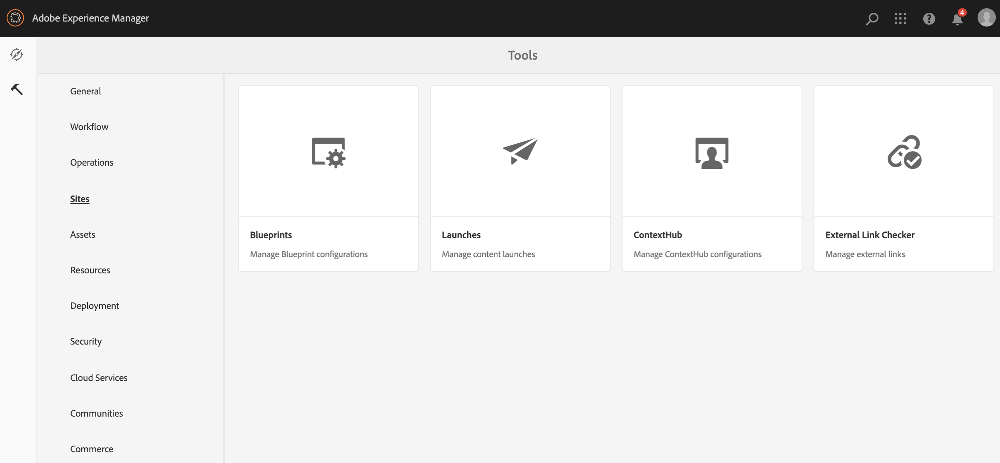
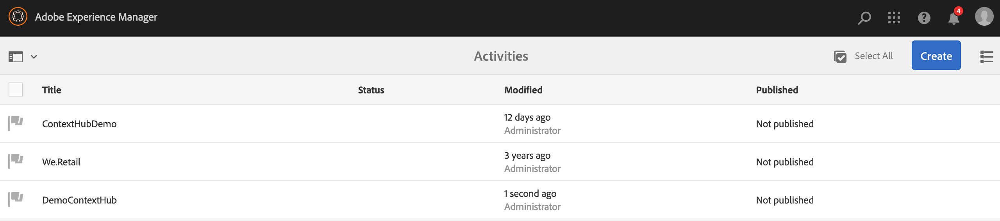
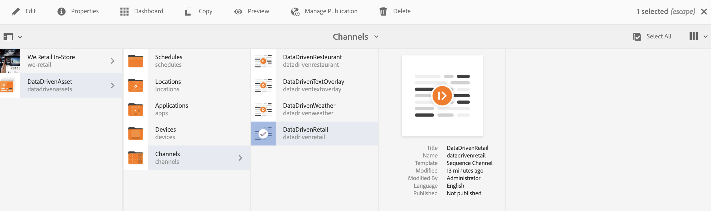
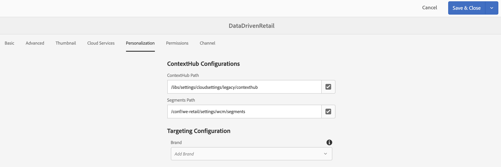
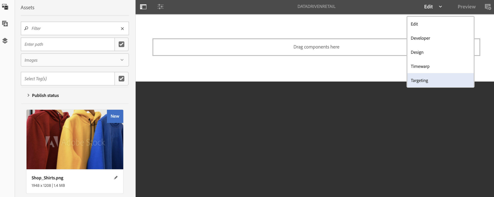

# Configuring ContextHub in AEM Screens{#configuring-contexthub-in-aem-screens}

This section emphasizes on creating and managing data driven asset changes using a a data store.

## Key Terms {#key-terms}

Before we get into the details of creating and managing inventory driven channels in your AEM Screens project, you must learn few of the key terms that are important and relevant to the different scenarios.

**Brand** Refers to your high level project description.

**Area** Refers to your AEM Screens project name such as Digital Ad Signage

**Activity** Defines the rule category such as Inventory-Driven, Weather-Driven, Department Availability-Driven, and so on.

**Audience** Defines the rule.

**Segment** Refers to the version of the asset to play for the given rule such as if the temperature is below 50 degrees fahrenheit, then the screen displays an image of a hot coffee otherwise a cold drink.

The following diagram provides a visual representation of how ContextHub Configurations coincide with Activity, Audience, and Channels.


## Preconditions {#preconditions}

Before you start setting up a data store for configuring Context Hub Configurations for an AEM Screens project, you must set up Google Sheets (for demonstration purposes).

>[!CAUTION]
>
>Google Sheets is used in the following example as a sample database system from where the values are fetched and is solely for educational purposes. Adobe does not endorse using Google Sheets for production environments.
>
>For more information, refer to [Get API Key](https://developers.google.com/maps/documentation/javascript/get-api-key) in Google documentation.

## Step 1: Setting up a Data Store {#step-setting-up-a-data-store}

Follow the steps below to set up a data store that allows you to use ContextHub configurations and segments path to AEM Screens channel.

1. **Navigating to ContextHub**

   Navigate to your AEM instance and click the tools icon from left sidebar. Click **Sites** --&gt; **ContextHub**, as shown in the figure below.

   

1. **Creating a new ContextHub Store Configuration**

    1. Navigate to **global** &gt; **default** &gt; **ContextHub Configuration**.

    1. Click** Create &gt; Configuration Container **and enter the title as** ContextHubDemo**.

    1. **Navigate** to **ContextHubDemo** &gt; **ContentHub Store Configuration...** to open the **Configure wizard**.

    1. Enter the **Title** as **Google Sheets**, **Store Name** as **googlesheets**, and **Store Type** as **contexthub.generic-jsonp**

    1. Click **Next**
    1. Enter your specific json configuration**.** For example, you can use the following json for demo purposes.
    1. Click **Save**.

   ```
   {
     "service": {
       "host": "sheets.googleapis.com",
       "port": 80,
       "path": "/v4/spreadsheets/<your sheet it>/values/Sheet1",
       "jsonp": false,
       "secure": true,
       "params": {
         "key": "<your API key>"
       }
     },
     "pollInterval": 3000
   }
   ```

   >[!NOTE]
   >
   >In the above sample code, **pollInterval** defines the frequency at which the values are refreshed (in ms).
   >
   >
   >Replace the code with your *&lt;Sheet ID&gt;* and *&lt;API Key&gt;*, that you fetched while setting up the Google Sheets.

   >[!CAUTION]
   >
   >If you create your Google Sheets store configurations outside of the legacy folder (for instance in your own project folder), then targeting will not work out of the box.
   >
   >
   >In case, you want to configure the Google Sheets store configurations outside the global legacy folder, then you should must set the **Store Name** as **segmentation** and **Store Type** as **aem.segmentation**. Additionally, you have to skip the process of defining the json as defined above.

1. **Creating a Brand in Activities**

    1. Navigate from your AEM instance to **Personalization** &gt; **Activities**

    1. Click** Create** &gt; **Create Brand**

    1. Select **Brand** from the **Create Page** wizard and click **Next**

    1. Enter the **Title** as **ContextHubDemo** and click **Create**. Your brand is now created as shown below.

   

1.

   >[!CAUTION]
   >
   >Known Issue:
   >
   >
   >To add an area, remove the master from the URL, such as
   >
   >
   >[https://localhost:4502/libs/cq/personalization/touch-ui/content/v2/activities.html/content/campaigns/contexthubdemo/master](https://localhost:4502/libs/cq/personalization/touch-ui/content/v2/activities.html/content/campaigns/contexthubdemo/master)

   **Creating an Area in your Brand**

    1. Click **Create** &gt; **Create Area**

    1. Select **Area** from the** Create Page** wizard and click Next

    1. Enter the **Title** as **GoogleSheets** and click **Create**. Your area will be created in your activity.

## Step 2: Setting Up Audience Segmentation {#step-setting-up-audience-segmentation}

Once you have set up a data store and defined your brand, follow the steps below to set up audience segments.

1. **Creating Segments in Audiences**

    1. Navigate from your AEM instance to **Personalization** &gt; **Audiences** &gt; **We.Retail**.

    1. Click **Create** &gt; **Create Context Hub Segment.** The **New ContextHub Segment** dialog box opens.**

    1. Enter the **Title** as **SheetA1 1** and click **Create**. Similarly, create another segment titled as **SheetA2 2**.

1. **Editing the Segments**

    1. Select the segment **Sheets A1 1** (created in step (5)), and click **Edit** from the action bar.

    1. Drag and drop the **Comparison: Property - Value** component to the editor.
    1. Click the wrench icon to open the **Comparing a property with value** dialog box.
    1. Select **googlesheets/value/1/0** from the drop-down in **Property name**.

    1. Select the **Operator** as **Equal **from the drop-down menu.

    1. Enter the **Value** as **1**.

   >[!NOTE]
   >
   >The AEM validates your data from the Google Sheet by showing your segment as green.

   

   Similarly, edit the property values to **Sheets A1 2**.

    1. Drag and drop the **Comparison: Property - Value** component to the editor.
    1. Click the wrench icon to open the **Comparing a property with value** dialog box.
    1. Select **googlesheets/value/1/0** from the drop-down in **Property name**.

    1. Select the **Operator** as **Equal **from the drop-down menu.

    1. Enter the **Value** as **2**.

   >[!NOTE]
   >
   >The rules applied in the preceding steps are just an example as to how you set up segments for implementing the following use cases.

## Step 3: Enabling Targeting in Channels {#step-enabling-targeting-in-channels}

Follow the steps below to enable targeting in your channels.

1. Navigate to one of the AEM Screens channel**. **The following steps demonstrate how to enable targeting by using **DataDrivenRetail** created in an AEM Screens Channel.

1. Select the channel (**DataDrivenRetail**)and click **Properties** from the action bar.

   

1. Select the **Personalization** tab to setup the ContextHub configurations.

    1. Select the **ContextHub Path** as **libs** &gt; **settings** &gt; **cloudsettings** &gt; **default** &gt; **ContextHub Configurations** and click **Select**.

    1. Select the **Segments Path** as **conf** &gt; **We.Retail **&gt; **settings** &gt; **wcm** &gt; **segments** and click **Select**.

    1. Click **Save & Close**.

   >[!NOTE]
   >
   >Use the ContextHub and the Segments path, where you initially saved your context hub configurations and segments.

   

1. Navigate and select the **DataDrivenRetail** from **DataDrivenAssets** &gt; **Channels **and click **Edit** from the action bar.

   >[!NOTE]
   >
   >If you have set up everything correctly, you will see **Targeting** option in the drop-down from the editor, as shown in the figure below.

   

   >[!NOTE]
   >
   >Once you have configured the ContextHub configurations for your channel, make sure you follow preceding steps from 1 through 4, for the other three sequence channels too if you want to follow all the use cases below.

## Learn More: Example Use Cases {#learn-more-example-use-cases}

After you have configured ContextHub for your AEM Screens project, you can follow the different Use Cases to understand how data triggered assets plays a vital role in different industries:

1. **[Retail Inventory Targeted Activation](/help/screens/retail-inventory-activation.md)**
1. **[Travel Center Temperature Activation](/help/screens/local-temperature-activation.md)**
1. **[Hospitality Reservation Activation](/help/screens/hospitality-reservation-activation.md)**
