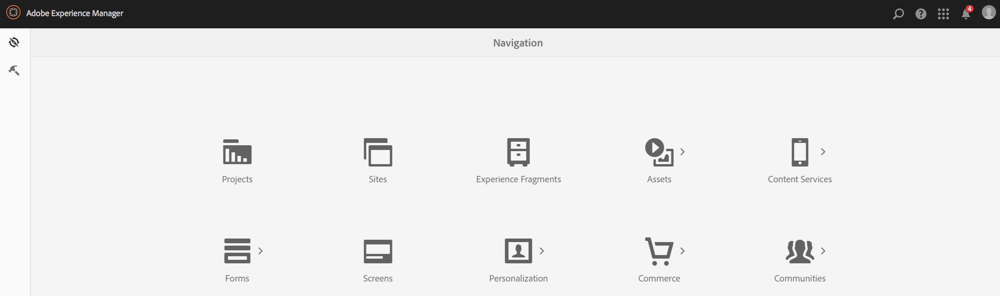
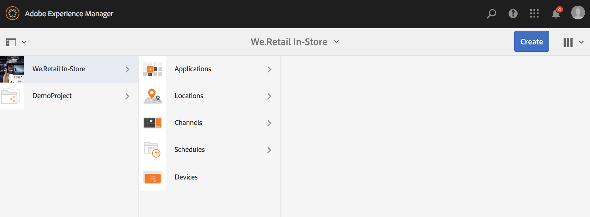
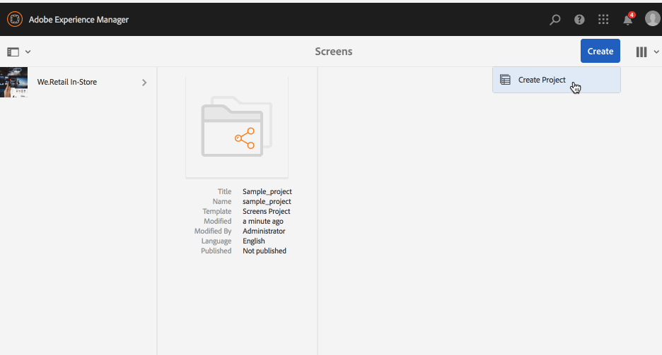
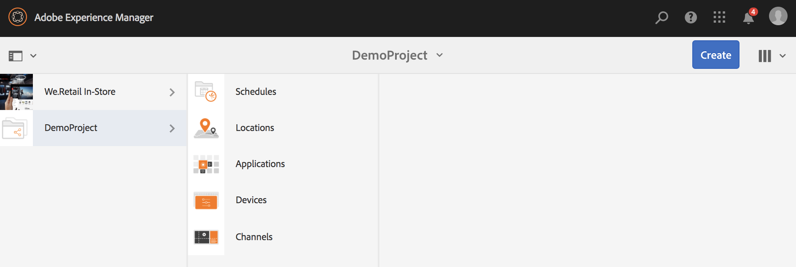
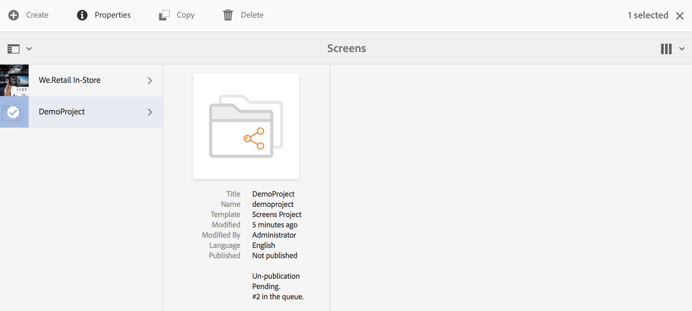
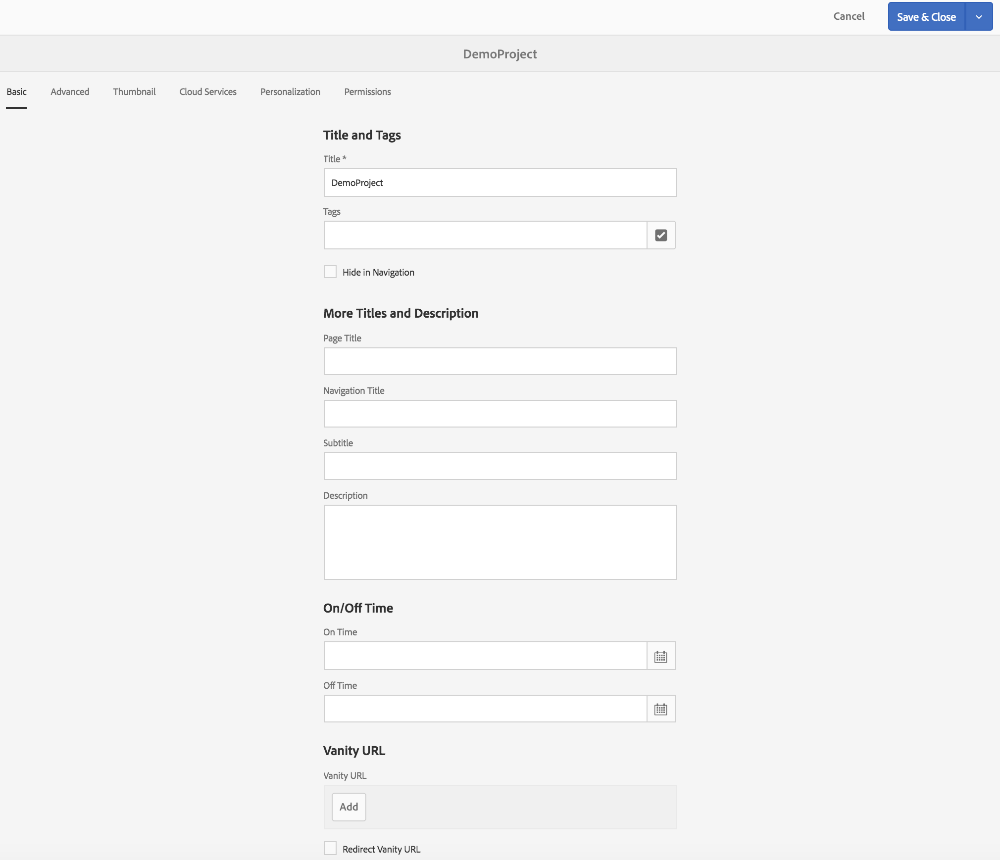
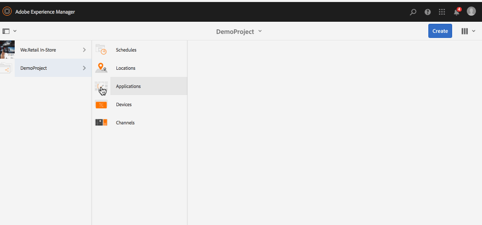

# Creating and Managing Projects{#creating-and-managing-projects}

The AEM Screens is available by selecting the Adobe Experience Manager link (top left) and then Screens.

Alternatively, you can go directly to: [http://localhost:4502/screens.html/content/screens](http://localhost:4502/screens.html/content/screens)

Different projects could be differents brands, deployments, customers, and so on.

>[!NOTE]
>
>**Navigation Tip:**
>
>You can also use the cursor keys to navigate through different folders in AEM. Additionally, once you select a particular entity, hit spacebar to edit or view properties for that specific folder.

## Creating a New Screens Project {#creating-a-new-screens-project}

Follow the steps below to create a new Screens project:

1. Select **Screens** from the AEM dashboard.
1. Click **Create **--&gt;** Create Project **and **Create Screens Project** wizard will open.

1. Select the **Screens** template and click **Next**.

1. Enter the properties (**Title** and **Name**) as required and click **Create**.

>[!NOTE]
>
>By default, the initial structure will contain the **Schedules**, **Locations**, **Applications**, **Channels**, and **Devices** master pages, but this can be manually adjusted if needed. You can remove the options, if the available ones are not relevant to your project.

The project is created and it brings you back to the Screens Project console. You can now select your project.

In a project, there are four kind of folders, as shown in the figure below:

* **Schedules**
* **Locations**
* **Applications**
* **Channels**
* **Devices**

 

### Viewing Properties {#viewing-properties}

Once you create the Screens project, click **Properties** on the action bar to edit properties of an exiting AEM Screens project. 

The following options allow you to edit/change properties of your *DemoProject*.

 

### Creating a Custom Folder {#creating-a-custom-folder}

You can also create your own custom folder under **Schedules**, **Locations**, **Applications**, **Channels**, and **Devices** master pages available in your project.

To create a custom folder:

1. Select your project and click on **Create** next to plus icon in the action bar. 
1. The **Create** wizard opens and select the appropriate option.
1. Click **Next**.
1. Enter the properties and click **Create**.

The following steps show the creation of an applications folder to your **Applications** master page in *DemoProject*.

 

### The Next Steps {#the-next-steps}

Once you have created your own project, see [**Channel Management**](/help/screens/managing-channels.md) to create and manage content in your channel.

Additionally, you can create your own schedule, application, location, or device.
