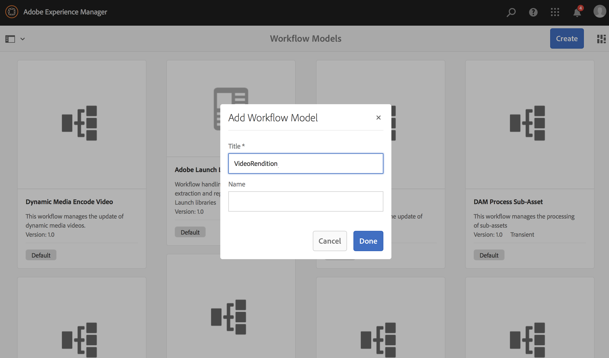
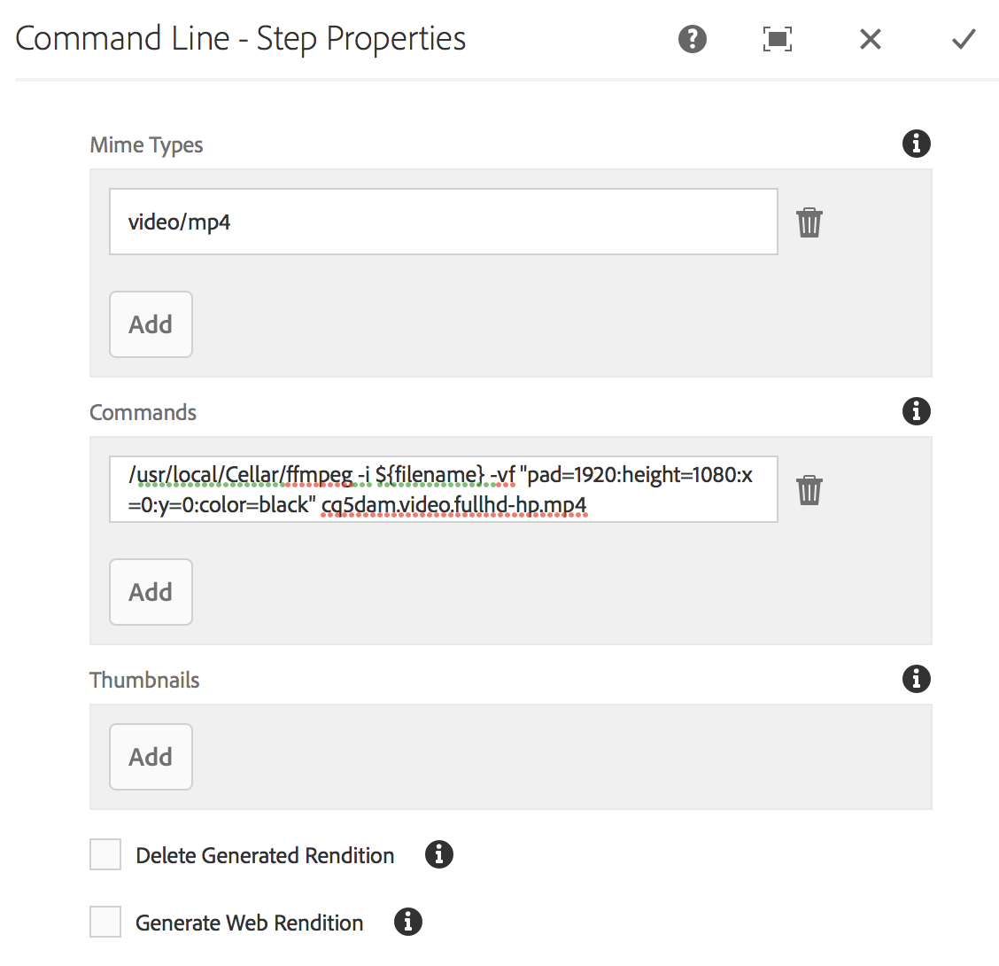
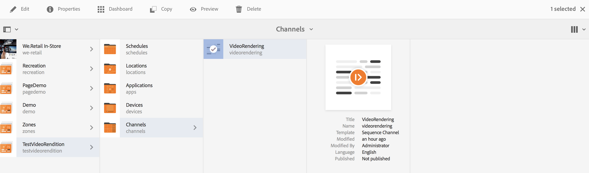
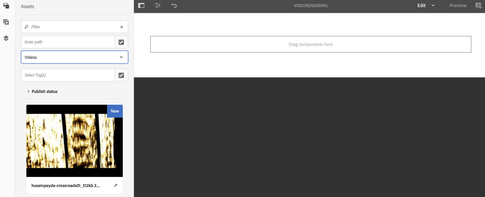
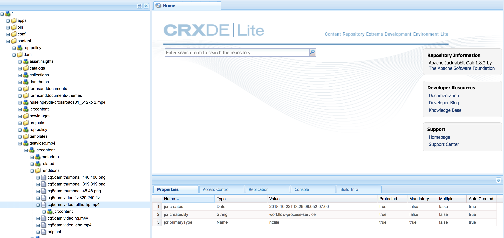

# Creating a Video Padding Workflow{#creating-a-video-padding-workflow}

This section covers the following topics:

* **Overview**
* **Prerequisites** 
* **Creating a Video Padding Workflow**
* **Using the Workflow in AEM Screens Project**
* **Validating the Output for the Workflow**

## Overview {#overview}

The following use case involves placing a video (example: 1280 x 720) in a channel where the display is 1920 x 1080 and having the video be placed at 0x0 (upper left). The video should not be stretched or modified in any way and do not use **Cover** in the video component.

The video will be displayed as an object from pixel 1 to pixel 1280 across and from pixel 1 to pixel 720 down and the rest of the channel will be default color.

## Prerequisites {#prerequisites}

Before you create a workflow for video, please complete the following prerequisites:

1. Upload a video in **Assets** folder in your AEM instance
1. Create an AEM Screens project (for example, **TestVideoRendition**) and a channel named (**VideoRendering**), as shown in the figure below:

 

## Creating a Video Padding Workflow {#creating-a-video-padding-workflow2}

To create a video padding workflow, you must create a workflow for your video and then use the same in your AEM Screens project channel.

Follow the steps below to create and use the workflow:

1. Creating a Workflow
1. Using the Workflow in an AEM Screens Project

### Creating a Workflow {#creating-a-workflow}

Follow the steps below to create a workflow for your video:

1. Navigate to your AEM instance and click tools from side rail. Select **Workflow** --&gt; **Models** to create a new model.

   

1. Click **Models** --&gt; **Create** --&gt; **Create Model**. Enter the **Title** (as **VideoRendition**) and **Name** in the **Add Workflow Model**. Click **Done** to add the workflow model.

   

1. Once you create the workflow model, select the model (**VideoRendition**), and click **Edit** from the action bar.

   

1. Drag and drop the **Command Line **component to your workflow.

   

1. Select the **Command Line** component and open the properties dialog box.

   

1. Select the **Arguments** tab to enter the fields in the **Command Line - Step Properties** dialog box.

   Enter the format in the **Mime Types** (as ***video/mp4***) and the command as (***/usr/local/Cellar/ffmpeg -i ${filename} -vf "pad=1920:height=1080:x=0:y=0:color=black" cq5dam.video.fullhd-hp.mp4***) to start the workflow in the **Commands** field.

   Please refer to the details on **Mime Types** and **Commands** in the note below.

   

1. Select the workflow (**VideoRenditions**) and click **Start Workflow** from the action bar to open the **Run Workflow** dialog bbox.

   

1. Select the path of your asset in the **Payload** (as ***/content/dam/huseinpeyda-crossroads01_512kb 2.mp4***) and enter the **Title **(as ***RunVideo***) and click **Run**.

   

### Using the Workflow in an AEM Screens Project {#using-the-workflow-in-an-aem-screens-project}

Follow the steps below to use the workflow in your AEM Screens project:

1. Navigate to an AEM Screens project (**TestVideoRendition** --&gt; **Channels** --&gt;**VideoRendition**).

   

1. Click **Edit** from the action bar. Drag and drop the video that you initially uploaded to **Assets**.

   

1. Once you have uploaded the video, click **Preview** to view the output.

   

## Validating the Output for the Workflow {#validating-the-output-for-the-workflow}

You can validate your output by:

* Check preview of the video in the channel
* Navigate to the ***/content/dam/testvideo.mp4/jcr:content/renditions/cq5dam.video.fullhd-hp.mp4*** in CRXDE Lite, as shown in the figure below:

