# Developing a Custom Component for AEM Screens{#developing-a-custom-component-for-aem-screens}

The following tutorial walks through the steps to create a custom component for AEM Screens. AEM Screens reuses many existing design patterns and technologies of other AEM products. The tutorial highlights differences and special considerations when developing for AEM Screens.

## Overview {#overview}

This tutorial is intended for developers who are new to AEM Screens. In this tutorial a simple "Hello World" component is built for a Sequence channel in AEM Screens. A dialog allows authors to update the text displayed.

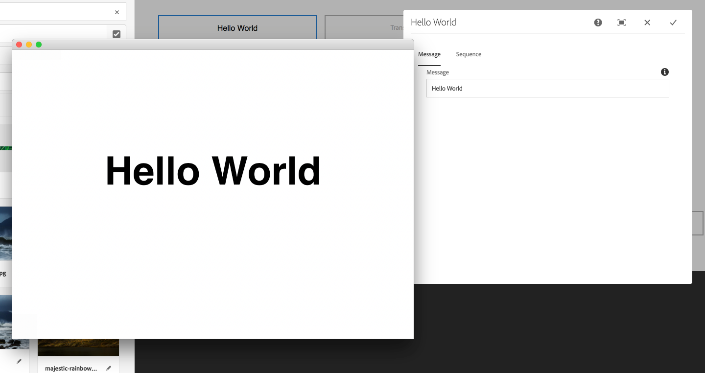 

## Prerequisites {#prerequisites}

To complete this tutorial the following is needed:

1. [AEM 6.4](https://helpx.adobe.com/experience-manager/6-4/release-notes.html) or [AEM 6.3](https://helpx.adobe.com/experience-manager/6-3/release-notes.html) + Latest Screens Feature Pack

1. [AEM Screens Player](https://helpx.adobe.com/experience-manager/6-4/sites/deploying/using/configuring-screens-introduction.html)
1. Local Development Environment

The tutorial steps and screen shots are performed using [CRXDE-Lite](http://localhost:4502/crx/de/index.jsp). [Eclipse](https://helpx.adobe.com/experience-manager/6-4/sites/developing/using/aem-eclipse.html) or [IntelliJ](https://helpx.adobe.com/experience-manager/6-4/sites/developing/using/ht-intellij.html) IDEs can also be used to complete the tutorial. More information on using an IDE to develop [with AEM can be found here.](https://helpx.adobe.com/experience-manager/kt/sites/using/getting-started-wknd-tutorial-develop/part1.html#eclipse-ide)

>[!NOTE]
>
>Before starting this tutorial, it is recommended to have reviewed the following:
>
>1. [Understanding AEM Screens](https://helpx.adobe.com/experience-manager/kt/screens/using/screens-concepts-feature-video-understand.html)
>1. [Screens Kickstart Guide](https://helpx.adobe.com/experience-manager/6-4/sites/deploying/using/kickstart-for-aem-screens.html)
>

## Project Setup {#project-setup}

A Screens project's source code is typically managed as a multi-module Maven project. To expedite the tutorial, a project was pre-generated using the [AEM Project Archetype 13](https://github.com/Adobe-Marketing-Cloud/aem-project-archetype). More details on [creating a project with Maven AEM Project Archetype can be found here](https://helpx.adobe.com/experience-manager/kt/sites/using/getting-started-wknd-tutorial-develop/part1.html#maven-multimodule).

1. Download and install the following packages using [CRX package manager](http://localhost:4502/crx/packmgr/index.jsp):

   [Get File](assets/base-screens-weretail-runuiapps-001-snapshot.zip)

   [Get File](assets/base-screens-weretail-runuicontent-001-snapshot.zip)
   **Optionally** if working with Eclipse or another IDE download the below source package. Deploy the project to a local AEM instance by using the Maven command:

   **`mvn -PautoInstallPackage clean install`**

   Start HelloWorld SRC Screens We.Retail Run Project

   [Get File](assets/src-screens-weretail-run.zip)

1. In [CRX Package Manager](http://localhost:4502/crx/packmgr/index.jsp) verify the following two packages are installed:

    1. **screens-weretail-run.ui.content-0.0.1-SNAPSHOT.zip**
    1. **screens-weretail-run.ui.apps-0.0.1-SNAPSHOT.zip**

   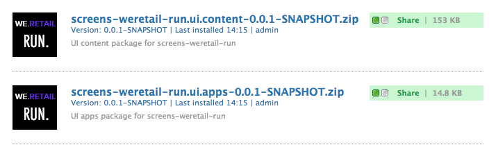

   Screens We.Retail Run Ui.Apps and Ui.Content packages installed via CRX Package Manager

1. The **screens-weretail-run.ui.apps** package installs code beneath `/apps/weretail-run`.

   This package contains the code responsible for rendering custom components for the project. This package includes component code and any JavaScript or CSS needed. This package also embeds **screens-weretail-run.core-0.0.1-SNAPSHOT.jar** which contains any Java code needed by the project.

   >[!NOTE]
   >
   >In this tutorial no Java code is written. If more complex business logic is needed, back-end Java can be created and deployed using the Core Java bundle.

   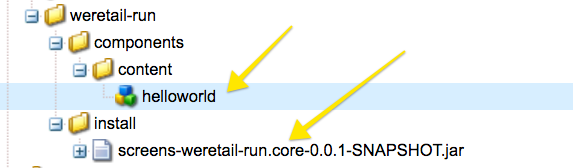

   Representation of the ui.apps code in CRXDE Lite

   The **helloworld** component is currently just a placeholder. Over the course of the tutorial, functionality will be added allowing an author to update the message displayed by the component.

1. The **screens-weretail-run.ui.content** package installs code beneath:

    * `/conf/we-retail-run`
    * `/content/dam/we-retail-run`
    * `/content/screens/we-retail-run`

   This package contains the starting content and configuration structure needed for the project. **`/conf/we-retail-run`** contains all configurations for the We.Retail Run project. **`/content/dam/we-retail-run`** includes starting digital assets for the project. **`/content/screens/we-retail-run`** contains the Screens content structure. The content beneath all of these paths is updated primarily in AEM. To promote consistency between environments (local, Dev, Stage, Prod) often a base content structure is saved in source control.

1. **Navigate to the AEM Screens &gt; We.Retail Run project:**

   From the AEM Start Menu &gt; Click the Screens the icon. Verify the We.Retail Run Project can be seen.

   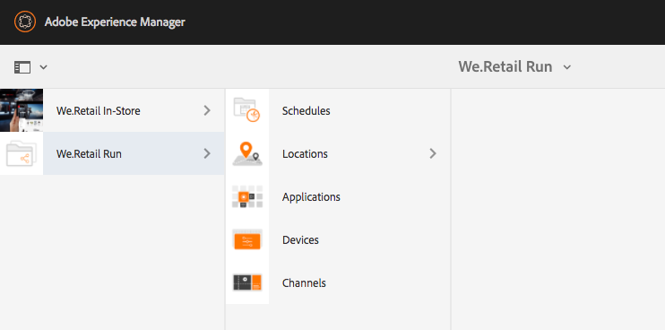

## Create the Hello World Component {#hello-world-cmp}

The Hello World component is a simple component that allows a user to input a message to be displayed on the screen. The component is based on the [AEM Screens Component Template: https://github.com/Adobe-Marketing-Cloud/aem-screens-component-template](https://github.com/Adobe-Marketing-Cloud/aem-screens-component-template).

AEM Screens has some interesting constraints that are not necessarily true for traditional WCM Sites components.

* Most Screens components need to run in fullscreen on the target digital signage devices
* Most Screens components need to be embeddable in the sequence channels to generate slideshows
* Authoring should allow editing individual components in a sequence channel, so rendering them fullscreen is out of the question

1. In [CRXDE-Lite](http://localhost:4502/crx/de/index.jsp) (or IDE of choice) navigate to `/apps/weretail-run/components/content/helloworld.`

   Add the following properties to the `helloworld` component:

   ```
       jcr:title="Hello World"
       sling:resourceSuperType="foundation/components/parbase"
       componentGroup="We.Retail Run - Content"
   ```

   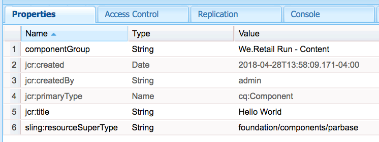

   Properties for /apps/weretail-run/components/content/helloworld

   The **helloworld** component extends the **foundation/components/parbase** component so it can properly be used inside a sequence channel.

1. Create a file beneath `/apps/weretail-run/components/content/helloworld` named `helloworld.html.`

   Populate the file with the following:

   ```xml
   <!--/* 
   
    /apps/weretail-run/components/content/helloworld/helloworld.html 
   
   */-->
   
   <!--/* production: preview authoring mode + unspecified mode (i.e. on publish) */-->
   <sly data-sly-test.production="${wcmmode.preview || wcmmode.disabled}" data-sly-include="production.html" />
   
   <!--/* edit: any other authoring mode, i.e. edit, design, scaffolding, etc. */-->
   <sly data-sly-test="${!production}" data-sly-include="edit.html" />
   ```

   Screens components require two different renderings depending on which [authoring mode](https://helpx.adobe.com/experience-manager/6-4/sites/authoring/using/author-environment-tools.html#PageModes) is being used:

    1. **Production**: Preview or Publish mode (wcmmode=disabled)
    1. **Edit**: used for all other authoring modes, i.e edit, design, scaffolding, developer...

   `helloworld.html`acts as a switch, checking which authoring mode is currently active and redirecting to to another HTL script. A common convention used by screens components is to have an `edit.html` script for Edit mode and a `production.html` script for Production mode.

1. Create a file beneath `/apps/weretail-run/components/content/helloworld` named `production.html.`

   Populate the file with the following:

   ```xml
   <!--/*
    /apps/weretail-run/components/content/helloworld/production.html  
      
   */-->
   
   <div data-duration="${properties.duration}" class="cmp-hello-world">
    <h1 class="cmp-hello-world__message">${properties.message}</h1>
   </div>
   ```

   Above is the production markup for the Hello World Component. A `data-duration` attribute is included since the component is used on a Sequence channel. The `data-duration` attribute is used by the sequence channel to know for how long a sequence item is to be displayed.

   The component renders a `div` and an `h1` tag with text. `${properties.message}` is a portion of HTL script that will output the contents of a JCR property named `message`. A dialog is created later that allows a user to enter a value for the `message` property text.

   Also note that BEM (Block Element Modifier) notation is used with the component. BEM is a CSS coding convention that makes it easier to create reusable components. BEM is the notation used by [AEM's Core Components](https://github.com/Adobe-Marketing-Cloud/aem-core-wcm-components/wiki/CSS-coding-conventions). More info can be found at: [https://getbem.com/](https://getbem.com/)

1. Create a file beneath `/apps/weretail-run/components/content/helloworld` named `edit.html.`

   Populate the file with the following:

   ```xml
   
   <!--/*
   
    /apps/weretail-run/components/content/helloworld/edit.html 
    
   */-->
   
   <!--/* if message populated */-->
   <div 
    data-sly-test.message="${properties.message}"
    class="aem-Screens-editWrapper cmp-hello-world">
    <p class="cmp-hello-world__message">${message}</p>
   </div>
   
   <!--/* empty place holder */-->
   <div data-sly-test="${!message}" 
        class="aem-Screens-editWrapper cq-placeholder cmp-hello-world" 
        data-emptytext="${'Hello World' @ i18n, locale=request.locale}">
   </div>
   ```

   Above is the edit markup for the Hello World Component. The first block displays an edit version of the component if the dialog message has been populated.

   The second block is rendered if no dialog message has been entered. The `cq-placeholder` and `data-emptytext` render the label ***Hello World*** as a place holder in that case. The string for the label can be internationalized using i18n in order to support authoring in multiple locales.

1. **Copy Screens Image Dialog to be used for the Hello World component.**

   It is easiest to start from an existing dialog and then make modifications.

    1. Copy the dialog from: `/libs/screens/core/components/content/image/cq:dialog`
    1. Paste the dialog beneath `/apps/weretail-run/components/content/helloworld`

   

1. **Update Hello World dialog to include a tab for message.**

   Update the dialog so that it matches the following. The JCR node structure of the final dialog is presented below in XML:

   ```xml
   <?xml version="1.0" encoding="UTF-8"?>
   <jcr:root xmlns:sling="https://sling.apache.org/jcr/sling/1.0" xmlns:cq="https://www.day.com/jcr/cq/1.0" xmlns:jcr="https://www.jcp.org/jcr/1.0" xmlns:nt="https://www.jcp.org/jcr/nt/1.0"
       jcr:primaryType="nt:unstructured"
       jcr:title="Hello World"
       sling:resourceType="cq/gui/components/authoring/dialog">
       <content
           jcr:primaryType="nt:unstructured"
           sling:resourceType="granite/ui/components/coral/foundation/tabs"
           size="L">
           <items jcr:primaryType="nt:unstructured">
               <message
                   jcr:primaryType="nt:unstructured"
                   jcr:title="Message"
                   sling:resourceType="granite/ui/components/coral/foundation/fixedcolumns">
                   <items jcr:primaryType="nt:unstructured">
                       <column
                           jcr:primaryType="nt:unstructured"
                           sling:resourceType="granite/ui/components/coral/foundation/container">
                           <items jcr:primaryType="nt:unstructured">
                               <message
                                   jcr:primaryType="nt:unstructured"
                                   sling:resourceType="granite/ui/components/coral/foundation/form/textfield"
                                   fieldDescription="Message for component to display"
                                   fieldLabel="Message"
                                   name="./message"/>
                           </items>
                       </column>
                   </items>
               </message>
               <sequence
                   jcr:primaryType="nt:unstructured"
                   jcr:title="Sequence"
                   sling:resourceType="granite/ui/components/coral/foundation/fixedcolumns">
                   <items jcr:primaryType="nt:unstructured">
                       <column
                           jcr:primaryType="nt:unstructured"
                           sling:resourceType="granite/ui/components/coral/foundation/container">
                           <items jcr:primaryType="nt:unstructured">
                               <duration
                                   jcr:primaryType="nt:unstructured"
                                   sling:resourceType="granite/ui/components/coral/foundation/form/numberfield"
                                   defaultValue=""
                                   fieldDescription="Amount of time the image will be shown in the sequence, in milliseconds"
                                   fieldLabel="Duration (ms)"
                                   min="0"
                                   name="./duration"/>
                           </items>
                       </column>
                   </items>
               </sequence>
           </items>
       </content>
   </jcr:root>
   
   ```

   The textfield for the Message will be saved to a property named `message` and that the numberfield for the Duration will be saved to a property named `duration`. These two properties are both referenced in `/apps/weretail-run/components/content/helloworld/production.html` by HTL as `${properties.message}` and `${properties.duration}`. 

   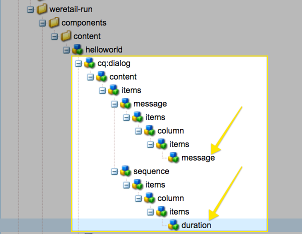

   Hello World - completed dialog

## Create Client-Side Libraries {#clientlibs}

Client-Side Libraries provide a mechanism to organize and manage CSS and JavaScript files necessary for an AEM implementation. More information about using [Client-Side Libraries can be found here.](https://helpx.adobe.com/experience-manager/6-4/sites/developing/using/clientlibs.html)

AEM Screens components are rendered differently in Edit mode vs. Preview/Production mode. Two client libraries will be created, one for Edit mode and a second for Preview/Production.

1. Create a folder for client-side libraries for the Hello World component.

   Beneath `/apps/weretail-run/components/content/helloworld`create a new folder named `clientlibs`.

   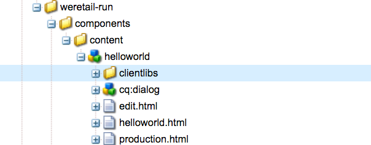

1. Beneath the `clientlibs` folder create a new node named `shared` of type `cq:ClientLibraryFolder.` 

   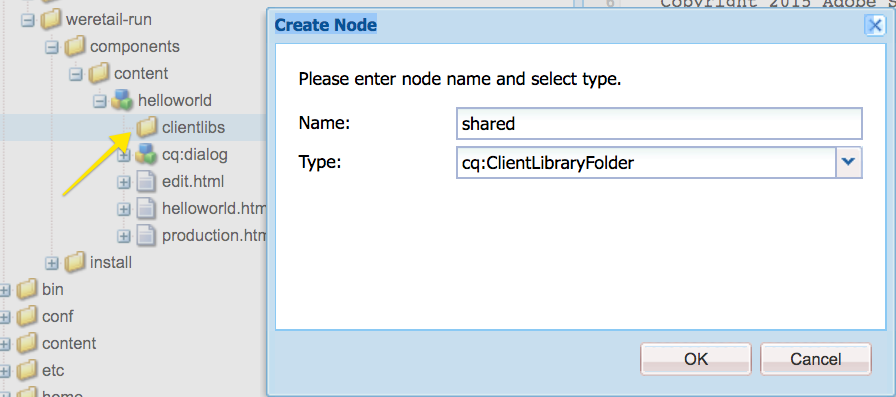

1. Add the following properties to the shared client library:

    * `allowProxy` | Boolean | `true`
    
    * `categories`| String[] | `cq.screens.components`

   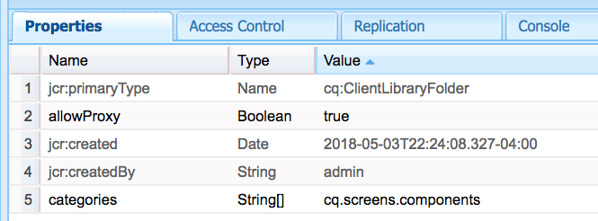

   Properties for /apps/weretail-run/components/content/helloworld/clientlibs/shared

   The categories property is a string that identifies the client library. The cq.screens.componentscategory is used in both Edit and Preview/Production mode. Therefore any CSS/JS defined in the sharedclientlib is loaded in all modes.

   It is a best practice to never expose any paths directly to /apps in a production environment. The allowProxy property ensures the client library CSS and JS is referenced via a prefix of/etc.clientlibs. More information about the [allowProxy property can be found here.](https://helpx.adobe.com/experience-manager/6-4/sites/developing/using/clientlibs.html#main-pars_title_8ced)

1. Create file named `css.txt` beneath the shared folder.

   Populate the file with the following:

   ```
   #base=css
   
   styles.less
   
   ```

1. Create a folder named `css` beneath the `shared` folder. Add a file named `style.less` beneath the `css` folder. The structure of the client libraries should now look like this:

   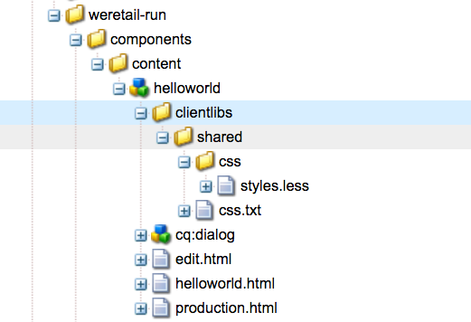

   Instead of writing CSS directly, this tutorial uses LESS. [LESS](https://lesscss.org/) is a popular CSS pre-compiler that supports CSS variables, mixins, and functions. AEM client libraries natively support LESS compilation. Sass or other pre-compilers can be used but need to be compiled outside of AEM.

1. Populate `/apps/weretail-run/components/content/helloworld/clientlibs/shared/css/styles.less` with the following:

   ```css
   /**
       Shared Styles 
      /apps/weretail-run/components/content/helloworld/clientlibs/shared/css/styles.less
   
   **/
   
   .cmp-hello-world {
       background-color: #fff;
    
    &__message {
     color: #000;
     font-family: Helvetica;
     text-align:center;
    }
   }
   ```

1. Copy and paste the `shared` client library folder to create a new client library named `production`. 

   

   Copy the shared client library to create a new production client library

1. Update the `categories` property of the production clientlibrary to be `cq.screens.components.production.`

   This ensures that the styles are only loaded when in Preview/Production mode.

   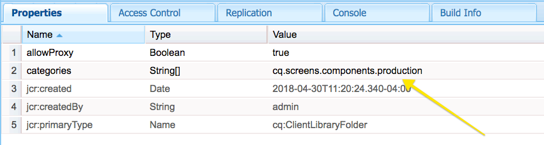

   Properties for /apps/weretail-run/components/content/helloworld/clientlibs/production

1. Populate `/apps/weretail-run/components/content/helloworld/clientlibs/production/css/styles.less` with the following:

   ```css
   /**
       Production Styles 
      /apps/weretail-run/components/content/helloworld/clientlibs/production/css/styles.less
   
   **/
   .cmp-hello-world {
   
       height: 100%;
       width: 100%;
       position: fixed;
       
    &__message {
           
     position: relative;
     font-size: 5rem;
     top:25%;
    }
   }
   ```

   The above styles will display the message centered in the middle of the screen, but only in production mode.

A third clientlibrary category: `cq.screens.components.edit` could be used to add Edit-only specific styles to the component. 

| Clientlib Category |Usage |
|---|---|
| `cq.screens.components` |Styles and scripts that are shared between both edit and production modes |
| `cq.screens.components.edit` |Styles and scripts that are only used in edit mode |
| `cq.screens.components.production` |Styles and scripts that are only used in production mode |

## Create a Design Page {#design-page}

AEM Screens uses [static Page Templates](https://helpx.adobe.com/experience-manager/6-4/sites/developing/using/page-templates-static.html) and [Design configurations](https://helpx.adobe.com/experience-manager/6-4/sites/authoring/using/default-components-designmode.html) for global changes. Design configurations are frequently used to configure allowed components for the Parsys on a channel. A best practice is to store these configurations in an app-specific way.

Below a We.Retail Run Design page is created that will store all configurations specific to the We.Retail Run project.

1. In [CRXDE-Lite](http://localhost:4502/crx/de/index.jsp#/apps/settings/wcm/designs) navigate to `/apps/settings/wcm/designs`
1. Create a new node beneath the designs folder, named `we-retail-run` with a type of `cq:Page`.
1. Beneath the `we-retail-run` page, add another node named `jcr:content` of type `nt:unstructured`. Add the following properties to the `jcr:content` node:

   | Name |Type |Value |
   |---|---|---|
   | jcr:title |String |We.Retail Run |
   | sling:resourceType |String |wcm/core/components/designer |
   | cq:doctype |String |html_5 |

   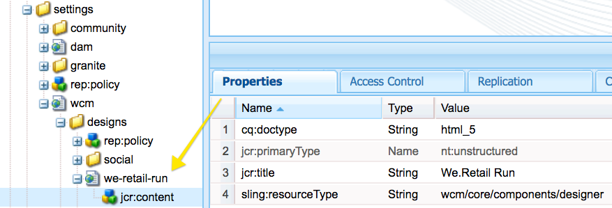

   Design Page at /apps/settings/wcm/designs/we-retail-run

## Create a Sequence Channel {#create-sequence-channel}

The Hello World component is intended to be used on a Sequence Channel. To test the component, a new Sequence Channel is created.

1. From the AEM Start Menu navigate to **Screens** &gt; **We.Retail Ru**n &gt; and select **Channels**.

1. Click the **Create** button

   1. Choose **Create Entity**

   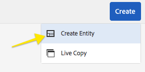

1. In the Create wizard:

1. Template Step - choose** Sequence Channel**

   1. Properties Step

    * Basic Tab &gt; Title = **Idle Channel**
    * Channel Tab &gt; check** Make channel online **

   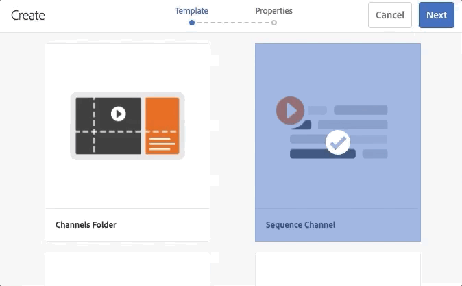

1. Open the page properties for the Idle Channel. Update the Design field to point to `/apps/settings/wcm/designs/we-retail-run,`the design page created in the previous section.

   

   Design config pointing to /apps/settings/wcm/designs/we-retail-run

1. Edit the newly created Idle Channel to open it.

1. Switch the page mode to **Design** Mode

   1. Click the **wrench** Icon in the Parsys to configure the allowed components

   1. Select the **Screens** group and the **We.Retail Run - Content** group.

   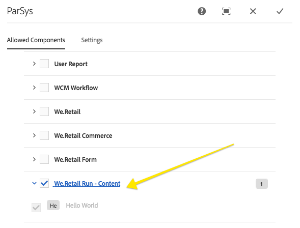

1. Switch the page mode to **Edit**. The Hello World component can now be added to the page and combined with other sequence channel components.

   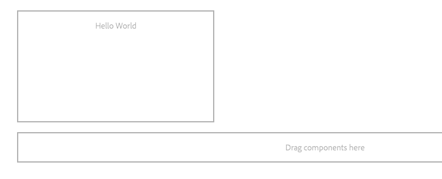

1. In [CRXDE-Lite](http://localhost:4502/crx/de/index.jsp#/apps/settings/wcm/designs/we-retail-run/jcr%3Acontent/sequencechannel/par) navigate to `/apps/settings/wcm/designs/we-retail-run/jcr:content/sequencechannel/par`. Notice the `components` property now includes `group:Screens`, `group:We.Retail Run - Content`. 

   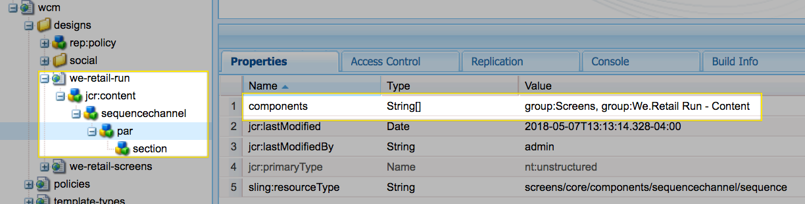

   Design configuration under /apps/settings/wcm/designs/we-retail-run

## Putting it all together {#putting-it-all-together}

The below video shows the finished component and how it can be added to a Sequence channel. The Channel is then added to a Location display and ultimately assigned to a Screens player.

>[!VIDEO](https://video.tv.adobe.com/v/22385?quaity=9)

## Finished Code {#finished-code}

Below is the finished code from the tutorial. The **screens-weretail-run.ui.apps-0.0.1-SNAPSHOT.zip** and **screens-weretail-run.ui.content-0.0.1-SNAPSHOT.zip** are the compiled AEM packages. The **SRC-screens-weretail-run-0.0.1.zip **is the un-compiled source code that can be deployed using Maven.

[Get File](assets/screens-weretail-runuiapps-001-snapshot.zip)

[Get File](assets/screens-weretail-runuicontent-001-snapshot.zip)

[Get File](assets/screens-weretail-run.zip)
