# Using Dynamic Embedded Sequence{#using-dynamic-embedded-sequence}

Using Dynamic Embedded Sequences covers the following topics:

* **Overview**
* **Using Dynamic Embedded Experience in AEM Screens**
* **Viewing the Results**
* **Restricting Users and Modifying the ACLs**

## Overview {#overview}

***Dynamic Embedded Sequences*** are created for large projects that follow parent child hierarchy, where the child is referenced inside a location folder and not a channel folder. It allows the user to embed a sequence inside a channel by ***Channel Role***. It lets the user define location-specific placeholders for different offices using an embedded sequence inside a main channel.

While assigning a channel to a display, you have the option of either specifying the path of the display or the role of the channel that will resolve to an actual channel by context.

To use Dynamic Embedded Sequence, you assign a channel by ***Channel Role***. Channel Role defines the context of the display. The role is targeted by various actions and is independent of the actual channel that fulfills the role. This section describes a use case that defines channels by role and how you can leverage that content to a global channel. You can also think of the role as an identifier for the assignment, or an alias for the channel in the context of.

### Benefits of Using Dynamic Embedded Sequences {#benefits-of-using-dynamic-embedded-sequences}

The main benefit of placing a sequence channel inside of a location instead of the channels folder is to allow local or regional authors to edit content relevant to them while being restricted from editing channels higher up in the hierarchy.

Referencing a *Channel By Role*, allows you to create local version of a channel, in order to dynamically resolve location-specific content and also allows you to create a global channel that leverages the content for the location-specific channels.

>[!NOTE]
>
>**Embedded Sequences versus Dynamic Embedded Sequences** 
>
>A Dynamic Embedded Sequence is similar to an embedded sequence but allows the user to follow a hierarchy where changes/updates made to one channel is propagated to other one in relation. It follows parent-child hierarchy and also includes assets like images or videos.  
>
>***Dynamic Embedded Sequences*** lets you display location-specific content whereas ***Embedded Sequences*** only display general slide show of the content. Additionally, while setting up Dynamic Embedded Sequences, you need to configure the channel using channel role and name. Please refer to the steps below for practical implementation.  
>
>To learn more about implementing embedded sequences, please refer to [**Embedded Sequences**](/help/screens/embedded-sequences.md) in AEM Screens.

The following example provides a solution by focusing on the following key terms:

* a ***main sequence channel*** for the global sequence
* ***dynamic embedded sequence*** components for each locally customizable part of the sequence
* ***individual sequence channels***vin the respective locations with a *role* in the display that matches the **dynamic embedded sequence component's *role*.**

>[!NOTE]
>
>To learn more about channel assignment, see **[Channel Assignment](/help/screens/channel-assignment.md) **under Authoring section in AEM Screens documentation.

## Using Dynamic Embedded Sequence {#using-dynamic-embedded-sequence-2}

The following section explains the creation of a Dynamic Embedded Sequence in an AEM Screens channel.

### Prerequisites {#prerequisites}

Before you start implementing this functionality, please make sure you have the following prerequisites ready to start implementing dynamic embedded sequences:

* Create an AEM Screens project (in this example, **Demo**)  

* Create a channel as **Global** under **Channels** folder

* Add content to your **Global** Channel (*Please check **Resources.zip** for relevant assets*)

The following image shows the **Demo** project with **Global** channel in **Channels** folder.   
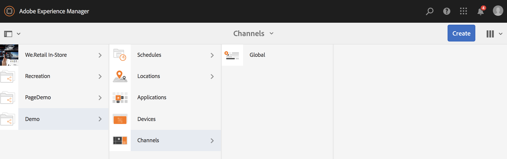 

### Resources {#resources}

You can download the following resources (images and add these to assets) and further use these as channel content for demonstration purpose.

[Get File](assets/resources.zip)

>[!NOTE]
>
>For additional information on how to create a project and how to create a sequence channel, please refer to resources below:
>
>* **[Creating and Managing Projects](/help/screens/creating-a-screens-project.md)  
>  **
>* **[Managing a Channel](/help/screens/managing-channels.md)**
>

Implementing Dynamic Embedded Sequence in an AEM Screens project involves three major tasks:

1. **Setting up Project taxonomy including Channels, Locations, and Displays**
1. **Creating a Schedule**
1. **Assigning Schedule to each display**

Follow the steps below to implement the functionality:

>[!CAUTION]
>
>While implementing Dynamic Embedded Sequences, please be careful of the **Name** and **Title** fields while creating channels under each location. Please follow the instructions on nomenclature carefully.

1. **Create two Locations Folder.**

   Navigate to your **Locations** folder in your AEM Screens project and create two location folders as **Region A** and **Region B**.

   >[!NOTE]
   >
   >While creating the **Region A** location folder, make sure you enter the **Title** as **Region A** and you can leave the **Name** field empty, so automatically **region-a** name is picked up.
   >
   >Similar, is the case for creating location folder **Region B**, as shown below:

   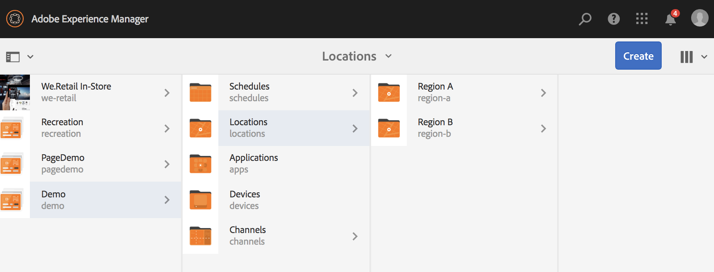

   >[!NOTE]
   >
   >To learn how to create a location, please refer to **[Creating and Managing Locations](/help/screens/managing-locations.md)**.

1. **Create two Locations and a Channel under each location folder.**

    1. Navigate to **Demo** --&gt; **Locations** --&gt; **Region A**.
    1. Select **Region A **and click **+ Create** from the action bar.
    1. Select **Location** from the wizard with **Title** as **Store 1**. Similarly, create another location from the wizard titled as **Store 2** with **Title** as **Store 2**. You can leave the **Name** field empy while creating **Store 1** and **Store 2**. 
    1. Repeat step (b) and now select **Sequence Channel** from the wizard. Enter the **Title** as **Region A** and **Name** as **region **for this channel.

   >[!CAUTION]
   >
   >Please make sure that while creating channel **Region A**, enter the **Title** as **Region A **and the **Name** as **region**.

   

   Similarly, create two locations under **Region B** titled as **Store 3** and **Store 4**. Also, create a **Sequence Channel** with **Title** as **Region B** and **Name** as **region**.

   >[!CAUTION]
   >
   >Please make sure that you can use the same name for the channels created in **Region A** and **Region B** as **region**.

   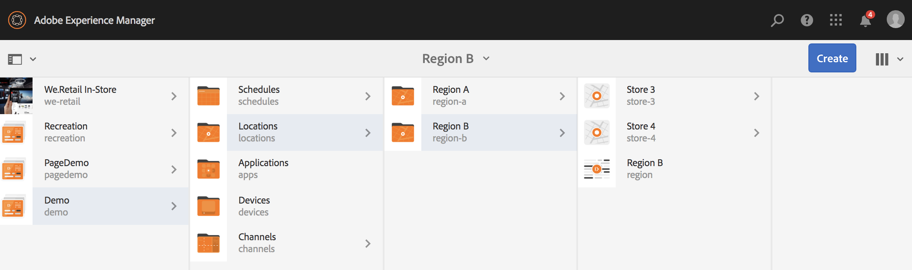

1. **Create Display and Channel under each Location.**

    1. Navigate to **Demo** --&gt; **Locations** --&gt; **Region A** --&gt; **Store 1**.  
    1. Select **Store 1 **and click **+ Create** from the action bar.
    1. Select **Display** from the wizard and create **Store1Display.** 
    1. Repeat step (b) and this time select **Sequence Channel** from the wizard. Enter the **Title** as **Store1Channel** and the **Name** as **store**.

   >[!CAUTION]
   >
   >It is important when you create a sequence channel, the **Title** of the channel can be as your requirement, but the **Name** should be the same in all the local channels.
   >
   >In this example, the channels under **Region A **and **Region B** share the same **Name** as **region** and channels under **Store 1**, **Store 2**, **Store 3**, and **Store 4 **share the same **Name** as **store**.

   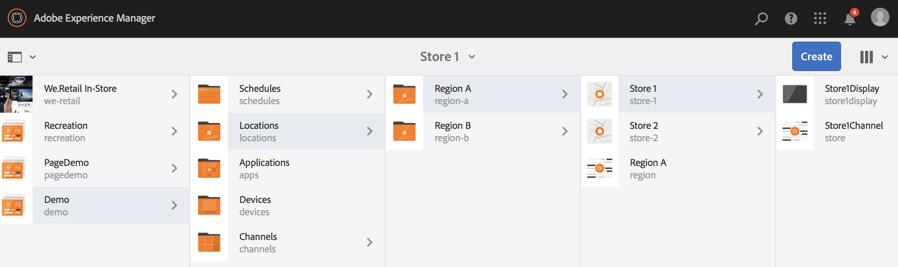

   Similarly, create a display as **Store2Display** and a channel **Store2Channel** under** Store 2** (with name as **store**).

   >[!NOTE]
   >
   >Please make sure that you can use the same name for the channels created in **Store 1** and **Store 2** as **store**.

   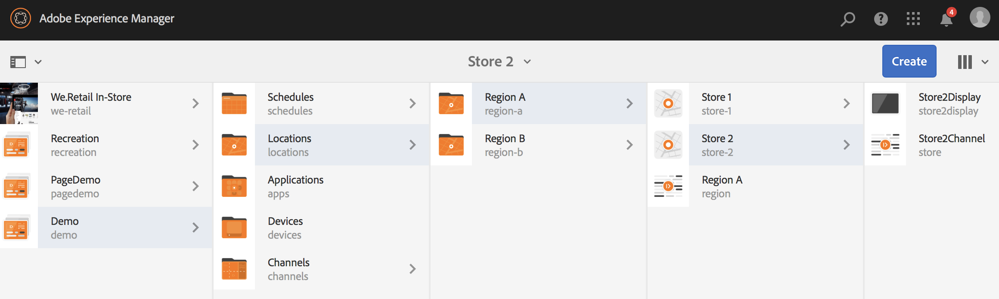

   Follow the preceding steps to create a channel and display in **Store 3** and **Store 4** under **Region B**. Again, please make sure that you use same **Name** as **store** while creating channel **Store3Channel** and **Store4Channel** respectively.

   The following image shows the display and channel in **Store 3**.

   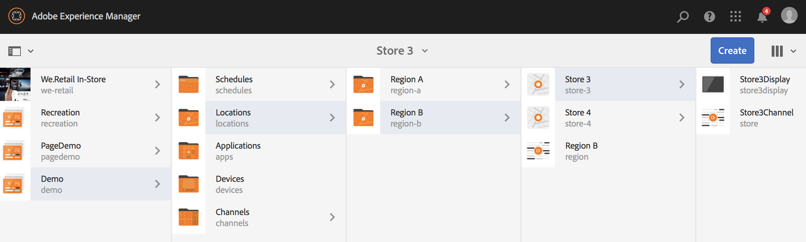

   The following image shows the display and channel in **Store 4**.

   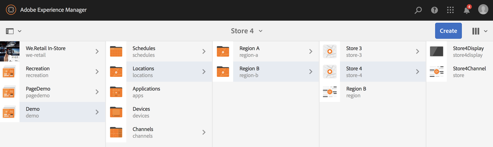

1. **Add Content to the Channels in their respective Locations.**

   Navigate to the **Demo** -&gt; **Locations** -&gt; **Region A** -&gt; **Region A** and click **Edit** from the action bar. Drag and drop the assets you would like to add to your channel.

   >[!NOTE]
   >
   >You can use the ***Resources.zip*** file from the **Resources** section, above, to use the images as assets for your channel content.

   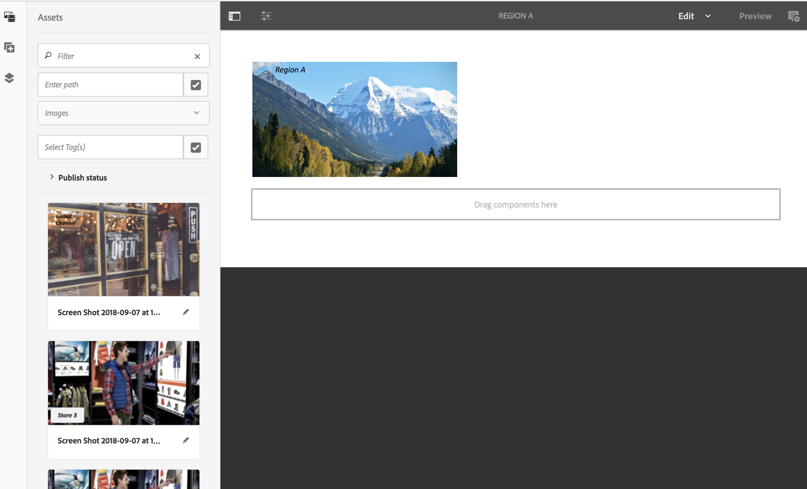

   Similarly, navigate to the **Demo** -&gt; **Locations** -&gt; **Region B** -&gt; **Region B** and click **Edit** from the action bar to drag and drop the assets to your channel, as shown below:

   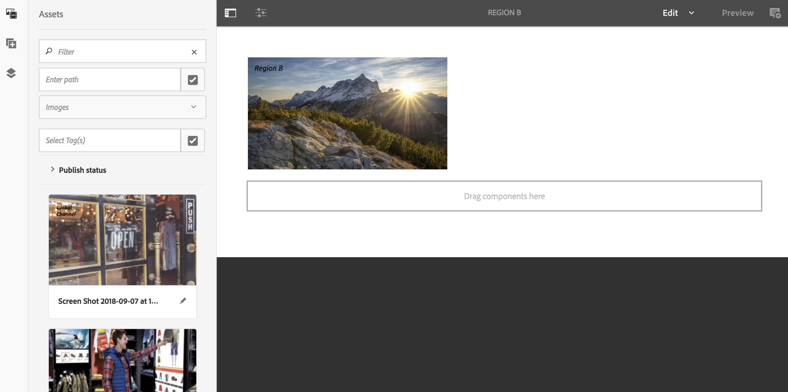

   Follow the preceding steps and the resources, to add content to the following channels:

    * **Store1Channel**
    * **Store2Channel**
    * **Store3Channel**
    * **Store4Channel**

1. **Create a Schedule**

   Navigate and select **Schedules** folder in your AEM Screens project and click **Create** from the action bar to create a new schedule.

   The following image shows the **AdSchedule** created in **Demo** project.

   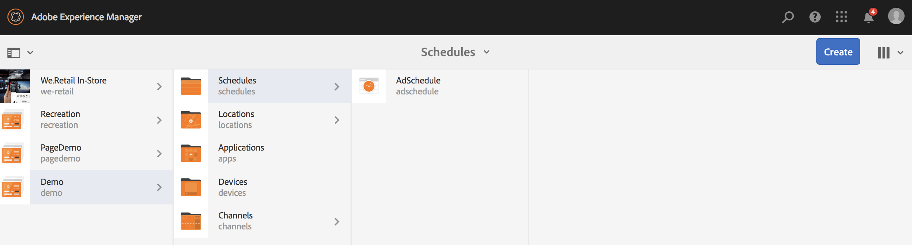

1. **Assign Channels to a Schedule**

    1. Navigate to **Demo** --&gt; **Schedules** --&gt; **AdSchedule** and click **Dashboard** from the action bar.
    1. Click **+ Assign Channel** from **ASSIGNED CHANNELS** panel to open the **Channel Assignment** dialog box.
    1. Select **Reference Channel**.. by path.
    1. Select the **Channel Path** as **Demo*** --&gt; ***Channels*** --&gt; ***Global***.
    1. Enter the **Channel Role** as **GlobalAdSegment**.
    1. Select the **Supported Events** as **Initial Load**, **Idle Screen**, and **User Interaction**.
    1. Click **Save**.

   **Assign Channel by Role for Region:**

    1. Click **+ Assign Channel** from **ASSIGNED CHANNELS** panel to open the **Channel Assignment** dialog box.
    1. Select **Reference Channel**.. by name.
    1. Enter the **Channel Name** as **region***.*
    1. Enter the **Channel Role** as **RegionAdSegment**.
    1. Click **Save**.

   **Assign Channel by Role for Store:**

    1. Click **+ Assign Channel** from **ASSIGNED CHANNELS** panel to open the **Channel Assignment** dialog box.
    1. Select **Reference Channel**.. by name.
    1. Enter the **Channel Name** as **store**.
    1. Enter the **Channel Role** as **StoreAdSegment**.
    1. Click **Save**.

   The following image shows the assigned channels by path and by role.

   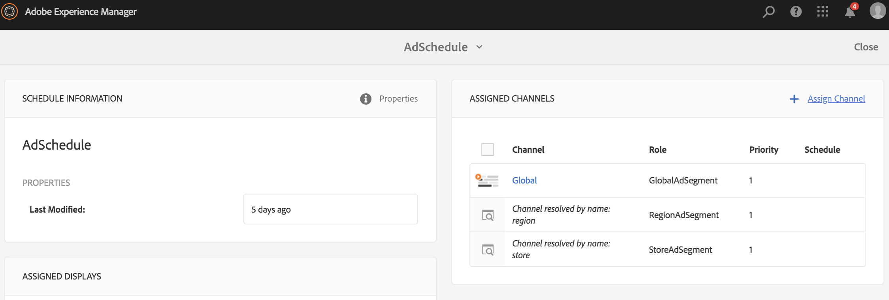

1. **Configuring Dynamic Embedded Sequence to the Global Channel.**

   Navigate to the **Global** Channel, you intially created in **Demo** project.

   Click **Edit** from the action to open the editor.

   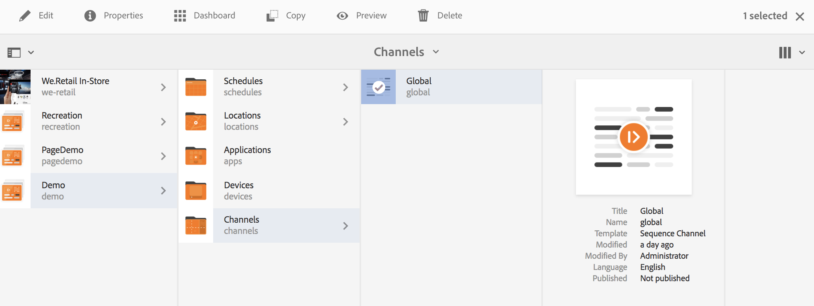

   Drag and drop two **Dynamic Embedded Sequence** components in the channel editor.

   Open the properties from one of the components and enter the **Channel Assignment Role** as **RegionAdSegment**.

   Similarly, select the other component and open properties to enter the **Channel Assignment Role** as **StoreAdSegment**.

   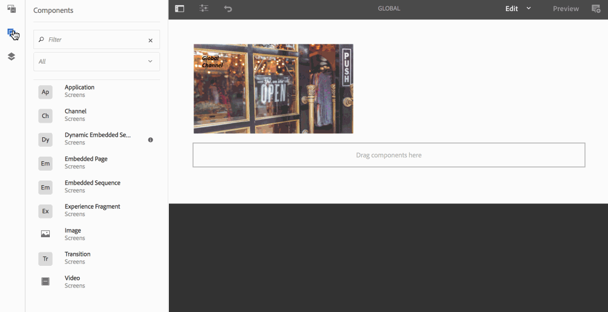

1. **Assigning Schedule to each Display**

    1. Navigate to the each display, such as **Demo** --&gt; **Locations** --&gt; **Region A** --&gt;**Store 1** --&gt;**Store1Display**.
    1. Click **Dashboard** from the action to open the display dashboard.
    1. Click **...** from the **ASSIGNED CHANNELS & SCHEDULES** panel and further click **+Assign Schedule**.
    1. Select the path to the Schedule (for example, here, **Demo** --&gt; **Schedules** --&gt;**AdSchedule**).
    1. Click **Save**.

## Viewing the Results {#viewing-the-results}

Once you have the set up for channels and display complete, please launch the AEM Screens player to view the content.

>[!NOTE]
>
>To learn about AEM Screen Player, please refer to the following resources:
>
>* [**AEM Screens player downloads**](https://download.macromedia.com/screens/)
>* [**Working with AEM Screens Player**](/help/screens/working-with-screens-player.md)
>

The following output confirms your channel content in AEM Screens player, depending on the display path.

**Scenario 1**:

If you assign the display path as **Demo** --&gt; **Locations** --&gt; **Region A** --&gt;** Store 1** --&gt; **Store1Display**, the following content will display on your AEM Screens player.

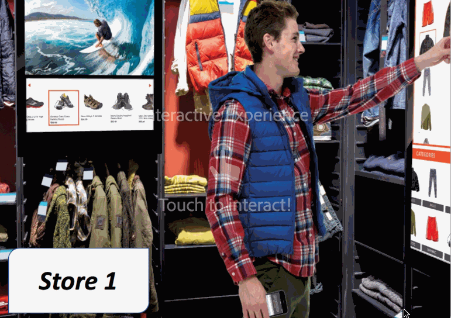

**Scenario 1**:

If you assign the display path as **Demo** --&gt; **Locations** --&gt; **Region B** --&gt;** Store 3** --&gt; **Store3Display**, the following content will display on your AEM Screens player.

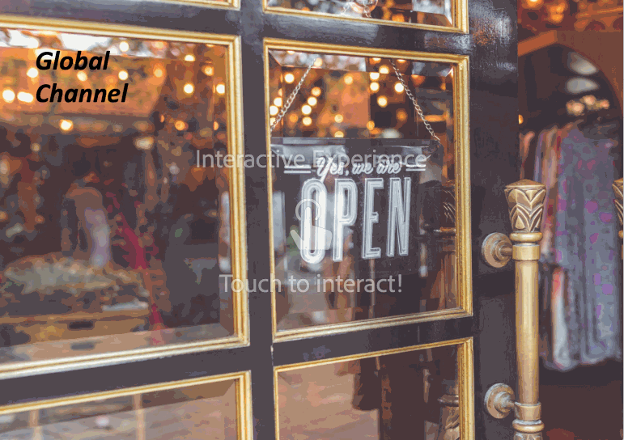 

## Restricting Users and Modifying the ACLs {#restricting-users-and-modifying-the-acls}

You can create global, regional, or local authors to edit content relevant to them while being restricted from editing channels higher up in the hierarchy.

You need to modify the ACLs to restrict the users access to the content based on their location.

### Example Use Case {#example-use-case}

The following example allows you to create three users for the above Demo project.

The privileges are assigned to each group are as follows:

**Groups**:

* **Global-Author**: Consists of users that have access to all the locations and channels in the **Demo** project and have all the read, write, and edit permissions.  

* **Region-Author**: Consists of users that have read, write, and edit permissions to **Region A** and **Region B**.  

* **Store-Author**: Consists of users that have read, write, and edit permissions only to **Store 1**, **Store 2**, **Store 3**, and **Store 4**.

#### Steps for creating User Groups, Users and setting up ACLs {#steps-for-creating-user-groups-users-and-setting-up-acls}

>[!NOTE]
>
>To learn in detail how to segregate projects using ACLs so that each individual or team handles their own project, please refer to **Setting up ACLs**.

Follow the steps below to create groups, users and modify the ACLs as per the permissions:

1. **Create Groups**

    1. Navigate to **Adobe Experience Manager**.
    1. Click **Tools** --&gt; **Security** --&gt; **Groups**.
    1. Click **Create Group** and enter **Global-Author** in **ID**.
    1. Click **Save & Close**.

   Similarly, create two other groups such as **Region-Author** and **Store-Author**.   

   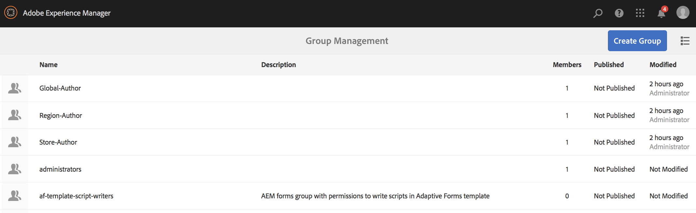

1. **Create Users and add Users to Groups**

    1. Navigate to **Adobe Experience Manager**.
    1. Click **Tools** --&gt; **Security** --&gt; **Users**.
    1. Click **Create User** and enter **Global-User** in **ID**.
    1. Enter **Password** and confirm password for this user.  
    1. Click the **Groups** tab and enter the group name in **Select Group**, for example, enter **Global-Author** to add **Global-User** to that specific group.  
    1. Click **Save & Close**.

   Similarly, create two other users such as **Region-User** and **Store-User** and add those to **Region-Author** and **Store-Author** respectively.

   >[!NOTE]
   >
   >It is a best practice to add users in a group and then assign permissions to each particular group of users.

   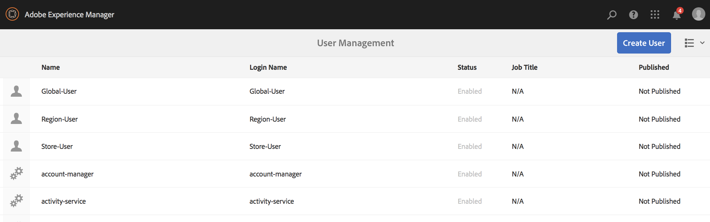

1. **Add all the Groups to Contributors**

    1. Navigate to **Adobe Experience Manager**.
    1. Click **Tools** --&gt; **Security** --&gt; **Groups**.
    1. Select **Contributors** from the list and select **Members** tab.
    1. Select the **Group** such as **Global-Author**, **Region-Author,** and **Store-Author** to contributors.
    1. Click **Save & Close**.

1. **Accessing Permissions for Each Group**

    1. Navigate to the *Useradmin* and use this UI to modify the permissions for different groups.
    1. Search for **Global-Author** and click **Permissions** tab, as shown in the figure below.
    1. Similarly, you can access the permissions for **Region-Author** and **Store-Author**.

   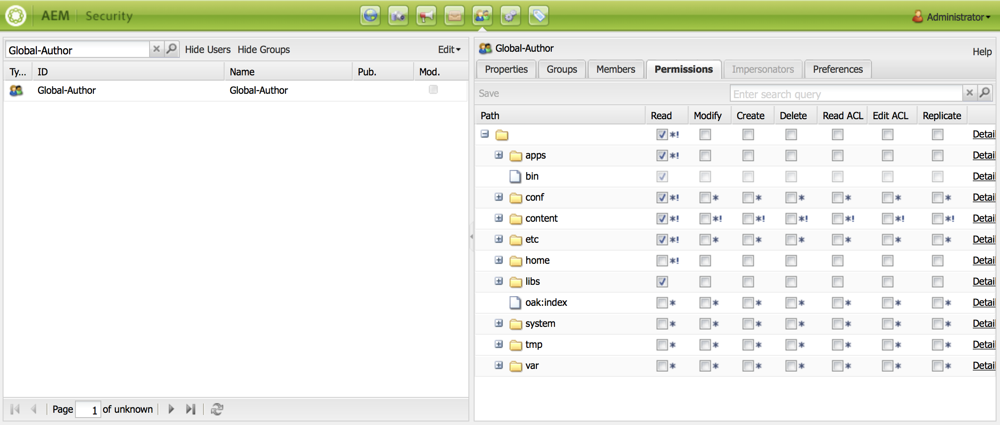

1. **Modifying Permissions for Each Group**

   **For Global-Author:**

    1. Navigate to the **Permissions** tab
    1. Navigate to ***/content/screens/demo*** and check all the permissions
    1. Navigate to ***/content/screens/demo/locations*** and check all the permissions
    1. Navigate to ***/content/screens/demo/locations***/***region-a*** and check all the permissions. Similarly, check the permissions for **region-b**.

   Please refer to the figure below for understanding the steps:   
   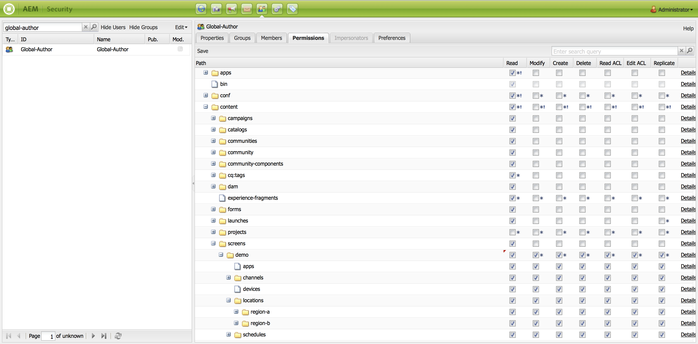

   The following image shows that now the **Global-User** has access to the **Global Channel** and both the **Region A** and **Region B** with all the four stores namely **Store 1**, **Store 2**, **Store 3**, and **Store 4**.

   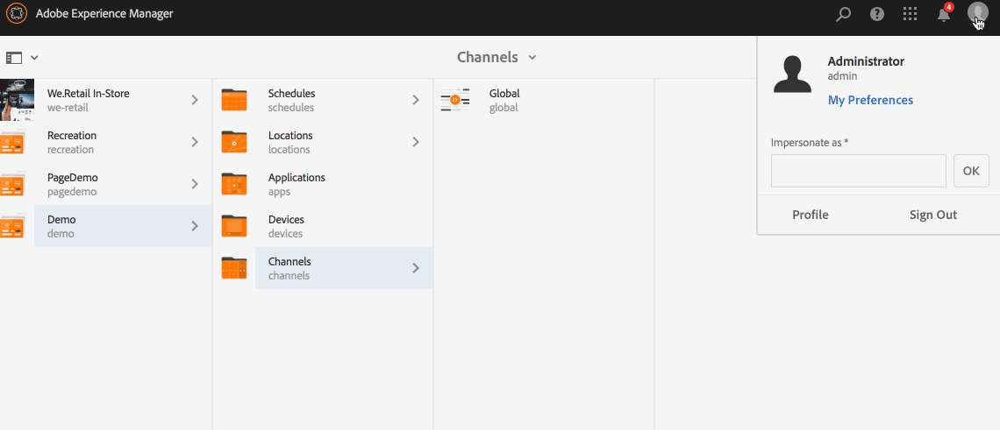

   **For Region-Author:**

    1. Navigate to the **Permissions** tab.
    1. Navigate to ***/content/screens/demo*** and check only the** Read** permissions.
    1. Navigate to ***/content/screens/demo/locations*** and check only the **Read** permissions.
    1. Navigate to ***/content/screens/demo/channels ***and un-check the permissions for **Global** channel.*** 
    1. Navigate to ***/content/screens/demo/locations***/***region-a*** and check all the permissions. Similarly, check the permissions for **region-b**.

   Please refer to the figure below for understanding the steps:

   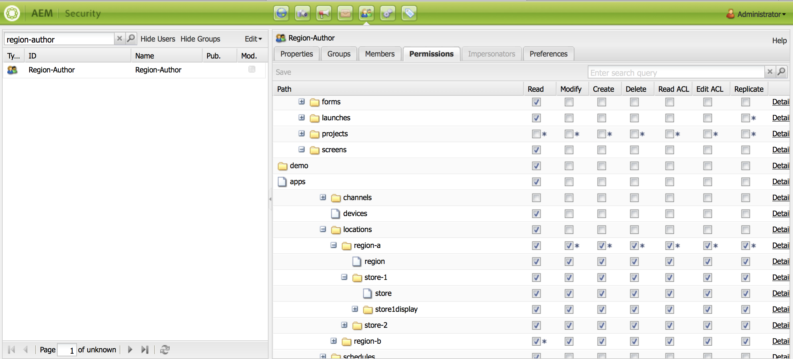

   The following image shows that now the Region-User has access to both the **Region A** and **Region B** with all the four stores namely **Store 1**, **Store 2**, **Store 3**, and **Store 4** but does not access to the **Global** Channel.

   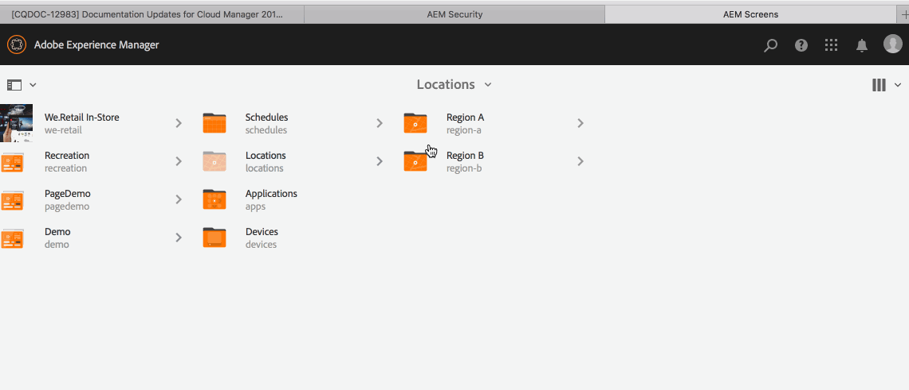

   **For Store-Author:**

    1. Navigate to the **Permissions** tab.
    1. Navigate to ***/content/screens/demo*** and check only the **Read** permissions.
    1. Navigate to ***/content/screens/demo/locations*** and check only the **Read** permissions.  
    1. Navigate to ***/content/screens/demo/channels*** and un-check the permissions for **Global** channel.
    1. Navigate to ***/content/screens/demo/locations/region-a*** and check only the **Read** permissions. Similarly, check only the **Read** permissions for **region-b**.
    1. Navigate to ***/content/screens/demo/locations***/***region-a /store-1*** and check all the permissions. Similarly, check the permissions for **store-2, store-3,** and **store-4**.

   Please refer to the figure below for understanding the steps:

   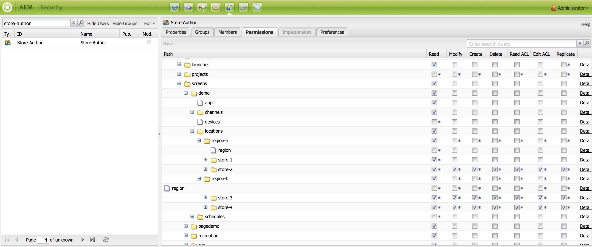

   The following image shows that now the **Store-User** has access only to the four stores namely **Store 1**, **Store 2**, **Store 3**, and **Store 4** but does not have permissions to access the **Global** or the region (**Region A **and **Region B**) channels.

   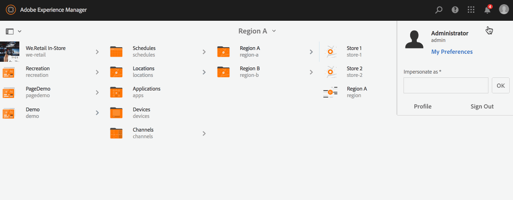

>[!NOTE]
>
>To learn in detail about setting up permissions, please refer to [**Setting up ACLs**](/help/screens/setting-up-acls.md) in AEM Screens Developer documentation.

