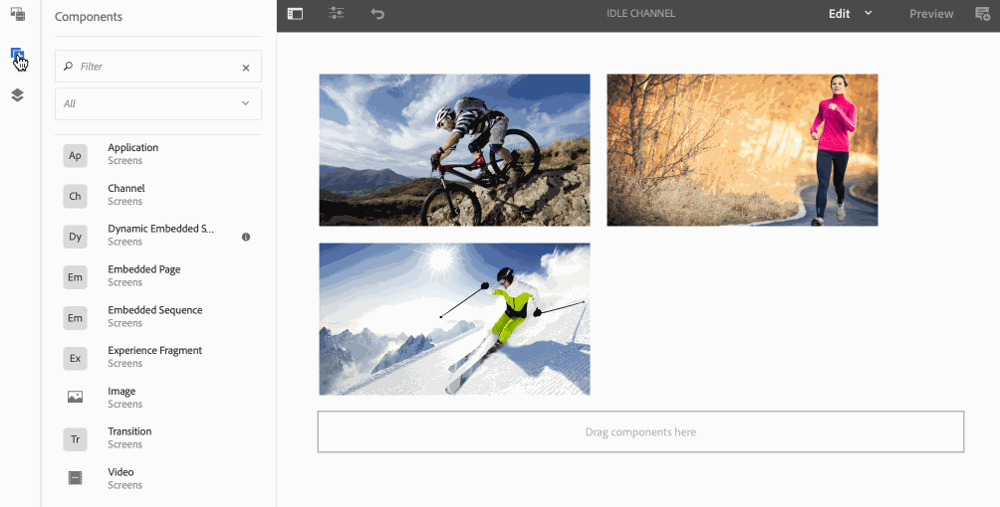
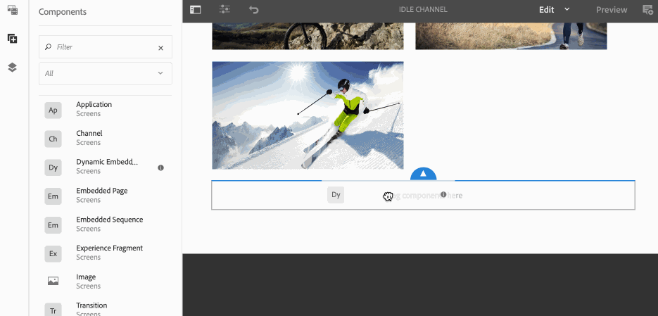

# Embedded Sequences{#embedded-sequences}

Using ***Embedded Sequences***, for channels, allows the user to add components in the parent channel and also to re-use the content from a different channel and embed it into the parent channel.

## Adding Embedded Sequences {#adding-embedded-sequences}

You have the option of adding the following the following components to your sequence channel:

* Embedded Sequence
* Dynamic Embedded Sequence

>[!NOTE]
>
>To learn about using other components in your Screens project, see [Adding Components to a Channel](/help/screens/adding-components-to-a-channel.md).

### Adding an Embedded Sequence {#adding-an-embedded-sequence}

You can add an embedded sequence to your channel. An embedded sequence ia another channel that includes assets like images or videos. Adding an embedded sequence allows the user to add the sequence to a channel by ***Channel Path***.

>[!NOTE]
>
>***Channel Path ***defines an explicit reference to the channel.
>
>To learn more about *Channel Path*, see [Channel Assignment](/help/screens/channel-assignment.md) in Authoring Screens.

Follow the steps below to add an embedded sequence to your channel:

1. Select the channel where you want to embed a page. For example, **We.Retail In-Store** --&gt; **Channels** --&gt;** Idle Channel**.

1. Click **Edit** from the action bar to open the channel in the editor mode.
1. Click components icon from the left side bar to add the embedded page. Drag and drop the the **Embedded Sequence** to the editor.
1. Double-click the **Embedded Sequence** component to add the channel to your original sequence channel.
1. Select the **Channel Path** of the channel. 
1. Select the **Duration (ms)** for your embedded channel in the **Sequence** tab. By default, the duration is set to **-1**, that means embedded channel is fully run. If the user specifies a duration, then the subsequence will be interrupted (that is, cut-off) at the specified time.

1. Set the **Metered Playback Strategy** to **normal**.

By default, it is set to **normal**. Setting the value to **normal*** (Play all items)* means that the subsequence will run fully on each cycle of the parent sequence. The other possible value is **Play a single item*** (Play a single item)* and that would only show one item of the subsequence on each run (for instance, the 1st item on the first loop, 2nd item on the second loop, and so on.)

The following example shows the addition of an embedded sequence (**Idle Channel - Night**) to an already existing channel (**Idle Channel**).

 

### Adding a Dynamic Embedded Sequence {#adding-a-dynamic-embedded-sequence}

You can add a dynamic embedded sequence to your channel. A dynamic embedded sequence is similar to an embedded sequence but allows the user to follow a hierarchy where changes/updates made to one channel is propagated to other one in relation. It follows parent-child herarchy and also includes assets like images or videos. Adding a dynamic sequence allows the user to add a channel by channel role.

>[!NOTE]
>
>***Channel Role*** defines the Channel role defines the context of the display.
>
>To learn more about *Channel Role*, see [Channel Assignment](/help/screens/channel-assignment.md) in Authoring Screens.

Follow the steps below to add an embedded sequence to your channel:

1. Select the channel where you want to embed a dynamic sequence. For example, **We.Retail In-Store** --&gt; **Channels** --&gt; **Idle Channel**.

1. Click **Edit** from the action bar to open the channel in the editor mode.
1. Click components icon from the left side bar to add the dynamic embedded sequence. Drag and drop the the **Dynamic Embedded Sequence** to the editor.

1. Double-click the **Dynamic Embedded Sequence** component to add the page to your sequence channel. 

1. Enter the **Channel Assignment Role**. 
1. Set the **Metered Playback Strategy** to **normal**. By default, it is set to **normal**. Setting the value to **normal*** (Play all items)* means that the subsequence will run fully on each cycle of the parent sequence. The other possible value is **Play a single item** *(Play a single item)* and that would only show one item of the subsequence on each run (for instance, the 1st item on the first loop, 2nd item on the second loop, and so on.)

1. Select the **Duration (ms)** in **Sequence** tab for your embedded channel in the sequence.

